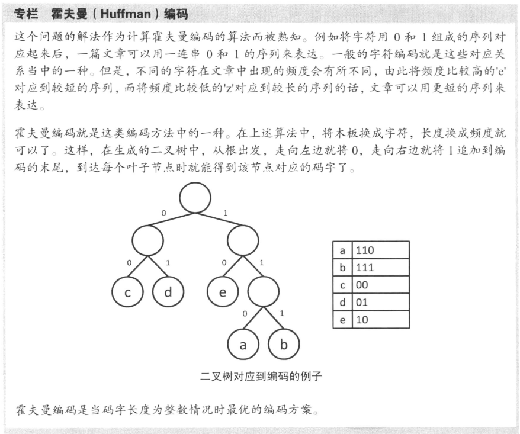

# 数据结构和算法

<!-- vim-markdown-toc GFM -->

* [刷题汇总](#刷题汇总)
* [huffman 编码](#huffman-编码)

<!-- vim-markdown-toc -->

- [The Algorithms 一些算法的实现](https://the-algorithms.com/)
- [前缀树](https://zhuanlan.zhihu.com/p/28891541)
- [三分算法](https://codeantenna.com/a/8QLI5mtuYk)
- [OI Wiki](https://oi-wiki.org/)

## 刷题汇总

- [剑指offer 专项突破](剑指offer(专项突破).md)
- [挑战程序设计竞赛](挑战程序设计竞赛.md)
- [算法竞赛入门经典](算法竞赛入门经典.md)

## huffman 编码

## 图相关算法

### 单源寻路算法
[Bellman-Ford Algorithm](https://en.wikipedia.org/wiki/Bellman%E2%80%93Ford_algorithm)
[Dijkstra's Algorithm](https://en.wikipedia.org/wiki/Dijkstra%27s_algorithm)

### 多源寻路算法
[Floyd-Warshall Algorithm](https://en.wikipedia.org/wiki/Floyd%E2%80%93Warshall_Algorithm#cite_note-10)

### 最小生成树
[Prim's Algorithm](https://en.wikipedia.org/wiki/Prim%27s_algorithm)
[Kruskal's Algorithm](https://en.wikipedia.org/wiki/Kruskal%27s_algorithm)

## 差分约束
[差分约束系统](https://blog.csdn.net/runninghui/article/details/9137673)
[oi wiki 差分约束](https://oi-wiki.org/graph/diff-constraints/)

## 最大公约数
[欧几里得算法(辗转相除法)](https://zh.wikipedia.org/wiki/%E8%BC%BE%E8%BD%89%E7%9B%B8%E9%99%A4%E6%B3%95)

## 素数筛选
[素性测试](https://zh.wikipedia.org/zh-hans/%E7%B4%A0%E6%80%A7%E6%B5%8B%E8%AF%95)
[埃式筛法](https://zh.wikipedia.org/zh-hans/%E5%9F%83%E6%8B%89%E6%89%98%E6%96%AF%E7%89%B9%E5%B0%BC%E7%AD%9B%E6%B3%95)

## 快速幂运算
[快速幂运算](https://oi-wiki.org/math/binary-exponentiation/)
