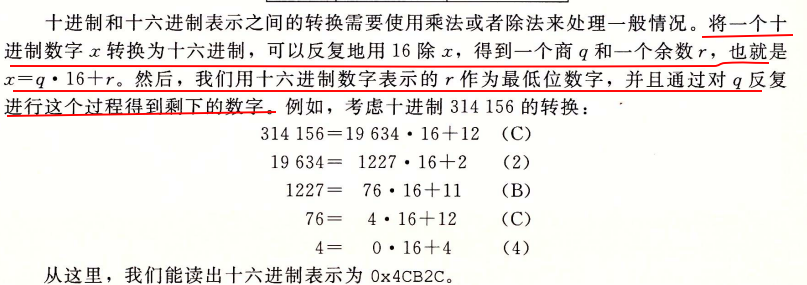
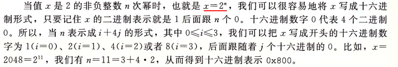
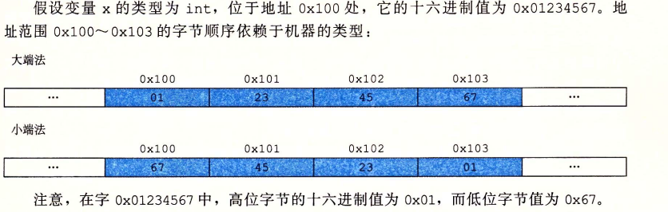

# CSAPP

<!-- vim-markdown-toc GFM -->

* [参考资料](#参考资料)

<!-- vim-markdown-toc -->

## 参考资料
- [课程主页](http://www.cs.cmu.edu/afs/cs/academic/class/15213-f22/www/index.html)
- [全英文视频课程](https://www.bilibili.com/video/av40238125/?vd_source=bb33286cda74be54bbcdf853e121e4f7)
- [课程视频](https://www.youtube.com/watch?v=ScMxnXq6fbI&list=PLcQU3vbfgCc9sVAiHf5761UUApjZ3ZD3x)
- [小土刀的博客](https://wdxtub.com/work/)
- [CSAPP重点解读](https://fengmuzi2003.gitbook.io/csapp3e/)
- [CSAPP-深入理解计算机系统](https://www.bilibili.com/video/BV1cD4y1D7uR/?vd_source=bb33286cda74be54bbcdf853e121e4f7)

## 算术运算的特性
1. 整型运算可能会导致溢出,例如多个正整数相乘可能会得到一个负数
2. 浮点数运算也会溢出, 但是多个正浮点数相乘溢出后的结果是 $+\infty$, 而不会导致负数

## 进制转换

### 十进制转十六进制

1.  
2. 

## 大小端

1. 从最低有效字节到最高有效字节的顺序存储对象 - 小端
2. 从最高有效字节到最低有效字节的顺序存储对象 - 大端

