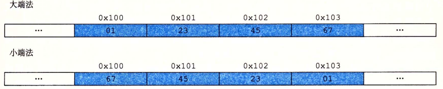

# CSAPP

<!-- vim-markdown-toc GFM -->

* [参考资料](#参考资料)

<!-- vim-markdown-toc -->

## 参考资料

- [课程主页](http://www.cs.cmu.edu/afs/cs/academic/class/15213-f22/www/index.html)
- [全英文视频课程](https://www.bilibili.com/video/av40238125/?vd_source=bb33286cda74be54bbcdf853e121e4f7)
- [课程视频](https://www.youtube.com/watch?v=ScMxnXq6fbI&list=PLcQU3vbfgCc9sVAiHf5761UUApjZ3ZD3x)
- [小土刀的博客](https://wdxtub.com/work/)
- [CSAPP重点解读](https://fengmuzi2003.gitbook.io/csapp3e/)
- [CSAPP-深入理解计算机系统](https://www.bilibili.com/video/BV1cD4y1D7uR/?vd_source=bb33286cda74be54bbcdf853e121e4f7)

## 大小端

假设变量 x 的类型为int，位于地址 `0x100` 处并且它的十六进制表示为 `0x01234567` ，那么在小端机器和大端机器上变量x在该地址处的表示如下图所示。

## 移位操作

- 逻辑左移
- 右移
    - 逻辑右移
    - 算术右移
