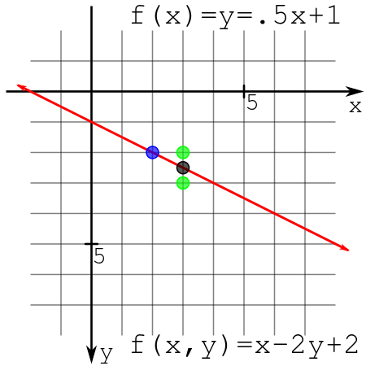

# Bresenham 画线算法
-------------

该算法的主要作用为光栅化一条线段，该算法需要建立在如下条件上
- 线段的$x$ 轴的长度要大于$y$ 轴的长度，这样能保证该线段上的像素点最多
- 整数的坐标点位于像素的中心点


核心代码

```c++

 void Render::DrawLine(int x0, int y0, int x1, int y1, Color& color,Device&device)
{
	bool isStep = false;

    //让线段在x轴上的投影总是比y轴上的投影长，如果不是就置换x,y轴
    //这样的话可以让线段拥有更多的像素点
	if (std::abs(x0 - x1) < std::abs(y1 - y0))
	{
		isStep = true;
		std::swap(x0, y0);
		std::swap(x1, y1);
	}

    //保证线段的绘制顺序是从左向右的，减少代码量
	if (x0 > x1)
	{
		std::swap(x0,x1);
		std::swap(y1,y0);
	}

	int dx = x1 - x0;
	int dy = y1 - y0;
	float derror = std::abs(dy/(float)dx);
	float error = 0;

	for (int x = x0,y = y0; x <= x1; x++)
	{
		if (isStep) {
			SetPixel(y,x,color,device); //转置了就转置回来
		}
		else {
			SetPixel(x,y,color,device);
		}

		error += derror;
		if (error > 0.5) {
			y += (y1 > y0 ? 1 : -1);
			error -= 1.0;
		}
	}
}

```


上面代码的核心在于`derror`，`error`的作用。
- `derror` 的值为`std::abs(dy/(float)dx)` 它的意义为这一条线段，x每变化1，对应的y变化多少。每当`error>1.` 时表示在y轴方向上经过了一个像素。需要注意一开始的时候只需 `error>0.5` 就能跨度到下一个像素。因为坐标值对应像素的中心点。 


优化通过一些优化手段可以去除浮点运算的开销，代码如下所示

```c++
void Render::DrawLine(int x0, int y0, int x1, int y1, Color& color,Device&device)
{
	bool isStep = false;

    //让线段在x轴上的投影总是比y轴上的投影长，如果不是就置换x,y轴
    //这样的话可以让线段拥有更多的像素点
	if (std::abs(x0 - x1) < std::abs(y1 - y0))
	{
		isStep = true;
		std::swap(x0, y0);
		std::swap(x1, y1);
	}

    //保证线段的绘制顺序是从左向右的，减少代码量
	if (x0 > x1)
	{
		std::swap(x0,x1);
		std::swap(y1,y0);
	}

	int dx = x1 - x0;
	int dy = y1 - y0;
	int derror2 = 2*std::abs(dy);
	int error2 = 0;

	for (int x = x0,y = y0; x <= x1; x++)
	{
		if (isStep) {
			SetPixel(y,x,color,device); //转置了就转置回来
		}
		else {
			SetPixel(x,y,color,device);
		}

		error2 += derror2;
		if (error2 > dx) {
			y += (y1 > y0 ? 1 : -1);
			error2 -= dx * 2;
		}
	}
}


```

在第一种方法中利用到了直线的的斜截式方程$y = mx+b$，那么从$y = mx+b$ 入手
$$
\begin{aligned}
y &=m x+b \\
y &=\frac{(\Delta y)}{(\Delta x)} x+b \\
(\Delta x) y &=(\Delta y) x+(\Delta x) b \\
0 &=(\Delta y) x-(\Delta x) y+(\Delta x) b
\end{aligned}
$$

此时方程转化$f(x,y) = Ax+By+C$
$$
\begin{array}{l}
A=\Delta y \\
B=-\Delta x \\
C=(\Delta x) b
\end{array}
$$


对于在直线上的点有$f(x,y) = 0$，在直线上方的点有$f(x,y)>0$ ,直线下方的点有$f(x,y)<0$ 从点$(x_0,y_0)$ 开始对于直线的下一个点的位置，只有两种可能取值，一种是$(x_0+1,y_0)$ ，一种是$(x_0+1,y_0+1)$ 取两个点的中点并进行评估$D = f(x_0+1,y_0+1/2)$



如果$D>0$，表示中点在直线上方此时取点$(x_0+1,y_0+1)$，如果$D<0$ 表示中点在直线下方则取点$(x_0+1,y_0)$。

可以通过累计求和的方式求出在每一个$x$ 中的$D$ 值
在$x = x_0+1$ 时有$f\left(x_{0}, y_{0}\right) = 0$
$$
\begin{array}{l}
D=f\left(x_{0}+1, y_{0}+\frac{1}{2}\right)-f\left(x_{0}, y_{0}\right)\\\\
\begin{aligned}
D &=\left[A\left(x_{0}+1\right)+B\left(y_{0}+\frac{1}{2}\right)+C\right]-\left[A x_{0}+B y_{0}+C\right] \\
&=\left[A x_{0}+B y_{0}+C+A+\frac{1}{2} B\right] \quad-\left[A x_{0}+B y_{0}+C\right] \\
&=A+\frac{1}{2} B
\end{aligned}
\end{array}
$$


在$x = x_0+2$ 时，分为两种情况，一种是在$x = x_0+1$ 处点为$\left(x_{0}+1, y_{0}\right)$ 时
$$
\Delta D=f\left(x_{0}+2, y_{0}+\frac{1}{2}\right)-f\left(x_{0}+1, y_{0}+\frac{1}{2}\right)=A=\Delta y
$$

一种是在$x = x_0+1$ 处点为$\left(x_{0}+1, y_{0}+1\right)$ 时

$$
\Delta D=f\left(x_{0}+2, y_{0}+\frac{3}{2}\right)-f\left(x_{0}+1, y_{0}+\frac{1}{2}\right)=A+B=\Delta y-\Delta x
$$

<br></br>

### 要点
- **代码中让$D$ 转变为$2D$.来避免了除法运算**
- **要记得检测算法的正确性，例如不同斜率(垂直，平行)的直线，以不同的顺序绘制同一直线的结果是否正确，一致**

