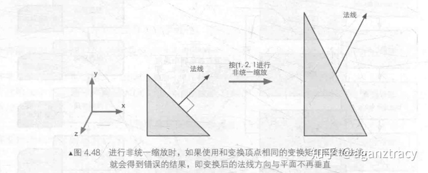

#  法线映射
-------------
法线贴图一般有两种，一种是模型空间的法线贴图，一种是切线空间的法线贴图。它们的样子分别如下所示。

左边的为模型空间的法线贴图，右边的为切线空间的法线贴图。可以很明显的看出切线空间的法线贴图整体偏蓝色。

## 1.模型空间中的法线映射
--------------
模型空间法线贴图中保存的是法线在模型空间中的`x,y,z` 坐标分量。只需要通过顶点或者像素的`uv`坐标即可在贴图中取得该位置上的法线。

如果模型进行变换，例如旋转，缩放，位移。又或者是模型顶点有变化(如骨骼动画)，此时这些获取到的法线也需要进行变换。但是如果模型存在非等比缩放的时候，我们使用模型变换矩阵$M$ 来对法线进行变换的结果就会变得不正确，如下所示。

对三角形顶点及其法线进行$(1,2,1)$的非等比缩放后，可以发现法线不再垂直三角形的斜边，也就是说我们不能直接使用模型变换矩阵$M$来对法线进行变换

### 1.1 法线变换矩阵的推导

------------------
设模型变换矩阵为$M$ ，对于模型中一个点和它对应的法线，我们可以确定一个平面，该平面方程为$Ax+By+Cz+D = 0$ 其中$(A,B,C,D)$即为该平面的法线。设该点为$(x,y,z,1)$。该点和法线它们有如下关系 。
$$
\left[\begin{array}{llll}
A & B & C & 0
\end{array}\right] \times\left[\begin{array}{l}
x \\
y \\
z \\
1
\end{array}\right]=0
$$
当该点经过模型变换矩阵变换到世界空间的时候，我们想要让上述方程依然成立，则有
$$
\left(\left[\begin{array}{llll}
A & B & C & 0
\end{array}\right] \times M^{-1}\right) \times\left(M \times\left[\begin{array}{l}
x \\
y \\
z \\
1
\end{array}\right]\right)=0
$$
对左边部分进行转置后可得
$$
\left(\left(M^{\top}\right)^{-1} \times\left[\begin{array}{c}
A \\
B \\
C \\
0
\end{array}\right]\right)^{\top} \times\left(M \times\left[\begin{array}{l}
x \\
y \\
z \\
1
\end{array}\right]\right)=0
$$

由此可以得出法线的变换矩阵为$(M^T)^{-1}$

$$
N^‘  =(M^T)^{-1}N
$$

## 2.切线空间法线映射
--------------------
切线空间法线贴图是另外一个保存法线的方式，此时贴图中保存法线在切线空间中的坐标分量。只要我们求出该点切线空间中的三个单位正交基向量，那么我们就可以通过`uv`从贴图中获取到法线在该空间的坐标分量，从而获取法线。

### 2.1 什么是切线空间
--------------
3维模型中的任意一个点都对应一个切平面，该切平面和该点的法线垂直。如下图所示。

因此我们可以通过，法线，以及切线空间中任意的两个独立的向量就可以组成一个空间，该空间就被称为切线空间。该空间存在如下三个基向量。

- **切线(Tangent Vector)**
- **副切线(Bitangent Vector)**
- **法线(Normal Vector)**

贴图中保存的三个坐标分量就是上述的基向量的坐标分量。

### 2.2 T,B,N 向量的求解

----------------

设切线向量为$T$，副切线向量为$B$ ，法线向量为$N$。设三角形三个顶点为$v_0,v_1,v_2$ ，则定义三角形的两条边向量为$E_1,E_2$  如下所示。
$$
E_1 = v1 - v0 \\
E_2 = v2 - v0
$$

设三角形的三个顶点的$uv$坐标分别为$(u_0,v_0),(u_1,v_1),(u_2,v_2)$，我们可以定义$\Delta U_1,\Delta U_2,\Delta V_1 ,\Delta V_2$

$$
\Delta U_1 = u_1 - u_0 \\
\Delta U_2 = u_2 - u_0 \\
\Delta V_1 = v_1 - v_0 \\
\Delta V_2 = v_2 - v_0
$$

如果我们知道一个点的$uv$坐标并且知道向量$T,B$。那么我们就可以求出该点在世界坐标系下的坐标。对于向量$E_1,E_2$来说同样也是如此。

$$
\begin{array}{l}
E_{1}=\Delta U_{1} T+\Delta V_{1} B \\
E_{2}=\Delta U_{2} T+\Delta V_{2} B
\end{array}
$$

上面的两个方程为二元一次方程，我们可以轻松的获取向量$T,B$的表达式。如下所示。
$$
\begin{array}{l}
T=\frac{\Delta V_{1} E_{2}-\Delta V_{2} E_{1}}{\Delta V_{1} \Delta U_{2}-\Delta V_{2} \Delta U_{1}} \\\\
B=\frac{-\Delta U_{1} E_{2}+\Delta U_{2} E_{1}}{\Delta V_{1} \Delta U_{2}-\Delta V_{2} \Delta V_{1}}
\end{array}
$$

通过上述的公式我们可以求出向量$T,B$，对于向量$N$ ，可以通过对三角形的三个顶点法线进行插值来得到。

### 2.3 TBN矩阵的求解
-----------

设切线向量为$T$，副切线向量为$B$ ，法线向量为$N$三个基向量之后，还没有结束，切线空间贴图中的坐标分量对应的是切线空间中三个单位正交基向量的线性组合。那么接下来我们需要将向量$T,B,N$ 进行正交化。

因为$向量T,B,N$为一组线性无关的向量，根据矩阵的格拉姆-斯密特 正交化法，我们可以得出如下公式
$$
\begin{array}{l}
\mathbf{n}_{\perp} = \operatorname{nrm}(\mathbf{N})\\
\mathbf{t}_{\perp}=\operatorname{nrm}(\mathbf{T}-(\mathbf{T} \cdot \mathbf{N}) \mathbf{N}) \\
\mathbf{b}_{\perp}=\operatorname{nrm}\left(\mathbf{B}-(\mathbf{B} \cdot \mathbf{N}) \mathbf{N}-\left(\mathbf{B} \cdot \mathbf{T}_{\perp}\right) \mathbf{T}_{\perp}\right)
\end{array}
$$

求出切下空间的三个单位正交基向量后，我们可以得出$TBN$矩阵为，使用该矩阵可以通过矩阵和向量的乘法的方式获取到该点的法线。

$$
M_{TBN} = \operatorname{mat4}(\mathbf{n}_{\perp},\mathbf{t}_{\perp,\mathbf{b}_{\perp}})
$$

## 3.相关连接
- [另外一种求T,B向量的方法](https://github.com/ssloy/tinyrenderer/wiki/Lesson-6bis:-tangent-space-normal-mapping)
- [关于切线空间的解析](https://zhuanlan.zhihu.com/p/139593847)