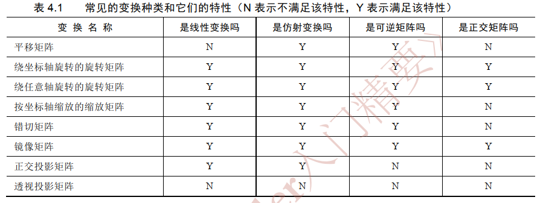

<!-- markdown-toc GFM -->

* [数学基础](#数学基础)
    * [什么是线性变换](#什么是线性变换)
    * [什么仿射变换](#什么仿射变换)
    * [常见变换种类及其特性](#常见变换种类及其特性)
    * [左手坐标系和右手坐标系旋转的正方向](#左手坐标系和右手坐标系旋转的正方向)
    * [左手坐标系和右手坐标系下叉乘的方向](#左手坐标系和右手坐标系下叉乘的方向)

<!-- markdown-toc -->

# 数学基础

## 什么是线性变换

线性变换是指一个向量空间中的变换，满足两个性质：保持向量的加法和标量乘法。向量的线性变换可以表示向量的缩放,旋转,镜像,正交投影等等操作.

## 什么仿射变换

向量的线性变换可以表示向量的缩放,旋转,镜像,正交投影等等操作. 但是对于平移操作无法使用线性变换来表示.因此通过合并线性变换和平移变换来引入一种新的变换即仿射变换, 做法是通过把矢量拓展到齐次坐标空间将3维向量和 3x3 矩阵拓展到4维向量和4x4 矩阵来达成.

## 常见变换种类及其特性

## 左手坐标系和右手坐标系旋转的正方向

在左手坐标系中,旋转正方向是由左手法则定义的,而在右手坐标系中则是由右手法则定义的. 如下图所示.

## 左手坐标系和右手坐标系下叉乘的方向

当在左手坐标系下时使用左手法则来判断叉乘的方向，当位于右手坐标系时使用右手法则来判断叉乘的方向.

