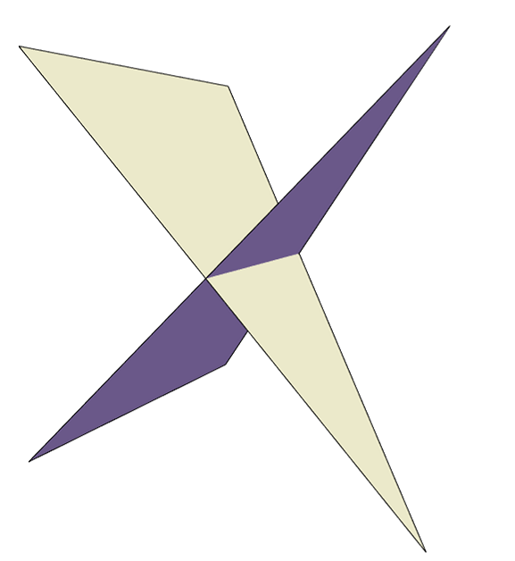

[TOC]
# 深度测试的优缺点

## 为什么需要深度测试
当我们通过光栅化绘制一个2D世界的时候，一般来说是不需要深度测试的。使用传统的画家算法就能解决大多数的问题。但是，当我们绘制3D世界的时候，就有可能出现下面这种两个三角形交叠在一起的情况。

此时画家算法就无法绘制出正确的图形，因为这两个三角形无法判断出那个在前面那个在后面。而通过使用深度测试，我们将这两个三角形采样成像素，在以像素为单位的情况下比较同一个位置上三角形像素的深度值就可以绘制出正确的画面。如下图所示

----------------------

## 绘制透明和半透明物体
深度测试的问题在于很难处理半透明物体的绘制。当一个场景中有透明和不透明物体的时候，一般的处理方法时先将不透明物体通过深度测试绘制出来，然后使用画家算法去绘制半透明物体。并且在绘制半透明物体的时候使用深度测试防止将半透明物体绘制到不透明物体的前方，也不将半透明物体的深度值写入到深度缓冲区中。

--------------------

## 深度测试的不足

- 当透明物体的三角形数量很大的时候，对这些三角形进行排序是非常困难的。
- 当存在两个半透明三角形交叠在一起的情况时，上面的方法就无法绘制出正确的画面，我们按照上面的方法去绘制两个交叠的半透明三角形，如下图所示。

我们先绘制红色三角形再绘制绿色三角形，可以看出无论时上半部分还是下半部分结果都是不正确的。

------------------