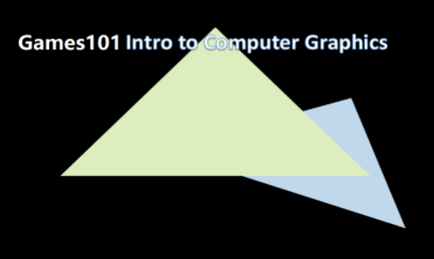
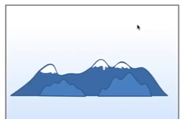
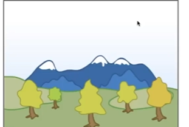
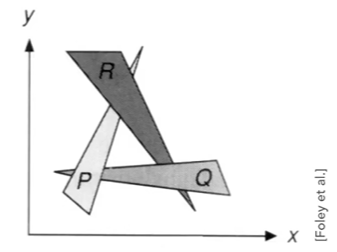
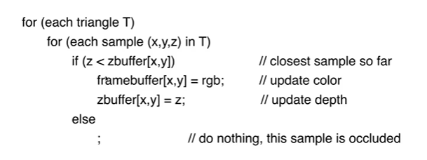
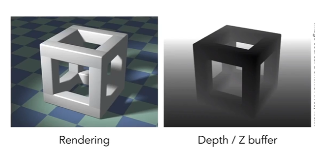

# 深度缓冲区zBuffer

我们绘制一个三角形的时候只需要键三角形直接绘制到屏幕上就可以，但是当需要绘制多个三角形的时候，我们就需要考虑这些三角形的一个重叠或者说是层级关系了。如下图所示。图中两个三角形发生了遮挡，所以在绘制这两个三角形的时候我们需要正确的处理这种遮挡关系。

## 画家算法
在2D的情况下我们一般使用画家算法来进行处理。画家算法的原理是在绘制三角形之前，首先对三角形按照它们离摄像机的距离由近到远进行一个排序，然后在绘制的时候从远到近的绘制三角形。这样的话就可以将三角形的这种遮挡关系表示出来。如下图所示,通过一层一层的绘制可以正确绘制出图像。

## 深度缓冲区算法
在3D的情况下画家算法就不再适用了，我们考虑下图中的情况，可以看出三个三角形之间都存在一个互相遮挡的关系，任何一个三角形都不能说是离摄像机最远也不能说是最近。这种情况下无论按照什么顺序绘制，绘制出来的图像都是错误的。

在这种情况下我们通过设置一个深度缓冲区，深度缓冲区（Depth Buffer）的大小跟帧缓冲区(Frame Buffer)的大小一致，并且缓冲区中每一项都保存着该像素对应的几何物体的深度的信息(一个浮点数)。绘制的是否如果发现有另外一个几何物体对应的像素上的深度比对应深度缓冲区上深度小，那么就将深度缓冲区对应位置的深度信息进行修改为最小的几何物体的深度信息。算法如下所示，深度缓冲区的初始值设置为一个无限大的值。

通过使用深度缓冲区算法，实际上我们每一帧需要绘制两张图像，一张是帧缓冲区的图像，一张是深度缓冲区的图像。如下所示，在深度缓冲区中图像的颜色越白该像素对应的几何物体部分离摄像机的距离就越远，反之越黑就越近。

