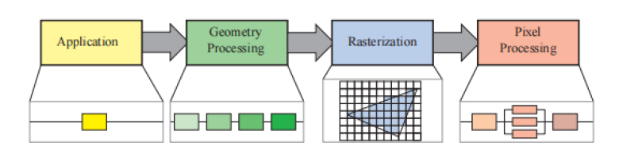
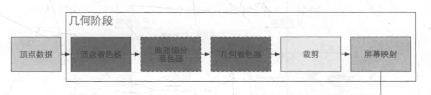
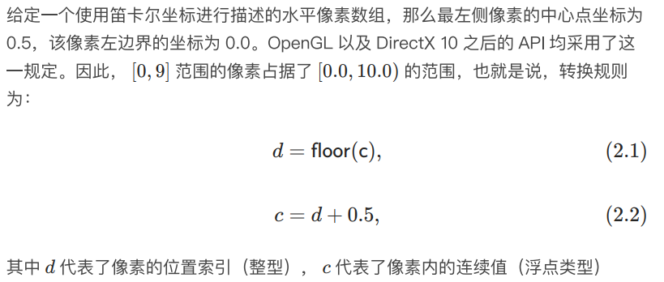

# 渲染管线

渲染图像是一个相对复杂并且耗时的过程.因此为了加快渲染的速度，而将其进行流水线化。这一步骤的关键在于将整个渲染流程切分为多个相互独立的阶段。这些相互独立的阶段就是渲染管线, 整个渲染管线可以被分为如下几个阶段。

## 应用阶段(Application)

在阶段通常运行在CPU上，典型的应用阶段进行的工作比如：碰撞检测，处理输入输出，游戏逻辑甚至是一些特殊的剔除算法等等。但是也有一些应用阶段的操作是在GPU上运行一些计算着色器。

该阶段的主要作用是准备好需要进行渲染的场景数据，并将其传送给渲染管线的下一个阶段。

## 几何阶段(Geometry Processing)

该阶段主要是进行一些逐三角形和逐顶点操作, 该阶段又可以分为几个子阶段。如下所示

- 顶点着色(Vertex Shading)
    - 该阶段的主要作用是计算顶点的位置和进行一些顶点光照计算, 甚至进行顶点动画。输出给下一个阶段着色数据(颜色，向量， 纹理等).
    - 在该阶段会对物体进行一些关键操作, 首先每个物体一开始会处在各自的模型空间(model space)中，接着会对物体进行模型变换(Model Transform) 将其转换到 世界坐标系下(world coordinate) 或者叫做世界空间(world space)中, 紧接着再通过观察变换(view transform) 将其变换到相机空间(camera space) 或者被称为观察空间(view space)和眼睛空间(eye space)中。 
- 投影(Projection)
    - 该阶段的作用主要是将位于相机空间中的物体变换到裁剪坐标系(clip coordinate)下. 该操作被称为投影变换(projection transform)该变换分为两种一种是透视投影另外一种是平行投影(正交投影只不过是平行投影的一种), 投影变换后的物体坐标都是齐次坐标(homogeneous coordinate), 因为进行变换的矩阵是一个4x4矩阵. 该过程可以想象为将相机空间的物体变换到归一化设备坐标系(normalized device coordinate)下或者称为标准立方体(standard cube)中。该标准立方体的范围是(-1,-1,-1) 到 (1,1,1). 但是由于目前还没有进行透视除法(perspective division)所以当前的物体处在裁剪坐标系下。
- 曲面细分(tessellation)
    - 该阶段是可选的主要作用是用来细分图元，该阶段又被分为壳着色器(hull shader)，曲面细分器(tessellator)， 域着色器(domain shader)三个子阶段.
- 几何着色器(geometry shader)
    - 该阶段是可选的主要作用是生成新的图元。
- 流式输出(stream out)
    - 该阶段可以将前面处理好的数据输入到一个缓冲区中而不是将其交给后续的渲染流程。这些缓冲区中的数据可以被CPU读回使用。
- 裁剪(Clipping)
    - 该阶段的作用是对将在标准立方体(standard cube)之外的图元进行消除，完全位于其中的图元将会传送给下一个阶段。而与其相交的图元则会被裁剪生成新的图元。如果我们使用的投影方法是透视投影的话这里还会进行透视矫正来正确的计算插值的顶点属性. 裁剪完成后会进行透视除法。来将物体从裁剪坐标系转换到标准立方体中。
- 屏幕映射(Screen Mapping)
    - 该阶段的作用是将物体从归一化设备坐标系转换到窗口坐标系. 其中顶点的x, y 坐标会被映射到一个最小坐标为(x1, y1), 最大坐标为(x2, y2) 其中(x1 < x2 , y1 < y2) 的窗口中，并且将z的坐标映射到[z1,z2], 默认z1 = 0, z2 = 1 (opengl 中为[-1, 1], Direct3D中则为[0, 1]). 映射后的(x, y) 坐标被称为屏幕坐标(screen coordinate). (x, y, z)则被称为窗口坐标(window coordinate)
    - 像素和坐标的对应关系

## 光栅化阶段(Rasterization)

- 三角形设置(Triangle Setup)
    - 该阶段的作用是计算三角形的微分,边界方程和其他数据这些数据可以⽤于三⻆形遍历，以及对⼏何处理阶段产⽣的各种着⾊数据进⾏插值。这个功能⼀般会使⽤固定功能的硬件实现。
- 三角形遍历(Triangle Traversal)
    - 在这⼀阶段，会对每个被三⻆形覆盖的像素（中⼼点或者样本点在三⻆形内部的像素）进⾏逐个检查，并⽣成⼀个对应的⽚元（fragment）。并且会对片元的属性进行插值(透视矫正)

## 像素处理阶段(Pixel Processing)

- 像素着色(Pixel Shadering)
    - 这⾥会使⽤插值过的着⾊数据作为输⼊，来进⾏逐像素的着⾊计算，其结果是⽣成⼀个颜⾊值或者多个颜⾊值，这些颜⾊值会被输⼊到下⼀阶段中。三⻆形设置和三⻆形 遍历使⽤了专⻔的硬件单元进⾏执⾏，⽽像素着⾊阶段则是由可编程的GPU 核⼼来执⾏的。为此，程序员需要为像素着⾊器（在OpenGL 中叫做⽚元着⾊器）提供⼀个实现程序，这个程序中包含了任何我们想要的着⾊计算操作。
- 合并(Merging)
    - 合并阶段的作用主要是将片元的颜色和颜色缓冲区中的颜色进行合并,并且处理一些可见性问题. 例如深度测试, 模板测试,颜色混合等等.
