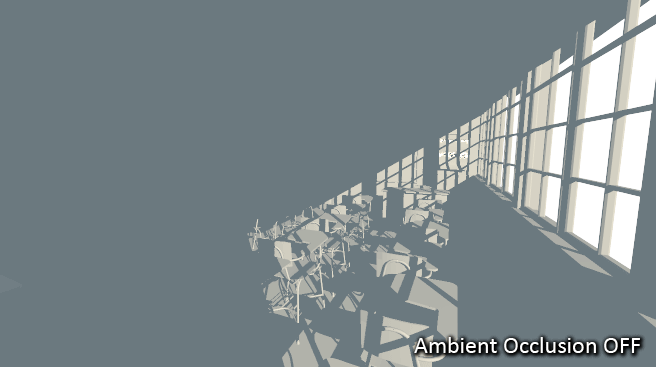

[TOC]

# 环境光遮蔽

## 1.什么是环境光遮蔽(Ambient Occlusion)

------------

环境光遮蔽是一种增加游戏环境真实度的一种方法，它可以获取到近似于 Global Illumination (GI 全局光照)的效果。它基于当前视角来进行模拟和着色。

# 2.算法原理

## 3. 作用效果

-------

环境光遮蔽可以给场景中分离的可视化物体添加全局的软阴影，从此来增加真实度。

可以看到开启了AO 后场景中物体的阴影细节增加了，从而让整个环境的真实感提升。

AO 还可以让相邻物体间的着色效果更为明显

可以看到开启AO后在光照范围后的物体的细节变得更为明显。更容易分辨出各个物体。

