# 着色

一个物体可能受到的光照类型
- 环境照明 Ambient Lighting
- 高光 Specular highlights
- 漫反射 Diffuse reflectoin
- 镜面反射 Specular reflection

在计算着色之前我们需要定义几个变量。
- 着色点 sharding point
- 观察方向 Viewer Direction
- 表面法线 sufface normal
- 光照方向 light direction
- 表面参数 surface parameters（着色点的颜色，等等属性）
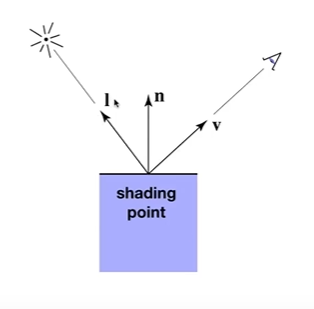

## 光照模型
- 局部光照模型-只考虑物体自己的，不考虑其他物体
- 全局光照模型- 考虑其他物体

## Blinn-Phong 着色模型

### 漫反射

漫反射的特点是它会均匀的向各个方向上反射光线，如下图所示。
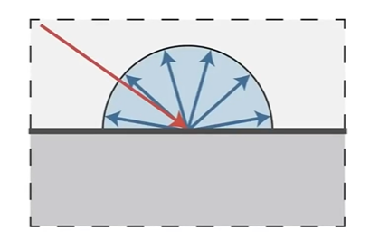

在介绍漫反射光的计算公式之前我们先来考虑几个问题。
**着色点从入射进来的光中吸收了多少能量**
- 物体接收到的光的能量是否和光线照射的角度相关？
我们假设有一定数量的光线以不同的角度照射到物体上如下图所示。可以明显的发现随着光线的入射方向和表面的法线方向的夹角越来越大物体接收到的光线数量越来越少，呈现出余弦函数的变化规律。
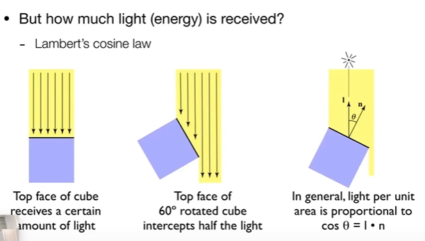

- 物体接收到的光的能量是否和物体离光源的距离有关
我假设光源的在一个单位球型上任意一点的能量为 **I**， 假设我们距离光源的距离为**r**，如下图所示。因为在各个不同距离的球型上光的总能量都一样，所以有比例式可得出在距离为r的的球型上任意一点的能量为**I/r^2**
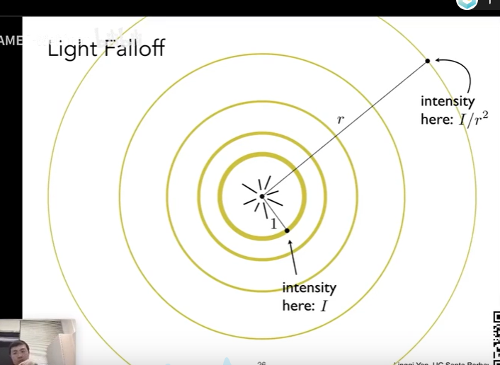

- 着色点吸收了光的能量后反射回多少能量
真正会进入到我们人眼中光线其实只是着色点反射出来的光线，当光线照射到着色点之后一部分的光线会被吸收，一部分的光线会被反射回环境中。这部分反射回环境中的光线最终会到达我们的眼睛中形成图像。我们使用一个漫反射因子来表示一个着色点会反射多少红光，蓝光，绿光。

**Lambertian 余弦定理**
该定理是用来计算漫反射最终的漫反射光，**ps ：Phong 着色模型中漫反射的计算公式是没有考虑能量守恒的想要知道能量守恒漫反射着色模型可以参考 https://www.scratchapixel.com/**
- Ld- 表示漫反射光
- Kd- 表示漫反射因子
- I- 表示光源的强度(在单位球体内)
- n- 表示表面的法线
- L- 表示光源的方向(不是光的入射方向，两者方向相反)

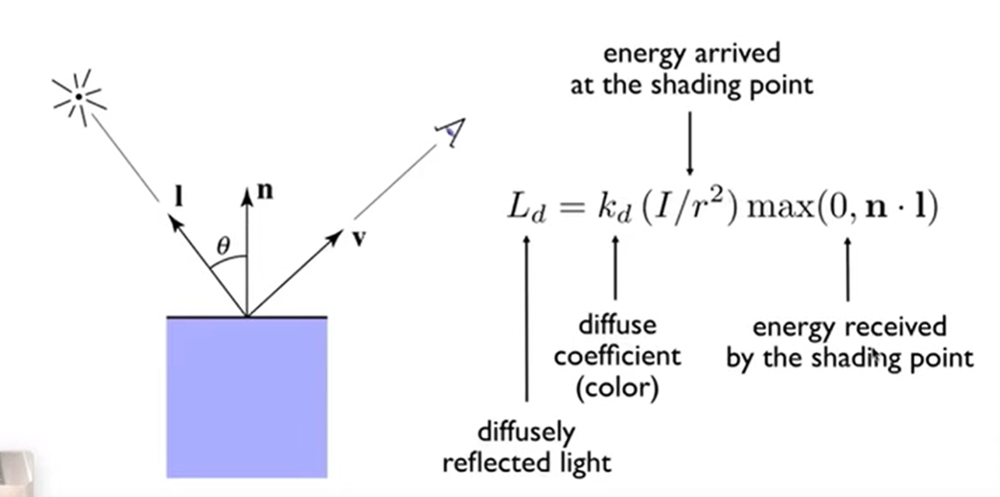

### 高光反射 -Spcular Refelction
和漫反射将光均匀的发射到各个方向不一样高光是将光大部分的往某个圆锥的范围内进行发放。只有当观察方向和光的 出射方向的夹角越小时接收到的光就越多。如下图所示。
- R-是光的反射方向
- I- 是光的入射方向
- n-是表面的法线 
- Ks-是高光因子，因为自然界中的高光一般来说是白色的所以这一项通常接近向量(1,1,1).
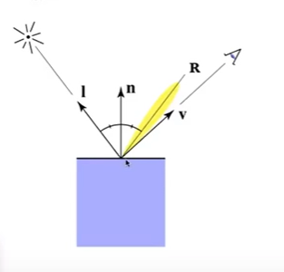

**计算公式**
可以看到高光反射的计算公式其实和漫反射的计算公式差不多，**不同的地方在于高光的计算公式中并没有考虑到光以不同的夹角照射物体时候的能量吸收率问题。我们可以自己加上这一项，但是没有必要因为这里的高光计算公式其实只是个经验公式**。
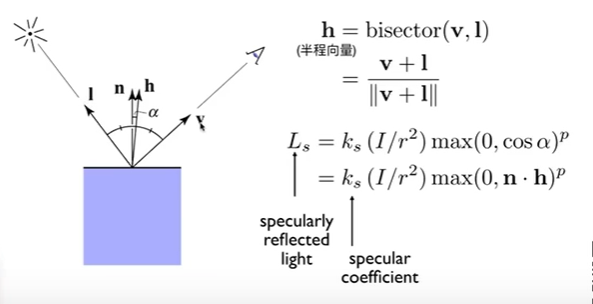

- 我们还可以发现公式中使用的是半乘向量来计算入射到人眼的光的能量。这是因为反射方向R和观察方向V的夹角的变化和表面防线n和半乘向量h的夹角变化是一样的。

- 我们还可以发现计算入射到人眼的光的能量的时候使用了 一个指数p，如下图所示
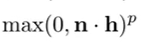
不同的p值会让cos函数产生如下图所示的变化，为什么需要这样的变化呢？那是因为我们在生活中能看到的高光的范围非常小，所以夹角越大能看到的高光就越小。
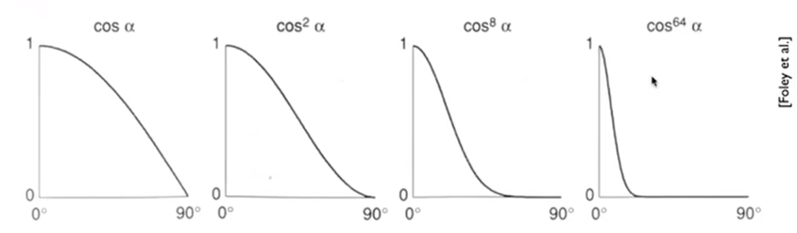
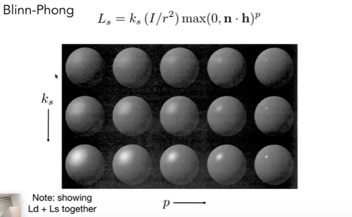

### 环境光照
该模型中环境光的计算方式是十分简单的，就是一个常数。如下图所示
- Ka-表示环境光因子
- Ia-表示环境光强度
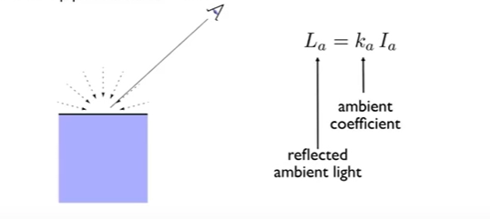

### Blinn-Phong 反射模型

我们将上面所有光照类型总结起来，应用到每一个着色点后，结果和计算公式如下所示。
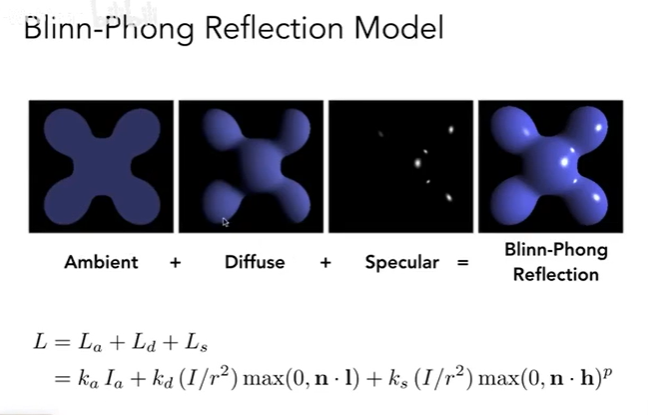

## 着色频率
我们上面基于一个着色点(shared point)来进行讨论的，那么我么在实现中是如何应用这么一个概念的呢？其实我们在实现中一般来说可以考虑下面几个不同的实现方式。这三种方式对应不同的着色频率，性能开销逐步递增。
- 基于面的着色(flat sharding)
- 基于三角形顶点的着色(Gouraud sharding)
- 基于像素的着色(Phong sharding)
这三种方式的效果如下图所示。
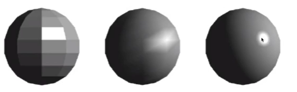
并不是说使用频率最高的那种着色就一定最优，在物体的几何足够复杂的时候使用较低频率得出的效果可能和频率高的得出的效果差不多，如下图所示。
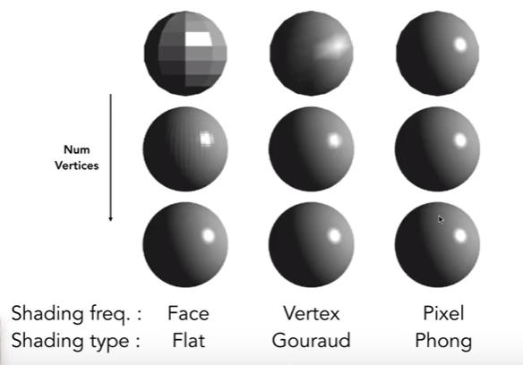

### 如何计算每一个顶点的法线
对一个顶点所临近的所有的面的面法线做一个平均或者是加权平均即可
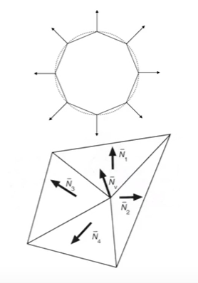

### 如何计算每一个像素的法线
使用顶点所组成的三角形重心坐标来进行一个插值来进行计算。

