[TOC]
# 坐标点的空间变换

**变换的整个过程主要包括四个阶段**

1. Modeling/World Transformation - 世界变换
   - 将模型从自己的模型(局部)坐标空间变换到世界坐标空间中。
2. Eye/Camera Transformation - 摄像机变换
   - 将模型变换到摄像机空间中，另外一种等价的说法是将摄像机变换到世界坐标原点。
4.  Projection  Transformation - 投影变换
   - 将上一个坐标空间中的点变换到一个x,y,z坐标在[-1,1] 范围内的空间，这个空间叫做NDC空间(归一化设备坐标空间)或者裁剪空间（Clip Space），和规范视域体（canonical View Volume）。
   - 投影变换分为两种一种是正交投影，一种是透视投影。
5. ViewPort/Windowing Transformation - 视口变换
   - 将在NDC坐标空间中的模型变换到具体的像素坐标空间当中。

**变换过程中坐标空间的转变**

------
## 变换中坐标空间

**世界坐标系**
游戏世界的原点，通常原点位置在(0,0,0),x,y,z的取值可以任意。

**摄像机坐标系 View Space**
以摄像机的位置作为坐标的原点，并在其原点上构建出u,v,w三个坐标系的基，x,y,z的取值是任意的。

**正交视域体(orthographic view volume)**
一个由l,r,b,t ,n,f参数定义的长方体，当投影方式为正交投影的时候，在OVV中的三角形才会被渲染。当投影方式是透视投影时点被矩阵**P**处理后就会位于OVV。

**NDC坐标(归一化设备坐标)/规范视域体(canonical view volume)** 
是一个正方体，长度是2，或者是1,里面的坐标范围是[-1,1]或者是[0,1]。

**像素空间**
实质上就是屏幕或者是一个窗口中的像素所形成的一个二维坐标系。原点一般来说在屏幕/窗口的左下角。

------

## 视口变换

视口变换的作用是将在 **NDC坐标(归一化设备坐标)/规范视域体(canonical view volume)** 中的模型变换到具体的屏幕/像素空间当中。负责该变换的矩阵记作$M_{\mathrm{vp}}$

**变换公式**
$$
\left[\begin{array}{c}
x_{\text {screen }} \\
y_{\text {screen }} \\
1
\end{array}\right]=\left[\begin{array}{ccc}
\frac{n_{x}}{2} & 0 & \frac{n_{x}-1}{2} \\
0 & \frac{n_{y}}{2} & \frac{n_{y}-1}{2} \\
0 & 0 & 1
\end{array}\right]\left[\begin{array}{c}
x_{\text {canonical }} \\
y_{\text {canonical }} \\
1
\end{array}\right]
$$

$\left[\begin{array}{c}x_{\text {canonical }} \\y_{\text {canonical }} \\1\end{array}\right]$ 为在**NDC坐标(归一化设备坐标)/规范视域体(canonical view volume)** 中的点。

$\left[\begin{array}{ccc}
\frac{n_{x}}{2} & 0 & \frac{n_{x}-1}{2} \\
0 & \frac{n_{y}}{2} & \frac{n_{y}-1}{2} \\
0 & 0 & 1
\end{array}\right]$为在**视口变换矩阵** ,记作Mvp

$\left[\begin{array}{c}
x_{\text {screen }} \\
y_{\text {screen }} \\
1
\end{array}\right]$为在**屏幕空间中的点** 

nx，ny 为屏幕在x，y轴上的像素的数量

**三维形式**
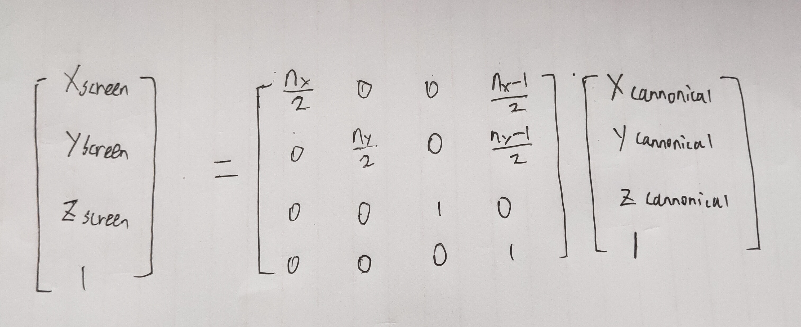

我们将该视口转换矩阵记作 $\mathbf{M}_{\text {vp}}$ ，如下所示。
$$
M_{\mathrm{vp}}=\left[\begin{array}{cccc}
\frac{n_{x}}{2} & 0 & 0 & \frac{n_{x}-1}{2} \\
0 & \frac{n_{y}}{2} & 0 & \frac{n_{y}-1}{2} \\
0 & 0 & 1 & 0 \\
0 & 0 & 0 & 1
\end{array}\right]
$$

注意这里的 $\mathbf{M}_{\text {vp}}$ 并没有考虑像素空间的y轴正方向是垂直向下的。实际进行处理的时候需要考虑这一点。

------
## 摄像机变换

无论是正交投影还是透视投影都存在摄像机变换,它的作用是将模型变换到**摄像机空间**中，摄像机变换的矩阵记作$M_{\mathrm{cam}}$ ，摄像机变换的本质是坐标系的变换。

图形学中定义一个摄像机是通过，定义 **e** 摄像机的位置，**g** 摄像机的朝向，**t** 摄像机的上方，这三个向量来进行定义的。然后再通过这三个向量来计算出摄像机的坐标系的三个正交基向量 **u,v,w**。

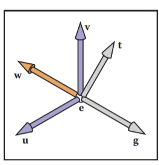 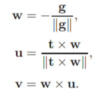

假设我们有在摄像机坐标系中的点A(a,b,c)，且知道摄像机坐标系的基在世界坐标中的表示 u,v,w三个向量和摄像机距离世界坐标系原点的向量e。**那么将这个点从摄像机坐标系转换到世界坐标系的矩阵为**
$$
\mathbf{M}_{\text {cam }}=\left[\begin{array}{cccc}
\mathbf{u} & \mathbf{v} & \mathbf{w} & \mathbf{e} \\
0 & 0 & 0 & 1
\end{array}\right]^{-1}=\left[\begin{array}{cccc}
x_{u} & y_{u} & z_{u} & 0 \\
x_{v} & y_{v} & z_{v} & 0 \\
x_{w} & y_{w} & z_{w} & 0 \\
0 & 0 & 0 & 1
\end{array}\right]\left[\begin{array}{cccc}
1 & 0 & 0 & -x_{e} \\
0 & 1 & 0 & -y_{e} \\
0 & 0 & 1 & -z_{e} \\
0 & 0 & 0 & 1
\end{array}\right]
$$

------

## 正交投影和透视投影

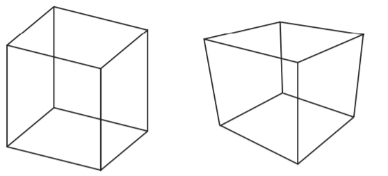
上图中绘制的是两个同样的正方体，左边是正交投影的作用效果，右边的是透视投影的作用效果。可以发现他们有一个很重要的区别就是透视投影会发生一个近大远小的现象。

在透视投影的作用下远处的边变的更小了，这会导致本来应该永不相交的两条平行的边变的不平行了。

**正交投影和透视投影的投影过程**

- 正交投影     模型坐标系 --> 世界坐标系 --> 摄像机坐标系 --> NDC坐标(归一化设备坐标)/规范视域体(canonical view volume) --> 像素空间/光栅空间
- 透视投影    模型坐标系 --> 世界坐标系 --> 摄像机坐标系 -->正交视域体(orthographic view volume)--> NDC坐标(归一化设备坐标)/规范视域体(canonical view volume) --> 像素空间/光栅空间

------

### 正交投影变换

正交投影的作用就是将 **正交视域体(orthographic view volume)** 中的模型变换到 **NDC坐标(归一化设备坐标)/规范视域体(canonical view volume)** 坐标空间中。正交投影中正交矩阵记作$M_{\mathrm{orth}}$

一个正交视域体如下所示
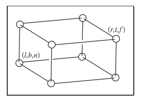

我们通过l,r,b,t,n,f 这六个数值来表示正交投影的长方体(该长方体长宽都为2)，分别表示左平面，右平面，上平面，下平面，近平面，远平面。
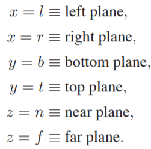

正交投影与透视投影的不同在于正交投影是将一个长方体内的模型变换到NDC，而透视投影是将一个视锥体内的模型变换到NDC。
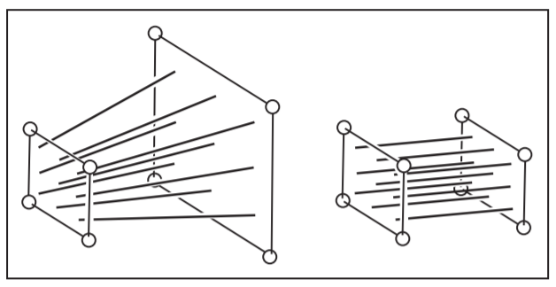

**正交矩阵**
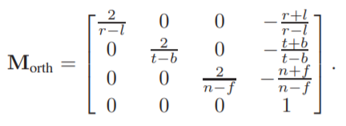
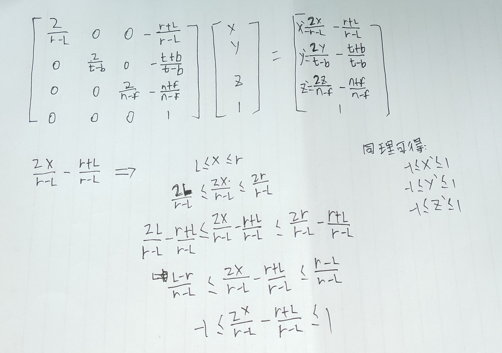

需要注意经过该矩阵变换后，近平面面上的点在NDC中的值为1，远平面上的点在NDC中的值为-1。

------

#### 正交投影的矩阵作用过程

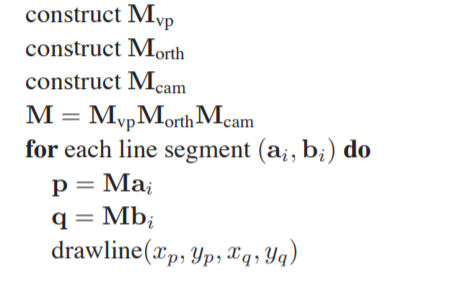

------

### 透视投影变换
透视投影变换的作用是将**摄像机空间**中的模型变换到**透视空间( perspective volume)**中，透视投影矩阵记作**P**。

透视投影和正交投影的区别是透视投影是将一个视锥体内的模型变换到NDC,而正交投影是将一个长方体内的模型变换到NDC.如下图所示。

我们可以将透视投影变换的过程想象成将一个视锥体拉伸成一个由l,r,t,b,n,f定义的长方体的过程。但是从数学上来说就是求一个相似三角形的过程，如下图所示。
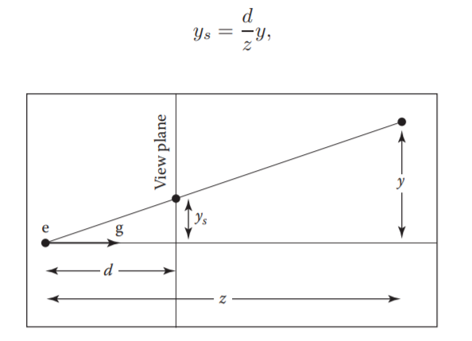

**透视投影矩阵**

我们定义n,f分别表示近平面和远平面.投影变换矩阵**P**如下所示，该矩阵的作用是将摄像机坐标系中的点转换到**正交视域体**(**orthographic view volume**)中。
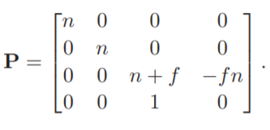
推导过程为
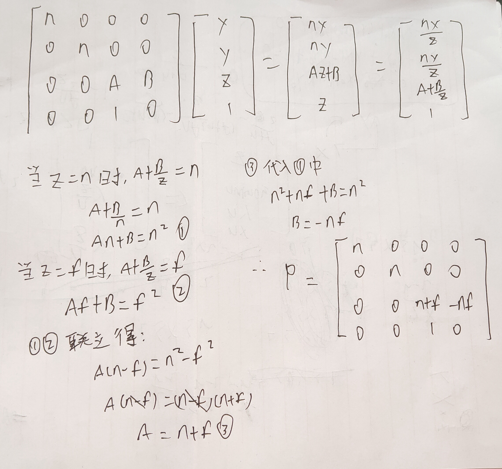
**ps:这里使用的是右手坐标系的方式进行推导**

我们将矩阵P和之前的矩阵$M_{\mathrm{orth}}$ 组合在一起可以得到透视投影矩阵 $M_{\mathrm{per}}$，如下所示。

$$
\mathbf{M}_{\text {per }}=\mathbf{M}_{\text {orth }} \mathbf{P}
$$

$$
\mathbf{M}_{\text {per }}=\left[\begin{array}{cccc}
\frac{2 n}{r-l} & 0 & \frac{l+r}{l-r} & 0 \\
0 & \frac{2 n}{t-b} & \frac{b+t}{b-t} & 0 \\
0 & 0 & \frac{f+n}{n-f} & \frac{2 f n}{f-n} \\
0 & 0 & 1 & 0
\end{array}\right]
$$
------

#### 透视投影的作用过程

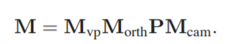
其中我们可以将**M**orth矩阵和**P**矩阵合并成一个新的矩阵**M**per
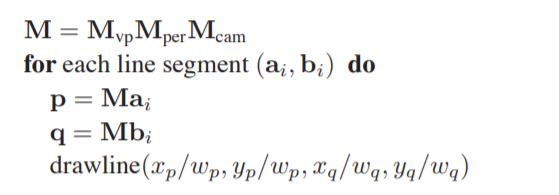

--------------------------

## 光栅化
一个屏幕是由一系列的像素构成的，我们一般抽象化这些像素为一个方形区域，在这个方形区域里面有三个子像素，每个分别发出红光，蓝光，绿光。这三种光组合可以发出各种颜色的光(但在实际上这些像素其实不一定是一个方形的区域)。

**屏幕坐标空间范围**
屏幕坐标空间的原点一般来说是在左下角，我们通常使用一个像素的中心点来定位一个像素，来确保一个像素的坐标是一些列的整数，比如如下所示像素的坐标范围在[0,0]到[width-1,height-1]中(使用整数)，而实际上的整个屏幕的坐标空间范围是在[-0.5,-0.5]到[width-0.5,height-0.5]中(使用浮点数)
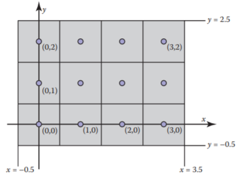

**如何判断一个像素是否在三角形里面**
当我们将三角形的三个顶点坐标从NDC空间转换到屏幕坐标空间的时候，每一个顶点的坐标范围就在[-0.5,-0.5]到[width-0.5,height-0.5] （浮点数）。那么如何判断哪些像素在三角形中呢?
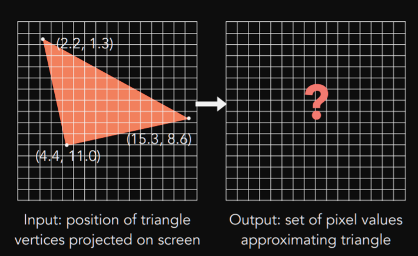

答案是进行采样，我们可以对所有像素点进行一个采样操作，来判断这个像素是否在三角形中。抽象的来说采样其实就是将一个点，传入到一个函数中进行处理后返回一个值的这么一个过程，通过采样我们可以将一个函数离散化。在这个例子中我们通过向量叉乘来判断一个点是否在三角形内来判断一个像素是否在三角形内。
ps:我们可以使用AABB来减少判断像素是否在三角形内的时间开销。
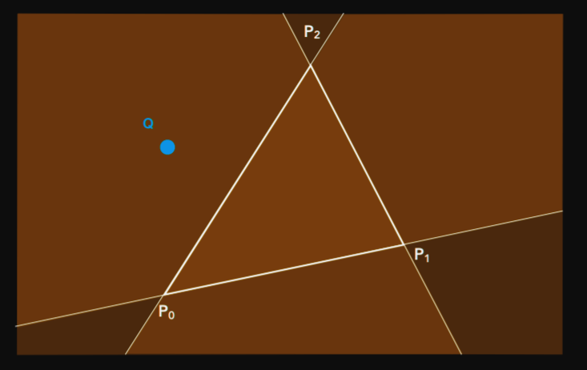

**如果像素中心点正好在三角形的边上的时候如何处理**
这个视情况而定在Directx中在要是点在左和下两条边的话就算在三角形中。

