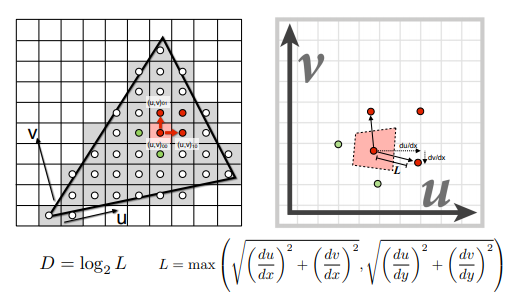

# 纹理映射
我们一般只将顶点的数据传送到图形管线中进行渲染，但是当图形管线渲染之后每一个像素都会自己的渲染颜色，发生这一个现象是因为图形管线在渲染每一个像素的时候，会对顶点数据进行一个插值，从而根据顶点数据找到每一个像素对应的渲染数据。

-----------------------

## 三角形重心坐标
一个任意的三角形，它的由同一坐标系中的A,B,C三点组成，那么该三角形中的任意一点都可以表示为A,B,C的一个线性组合。

其中
$$
\alpha>=0 , \beta >=0 , \gamma>=0
$$
其中三个参数的值可以通过内部三角形面积的比值来进行求解

也可以不使用面积比值的方式来进行求解

### 三角形的重心坐标并不是投影不变的
当我们知道了一个点在三角形中的重心坐标的时候，我们就可以对顶点数据进行插值来获取对应像素上的数据。
但是如果我们在屏幕空间中直接进行属性插值，这个结果是不正确的，因为投影之后的三角形会发生改变，我们在世界坐标系下求出的三角形内部某点的重心坐标和该点在屏幕空间中求出的重心坐标的结果是不一致的。直接使用屏幕空间中的重心坐标进行求值不会得到正确的渲染结果。

**解决方法**
- 将三角形和该点逆变换回世界坐标系或者是摄像机坐标系中，再进行重心坐标求解。
- 使用一些数值方式来修正结果。

-----------------

## 纹理采样
当我们计算出像素对应的纹理坐标的时候，我们就需要根据物体绑定的贴图来进行一个纹理采样。**为了方便取值我们一般将贴图映射成一个坐标，这个坐标被称为纹理坐标(uv坐标)，这个坐标系中水平为u(0~1)，垂直为v(0~1)。贴图中的每一个像素被称为纹素。贴图的大小很可能各不相同**

### 纹理采样的问题
**当我们将纹理采样到像素的时候需要注意一个问题就是屏幕中的像素实际上对应于多大的纹理范围**，如下图所示，当需要进行映射的区域和纹理的大小刚好一样的时候，这个时候纹理采样不会出现什么问题。

- 当我们将一个较小的纹理映射到一个较大的像素范围的时候(放大纹理)，一个像素所覆盖的纹理范围很小。
- 但是当我们将一个较大的纹理映射到一个较小的像素范围的时候，一个像素所覆盖的纹理范围就会很大。(样本频率非常高，但采样频率很低)

### 当纹理过小
这种情况下一个像素所覆盖的纹理范围很小，我们可以使用一些插值方法来进行采样。
方式有三种如下所示，**效果从低到高，性能开销从低到高**
- Nearest(Point?)-取最近的纹素
- Bilinear-取于uv坐标相邻的四个纹素然后在垂直和水平方向上进行线性插值。
- Bicubic- 取于uv坐标相邻的十六个纹素然后进行插值(非线性插值)。

### 当纹理过大
这种情况下一个像素所覆盖的纹理范围就会很大，当我们继续使用上述的插值方式的时候，就会出现问题，如下所示。渲染后的图像出现了**Moire**纹和锯齿。

出现这种问题的根本原因是信号的频率很高，但是采样的频率太低。解决方案
- 使用一些Supersampling（超采样技术）
- 使用MipMap本质上是一种范围查询

## MipMap
当纹理过大的时候会出现上述所说的问题，使用Supersampling来解决是十分耗时和浪费资源的，如果能进行**范围查询**即一次性获取像素所对应的纹素范围内所有的纹素的平均值，那么就可以解决这个问题。MipMap其实就是在原来纹理的基础上将纹理在长宽上各缩小一半。直到图像大小变为1x1.**使用MipMap最多会增加1/3的存储空间，基于贴图大小**

生成了MipMap之后，在进行采样之前，我们会获取目标像素和它周围两个像素，然后将这三个像素映射到纹理上。

然后我们计算出目标纹素到其他两个纹素之间距离的最大值，使用这个最大值以目标纹素为中心抽象出一个正方形，这个正方形可以被近似的认为是目标像素覆盖的纹素的大小。

然后使用**log2**公式计算出该正方形范围在哪一层的MipMap会缩小为1一个像素。然后在这个MipMap以及和它相邻的MipMap上进行线性插值(点采样的思想)。如下所示。

### MipMap存在的问题
虽然使用了MipMap但是生成出来的图像的质量还是不行，如下所示。

出现该问题的原因在于我们使用一个正方形的方式去近似了像素覆盖的纹素范围，但是实际上像素覆盖的纹素范围是不规则的各种形状都有可能。如下图所示。

## 各向异性过滤(Anisotropic Filtering)
为了更加准确的近似像素覆盖的纹素范围，在生成MipMap的时候我们不仅在 长且宽上，在长和宽上也进行缩放来生成MipMap，如下所示。

当在插值的时候我们不仅和对角线上的MipMap进行插值，也和上方和左边的Miap进行插值，这样相当于。这样生成的结果质量更高。
