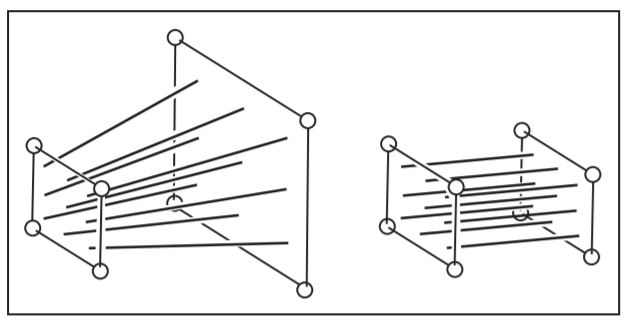

# 透视矫正

---------------

在光栅化过程中，直接使用在**Window Space**的点来求像素点的重心坐标，然后使用这个重心坐标来进行插值。那么插值得到的结果其实是不正确的。最明显的就是在绘制地板这种模型的时候，透视不争取来导致地板纹理的扭曲，如下所示。

透视不正确

透视正确

## 2 透视不正确的原因

----------

透视不正确的原因在于，$Window Space$ 和$Camera Space$ 的线性关系，在进行透视投影的时候被打破。如下图所示。

我们在**Window Space** 中利用0.5在$a,b$ 两点之间插值可以得到$a,b$ 的中点$c$，如果将该点对应到$Camera Space$ 中，我们可以得到点$C$，可以发现点$C$ 并不是点$A,B$ 的中点。在正常情况下点$C$ 应该是$A,B$ 的中点。这正是由于透视投影打破了$Window Space$ 和$Camera Space$ 中点的线性映射关系。

从几何上来说明，就是当一个点在**Camera Space** 时它位于如下的一个视锥体中，而透视投影的过程则将该视锥体拉伸为一个立方体。而在次过程中点的z轴坐标发生了改变。

## 3. 透视矫正算法

-------------

### 3.1 线性插值的透视矫正
-----------

矫正公式如下所示，其中$Z_1,Z_2,Z_t$为点$A,B,C$ 在**Camera Space**中的z轴坐标值，$s$为在$Window Space$ 中的线性插值系数。$I_1,I_2$为需要进行插值属性，$I_t$ 为插值结果。

$$
\begin{array}{c}

Z_{t}=\frac{1}{\frac{1}{Z_{1}}+s\left(\frac{1}{Z_{2}}-\frac{1}{Z_{1}}\right)} \\\\

I_{t}=\left(\frac{I_{1}}{Z_{1}}+s\left(\frac{I_{2}}{Z_{2}}-\frac{I_{1}}{Z_{1}}\right)\right) / \frac{1}{Z_{t}}
\end{array}
$$

[线性插值的透视矫正推导过程](https://www.comp.nus.edu.sg/~lowkl/publications/lowk_persp_interp_techrep.pdf)

### 3.2 重心坐标的透视矫正
------------

重心坐标插值的透视矫正公式如下所示，$a,b,c$为像素点对应的重心坐标值，$w_a,w_b,w_c$为$a,b,c$三点在**Window Space** 中坐标的$w$ 分量。$f_a,f_b,f_c$ 为 $a,b,c$三点上的属性值。$f$为该像素点对应的属性值。

$$
f=\frac{a f_{a} / w_{a}+b f_{b} / w_{b}+c f_{c} / w_{c}}{a / w_{a}+b / w_{b}+c / w_{c}}
$$

[重心坐标插值的透视矫正](https://www.khronos.org/registry/OpenGL/specs/es/2.0/es_full_spec_2.0.pdf)
