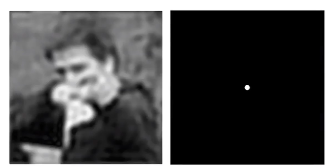
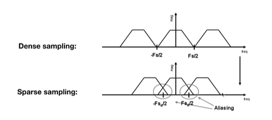

## 采样，走样和反走样

### 什么是采样
采样是指用每隔一定时间的信号样值序列来代替原来在时间上连续的信号，也就是在时间上将模拟信号离散化。
把连续信号转换成离散信号的过程称为采样过程（sampling process），采样的本质是将一个连续表现的事物离散化。如下图所示，一个人挥拍的动作是连续的，但是我们可以通过每隔一段时间来记录下当前人物的动作，来采样出一个人挥拍的动画。

------------------------

### 走样
走样产生的原因是信号变化的速度太快，以至于采样的速度跟不上信号变化的速度，从而导致走样，采样频率越低，走样越高.假设我们有f1,f2,f3,f4,f5这五条函数，他们的频率依次递增，他们的函数图像如下所示，我们用同样的一种采样方式，每隔一个固定的距离就采样函数的一个点，在使用这些采样点来还原原来的函数的时候我们可以看到，f5，f4这两个函数的还原出来的图像和原来的函数差别很大，这就发生了走样。

在计算机图形学中，将一个三角形离散化到一个屏幕空间的像素中也会发生走样。所以用像素来显示一个三角形实际上并不是一个完美的三角形，如下所示。可以看出三角形在采样后发生了严重的走样。

这是需要进行采样的三角形

这是采样之后的结果

-------------------------

### 滤波

#### 傅里叶级数 
任何一个周期函数，都可以发写成一系列的正弦和余弦函数的组合。例如我们可以通过通过一系列的正弦和余弦函数的组合来近似的表示一个box Function。并且这个近似可以越来越逼近。

#### 傅里叶变换
傅里叶变换的作用是将一个函数转变为另外一个函数(不太专业).在数字图像处理领域上使用傅里叶变换可以得到一幅图像的频域图。

#### 滤波
滤波的作用是将一个信号上的一些特定频率的信息进行过滤去除。

**将图像从时域转变到频域**
时域并不代表一个图像在时间上的关联，反而它是一副图像在空间上的关联。如下所示左边是一副图像的时域图，右边是一副图像的频域图(或者是频谱图)。通过傅里叶变换可以将图像从时域变换到频率。

频域图的中心代表低频部分，而频域图的四周表示高频部分。自然界的大部分图像的频率都是低频信息。所以上图中信息基本集中在频域图(或者是频谱图)的中间位置。

**图像的频率具体是什么东西呢？**
图像频率的物理意义。图像可以看做是一个定义为二维平面上的信号，该信号的幅值对应于像素的灰度（对于彩色图像则是RGB三个分量），如果我们仅仅考虑图像上某一行像素，则可以将之视为一个定义在一维空间上信号，这个信号在形式上与传统的信号处理领域的时变信号是相似的。不过是一个是定义在空间域上的，而另一个是定义在时间域上的。所以图像的频率又称为空间频率，它反映了图像的像素灰度在空间中变化的情况。例如，一面墙壁的图像，由于灰度值分布平坦，其低频成分就较强，而高频成分较弱；而对于国际象棋棋盘或者沟壑纵横的卫星图片这类具有快速空间变化的图像来说，其高频成分会相对较强，低频则较弱（注意，是相对而言）。-**--知乎网友的回答**

**低通滤波**
我们可以将频谱图中高频部分的信息给消去，然后对频谱图进行逆傅里叶变换，就可以得到一个新的时域图。如下所示，可以看到我们得到了一张相对模糊的图像。

**高通滤波**
我们可以将频谱图中低频部分的信息给消去，然后对频谱图进行逆傅里叶变换，就可以得到一个新的时域图。如下所示，可以看到图像只剩下图像内容中的边界了。

**卷积**

在时域上的卷积等价于两个信号在频域上的乘积然后再对结果进行逆傅里叶变换。
如下图所示在图的上部分进行的是一个卷积操作，图的下部分进行的两个信号频域数据的乘积。

--------------------

### 采样和走样在频谱上的表示
进行采样的时候，我们实际上是在时域上进行，可以理解为将需要进行采样的函数和采样函数（一般被称为脉冲函数）进行一个乘积。在时域上的乘积操作对应于在频域上的一个卷积操作，如下图所示。观察图得知，**在频域上的采样就是在重复原始信号的一个频谱**。

对于走样在频谱上的表现就是发生了混叠现象。如下图所示原始信号的频谱在采样之后发送了混叠.**采样频率越稀疏，混叠现象越严重**。

------------------------

### 反走样
反走样是通过一系列的算法来减少采样过程中造成的走样的一系列操作。反走样方法有如下所示。
- 增加采样率
- 先模糊再采样-在时域上通过进行模糊再进行采样。频域 上对应的操作是将原始信号上的高频部分去除，然后 进行卷积，通过这样来减少在采样上发生的混叠现象，如下所示。

计算机图形学中的抗锯齿方案

- MSAA
- FXAA
- TAA

在光栅化过程中一种反走样方法就是通过对三角形进行一个模糊(或者说是滤波)操作可以减少三角形在像素空间中显示的走样效果。如下图所示。可以地看到在屏幕空间中的三角形被更好的显示出来。

一些复杂场景中通过将三角形先模糊然后进行采样的效果和不进行模糊直接采样的效果如下图所示。左边是没有经过模糊直接采样，右边是先进行模糊再进行采样，可以看到效果十分的明显。

-----------------------

