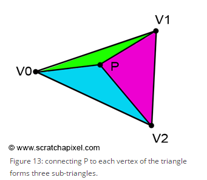
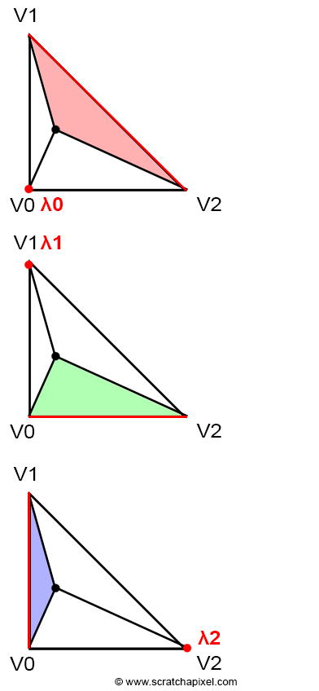

# 三角形的重心坐标
----------

## 1.什么是三角形的重心坐标
-------------

重心坐标可以说是图形学中相当重要的一个概念，通过重心坐标。可将顶点的各个属性进行插值，从而获取某像素点上对于数据。这些数据包括但不限于，法线，颜色值，纹理坐标，等等。

三角形中的任意一个点可以通过，三角形的三个顶点的线性组合得到
$$
P = \lambda_0*V_0+\lambda_1*V_1+\lambda_2*V_2
$$

对于$\lambda_0,\lambda_1,\lambda_2$ 有$\lambda_0+\lambda_1+\lambda_2 = 1,$ 。且$\lambda_0>=0,\lambda_1>=0,\lambda_2>=0$

## 2.重心坐标的计算方式

-----------

三角形中任意一个点的重心坐标值的计算方法有许多，它们各有个的优点。设三角形由三个顶点$V_0,V_1,V_2$ 组成，三角形中存在一个点$P$ 。如下所示。



### 2.1 通过面积比例来计算重心坐标

-------------

重心坐标的三个坐标值可以通过，三角形的面积和由$P$切割出来的三个小三角形的值来求出。



$$
\begin{array}{l}
\lambda_{0}=\frac{\operatorname{Area}(V 1, V 2, P)}{A \operatorname{rea}(V 0, V 1, V 2)} \\
\lambda_{1}=\frac{\operatorname{Area}(V 2, V 0, P)}{\operatorname{Area}(V 0, V 1, V 2)} \\
\lambda_{2}=\frac{\operatorname{Area}(V 0, V 1, P)}{\operatorname{Area}(V 0, V 1, V 2)}
\end{array}
$$

特别的一个三角形的面积可以通过叉乘来进行求解，上图中三角形$\triangle_{v0v1v2}$ 可以通过它的任意两条边$A,B$ 通过以下公式来进行求解
$$
Area_{\triangle V 0 V 1 V 2}=\frac{1}{2} A \times B=\frac{1}{2}(A . x * B . y-A . y * B \cdot x)
$$


### 2.2 Cramer's rule

----------------

**Cramer's rule** 通过求解一个线性方程组的方式来高效的求解重心坐标。对于$P$ 有
$$
\begin{array}{c}
P = (1 - \lambda_1 - \lambda_2)V_0+\lambda_1V_1+\lambda_2V_2 \\\\
\overrightarrow{V_0 P} = \lambda_1\overrightarrow{V_0 V_1}+\lambda_2\overrightarrow{V_0 V_2} \\\\
\lambda_1\overrightarrow{V_0 V_1}+\lambda_2\overrightarrow{V_0 V_2}+\overrightarrow{P V_0} = 0

\end{array}
$$

由上可得
$$
\begin{array}{c}
\lambda_1\overrightarrow{V_0 V_1}_x+\lambda_2\overrightarrow{V_0 V_2}_x+\overrightarrow{P V_0}_x = 0 \\\\
\lambda_1\overrightarrow{V_0 V_1}_y+\lambda_2\overrightarrow{V_0 V_2}_y+\overrightarrow{P V_0}_y = 0\\\\
\end{array}
$$

最终可以得出如下两个方程组
$$
\begin{array}{c}
\left[\begin{array}{c}    
\overrightarrow{V_0 V_1}_x & \overrightarrow{V_0 V_2}_x & \overrightarrow{P V_0}_x
\end{array}\right] \left[ \begin{array}{c} \lambda_1\\ \lambda_2 \\ 1 \end{array} \right] = 0 
\\\\
\left[\begin{array}{c}    
\overrightarrow{V_0 V_1}_y & \overrightarrow{V_0 V_2}_y & \overrightarrow{P V_0}_y
\end{array}\right] \left[ \begin{array}{c} \lambda_1\\ \lambda_2 \\ 1 \end{array} \right] = 0

\end{array}
$$

可以看出向量$\left[\begin{array}{c}\lambda_{1} \\ \lambda_{2} \\ 1\end{array}\right]$ 和向量$\left[\begin{array}{c}\overrightarrow{V_0 V_1}_x \\ \overrightarrow{V_0 V_2}_x \\ \overrightarrow{P V_0}_x\end{array}\right]$ 以及向量$\left[\begin{array}{c}\overrightarrow{V_0 V_1}_y \\ \overrightarrow{V_0 V_2}_y \\ \overrightarrow{P V_0}_y\end{array}\right]$ 垂直。也就是说我们只需要求向量$\left[\begin{array}{c}\overrightarrow{V_0 V_1}_x \\ \overrightarrow{V_0 V_2}_x \\ \overrightarrow{P V_0}_x\end{array}\right]$ 以及向量$\left[\begin{array}{c}\overrightarrow{V_0 V_1}_y \\ \overrightarrow{V_0 V_2}_y \\ \overrightarrow{P V_0}_y\end{array}\right]$的叉乘，然后将结果正交化后就可以求出$\lambda_0,\lambda_1,\lambda_2$


## 3.代码示例
```c++
Vec3f getBarycentric2D(const Vec2Int& v0, const Vec2Int& v1, const Vec2Int& v2, const Vec2Int& p)
{
    
	Vec3f u = vec3f_Cross(Vec3f((v1.x - v0.x), (v2.x - v0.x),(v0.x - p.x))
    ,Vec3f( (v1.y - v0.y),(v2.y - v0.y),(v0.y - p.y)));

	if (std::abs(u.z) < 1.f)
	{
		// because u.z is a integer ，u.z<1.f means u.z is zero
		return {-1,1,1};
	}

	return { 1.f - (u.x + u.y) / (u.z) ,u.x/u.z,u.y/u.z};
}
```


