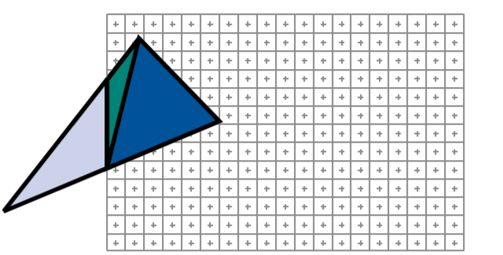
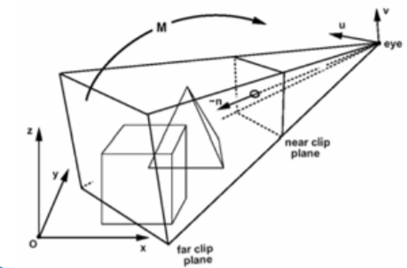
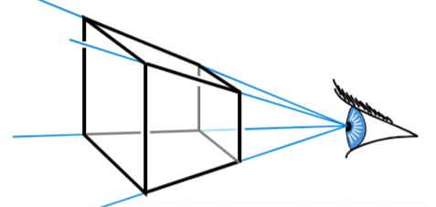
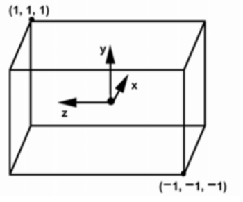
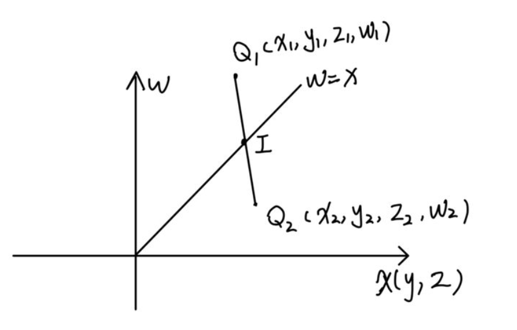

# 齐次裁剪

------------------


在光栅化的过程如果三角形超出了摄像机的可视范围或者是，三角形一部分在可视范围内，一部分不在可视范围内。那么这时候就需要对三角形进行裁剪。如下图所示，明显三角形被裁剪成蓝色和绿色部分。




## 1.三角形裁剪的方法
------------
三角形裁剪的方案一般来说有三种，如下所示。

**1.在透视投影之前，摄像机坐标系(View Space)中进行**


该方案的特点如下所示
- **最为直观，便于理解**
- **计算量较大，效率不足**


**2.在透视投影之后，透视除法之前。在齐次空间中进行**


该方案的特点如下所示
- **不太直观，理解上存在难度**
- **计算量最小，效率最高**


**3.在进行透视投影并且进行了透视除法后的，CVV空间中进行**
  


该方案的特点如下所示
- **计算效率和方案二相比不足**
- **需要考虑透视矫正的问题**


## 2.三角形裁剪的核心
对于三角形的裁剪，我们需要解决三个问题
- 如何判断点时候在在可是范围内
- 如果相交，如何求出三角形和裁剪平面的交点
- 如何将裁剪后的顶点，组成三角形

## 3.齐次裁剪算法原理
--------------

我们考虑效率最高的在齐次坐标系中的三角形裁剪算法。首先视锥体有六个面，对于这六个面，我们需要依次的进行裁剪。

### 3.1判断点是否在可是范围内
--------------
当我们进行了透视投影之后，只有坐标值符合如下所示约束的顶点才位于可视范围内。
$$
\begin{array}{l}
-1<=x / w<=1 \\
-1<=y / w<=1 \\
-1<=z / w<=1
\end{array}
$$

因为此时还没有进行透视除法，所以上述公式变为：
$$
\begin{array}{l}
-w<=x<=w \\
-w<=y<=w \\
-w<=z<=w \\
w>=x,w>=-x \\
w>=y,w>=-y\\
w>=z,w>=-z
\end{array}
$$

根据上述公式，我们可以找到在齐次空间下的六个超平面(裁剪平面)
$$
\begin{array}{l}
\begin{array}{l}
w = x \\
w = -x\\
\end{array}
\begin{array}{l}
w = y\\
w = -y\\
\end{array}
\begin{array}{l}
w = z\\
w = -z
\end{array}
\end{array}
$$

我们以$x$分量为例，以$w$轴为纵坐标，以$x$轴为横坐标。以二维的方式来简化的表述$x,-x$两个超平面。绘制出两个直线$w = x$和$w= -x$。图像中的蓝色部分为我们的可视区域


因此我们可以用$w>=x,w>=-x$ 来判断一个顶点是否在可视区域内，其余的裁剪平面同理。

### 3.2 求出三角形和裁剪平面的交点
------------

如何获取三角形和裁剪平面的交点，其实求解三角形和裁剪平面的交点就是求解线段和裁剪平面的交点。假设存在$Q_1,Q_2$两点，$Q_1$在裁剪平面$w = x$外，$Q_2$则在裁剪平面$w = x$ 内，设交点为$I$。如下所示



线段 $Q_1Q_2$ 和 $w = x$ 的交点 $I$，可以通过 $I=Q_{1}+t\left(Q_{2}-Q_{1}\right)$，来表示，又因为交点在平面 $w = x$ 上所以有
$$
\begin{array}{c}
w_{1}+t\left(w_{2}-w_{1}\right)=x_{1}+t\left(x_{2}-x_{1}\right) \\
t=\frac{w_{1}-x_{1}}{\left(w_{1}-x_{1}\right)-\left(w_{2}-x_{2}\right)}
\end{array}
$$

如上所示，我们可以求出交点的坐标值。

### 3.3 重新组合三角形
------------
如果我们按逆时针的顺序分别对三角形的三条边进行检测并将生成的新的顶点和通过测试的顶点放到一个容器中。那么我们可以通过如下算法按逆时针的顺序来生成新的三角形
```c++

int vertex_nums = clip_planel(in_coord,out_coord);

for(int i = 0;i<vertex_nums-2;i++)
{
    int v0 = 0;
    int v1 = i+1;
    int v2 = i+2;

    ........
    ........
}


```


## 相关连接
------------
- [View Space裁剪原理](https://groups.csail.mit.edu/graphics/classes/6.837/F04/lectures/07_Pipeline_II.pdf)
- [齐次裁剪原理](https://fabiensanglard.net/polygon_codec/)
- [知乎上的原理讲解](https://zhuanlan.zhihu.com/p/162190576)

