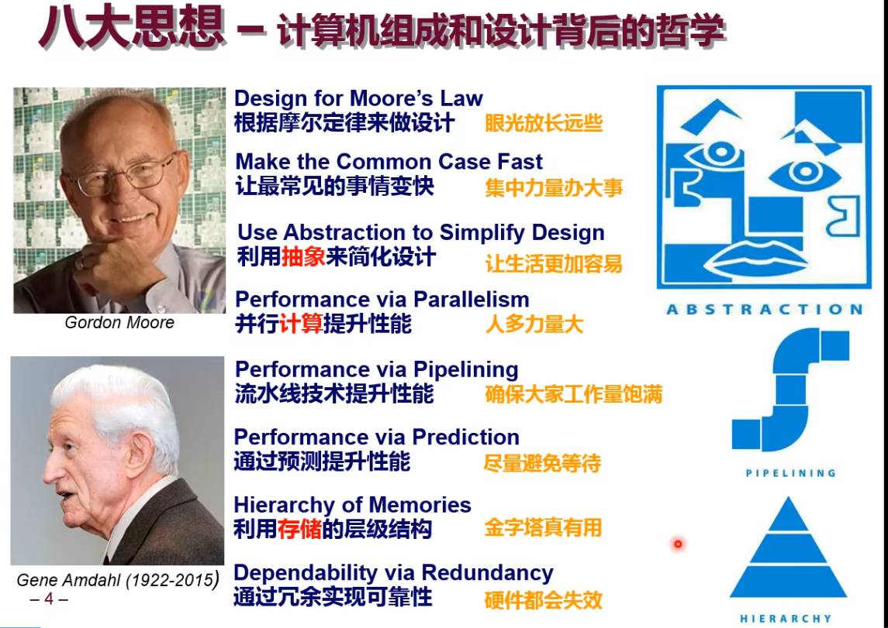
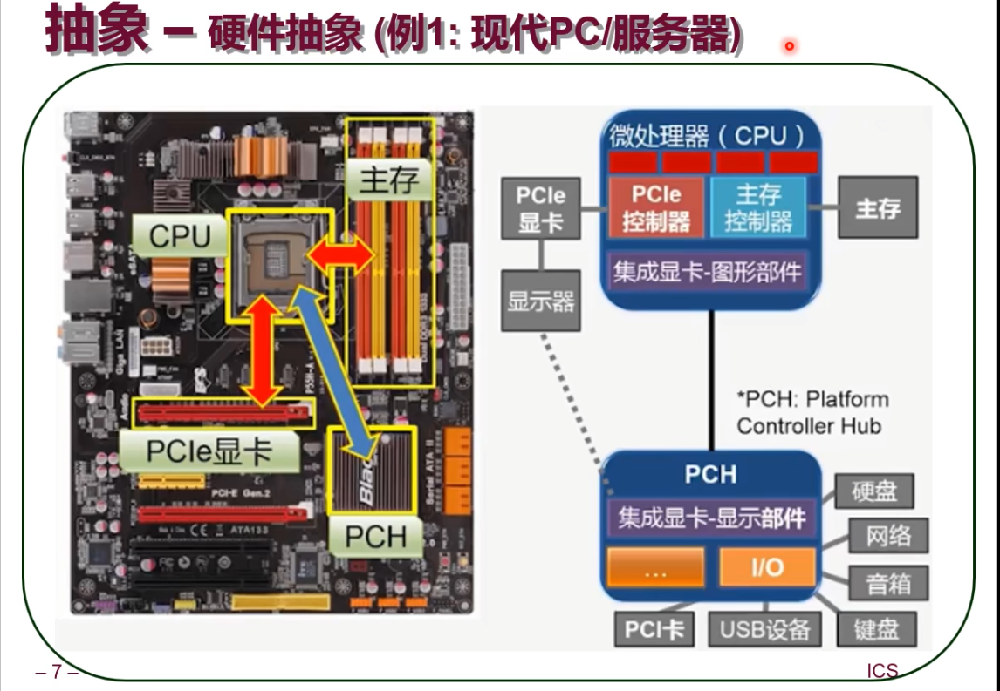
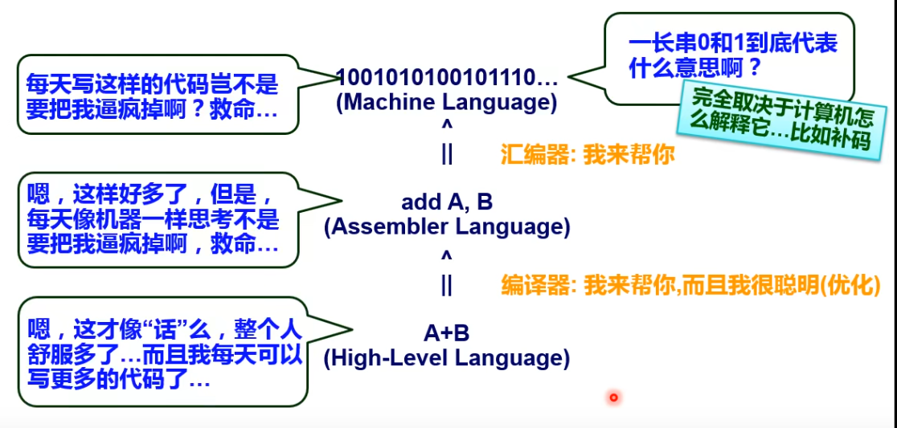
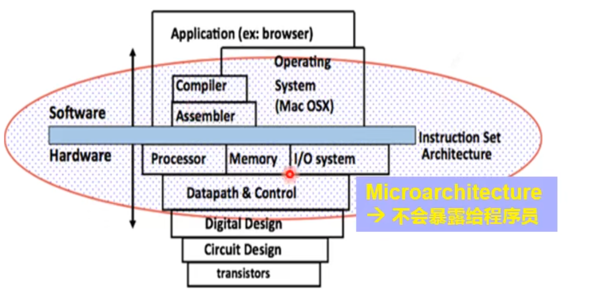
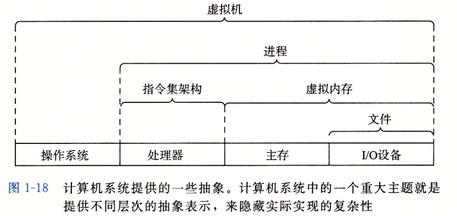

# 计算机组成和设计背后的设计思想

# 计算机中的抽象设计

- 硬件抽象 - 硬件抽象就是提供标准的计算模型使之不依赖于具体的硬件技术实现
例如将运算器,控制器,存储单元,寄存器和各种晶体管的排布,线路的链接抽象成统一的单元,例如CPU, 内存，PCIE显卡，PHC等等。然后在主板上提供对应CPU，PCIE， 内存接口使之不依赖于具体的型号的硬件.

- 软件抽象 - 软件抽象就是对软件的层级结构抽象,每个层级对上层隐藏具体的实现细节
    - 操作系统提供了抽象,是应用软件和硬件之间的桥梁,管理协调系统可用的资源
    - 编译器提供了抽象,应用程序不需要关系指令集架构(ISA), 
    - 指令集架构(ISA) 提供了抽象,可以看成是软件/硬件的接口.

- 计算机系统提供的抽象

