<!-- markdown-toc GFM -->

* [信息的表示](#信息的表示)
    * [各种信息的位表现形式](#各种信息的位表现形式)
    * [二进制表示](#二进制表示)
    * [十六进制表示](#十六进制表示)
    * [十六进制 二进制 十进制之间的转化](#十六进制-二进制-十进制之间的转化)
* [信息的存储](#信息的存储)
    * [位的电子实现](#位的电子实现)
    * [计算机中的字节](#计算机中的字节)
    * [计算机中的字](#计算机中的字)
    * [寻址和字节顺序](#寻址和字节顺序)
        * [对象的存储](#对象的存储)
        * [字节序](#字节序)
        * [需要注意字节序的情况](#需要注意字节序的情况)
    * [字符串的表示](#字符串的表示)
* [按位运算](#按位运算)
    * [位运算的基础 - 布尔代数](#位运算的基础---布尔代数)
        * [布尔代数的起源](#布尔代数的起源)
        * [布尔代数的基本概念](#布尔代数的基本概念)
        * [位向量上的布尔代数](#位向量上的布尔代数)
    * [C/C++ 中的位级运算](#cc-中的位级运算)
    * [c语言中的逻辑运算](#c语言中的逻辑运算)
        * [基本内容](#基本内容)
        * [逻辑运算和位级运算的区别](#逻辑运算和位级运算的区别)
    * [c语言中的移位运算](#c语言中的移位运算)
        * [左移](#左移)
        * [逻辑右移和算术右移](#逻辑右移和算术右移)
        * [有符号数的右移](#有符号数的右移)
        * [当移位量很大时如何处理](#当移位量很大时如何处理)
* [整数的表示](#整数的表示)
    * [整数编码与性质](#整数编码与性质)
        * [整数的编码形式](#整数的编码形式)
        * [整数的最值](#整数的最值)
    * [无符号数和有符号数之间的转换](#无符号数和有符号数之间的转换)
    * [整数的拓展](#整数的拓展)
    * [整数的截断](#整数的截断)
    * [c语言中拓展和转换的顺序](#c语言中拓展和转换的顺序)
* [整数的运算](#整数的运算)
    * [整数加法](#整数加法)
    * [整数加法的溢出检测](#整数加法的溢出检测)
    * [整数的加法逆元](#整数的加法逆元)
    * [整数乘法](#整数乘法)
    * [整数乘法的溢出检测](#整数乘法的溢出检测)
    * [整数乘以2的幂](#整数乘以2的幂)
    * [整数除以2的幂](#整数除以2的幂)
* [浮点数的表示](#浮点数的表示)
* [浮点数的运算](#浮点数的运算)

<!-- markdown-toc -->

# 信息的表示

信息在计算机存储设备中大多数都是以位的形式. 每一个位要么是0要么是1. 

## 各种信息的位表现形式 

我们通过将数据进行编码成二进制的形式将其存储在计算机上，又通过对这些位进行解码来将其解释成各种不同的信息。二进制是计算机编码，存储和操作信息的核心.

## 二进制表示

二进制是一种数字系统，仅使用两个符号：0和1。它是计算机和数字电子设备中最基本的数值表示方法。一个字节由8位组成。在二进制表示法中,它的值域是$00000000_2$ ~ $11111111_2$ . 如果看成十进制整数,它的值域就是 $0_{10}$ ~ $255_{10}$.

## 十六进制表示

二进制表示法有时候太冗长，而十进制表示法与位模式的互相转化又很麻烦。此时可以使用十六进制来表示。十六进制简写为"hex"，它使用数字'0' ~ '9'以及字符'A' ~ 'F' 来表示16个可能的值。与二进制的对应关系如下图。

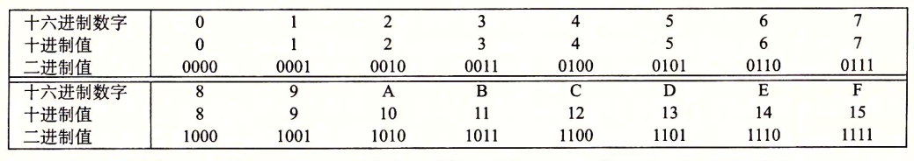

## 十六进制 二进制 十进制之间的转化

略

# 信息的存储

## 位的电子实现

位的通常的实现形式是通过通电设备中存储单位的电压来判断一个位表示的是0还是1. 如下图所示。

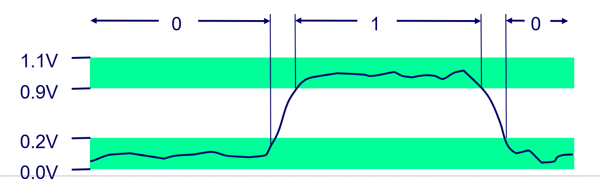

当存储单元中的电压在一个较高的范围内时它就表示1，同理当电压在一个较低的范围内时它表示0.

## 计算机中的字节

大多数计算机使用8位的块，或者字节(byte)，作为最小的可寻址的内存单位，而不是访问内存中单独的位。

## 计算机中的字

- 字由多个字节组成，通常是32位或者64位
- 指针的大小即为字的大小
- 字表明了虚拟地址空间的最大大小 $0$~ $2^w - 1$
- 计算机的总线通常被设计为传输字大小的数据。

## 寻址和字节顺序

### 对象的存储

几乎在所有的机械上,多字节对象都被存储为连续的字节序列,对象的地址为所使用字节中最小的地址.

### 字节序

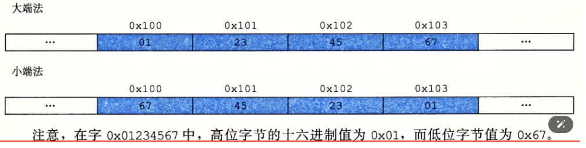

- 小端
    - 在内存中按照从最低有效字节到最高有效字节的顺序存储对象
- 大端
    - 内存中按照从最高有效字节到最低有效字节的顺序存储对象

**注意字节中位的顺序并不会因为字节序的不同而不同**

- 个人电脑：大多数个人电脑（特别是基于x86架构的）使用小端序。
- 现代手机通常使用ARM架构，ARM处理器可以支持大端序和小端序，但这些芯片上最常见的操作系统Android和IOS却只能运行于小端模式.

### 需要注意字节序的情况

1. 在不同类型机械之间通过网络传送二进制数据时.
2. 当阅读由小端法机械生成的机械级程序表示时(例如读汇编代码), 经常会将字节按照相反的顺序显示。
3. 当编写规避正常的类型系统的程序时(例如：使用了强制类型转换). 大端和小端的数据存储方式的不同。

## 字符串的表示

c/c++ 中字符串被编码为一个以null(其值为零)字符结尾的字符数组。每个字符都由某个标准编码来表示，最常见的是ASCII字符码。因为字符类型char大小通常为1个字节，因此单个字符并不会受平台的大小端字节序影响具有更强的平台独立性。(字符串虽然是一个多字节序对象但是各个字符之间相互独立)

# 按位运算

## 位运算的基础 - 布尔代数

### 布尔代数的起源

布尔代数起源于1850年前后乔治.布尔。他注意到通过将逻辑值TRUE(真) 和 FALSE(假) 编码位二进制值 1 和 0，能够设计出一种代数，以研究逻辑推理的基本原则。最简单的布尔代数是在二元集合{0, 1}基础上定义的。如下图所示。

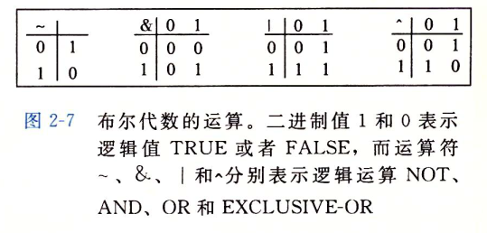

后来创立信息论领域的Claude Shannon首先建立了布尔代数和数字逻辑之间的联系。他在1937年的硕士论文中表明了布尔代数可以用来设计和分析机电继电器网络。

### 布尔代数的基本概念

- 变量：布尔代数中的变量只能取两个值，通常是“真”（1）和“假”（0）。

- 运算：
    - 与运算（AND）：只有当两个操作数都为真时，结果才为真。
    - 或运算（OR）：只要有一个操作数为真，结果就为真。
    - 非运算（NOT）：对一个布尔值取反，真变假，假变真。

- 定律：
    - 交换律：A AND B = B AND A；A OR B = B OR A
    - 结合律：A AND (B AND C) = (A AND B) AND C；A OR (B OR C) = (A OR B) OR C
    - 分配律：A AND (B OR C) = (A AND B) OR (A AND C)

### 位向量上的布尔代数

对于任意整数 $w > 0$, 长度为$w$ 的位向量上的布尔运算 $|, & , ~$形成了一个布尔代数. 特别的当考虑长度为$w$的位向量上的$^, &, ~$运算时,会得到一种被称为布尔环的数学形式. 布尔环与整数运算由很多相同的属性，例如整数运算的一个属性是每个值x都有一个加法逆元 -x，使得 $x + (-x)=0$. 布尔环也有类似的属性，这里的"加法"运算对应^ ，不过这时每个元素的加法逆元是它自己本身。

## C/C++ 中的位级运算

C/c++ 语言的一个很有用的特性就是它支持按位布尔运算，就是c/c++中使用的$&, |, ~, ^$ 对应于布尔代数中的与，或，非，异或。

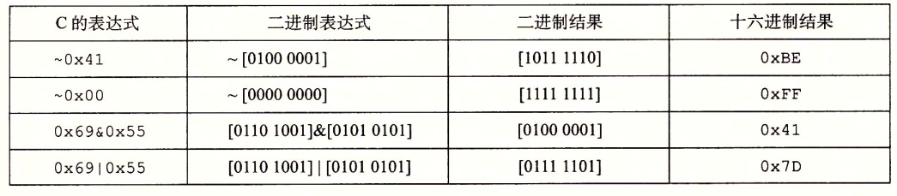

## c语言中的逻辑运算

### 基本内容

c/c++语言还提供了一组逻辑运算符 $||, &&, !$, 分别对应于命题逻辑中的 OR， AND， NOT运算。

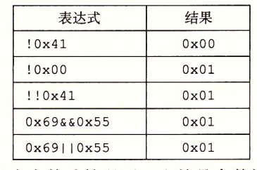

### 逻辑运算和位级运算的区别

- 逻辑运算认为所有非零的参数都表示TRUE ,而参数0表示FALSE. 它们返回1或者0,分别表示结果位TRUE 或者为FALSE. 
- 逻辑运算符 $&&, ||$ 与它们对用的位级运算 $&, |$ 之间的区别是，如果对第一个参数求值能确定表达式的结果，那么逻辑运算符就不会对第二个参数求值。例如 $a&&5/a$不会导致除零错误。

## c语言中的移位运算

### 左移 

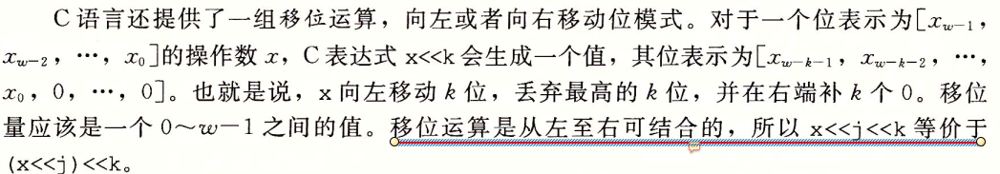

### 逻辑右移和算术右移

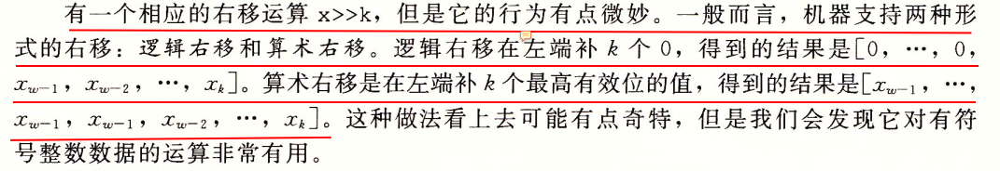

### 有符号数的右移

C语言标准并没有明确定义对于有符号数应该使用哪种类型的右移, 算术右移或者逻辑右移都可以. 但这意味着可能会导致移植性问题,然而实际上,几乎所有的编译器/机械组合都对有符号数使用算术右移,且许多程序员也都假设机械会使用这种右移,另一方面,对于无符号数，右移必须是逻辑的。

### 当移位量很大时如何处理

对于一个由w位组成的数据类型x的移位操作

$$
x << k 
$$

或
$$
x >> k
$$

当k >= w 或 k < 0 时. c语言标准并没有规定这种情况下该如何做，但是当k > 0 时绝大多数的机械上位移量是通过计算 k mod w 来得到的。例如考虑w = 32 ，当k = 32 , 36, 40 时，实际的位移量是 0, 4, 6. 而当k小于0时不会起任何效果. 不过这种行为对于c程序来说并没有保证,所以应该保持位移量小于w。

# 整数的表示

c语言支持多种整型数据类型来表示有限范围的整数，这些数据类型的字节大小根据程序编译位32位还是64位而有所不同，而根据所分配的字节它们所能表示的值的范围也不同。此外c语言标准也规定了这些数据类型至少具有的取值范围来保证程序的可移植性。如下图所示。

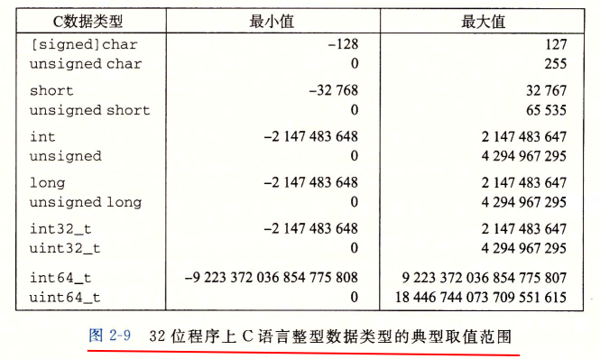
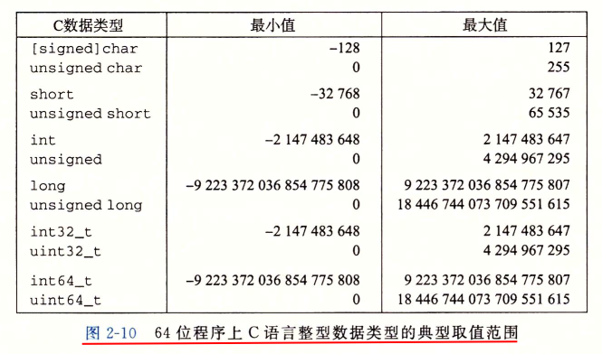
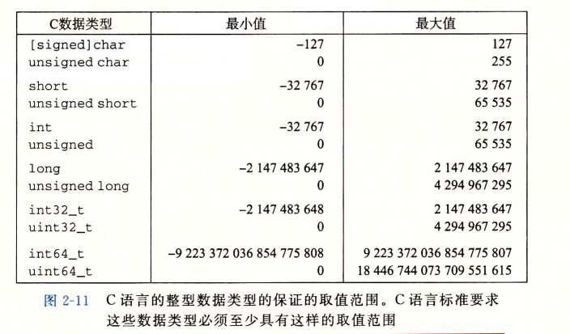

## 整数编码与性质

### 整数的编码形式

无论是无符号还是有符号数都是通过位向量来表示，例如一个w位的整数表示为$[x_{w-1}, x_w, ..., x_0]$ .

将有符号数和无符号数转换为十进制的方式分别如下

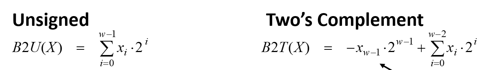

- 其中无符号数的最高有效位不代表符号位, 有符号数使用补码表示其最高有效位即表示符号,且具有 $-2_{w-1}$ 的权重
- 无符号和有符号数的编码都具有唯一性, 即每一种位组合都对应唯一的一个数字
- c语言标准并没有强制要求补码为有符号数的编码方式，但是绝大多数的机器都是这么做的。
- 我们通过计算$2^w - |x|$的无符号位向量表示,来计算负数x的补码表示。
- 有符号数的负数和正数是不对称的,其原因是因为0既不是整数也不是负数

### 整数的最值

我们使用$UMax_w, UMin_w, TMax_w, TMin_w$ 来分别表示w位的无符号数和有符号数的最大值和最小值。它们的位向量表示如下所示.

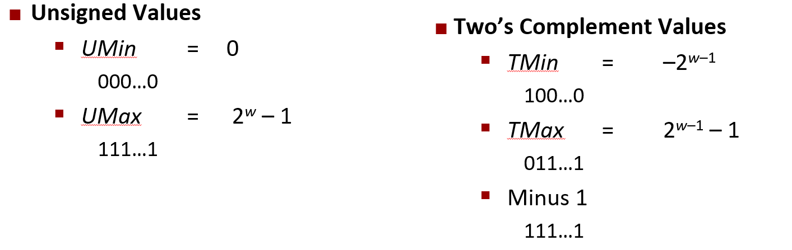

除此之外,这些极值之间还具有如下性质
- $|TMin| = TMax + 1$
- $UMax = 2 * TMax + 1$

## 无符号数和有符号数之间的转换

无符号数和有符号数之间的转换遵循着一个基本的规则，那就是转换前和转换后它的位模式都是不变的，只不过数值大小发生了变化.

$$
T2U(x) = 
\begin{cases} 
x + 2^w &  x < 0 \\ 
x &  x \geq 0  
\end{cases} \quad
U2T(x) = 
\begin{cases}
x - 2^w & x > TMax \\
x & x \leq TMax
\end{cases}

$$

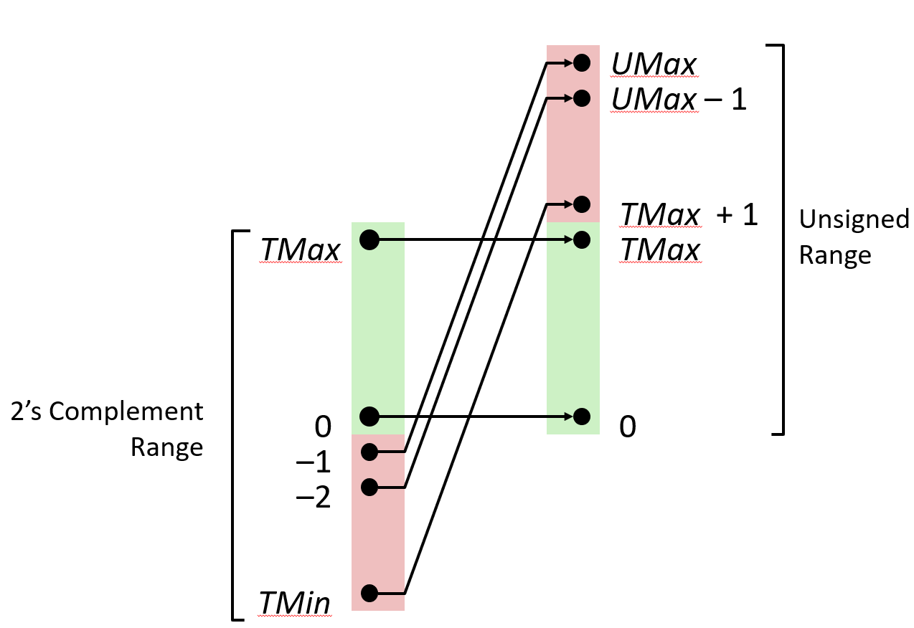

以w = 4 的有符号和无符号整数的位向量对比为例

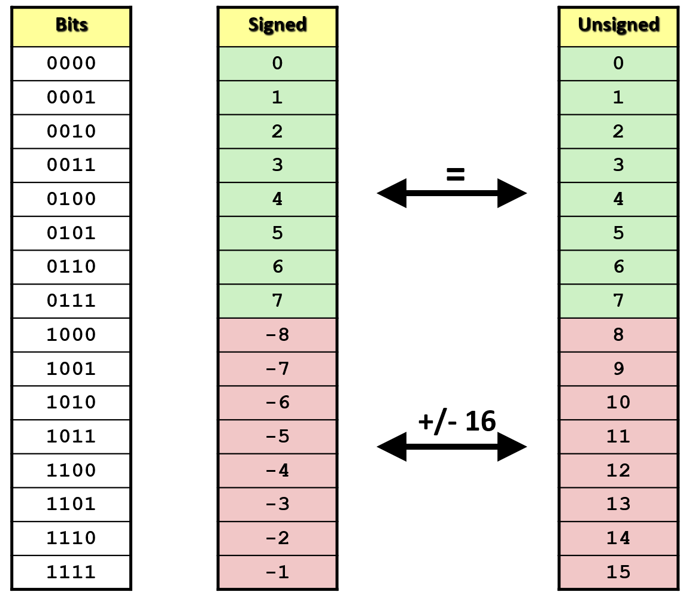

- 无符号数和补码对于0和正数的编码是一致的。
- c语言中如何一个运算数是有符号的而另一个是无符号 的,那么c语言会隐式地将有符号的强制类型转换为无符号数,并假设这两个数都是非负的来执行这个运算(这个运算可以是算数运算也可以是逻辑运算)

## 整数的拓展

任务:
- 将一个w位的有符号或者无符号整型，转换成一个数值相同的w+k位的有符号或者无符号整型

规则:
- 无符号数使用零拓展, 拓展的位补充零
- 补码使用符号位拓展, 拓展的位补充其符号位

补码进行符号位拓展后其数值大小不变，证明如下

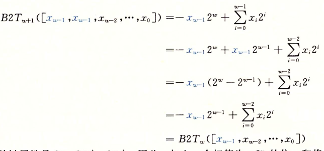

## 整数的截断

任务：
- 给予一个w + k位的有符号或者无符号整型，将其转换成一个w位的有符号或者无符号整型

规则：
- 对于无符号数截断后的数值为其原来数值mod $2^w$
- 对于有符号数截断后的数值为将其转换为无符号数的数值截断后的结果再转换回有符号数。

五位的有符号和无符号数截断成四位的例子,如下所示.

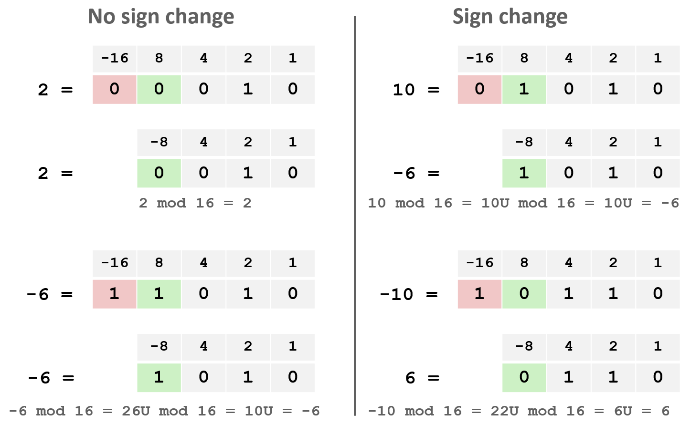

## c语言中拓展和转换的顺序

对于代码
~~~c
short sx = -12345
unsigned int uy = sx; // 等价于 (unsigned int)(int)
~~~

上述代码会先进行整数拓展，然后再进行有符号到无符号的转换。

# 整数的运算

## 整数加法

二进制的加法运算和十进制类似，如下所示
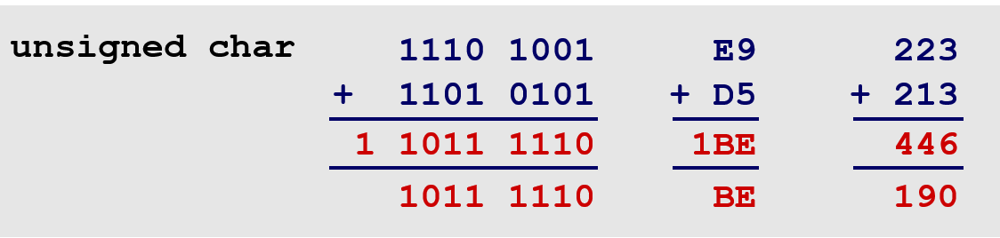

对于w位表示的无符号整数的加法有：

$$
UAdd_w(x, y) = 
\begin{cases}
x + y & x + y \leq UMax & 正常\\
x + y - 2^w & UMax < x + y < 2^w & 溢出
\end{cases}
$$
- 从两个无符号数相加结果的取值范围看，需要$w + 1$ 位才能完整的表示其数值大小。
- 丢弃w + 1位
- 截断相当于模运算, 即$UAdd_x(x, y)  = (x + y) \mod 2^w$

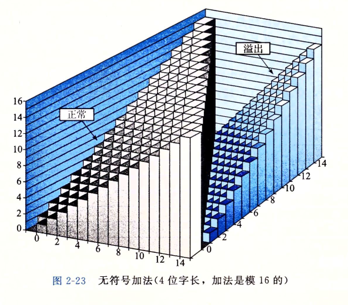

对于w位表示的有符号整数的加法有:

$$
TAdd_w(x, y) = 
\begin{cases}
x + y - 2^w & x + y > TMax & 正溢出 \\
x + y & TMin \leq x + y \leq TMax & 正常\\
x + y + 2^w & -2^w \leq x + y < TMin & 负溢出
\end{cases}
$$

- 从两个补码相加的结果的取值范围看，需要$w + 1$ 位才能表示其数值大小。
- 丢弃w + 1位
- 补码的加法和无符号的加法在二进制表示上是完全相同的

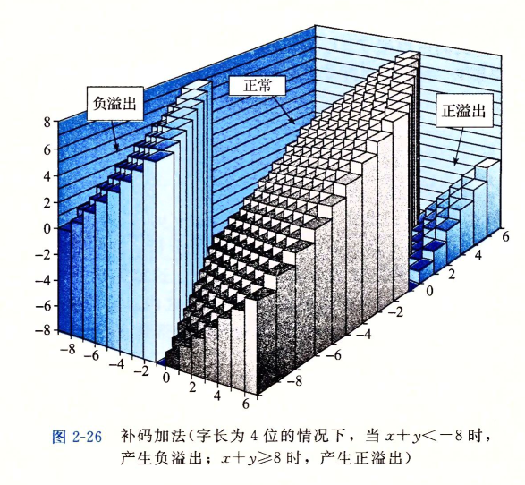

## 整数加法的溢出检测

对于无符号加法有：

对在范围 $0 \leq x, y \leq UMax_w$ 中的x, y，当且仅当 x + y < x 或者 x + y < y 时发生溢出

对补码加法有：

对于满足 $TMin_w \leq x, y \leq TMax_w$ 的x,y ，当且仅当 x > 0, y > 0 且 x + y <= 0 时发生正溢出，当且仅当 x < 0, y < 0 且 x + y >=0 时发生负溢出。

## 整数的加法逆元

对于整数x，使得 $x + (-x) = 0$ 成立。那么整数-x就称为x的逆元

无符号整数的加法逆元
$$
-^u_wx = 
\begin{cases}
x, & x = 0 \\
2^w - x, & x > 0
\end{cases}
$$

有符号整数的逆元

$$
-^t_wx = 
\begin{cases}
TMin_w, & x = TMin_w \\
-x, & x > TMin_w
\end{cases}
$$

## 整数乘法

对于w位的无符号乘法有:

$$
UMult_w(x, y) = (x * y) \mod 2^w
$$

- 需要2*w位才能保存乘法的结果
- 结果丢弃高w 位，保留低w位

对于补码乘法有：

$$
TMult_w(x, y) = U2T_w((x * y) mod 2^w)
$$

- 需要2w位才能保存乘法的结果
- 结果丢弃高w 位，保留低w位
- 虽然无符号和补码的两种乘法的结果2w位表示可能不同，但是截断后的低w位表示是相同的。(主要是补码使用的算数拓展)

## 整数乘法的溢出检测

~~~c
// 方法1
int tmult_ok(int x, int y) {
    int p = x * y;
    return !x || p / x == y;
}

// 方法2
int tmult_ok2(int x, int y) {
    int64_t s = (int64_t) x * y;
    return s == (int)s;
}
~~~

- 上述代码能检测乘法溢出而 (x + y) -x == (x + y) -y 却无法检测加法溢出的原因是因为除法运算它需要高2w位中的高w位才能计算出结果，而加法运算的结果是不依赖高w位的数值的。
- 上述代码无符号和有符号都通用, 只是需要改一改数据类型.

## 整数乘以2的幂

类似于十进制，当二进制表示的数值乘以2的k次方的时候相当于左移了k位,因此可以将整数的乘法简化成移位和加法.

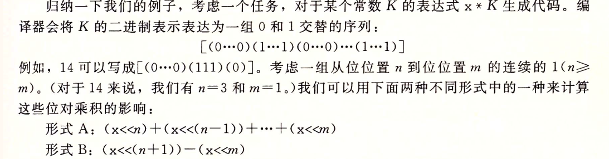

- 上述法则对有符号和无符号数都适用
- 当K中最高有效位位1时,形式B则变为 $-(x << m)$
- 当K为负数的时候上述规则同样生效
- 编译器会自动的选择上述两种形式中最简单的进行替换

## 整数除以2的幂

同样的和十进制类似，除以2的幂相当于右移。但是C表达式 $x >> K$ 产生的数值为$\lfloor x / 2^k \rfloor$.

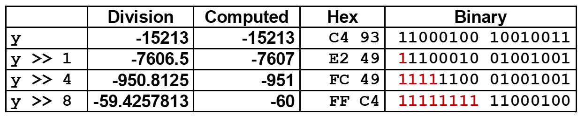

因为普通的移位操作会让结果向下取整,而我们通常想要在得到负数的结果时向上取整(即向零取整), 这时候就需要对表达式进行偏置。

偏置后的表达式为

$$
(x + 1 << K - 1) >> K
$$

- (1 << k) - 1 确保了在后k位中只要存在1最终的结果就会加1
- 除以非2的幂的时候,则会对结果进行向零舍入

# 浮点数的表示

小数的二进制表示如下:

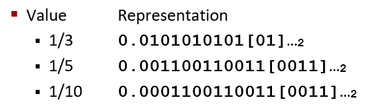

- 十进制小数转化为二进制的方法
    - 转换为十进制的方式是通过不断的对小数乘以2, 如果乘2后小数的大小比1大那么该位的二进制数值位1否则为零，直到小数的数值变为0为止。
- 二进制小数转十进制的方法
    - $\sum_{i = -n}^m 2^i \times b_i$, $b_i$为对应位上的二进制值。
- 有限位数的二进制只能近似的表示一个小数

浮点数表示IEEE标准

我们通过将小数转化成 $-1^s \times M \times 2^E$的形式再转换成二进制来表示这个小数。其二进制组成分为：
- s 表示符号
- M表示尾数
- E表示阶码

以32位和64位浮点数为例:
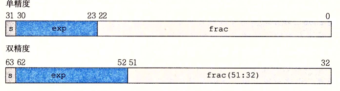

浮点数二进制表示的编码情况分为四种：

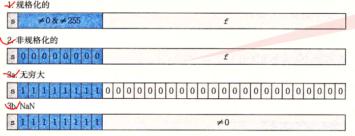

- 四种情况下浮点数的数值表示和计算都是不同
- 当将IEEE标准的浮点数表示转换为无符号整数时，它们都是按升序排列的。
- 每个浮点数的逆元只是简单的改变符号位即可.
- 很多时候浮点数无法精确的表示一个数值,并且离0的距离越大误差也就越大
- IEEE定义了四种浮点数的舍入, 默认使用的是向偶数舍入

# 浮点数的运算

浮点数加法原理如下所示:
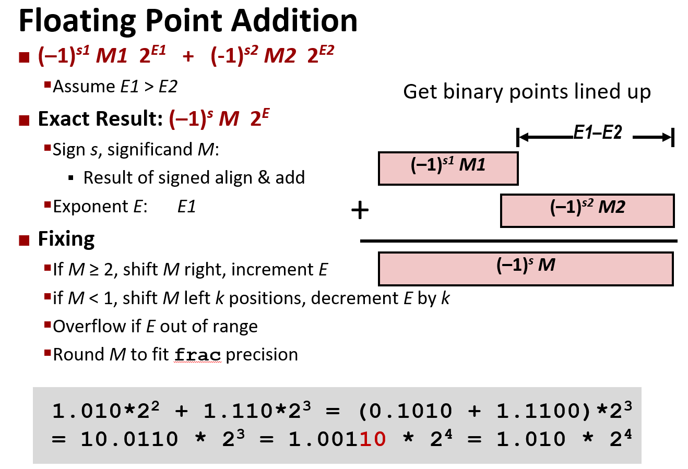
浮点数乘法的原理如下所示:
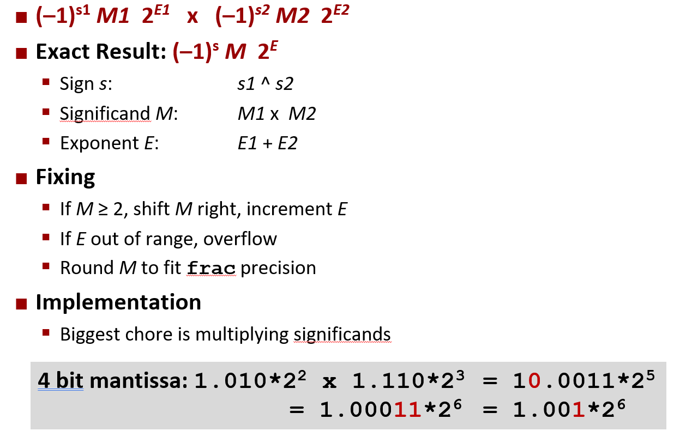

IEEE标准下的浮点数运算的性质
- 1 / -0 将产生 $-\infty$, 而 1 / +0 会产生$+\infty$，$+\infty -\infty = NaN$
- 溢出会得到无穷值
- 浮点加法 x + y , 是封闭的(两个正数相加不会溢出成负数)， 可交换的,但是不可结合.所有浮点数x都有逆元(除了无穷大和NaN), 是单调的(a ≥ b ⇒ a+c ≥ b+c), 加法恒等式为0(x + 0 = x)
- 浮点数乘法x*y, 是封闭的, 满足单调性，可交换但不可结合，并且在加法上不具有分配性, 乘法恒等式为1。

c语言中的浮点数和整数的转换

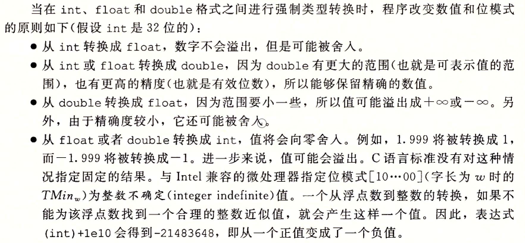

