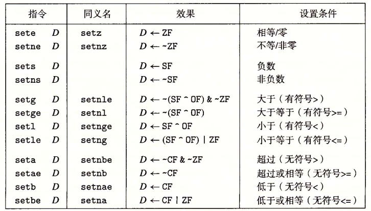

- [被隐藏的处理器状态](#被隐藏的处理器状态)
- [x86\_64的虚拟内存地址](#x86_64的虚拟内存地址)
- [汇编代码的格式](#汇编代码的格式)
  - [两种不同的汇编代码格式](#两种不同的汇编代码格式)
  - [ATT汇编代码格式补充](#att汇编代码格式补充)
  - [汇编代码中的操作数](#汇编代码中的操作数)
- [x86\_64 中的寄存器](#x86_64-中的寄存器)
  - [整数寄存器文件](#整数寄存器文件)
  - [条件码寄存器](#条件码寄存器)
- [x86\_64 中的重要指令](#x86_64-中的重要指令)
  - [数据传送指令](#数据传送指令)
  - [压入和弹出程序栈指令](#压入和弹出程序栈指令)
  - [算数逻辑操作指令](#算数逻辑操作指令)
  - [CMP 与 TEST 指令](#cmp-与-test-指令)
  - [set指令](#set指令)

# 被隐藏的处理器状态

- 程序计数器
    - 给出将要执行的下一条指令再内存中的地址
- 整数寄存器文件
    - 包含16个命名的位置，分别存储64位的值，可以被用来存储地址，整数数据 ，记录某些重要的程序状态或者是保存临时数据
- 条件码寄存器
    - 保存着最近执行的算术或逻辑指令的状态信息
- 一组向量寄存器
    - 用来存放一个或多个整数或浮点数值

# x86_64的虚拟内存地址

x86_64的虚拟地址是由64位的字来表示的, 这些地址的高16位必须设置为0,所以一个地址实际上能够指定的是$2^{48}$或64TB范围内的一个字节。

# 汇编代码的格式

## 两种不同的汇编代码格式

## ATT汇编代码格式补充

- GCC生成的汇编代码中所有以"."开头的行都是指导汇编器和连接器工作的伪指令,可以忽略它们.
- GCC生成的汇编代码指令都由一个字符后缀，表明操作数的大小，例如 moveb(传送字节),movw(传送字), movl(传送双字), movq(传送四字).一个字为16位大小。

## 汇编代码中的操作数

- $开头的数字表示常数，例如$108 和 $0x12 分别表示十进制的108和十六进制的0x12, 对应符号为$Imm
- 以寄存器名称$r_a$来表示的为对应寄存器中的数值, 对应符号为$R[r_a]$来表示。
- 其余的皆为 Imm(rb, ri, s)的变种表示内存引用，计算方式为 $Imm + R[r_b] + R[r_i] \cdot s$.

# x86_64 中的寄存器

## 整数寄存器文件

- 最初的8086中只有8个16位的寄存器,即图中 %ax到%bp, 拓展到IA32架构时寄存器也拓展到32位,标号从%eax到%ebp. 拓展到x86_64后原来的8个寄存器拓展成64位,标号从%rax到%rbp.
- 访问这些寄存器的规则为，对于生成1字节和2字节数字的指令会保持剩下的字节不变，生成4字节数字的指令会把高位4字节置为0.

## 条件码寄存器

条件码寄存器描述了最近的算术或逻辑操作的属性，可以检测这些寄存器来执行条件分支指令。

- leaq指令不改变任何条件码
- 算术和逻辑操作指令都会设置条件码
- 对于逻辑操作，进位标志和溢出标志会设置成0
- 对于移位操作，进位标志将设置为最后一个被移除的位，而溢出标志设置为0
- INC 和 DEC 指令会设置溢出和零标志，但不会改变进位标志

条件码有三种常见的使用场景
1. 根据条件码的某种组合将一个字节设置为0或1
2. 可以条件跳转到程序的某个地方的部分
3. 可以有条件地传送数据

# x86_64 中的重要指令

## 数据传送指令

**x86_64的传送指令有几条重要限制.传送指令的两个操作数不能都指向内存位置, 将一个值从一个内存位置复制到另一个内存位置需要两条指令， 第一条指令将源值加载寄存器中，第二条将该寄存器值写入目的位置。**

几种重要的数据传送指令如下图所示。

- movl指令以寄存器作为目的时，它会把寄存器的高位4字节设置位0
- 常规的movq指令只能以表示位32位补码数字的立即数作为源操作数，然后把这个值符号位拓展到64位的值，放到目的位置。
- movabsq指令能够以任意64位立即数只作为源操作数，并且只能以寄存器作为目的。

下面两种指令在将较小的源值复制到较大的目的时使用。第一个字符指定源的大小，第二个指明目的的大小

- movz类指令把目的中剩余的字节填充为0

- movs类指令通过符号为拓展来填充剩余位，把源操作的最高位进行复制
- cltq指令没有操作数，它总是以寄存器%eax作为源，%rax作为符号拓展结果的目的。与movslq完全一致不过编码更紧凑

## 压入和弹出程序栈指令

在x86_64中程序栈存放在内存中的某个区域，栈向下增长，栈顶元素的地址是所有栈中元素地址中最低的。如下所示。

pushq指令的功能是把数据压入到栈上,而popq指令是弹出数据

pushq指令的行为等价于

popq指令的行为等价于

## 算数逻辑操作指令

一些常用的算数逻辑指令如下所示。

这些算数逻辑指令大致被分为四类
- 加载有效地址指令 leaq
  - leaq实际上是movq指令的变形。它的第一个操作数看上去是一个内存引用，但该指令并不是从指定的位置读入数据而是将有效地址写入到目的操作数。
  - **而且它的目的操作数必须是一个寄存器**
  - leaq指令能执行加法和有限形式的乘法，在编译简单的算数表达式时非常有用
- 一元操作指令
  - 只有一个操作数，既是源又是目的。这个操作数可以是寄存器也可以是内存位置。
- 二元操作指令
  - 第二个操作数既是源又是目的，第一个操作数可以是立即数，寄存器或是内存地址，第二个操作数可以是寄存器或是内存地址.
  - 当第二个操作数为内存地址时，处理器必须从内存读出值，执行操作，再把结果写回内存中。
- 移位操作
  - 先给出移位量，然后是要移位的数。移位量可以是一个立即数，或者是放在单字节寄存器%cl中的数值，移位操作对$w$位字长的数据值进行操作，移位量是由%cl寄存器的低$m$位决定的。这里$2^m = w$，而高位会被忽略.移位操作的目的操作数可以是一个寄存器或是一个内存位置。

**一些特殊的算数操作**

- 单操作数的imulq，mulq 指令
  - x86_64提供的单操作数乘法指令用于计算两个64位值的全128位乘积，分为有符号和无符号两种。
  - 这两条指令都要求一个参数必须在寄存器%rax中，而另一个作为指令的源操作数给出，乘积存放在寄存器%rdx(高64位)和%rax(低64位)中
- 单操作数idivq,divq 指令 和 cqto指令
  - 有符号除法指令将寄存器%rdx(高64位)和%rax(低64位)中的128位数作为被除数，而除数作为指令的操作数给出。指令将商存储在寄存器%rax中，将余数存储在寄存器%rdx中。
  - cqto指令不需要操作数一般和idivq指令配合使用，它的作用是读出%rax的符号位，并将它复制到%rdx的所有位。因为单操作数除法指令的被除数通常都是一个64位数被存储在%rax寄存器中，此时%rdx寄存器中的值应为0 或者是 %rax的符号位。后面这个操作通过cqto指令就可以正确设置%rdx中的数值.

## CMP 与 TEST 指令

CMP 指令和 TEST 指令 只设置条件码而不改变任何其他寄存器。

- CMP 指令与SUB指令行为一致，如果两个操作数相等则零标志设置为1，其他的标志可以用来确定两个操作数间的大小关系
- TEST 指令与AND指令的行为一致
  - 通过 TEST s1, s1 然后读取ZF 和 SF 标志来判断s1是正数，负数还是零
  - 检查某个寄存器或内存位置的特定位是否被设置，例如检查某个标志位是否为1。

## set指令

通过set指令我们可以根据条件码的某种组合，将一个字节设置为0或1。它有如下种类

- set指令的常见用途是与CMP指令结合，来判断两个数的大小关系