- [被隐藏的处理器状态](#被隐藏的处理器状态)
- [x86\_64的虚拟内存地址](#x86_64的虚拟内存地址)
- [汇编代码的格式](#汇编代码的格式)
  - [两种不同的汇编代码格式](#两种不同的汇编代码格式)
  - [ATT汇编代码格式补充](#att汇编代码格式补充)
  - [汇编代码中的操作数](#汇编代码中的操作数)
- [x86\_64 中的寄存器](#x86_64-中的寄存器)
  - [整数寄存器文件](#整数寄存器文件)
  - [条件码寄存器](#条件码寄存器)
- [x86\_64 中的重要指令](#x86_64-中的重要指令)
  - [数据传送指令](#数据传送指令)
  - [压入和弹出程序栈指令](#压入和弹出程序栈指令)
  - [算数逻辑操作指令](#算数逻辑操作指令)
  - [CMP 与 TEST 指令](#cmp-与-test-指令)
  - [set指令](#set指令)
  - [条件跳转指令 - jump指令](#条件跳转指令---jump指令)
    - [跳转指令的编码](#跳转指令的编码)
  - [条件数据传送指令](#条件数据传送指令)
- [条件分支的实现](#条件分支的实现)
  - [使用条件跳转来实现条件分支](#使用条件跳转来实现条件分支)
  - [使用条件数据传送来实现条件分支](#使用条件数据传送来实现条件分支)
  - [两种实现方式的比较](#两种实现方式的比较)
- [循环的实现](#循环的实现)
  - [do-while循环的实现](#do-while循环的实现)
  - [while循环的实现](#while循环的实现)
    - [jump to middle 实现方式](#jump-to-middle-实现方式)
    - [grrded-do 实现方式](#grrded-do-实现方式)
  - [for循环的实现](#for循环的实现)
- [switch 语句的实现](#switch-语句的实现)
- [过程(Procedures)](#过程procedures)
  - [过程的实现机制](#过程的实现机制)
  - [栈帧(Stack Frame)](#栈帧stack-frame)
  - [x86\_64 过程的实现](#x86_64-过程的实现)
    - [数据传送 - 参数的传递](#数据传送---参数的传递)
    - [控制转移 - 调用函数](#控制转移---调用函数)
    - [将callee寄存器的内容保存在栈上](#将callee寄存器的内容保存在栈上)
    - [函数的局部存储](#函数的局部存储)
    - [控制传送 - 函数返回](#控制传送---函数返回)


# 被隐藏的处理器状态

- 程序计数器
    - 给出将要执行的下一条指令再内存中的地址
- 整数寄存器文件
    - 包含16个命名的位置，分别存储64位的值，可以被用来存储地址，整数数据 ，记录某些重要的程序状态或者是保存临时数据
- 条件码寄存器
    - 保存着最近执行的算术或逻辑指令的状态信息
- 一组向量寄存器
    - 用来存放一个或多个整数或浮点数值

# x86_64的虚拟内存地址

x86_64的虚拟地址是由64位的字来表示的, 这些地址的高16位必须设置为0,所以一个地址实际上能够指定的是$2^{48}$或64TB范围内的一个字节。

# 汇编代码的格式


## 两种不同的汇编代码格式

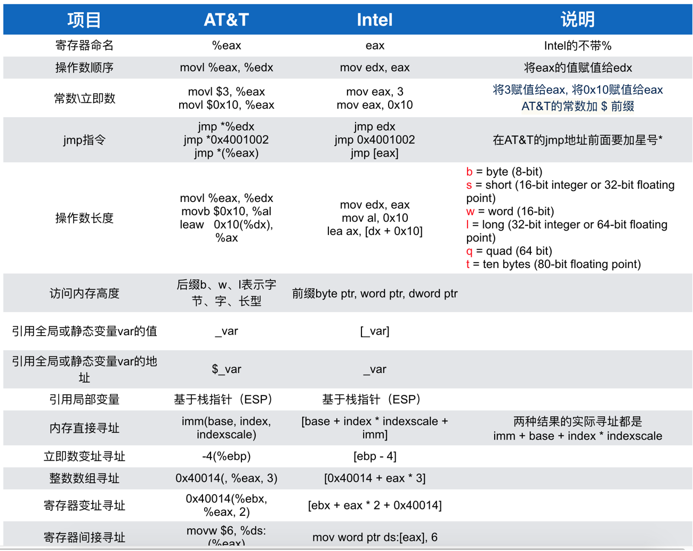

## ATT汇编代码格式补充

- GCC生成的汇编代码中所有以"."开头的行都是指导汇编器和连接器工作的伪指令,可以忽略它们.
- GCC生成的汇编代码指令都由一个字符后缀，表明操作数的大小，例如 moveb(传送字节),movw(传送字), movl(传送双字), movq(传送四字).一个字为16位大小。

## 汇编代码中的操作数

- $开头的数字表示常数，例如$108 和 $0x12 分别表示十进制的108和十六进制的0x12, 对应符号为$Imm
- 以寄存器名称$r_a$来表示的为对应寄存器中的数值, 对应符号为$R[r_a]$来表示。
- 其余的皆为 Imm(rb, ri, s)的变种表示内存引用，计算方式为 $Imm + R[r_b] + R[r_i] \cdot s$.

# x86_64 中的寄存器

## 整数寄存器文件

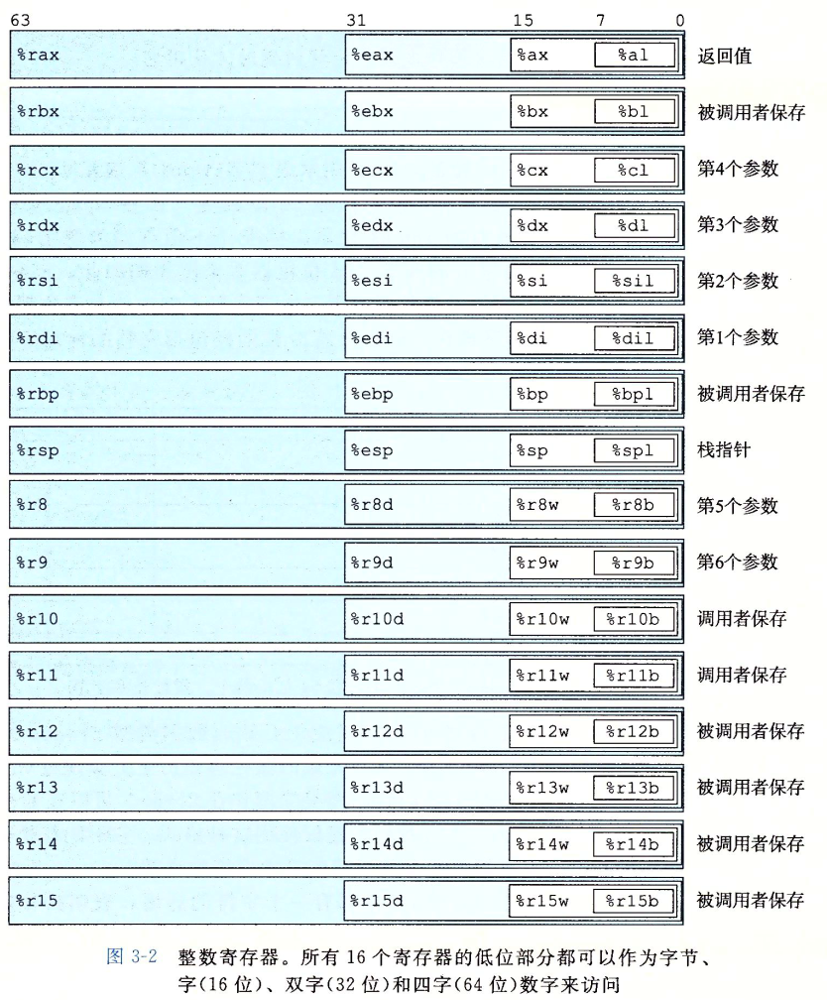

- 最初的8086中只有8个16位的寄存器,即图中 %ax到%bp, 拓展到IA32架构时寄存器也拓展到32位,标号从%eax到%ebp. 拓展到x86_64后原来的8个寄存器拓展成64位,标号从%rax到%rbp.
- 访问这些寄存器的规则为，对于生成1字节和2字节数字的指令会保持剩下的字节不变，生成4字节数字的指令会把高位4字节置为0.

## 条件码寄存器

条件码寄存器描述了最近的算术或逻辑操作的属性，可以检测这些寄存器来执行条件分支指令。

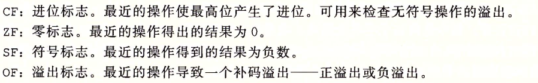

- leaq指令不改变任何条件码
- 算术和逻辑操作指令都会设置条件码
- 对于逻辑操作，进位标志和溢出标志会设置成0
- 对于移位操作，进位标志将设置为最后一个被移除的位，而溢出标志设置为0
- INC 和 DEC 指令会设置溢出和零标志，但不会改变进位标志

条件码有三种常见的使用场景
1. 根据条件码的某种组合将一个字节设置为0或1
2. 可以条件跳转到程序的某个地方的部分
3. 可以有条件地传送数据

# x86_64 中的重要指令

----------------------

## 数据传送指令

**x86_64的传送指令有几条重要限制.传送指令的两个操作数不能都指向内存位置, 将一个值从一个内存位置复制到另一个内存位置需要两条指令， 第一条指令将源值加载寄存器中，第二条将该寄存器值写入目的位置。**

几种重要的数据传送指令如下图所示。

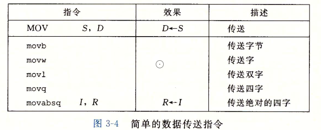
- movl指令以寄存器作为目的时，它会把寄存器的高位4字节设置位0
- 常规的movq指令只能以表示位32位补码数字的立即数作为源操作数，然后把这个值符号位拓展到64位的值，放到目的位置。
- movabsq指令能够以任意64位立即数只作为源操作数，并且只能以寄存器作为目的。

下面两种指令在将较小的源值复制到较大的目的时使用。第一个字符指定源的大小，第二个指明目的的大小

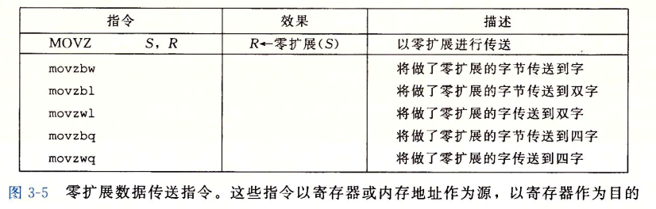
- movz类指令把目的中剩余的字节填充为0

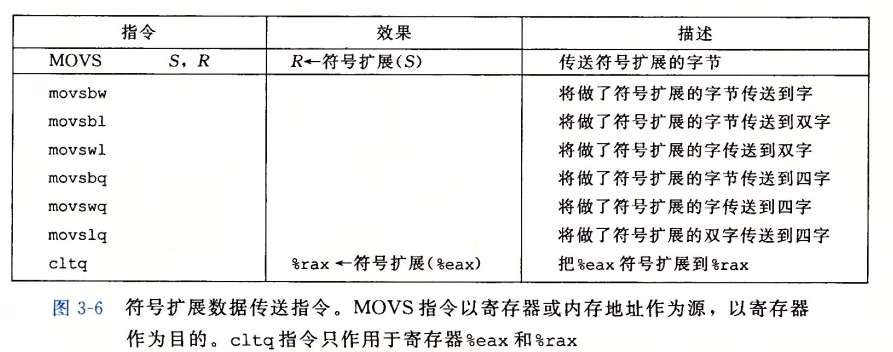
- movs类指令通过符号为拓展来填充剩余位，把源操作的最高位进行复制
- cltq指令没有操作数，它总是以寄存器%eax作为源，%rax作为符号拓展结果的目的。与movslq完全一致不过编码更紧凑

----------------

## 压入和弹出程序栈指令

在x86_64中程序栈存放在内存中的某个区域，栈向下增长，栈顶元素的地址是所有栈中元素地址中最低的。如下所示。

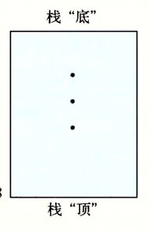

pushq指令的功能是把数据压入到栈上,而popq指令是弹出数据

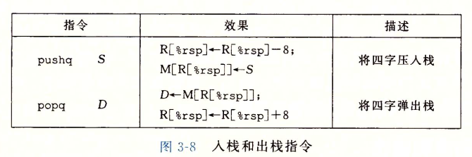

pushq指令的行为等价于

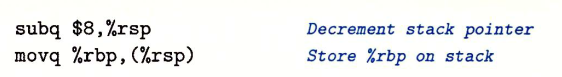

popq指令的行为等价于

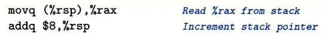

------------------

## 算数逻辑操作指令

一些常用的算数逻辑指令如下所示。

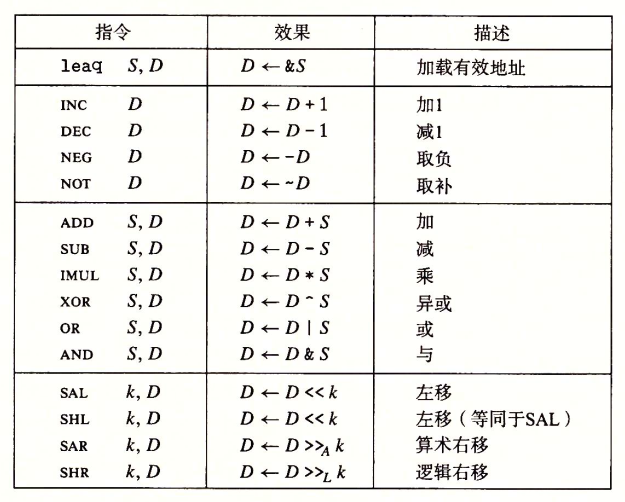
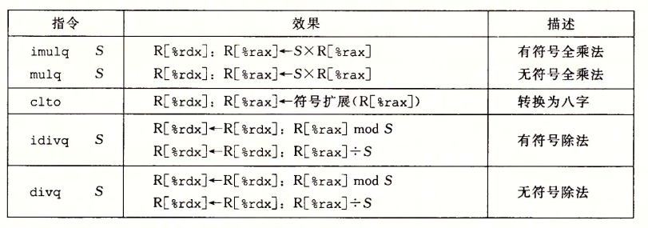

这些算数逻辑指令大致被分为四类
- 加载有效地址指令 leaq
  - leaq实际上是movq指令的变形。它的第一个操作数看上去是一个内存引用，但该指令并不是从指定的位置读入数据而是将有效地址写入到目的操作数。
  - **而且它的目的操作数必须是一个寄存器**
  - leaq指令能执行加法和有限形式的乘法，在编译简单的算数表达式时非常有用
- 一元操作指令
  - 只有一个操作数，既是源又是目的。这个操作数可以是寄存器也可以是内存位置。
- 二元操作指令
  - 第二个操作数既是源又是目的，第一个操作数可以是立即数，寄存器或是内存地址，第二个操作数可以是寄存器或是内存地址.
  - 当第二个操作数为内存地址时，处理器必须从内存读出值，执行操作，再把结果写回内存中。
- 移位操作
  - 先给出移位量，然后是要移位的数。移位量可以是一个立即数，或者是放在单字节寄存器%cl中的数值，移位操作对$w$位字长的数据值进行操作，移位量是由%cl寄存器的低$m$位决定的。这里$2^m = w$，而高位会被忽略.移位操作的目的操作数可以是一个寄存器或是一个内存位置。

**一些特殊的算数操作**

- 单操作数的imulq，mulq 指令
  - x86_64提供的单操作数乘法指令用于计算两个64位值的全128位乘积，分为有符号和无符号两种。
  - 这两条指令都要求一个参数必须在寄存器%rax中，而另一个作为指令的源操作数给出，乘积存放在寄存器%rdx(高64位)和%rax(低64位)中
- 单操作数idivq,divq 指令 和 cqto指令
  - 有符号除法指令将寄存器%rdx(高64位)和%rax(低64位)中的128位数作为被除数，而除数作为指令的操作数给出。指令将商存储在寄存器%rax中，将余数存储在寄存器%rdx中。
  - cqto指令不需要操作数一般和idivq指令配合使用，它的作用是读出%rax的符号位，并将它复制到%rdx的所有位。因为单操作数除法指令的被除数通常都是一个64位数被存储在%rax寄存器中，此时%rdx寄存器中的值应为0 或者是 %rax的符号位。后面这个操作通过cqto指令就可以正确设置%rdx中的数值.

-------------------

## CMP 与 TEST 指令

CMP 指令和 TEST 指令 只设置条件码而不改变任何其他寄存器。

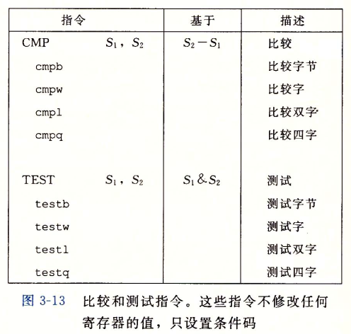

- CMP 指令与SUB指令行为一致，如果两个操作数相等则零标志设置为1，其他的标志可以用来确定两个操作数间的大小关系
- TEST 指令与AND指令的行为一致
  - 通过 TEST s1, s1 然后读取ZF 和 SF 标志来判断s1是正数，负数还是零
  - 检查某个寄存器或内存位置的特定位是否被设置，例如检查某个标志位是否为1。

--------------

## set指令

通过set指令我们可以根据条件码的某种组合，将一个字节设置为0或1。它有如下种类

<div align = center> <Image src = "pic/set_instruction.PNG"> </div>

- set指令的常见用途是与CMP指令结合，来判断两个数的大小关系

---------------

## 条件跳转指令 - jump指令

jump指令会导致执行切换到程序中一个全新的位置，常见的jump指令如下所示

<div align = center> <Image src = "pic/jump_instruction.PNG"> </div>

jump指令跳转的方式分为三种
- 直接跳转
  - 跳转的目标作为指令的一部分直接给出，例如 jmp .L1
- 间接跳转
  - 跳转的目标从寄存器或内存位置中读出,写法是'*'后面跟一个操作数， 例如 jmp *%rax 和 jmp *(%rax)
- **条件跳转**
  - 根据条件码的某种组合来决定是跳转到目标还是继续执行代码序列中的下一条指令。
  - 条件跳转只能是直接跳转, 如 jg .L3


jump指令中jmp指令可以进行直接跳转或是间接跳转，而其他jump指令都是条件跳转。

-------------

### 跳转指令的编码

在汇编代码中跳转指令的跳转目标会直接给出，但是在汇编器以及后来的链接器则会将跳转目标进行编码，常见的目标编码如下所示：

- PC相对编码 
  - 它们将目标指令的地址与紧跟在跳转指令后面的那条指令的地址之间的差作为编码。当执行PC相对寻址时，程序计数器的值是跳转指令后面的那条指令的地址，而不是跳转指令本身的地址。
  - 这些地址偏移量可以编码为1，2，4个字节
- 绝对地址
  - 用4个字节直接指定目标

一个简单的例子如下：

<div align = center> <Image src = "pic/jmp_code.PNG"> </div>

jmp指令和jg指令的目标编码分别为03 和 f8 。通过将它们和下一条指令地址的相加可以得出目标地址分别为：4004d8 和 4004d5.

---------------
## 条件数据传送指令

和普通的数据传送指令不同，条件传送只有当条件码满足特定的条件时才将源表示的数据传送到目标中。常见的条件数据传送指令如下所示

<div align = center> <Image src = "pic/condition_mov.PNG"> </div>

补充：

- 源值可以从内存或者寄存器中读取，但是目标必须为寄存器
- 汇编器可以从目标寄存器的名字推断出条件数据传送指令的操作数的长度，所以对所有的操作数长度，都不需要添加表示操作数大小的后缀。
- 源和目的的值可以是16位，32位或64位，不支持单字节的条件传送

-----------------
# 条件分支的实现

-------------
## 使用条件跳转来实现条件分支

条件分支最基本的实现是利用跳转指令中的条件跳转类指令，示例如下

<div align = center> <Image src = "pic/conditional_jmp_imp_if_else.PNG"> </div>

条件跳转实现条件分支的汇编形式

<div align = center> <Image src = "pic/conditional_jmp_assembly_form.PNG"> </div>

------------------
## 使用条件数据传送来实现条件分支

这种实现方式，会计算一个条件操作的两种结果，然后再根据条件是否满足从中选取一个。只有在一些受限制的情况中，这种策略才可行。但如果可行，就可以用一条简单的条件数据传送指令来实现它，这种方法更符合现代处理器的性能特性。

示例如下所示

<div align = center> <Image src = "pic/conditional_mov_imp_ifelse.PNG"> </div>

其汇编的形式如下所示

<div align = center> <Image src = "pic/conditional_mov_assembly_form.PNG"> </div>


-----------------
## 两种实现方式的比较

- 对于基于条件跳转的实现方法来说
  - 在现代处理器上使用条件跳转的条件分支有可能会非常低效, 这是因为为了提高指令流水线的性能，现代处理器使用了一种叫分支预测的技术，当机器遇到条件跳转(分支)时处理器会猜测跳转指令是否会跳转然后根据这种猜测去执行对应分支的指令，通过这种方式能让指令流水线中充满指令，然而当错误预测一个跳转时，处理器会丢掉它为该跳转指令后所有指令已做的工作，然后再开始从正确的位置处去填充流水线.这样一个错误预测会招致很严重的惩罚，浪费大约15 ~ 30 个时钟周期，导致程序性能严重下降。

- 对于基于条件数据传送的实现方式来说
  - <div align = center> <Image src = "pic/conditional_mov_limit.PNG"> </div>

---------------
# 循环的实现

对于循环语句，汇编中没有直接对应的指令存在.因此需要使用条件测试和跳转组合起来实现循环的效果,即将循环部分转换成if-else和goto语句来实现，具体的实现形式不同的编译器可能不同。

----------------
## do-while循环的实现

do-while语句的通用形式如下：

```c
do
  body-statement
  while (test-expr);
```

do-while转换为goto代码后如下所示：

```c
loop:
  body-statement
  t = test-expr;
  if (t)
    goto loop;
```

例子如下所示：

<div align = center> <Image src = "pic/do_while_example.PNG"> </div>

-----------------
## while循环的实现

while语句的通用形式如下：

``` c
while (test-expr)
  body-statement
```

GCC的代码生成中使用两种while循环的生成方法
1. 跳转到中间(jump to middle)
2. grarded-do

----------------
### jump to middle 实现方式

该实现方法执行一个无条件跳转跳到循环结尾处的测试，以此来执行初始的测试。

将while循环转换为goto代码后如下所示：

```c
  goto test;
loop:
  body-statement
test:
  t = test-expr;
  if (t)
    goto loop;
```

例子如下：

<div align = center> <Image src="pic/while_imp.PNG"> </div>

-----------------
### grrded-do 实现方式

该实现方法首先使用条件分支，如果初始条件不成立就跳过循环，把代码转换为do-while循环。当在使用-O1 选项后 GCC会采用这种方案。

将while循环转换为do-while后如下所示：

```c
t = test-expr;
if (!t)
  goto done;
do
  body-statement
  while (test-expr);
done:

```
将上述的代码转换为goto代码如下

```c
t = test-expr;
if (!t)
  goto done;
loop:
  body-statement
  t = test-expr;
  if (t)
    goto loop;
done:
```

例子如下：

<div align = center> <Image src="pic/while_example1.PNG"> </div>
<div align = center> <Image src="pic/while_example2.PNG"> </div>

--------------------
## for循环的实现

GCC为for循环产生的代码是while循环的两种翻译之一，这取决于优化等级。

for循环的通用形式如下：

```c
for (init-expr; test-expr; update-expr)
  body-statement
```

上述的循环与下面的while循环代码行为是一样的

```c
init-expr
while (test-expr) {
  body-statement
  update-expr;
}
```

使用jump to middle 策略会得到如下goto代码：

```c
  init-expr;
  goto test;
loop:
  body-statement
  update-expr;
test:
  t = test-expr;
  if (t)
    goto loop;
```

使用guarded-do策略得到如下goto代码：

```c
  init-expr;
  t = test-expr;
  if (!t)
    goto done;
loop:
  body-statement
  update-expr;
  t = test-expr;
  if (t)
    goto loop;
done:
```

# switch 语句的实现

switch语句可以根据一个整数索引值进行多重分支，实现方式有多种。其中基于跳转表的实现更加高效，它可以使用开关索引值来进行数组索引，使得执行开关语句与开关情况的数量无关。

GCC根据开关情况的数量和开关情况值的稀疏程度来翻译开关语句，当开关情况数量比较多，并且值的范围比较小时就会使用跳转表。

switch语句的汇编实现例子如下所示：

<div align = center> <Image src = "pic/switch_imp1.PNG"> </div>
<div align = center> <Image src = "pic/switch_imp2.PNG"> </div>
<div align = center> <Image src = "pic/switch_imp3.PNG"> </div>

可见跳转表的索引使用的是间接寻址，上述例子中对应的跳转表的汇编声明如下所示：

<div align = center> <Image src = "pic/switch_imp4.PNG"> </div>

其中L4是该跳转表的基地址。

----------------
# 过程(Procedures)

---------------
## 过程的实现机制

过程 - 它提供了一种封装代码的方式，用一组指定的参数和一个可选的返回值实现某种功能。设计良好的软件用过程作为抽象机制，隐藏某个行为的具体实现，同时又提供清晰简洁的接口定义，说明要计算的是哪些值，过程会对程序状态产生什么样的影响。

**过程有多种形式如：函数(function), 方法(method), 子例程(subroutine), 处理函数(handler)**

过程的实现机制
- 控制传递
  - 能够开始过程的执行
  - 过程结束后能恢复之前的执行
- 数据传递
  - 能给过程传递参数
  - 过程能返回执行的结果给调用者
- 内存管理
  - 能为过程的执行分配存储空间
  - 过程结束后能释放这些空间

**c语言通过栈来实现过程的调用，利用了栈提供的后进先出的内存内存管理机制。**

-------------
## 栈帧(Stack Frame)

栈帧：栈帧（Stack Frame）是程序在执行过程中，为了管理函数调用而在调用栈上分配的一个内存区域。每当一个函数被调用时，系统会为该函数创建一个新的栈帧，存储该函数的局部变量、参数、返回地址，寄存器内容等信息。

X86_64的栈帧的例子如下所示。

<div align = center> <Image src = "pic/stack_frame.PNG"> </div>

- %rbp寄存器指向当前栈帧的起始,只有当栈帧的大小不定长时该寄存器才指向栈帧的起始，对于定长的栈帧%rbp寄存器被当作普通的寄存器。
- %rsp寄存器指向当前栈帧的结尾

*需要注意x86_64中，函数的栈帧并不包括该函数的返回地址和参数，返回地址和参数属于调用者的栈帧部分*

## x86_64 过程的实现

---------------------
### 数据传送 - 参数的传递

在调用函数之前，首先需要准备好该函数的参数. x86_64 中规定了6个用来传递函数参数的寄存器，如下所示：

<div align = center> <Image src = "pic/parameter_register.PNG"> </div>

如果一个函数有大于6个整型参数，超出6个的部分就要通过栈来传递。把参数1~6复制到对应的寄存器，把参数7~n放到栈上，通过栈传递参数时，所有的数据大小都向8的倍数对齐。

例子如下所示：

<div align = center> <Image src = "pic/data_passing.PNG"> </div>

此时栈中的栈帧形式如下：

<div align = center> <Image src = "pic/data_passing_stack_frame.PNG"> </div>

---------------
### 控制转移 - 调用函数

在准备好函数参数后就需要正式调用函数了，x86_64中通过call指令来调用函数，该指令会把返回地址(该指令所在的下一条指令的地址)压入栈中，并将PC设置为被调用函数的起始地址。之后CPU就会自动跳转到目标函数中去执行。

例子如下所示：

<div align = center> <Image src = "pic/call_instruction_example.PNG"> </div>

call 指令执行后 %rip(PC) 以及 %rsp 寄存器的状态如下：

<div align = center> <Image src = "pic/call_instruction_example2.PNG"> </div>

这种把返回地址压入栈的简单机制能够让函数在稍后返回到程序中正确的点。

-----------------
### 将callee寄存器的内容保存在栈上

在函数调用的过程中我们要确保当一个过程调用另一个过程时，被调用者不会覆盖调用者稍后会使用到的寄存器值。因此x86_64中规定了一种calling convention, 它定义了两种寄存器
- callee save 寄存器 - 寄存器%rbx, %rbp和 %r12 ~ %r15被划分为被调用者寄存器，当过程P调用过程Q时，Q必须保存这些寄存器的值，并在Q返回到P时将这些值写回到对应的寄存器中. 来保证过程P执行的正确性。
- caller save 寄存器 - 所有其他的寄存器，除了%rsp都分类为调用者保存寄存器. 任何函数都能修改它们

因此在函数执行前需要将调用者使用到了Callee寄存器的值保存到栈上(如果调用者没有使用到任何callee寄存器则不需要保存)，在函数执行完成并且调用 ret指令之前将保存在栈上的callee的值写回到对应的寄存器中取。例子如下所示：

<div align = center> <Image src = "pic/callee_save_register_example.PNG"> </div>


---------------
### 函数的局部存储

在将必要的callee save 寄存器保存到栈上后，函数就开始执行了。此时栈上产生的数据为该函数执行过程中所需要的局部数据。但并非所有的局部数据都需要在栈上分配空间，可以的话直接保存在寄存器caller寄存器上即可。局部数据必须放在内存中的常见情况包括：

- 寄存器不足够存放所有的本地数据
- 对一个局部变量使用取地址运算符'&' ，因此必须为它产生一个地址。(毕竟寄存器是取不到地址的)
- 某些局部变量是数据或结构，因此必须能够通过数组或结构引用被访问到。

例子如下所示：

<div align = center> <Image src = "pic/data_passing_local_example1.PNG"> </div>
<div align = center> <Image src = "pic/data_passing_local_example2.PNG"> </div>


------------
### 控制传送 - 函数返回

当函数执行完后，使用ret指令来进行函数函数返回。该指令的作用是将返回地址的值写入%rip(PC)寄存器中. 让CPU回到调用者的执行中去。

对于栈帧的释放，有两种方式
1. 栈帧的大小固定，则只需计算 %rsp寄存器中的值 + 栈帧的大小 + 8 即可得到返回地址的位置
2. 对于栈帧大小不固定, 此时%rbp 寄存器中的值即为栈帧的起始地址。此时只要对其值加8即可得到返回地址在栈上的位置.