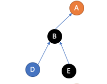
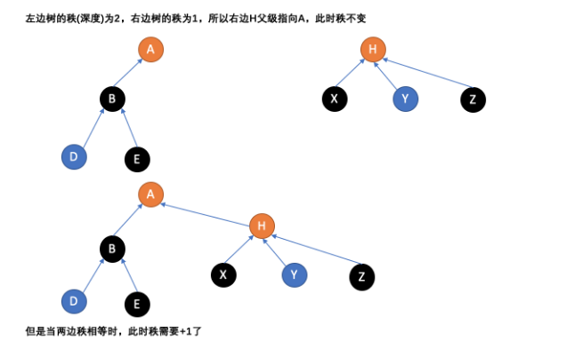
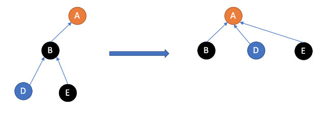

# 并查集

------------------

<!-- markdown-toc GFM -->

* [并查集的实现方案](#并查集的实现方案)
* [并查集森林的缺点](#并查集森林的缺点)
* [并查集森林的优化](#并查集森林的优化)
    * [按秩合并](#按秩合并)
    * [路径压缩](#路径压缩)
* [完整代码 C++ 描述](#完整代码-c-描述)

<!-- markdown-toc -->

-------------------

在计算机科学中，并查集是一种树型的数据结构，用于处理一些不交集（disjoint sets）的合并及查询问题。有一个联合-查找算法（union-find algorithm）定义了两个用于此数据结构的操作：

- Find：确定元素属于哪一个子集。这个确定方法就是不断向上查找找到它的根节点，它可以被用来确定两个元素是否属于同一子集。 
- Union：将两个子集合并成同一个集合。

## 并查集的实现方案

1. 并查集森林-并查集森林是一种将每一个集合以树表示的数据结构。我们通过每一个一个元素所在树的根节点是否相同来判断两个元素是否在一个并查集树中。联合两个并查集森林是通过将两个森林进行合并来完成的。这样所有的节点的根节点都是一样的。

## 并查集森林的缺点

1. 随着元素的合并，森林的高度会变得越来越高这样查找一个根节点的时间效率会下降，在最坏情况下会是O（n）。
2. 一个森林中的元素每一次获取根节点的时间效率都是不同的。有些高有些低。如下图所示，B节点获取A节点的效率比在D节点获取A节点要高。



## 并查集森林的优化

### 按秩合并

按秩合并-给每一个森林定义一个秩(高度)，每一次合并森林的时候将高度较小的和合并到高度较高的森林上。如下图所示

   

代码
```c++
void un(int x,int y) {
               int i = find(x);
               int j = find(y);
               if (i == j) return;
               num--;
               if (rank[i] > rank[j]) {
                       par[j] = i;
               }
               else
               {
                       par[i] = j;
                       if (rank[i] == rank[j]) rank[j]++;
               }
        }
```

### 路径压缩

路径压缩-当通过递归的查找一个节点所在森林的根节点的时候，我们可以对其查找路径上的所有顶点进行路径更新将节点所指向的节点更新为根节点。如下图所示



代码
```c++
nt find(int x)
        {
               if (par[x] == x) return x;
               return par[x] = find(par[x]);
        }
```

## 完整代码 C++ 描述

```c++
class UnionSet
{
private:
        vector<int> par;
        vector<int> rank;
        int num;//记录集合的数量
public:
        UnionSet(int n)
        {
               par.resize(n);
               rank.resize(n, 0);
               for (int i = 0; i < par.size(); i++)
               {
                       par[i] = i;
               }
               num = n;
        }
        void Init(int n)
        {
               par.resize(n);
               rank.resize(n, 0);
               for (int i = 0; i < par.size(); i++)
               {
                       par[i] = i;
               }
        }
        int Find(int x)
        {
               if (x < 0 || x >= par.size()) return x;
               return find(x);
        }
        bool Union(int x, int y)
        {
               if (x < 0 || x >= par.size()) return false;
               if (y < 0 || y >= par.size()) return false;
               un(x,y);
               return true;
        }
        bool isSame(int x, int y)
        {
               if (x < 0 || x >= par.size()) return false;
               if (y < 0 || y >= par.size()) return false;
               return find(x) == find(y);
        }
        int SetNumber() { return num; }
private:
        int find(int x)
        {
               if (par[x] == x) return x;
               return par[x] = find(par[x]);
        }
        void un(int x,int y) {
               int i = find(x);
               int j = find(y);
               if (i == j) return;
               num--;
               if (rank[i] > rank[j]) {
                       par[j] = i;
               }
               else
               {
                       par[i] = j;
                       if (rank[i] == rank[j]) rank[j]++;
               }
        }
};
```

