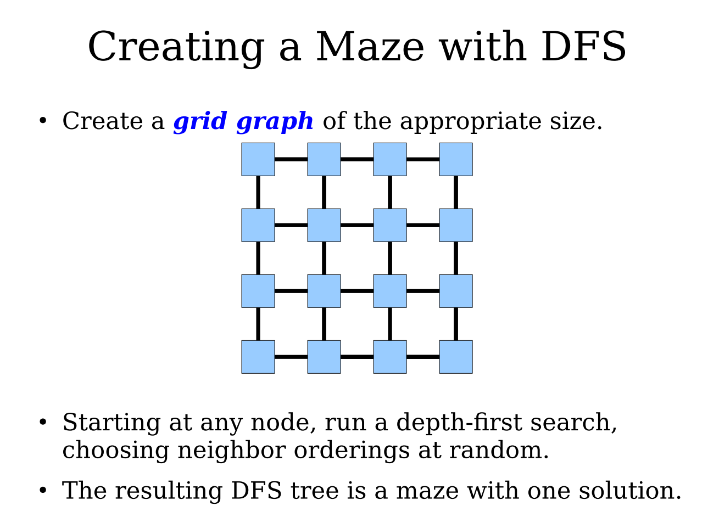
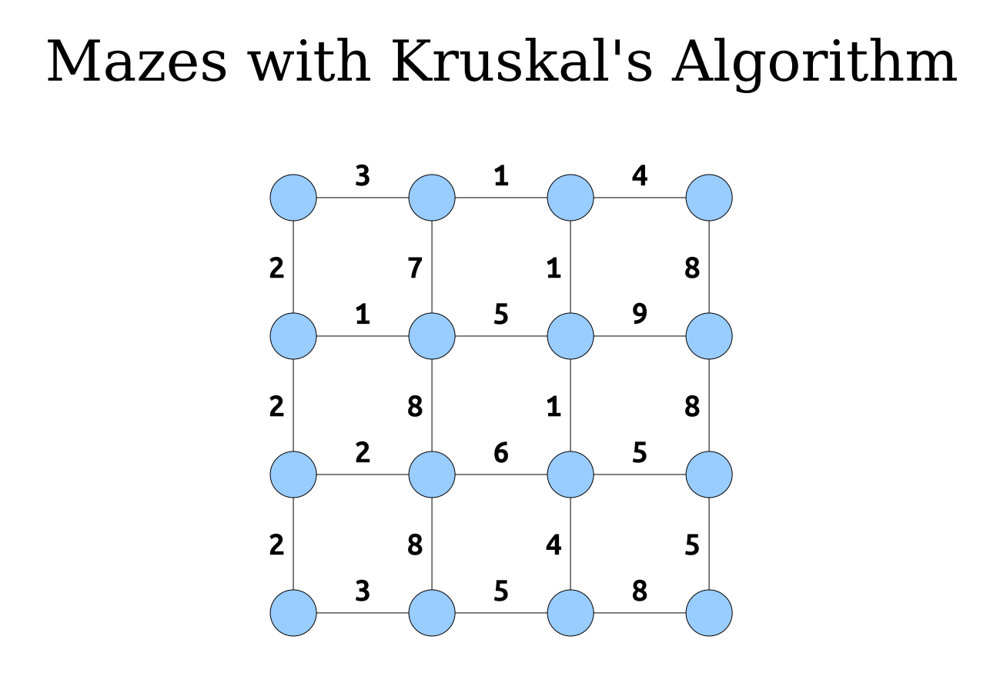
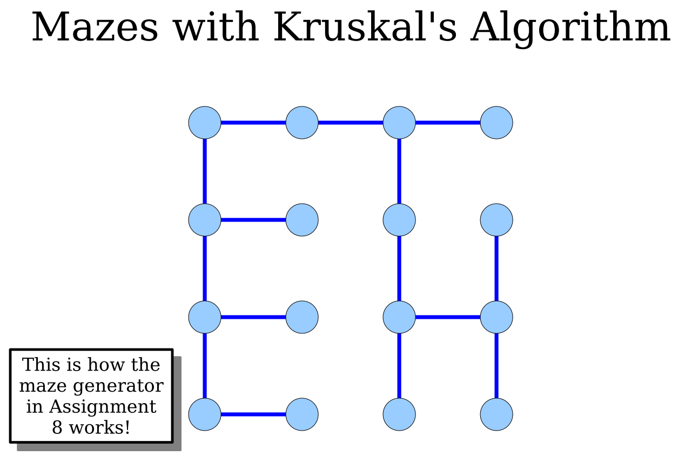

# 游戏算法

##  迷宫生成算法
  - 一般迷宫生成算法 -> disjoint-set forest 算法
  - 扭曲迷宫生成算法 -> 使用 Erd s-Rényi 随机图生成的，通过广度优先搜索保证连通性，起始位置是通过使用 Floyd-Warshall 算法作为子步骤的过程选择的。
  - 使用一个随机深度优先搜索来构建有很多长而扭曲的走廊的迷宫
  - 使用随机的 Prim 算法来构建从中心位置分支出来的迷宫。威尔逊的算法生成的迷宫是从所有可能的迷宫空间中均匀随机抽样的。
  -  充满很多死胡同的迷宫生成 -> 使用DFS 
     -  
  -  充满短而曲折分支的迷宫 -> 使用Kruskal`s 算法
     -  
     -  

## 图可视化的算法
   - force-directed algorithm 

##  在字符串中查找子串
  - Knuth-Morris-Pratt (KMP)算法保证了这种最坏情况下的性能。Rabin-Karp 算法以一种非常聪明的方式使用散列函数使得平均情况下的性能为 O (m + n) ，尽管最差情况下的性能为 O (mn)。

## 正则表达式查询算法
- [A Regular Expression Matcher](https://www.cs.princeton.edu/courses/archive/spr09/cos333/beautiful.html)
- [A Regular Expression Matcher : Brian Kernighan & Rob Pike](https://gist.github.com/j2doll/16d876cb167d85c3e596b1a672d6a19f)

## 二叉树遍历
- [二叉树前中后序,以及Morris遍历](https://ghh3809.github.io/2018/08/06/morris-traversal/)