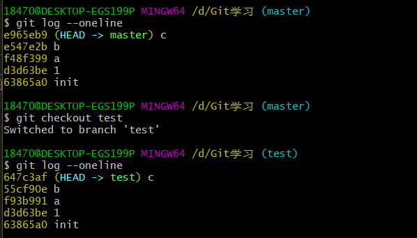
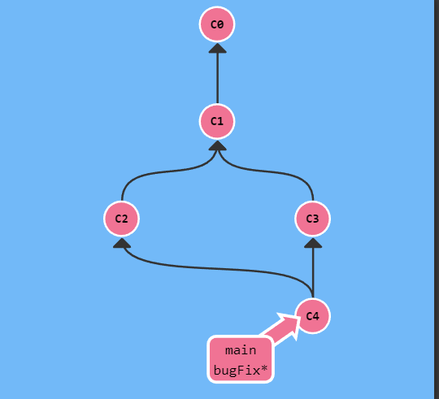
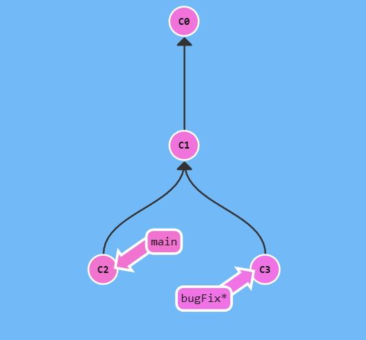
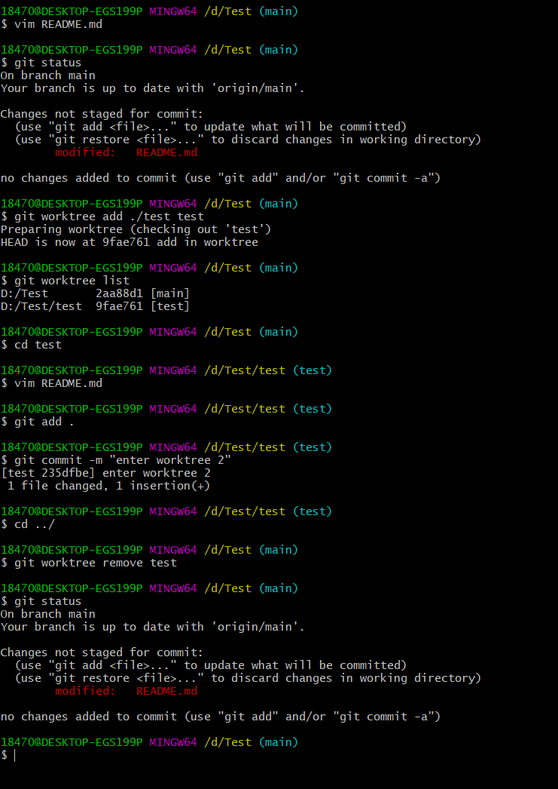

- [Git 学习](#git-学习)
  - [1.什么是Git](#1什么是git)
  - [2.什么是Git远程仓库](#2什么是git远程仓库)
  - [3. 团队内部协作和跨团队协作](#3-团队内部协作和跨团队协作)
    - [3.1 fork 和clone 的区别](#31-fork-和clone-的区别)
  - [4.Git分支](#4git分支)
  - [5.Git 使用流程](#5git-使用流程)
    - [5.1 初始化本地仓库](#51-初始化本地仓库)
    - [5.2 设置签名](#52-设置签名)
  - [6.git 命令操作](#6git-命令操作)
    - [查看当前git状态](#查看当前git状态)
    - [提交修改到暂存区](#提交修改到暂存区)
    - [提交修改到本地库](#提交修改到本地库)
    - [复制提交](#复制提交)
    - [标记标签](#标记标签)
    - [删除标签](#删除标签)
    - [寻找距离提交最近的标签信息](#寻找距离提交最近的标签信息)
    - [查看提交的历史记录](#查看提交的历史记录)
    - [历史版本的前进后退](#历史版本的前进后退)
      - [soft hard mixed 三个参数的区别](#soft-hard-mixed-三个参数的区别)
    - [撤销提交](#撤销提交)
    - [撤销暂存区中的修改](#撤销暂存区中的修改)
    - [撤销分支的合并](#撤销分支的合并)
    - [比较文件差异](#比较文件差异)
    - [复制提交](#复制提交-1)
    - [修改提交信息](#修改提交信息)
      - [修改最后一次提交的提交信息](#修改最后一次提交的提交信息)
      - [选择提交的父提交](#选择提交的父提交)
      - [修改前边某次的提交信息](#修改前边某次的提交信息)
    - [分支操作](#分支操作)
      - [创建分支](#创建分支)
      - [删除分支](#删除分支)
      - [查看所有分支](#查看所有分支)
      - [切换到分支](#切换到分支)
      - [修改分支指向](#修改分支指向)
      - [merge合并分支](#merge合并分支)
        - [解决合并冲突](#解决合并冲突)
        - [合并过程中分支指针的变化情况](#合并过程中分支指针的变化情况)
      - [rebase 合并分支](#rebase-合并分支)
        - [rebase 分支时冲突的处理](#rebase-分支时冲突的处理)
        - [rebase压缩提交](#rebase压缩提交)
      - [rebase整个分支](#rebase整个分支)
    - [远程库操作](#远程库操作)
      - [查看远程库信息](#查看远程库信息)
      - [设置远程库](#设置远程库)
      - [将新的分支推送到远程库](#将新的分支推送到远程库)
      - [推送修改到远程库](#推送修改到远程库)
        - [推送远程库时产生冲突](#推送远程库时产生冲突)
      - [删除远程分支](#删除远程分支)
      - [克隆远程库](#克隆远程库)
      - [拉取远程库](#拉取远程库)
        - [处理拉取时的冲突](#处理拉取时的冲突)
      - [修剪本地远程分支](#修剪本地远程分支)
      - [查看远程库和本地分支的关联情况](#查看远程库和本地分支的关联情况)
      - [查看本地远程分支和本地分支的关联情况](#查看本地远程分支和本地分支的关联情况)
    - [同时在多个分支上进行工作](#同时在多个分支上进行工作)
    - [Git hook](#git-hook)
    - [.gitignore 文件](#gitignore-文件)
  - [7. Git基本原理](#7-git基本原理)
    - [7.1 HEAD 指针](#71-head-指针)
    - [FETCH\_HEAD指针](#fetch_head指针)
  - [9.Git 工作流](#9git-工作流)
  - [10.使用Github](#10使用github)
    - [10.1 GitFow 工作流](#101-gitfow-工作流)
  - [相关学习网站](#相关学习网站)

# Git 学习

## 1.什么是Git
文件的版本管理工具，它由三个部分组成


--------------

## 2.什么是Git远程仓库
远程仓库用于存放数据文件并提供Git功能来给用户进行数据管理

----------------

## 3. 团队内部协作和跨团队协作


### 3.1 fork 和clone 的区别
* `fork`会为用户创建一个新的远程仓库，用户可以对新的远程库进行修改，但是无法修改初始远程库，想要修改初始远程库则必须发起一个`pull request` 并由初始远程库持有者审核后 `merge`到初始远程库中。**对应于跨团队协作**

* `clone` 会直接将远程库复制到本地库，只有当用户获得远程库的开发权限后才能将修改提交到初始远程库中。**对应于团队内部协作**

--------------

## 4.Git分支
分支的作用是让项目多个功能能够同时开发，推进,一个分支上可能存在多个提交。分支管理的本质是创建和移动指针。


## 5.Git 使用流程

1.初始化本地仓库
2.设置签名
3.git命令操作

### 5.1 初始化本地仓库
使用如下命令初始化，后会创建一个`.git`的隐藏文件夹，存放一些配置文件
```
git init
```


### 5.2 设置签名
- 签名形式： `用户名`+`Email地址`
- 签名的作用 ：用来区分开发人员
- 签名的类别
  - 仓库级别/项目级别：仅在当前本地库范围内有效
  - 系统用户级别：登录当前计算机的系统用户范围内生效
  - 优先级别：就近原则，项目级别优先于系统用户级别，不允许两者都不存在的情况
- 登录远程库的账号和密码和签名无任何关系
- 签名信息保存位置
    
  - 仓库级别的在`.git`文件夹中的`config`文件中
  - 系统用户级别的在 `c:\用户\<用户名>\.gitconfig` 文件中

设置仓库级别签名
```
git config user.name xxxx
git config user.email xxx@xxx.com
```

设置系统用户级别
```
git config --global user.name xxx
git config --global user.email xxx@xxx.com
```

----------------

## 6.git 命令操作

###  查看当前git状态
```
git status 查看git 工作区，暂存区的状态

```

###  提交修改到暂存区
```
git add <文件名> //将一个文件在工作区的修改/添加提交到暂存区
git add . //将当前工作区中的所有修改提交到暂存区
```

###  提交修改到本地库
```
git commit -m "" <文件名> //将暂存区中一个文件的修改/添加提交到本地库
```

### 复制提交
可以将提交复制到当前分支上
```
git cherry-pick <提交ID> //将某个提交复制到当前分支上
```


执行命令`git cherry-pick c2 c4` 后


-------------------

### 标记标签
在Git版本树中会发生许多复制，排序，合并，撤销等等的操作，有时候我们会想要给特定的提交打上一个标签来进行标识。存在如下所示版本树。


此时我们想要给提交`1`打上标签`v1`，可以使用命令`git tag <标签名> <提交哈希值>`。

```
git tag v1 d3d63be
```

执行上述命令后版本树的状态变为如下所示


### 删除标签
使用命令`git tag -d <标签名>`

### 寻找距离提交最近的标签信息
标签在代码库中起着“锚点”的作用，Git 还为此专门设计了一个命令用来描述离你最近的锚点，使用命令
`git describe --tags <提交哈希值>/<分支名>` 可以获取在该提交之前，距离最近的标签的信息，该信息通过如下格式表示出来

`<tag>_<numCommits>_g<hash>`
- `<tag>` 表示该标签的名称
- `<numCommits>` 表示当前提交和标签的距离
- `<hash>` 表示的是你所给定的提交所表示的哈希值的前几位


###  查看提交的历史记录

```
git log
git log --pretty=oneline 或 git log --oneline  //每行记录占一行
git reflog //每行记录占一行，并显示当前指针移动到对应记录的步数
```

###  历史版本的前进后退
```
git reset --hard <索引值>
git reset --hard HEAD^ //从当前的版本回退一个版本，由^的个数表示回退几步
git reset --hard HEAD^<步数> //回退到距离当前版本指定步数的版本
```

####  soft hard mixed 三个参数的区别

使用soft 参数后git只会改变本地库的指针，暂存区和工作区的指针保持不变，此时git会认为有修改被提交到了暂存区，

使用mixed 参数后git会改变本地库，暂存区的指针，工作区的指针保持不变，此时git会认为有修改发生在工作区没有被提交

使用hard参数后git会改变本地库，暂存区，工作区的指针，三者保持一直，git会认为当前没有修改发生


没有明确指明使用哪一种模式的情况下默认使用 `mixed` 模式

### 撤销提交

```
git revert <提交哈希值>/<分支名> 
```
撤销对应的提交,此操作会产生一个新的提交，来覆盖想要撤销的提交.通过该方法可以撤销已经推送到远程库上的操作

在使用命令`git revert <提交哈希值>/<分支名>`来撤销提交时可能会产生冲突，产生冲突的原因是Git会将撤销提交的父提交和当前`Head`指针对应的提交中的文件状态进行比较查看是否有冲突。如果发生冲突此时应该手动的处理冲突之后使用如下命令来继续撤销流程

```
git add <文件名>
git revert --continue
```

---------------

###  撤销暂存区中的修改
```
git reset --hard HEAD 重置本地库，暂存区，工作区的指针，撤销暂存区中的所有修改
git restore --staged <文件名> //撤销暂存区中某一个文件的修改
```

###  撤销分支的合并
```
git revert -m <1|2> <合并提交的ID> //数字1，2表示对应的父提交，数字1表示直接父提交
```

###  比较文件差异

```
git diff <文件名> //将工作区的版本和暂存区中的版本进行比较
git diff HEAD <文件名> //将工作区的版本和本地库的版本进行比较
git diff HEAD^ <文件名> //将工作区的版本和本地库的上一个版本进行比较
//以上命令不指定文件名时将会比较工作区中的所有文件
```

### 复制提交
假设存在分支`master` 和分支 `test` 如下图所示。如今我们想要将`test`分支中的 `a`,`b`,`c`提交复制到`master` 分支上，可以使用`git cherry-pick <提交a的哈希值> <提交b的哈希值> <提交c的哈希值>`
```               
      master
       ↓
 * --- 1  
        \
          --- a --- b --- c
                          ↑
                        test*
```


执行如下命令，注意哈希值的排放顺序跟提交复制的顺序一致
```
git checkout master
git cherry-pick f93b991 55cf90e 647c3af
```

提交后版本树的状态如下所示
```               
                         master*
                           ↓
 * --- 1 --- a' --- b' --- c'
        \
          --- a --- b --- c
                          ↑
                        test
```


**需要注意在某分支上进行cherry-pick 后，当前分支的指向会进行更新**

### 修改提交信息

#### 修改最后一次提交的提交信息

使用命令`git commit --amend -m <新的提交信息>` 可以修改当前`HEAD`指针对应的提交的提交信息。但是该命令并不会直接修改提交信息，相反它会创建和当前提交一摸一样但是提交信息不同的新提交。如下图所示

```
                master*
                  ↓
* --- * --- * --- A
```

执行命令`git commit --amend -m "A'"` 后，版本树则变为如下状态，可见`A`提交并未消失

```
* --- * --- * --- A
              \
               --- A'
                   ↑
                 master*
```

如果当前`HEAD`指向处于分离状态。如下所示

```
            HEAD      master
            ↓           ↓
* --- * --- B --- * --- A
```

此时如果执行命令`git commit --amend -m "B'"` ，则版本树则变为如下状态。因此当`HEAD`处于分离状态时应该谨慎使用该命令。此时如果想要修改提交`B`的提交信息应该使用`rebase`。

```
                       master*
                        ↓
* --- * --- B --- * --- A
           \
            B' 
            ↑
           HEAD
```

#### 选择提交的父提交
当一个提交有两个父提交的时候，如下图所示，


我们选择其中的父提交时有两种办法
- 直接指定提交哈希值
- 使用`^`关键字指定具体的父提交

当使用命令`git checkout HEAD^2` 则会跳转到`c2`上 使用命令`git checkout HEAD^` 则会跳转到`c1`上。其中`HEAD^2` 表示`HEAD`的非直接父提交即`c2`

#### 修改前边某次的提交信息

假如当前版本树状态如下所示，我们想要修改提交`b` 和提交`a` 的提交信息，此时可以使用命令`git rebase -i HEAD~3`

```
                       master*
                        ↓
* --- * --- a --- b --- c
```
执行命令 `git rebase -i HEAD~3` 会弹出如下界面。


然后我们将需要进行修改的提交的`pick` 标注改为`edit`或者`e`,如下所示


接下来Git 会依次rebase 这三个提交，在我们设置了标注`e`的提交上，我们需要使用命令`git commit --amend -m <新的提交信息>` 然后执行`git rebase --continue` 命令来修改提交信息。

对于`a`提交


对于`c`提交


最终版本树的状态如下所示，可见该命令的本质是创建了新提交
```
                       
* --- * --- a --- b --- c
           \             master*
            \             ↓
             a' --- b --- c'
```


###  分支操作

####  创建分支
```
git branch <分支名> //创建新的分支
git checkout -b <分支名> // 创建一个分支，并且切换到该分支上
```

#### 删除分支
```
git branch -d <分支名>
```

####  查看所有分支


- `git branch -v` 查看本地分支信息
- `git branch -r` 查看本地远程分支
- `git branch -a` 查看所有分支信息，包括本地分支和本地远程分支
- `git branch -vv` 查看本地分支和本地远程分支的关联


#### 切换到分支
```
git checkout <分支名>
git switch <分支名> //Git 2.23 版本中，引入了一个名为 git switch 的新命令，最终会取代 git checkout，因为 checkout 作为单个命令有点超载（它承载了很多独立的功能）
```

#### 修改分支指向
```
git branch -f <分支名> <目标分支名>/<目标相对位置>/<目标提交对象哈希值> //修改分支的指向
```

在Git中分支指针的位置也是可以改变的，如下图当前`HEAD` 指针在`bugFix`分支上。


使用命令`git branch -f main HEAD~3` 后`main`分支则指向了`c1`


-----------------

#### merge合并分支
在合并分支之前必须切换到接受修改的分支上
```
git merge <目标分支> //将目标分支合并到当前分支上
git rebase <目标分支名> //将当前分支 rebase 到目标分支上
```

#####  解决合并冲突
Git对文件的管理是基于行的因此如果合并分支发现某个文件的某一行都被修改，那么就会产生冲突，此时自动合并会失败，用户必须进行手动合并，手动修改文件到满意的程度。然后使用`git commit -m "" //不能带文件名` 来进行手动合并

##### 合并过程中分支指针的变化情况

下图存在分支`bugFix` 和分支`main`


当处于`main`分支时，使用命令`git merge bugFix`,就可以将`bugFix`分支合并到`main`分支上


当处于`bugFix`分支时，使用`git merge main`命令合并，并不会产生一个新的提交，只是单纯的将`bugFix`的指针移动到`main`的位置



--------------

#### rebase 合并分支

Rebase 实际上就是取出一系列的提交记录，“复制”它们，然后在另外一个地方逐个的放下去。

Rebase 的优势就是可以创造更线性的提交历史，这听上去有些难以理解。如果只允许使用 rebase 的话，代码库的提交历史将会变得更清晰。

如下图所示，存在两个分支 `bugFix`和`main`,当前位于分支`bugFix`上


当处于`bugFix`分支时，使用命令`git rebase main`将分支`bugFix` rebase 到分支`main`上，此时`bugFix`分支指向`c3'`,`main`分支指向`c2`。


现在 bugFix 分支上的工作在 main 的最顶端，同时我们也得到了一个更线性的提交序列。
注意，提交记录 C3 依然存在（树上那个半透明的节点），而 C3' 是我们 Rebase 到 main 分支上的 C3 的副本。

##### rebase 分支时冲突的处理
当rebase分支发生冲突的时候应该手动的处理冲突，然后使用`git rebase --continue`来继续rebase操作

##### rebase压缩提交
假设`master` 有如下几个提交记录，`f`,`d`,`e`。如下图


我们想要将`f`,`d`,`e`三个提交合并成一个来简化版本树,此时可以通过命令`git rebase -i HEAD~3`来实现。输入命令后Git会弹出一个面板，让你来手动指定对每一个提交执行的操作


想要压缩提交，我们必须保留一个提交记录，一般保留最早的提交。然后将需要压缩的提交前面设置标记`squash`或者`s` (每一个缩写的作用都被Git以注释的形式标记出来了)。


保存退出，如果发生冲突手动修复即可,然后设置压缩后的提交的提交信息.


压缩之后，版本树就会变为如下形式


#### rebase整个分支

假设存在分支`master`和分支`test`，他们的共有一个公共的父提交`1`。如下所示.

```
                        master
                           ↓
init --- 1 --- 2 --- 3 --- 4
           \
            a --- b --- c 
                        ↑
                        test
```

此时如果分支`test`已经开发完毕,我们不想要继续保留`test`分支，而是想要将它的修改直接应用到`master`分支上，那么我们使用命令

```
git checkout test
git rebase -i master
```

随后Git会让我们选择需要rebase到master上的提交，选择后就可以继续rebase操作，Git不会直接将`test`分支上的提交提交到`master`上而是会创建对应的副本，这些副本提交所作的修改和`test`上对应的提交一致，然后依次提交到`master`分支上。操作完成后版本树的状态如下所示

```
                        master                test
                           ↓                   ↓
init --- 1 --- 2 --- 3 --- 4 --- a' --- b' --- c'
           \
            a --- b --- c 
```

注意在rebase的过程中很有可能会产生冲突，Git在rebase分支时首先会比较提交`4` 的内容和提交`a'`的内容看是否有冲突如果有则需要我们手动解决冲突后使用命令 `git rebase --continue` 来继续rebase
下一次Git将会比较提交`a'`和提交`b'`的内容，直到rebase操作完成。


**除了上述功能外，rebase还可能对已有的提交进行重新排序或者舍弃某些提交。该过程同样会创建新的提交，操作过程和上述类似**


---------------


### 远程库操作

####  查看远程库信息
```
git remote -v
```

####  设置远程库
```
git remote add <远程库别名> <远程库地址>
```

#### 将新的分支推送到远程库
```
git push <远程库名> <目标分支名>
```

作用：
- 将目标分支推送到远程库，远程库会创建该目标分支
- 在本地库中创建本地远程分支，但不会将本地分支和本地远程分支进行关联

```
git push -u <远程库名> <目标分支名>
```

作用：
- 将目标分支推送到远程库，远程库会创建该目标分支
- 在本地库中创建本地远程分支，并且会将本地分支和本地远程分支进行关联

####  推送修改到远程库
```
git push <远程库名> 或者 git push
```

作用：
- 将当前分支上的修改推送到远程库
- 当本地库存在远程库没有的分支，或者是本地库的分支落后于远程库版本的时候会失败


##### 推送远程库时产生冲突
如果两个人编辑同一个文件，当两个人进行推送的时候，只有先推送的人才能推送到远程库中，后推送的人会推送失败，此时后推送的人必须先拉取远程库后才能推送成功。

#### 删除远程分支
```
git push <远程库名> -d <目标分支名>
```

作用：
- 删除远程库中的远程分支和其对应本地远程分支
- 不会删除和本地远程分支关联的本地分支


#### 克隆远程库

```
git clone <远程库地址>
```

克隆一个远程库有三个效果
1. 将远程库复制到本地
2. 设置好远程库别名
3. 初始化本地库，创建并设置好对应的本地分支，本地远程分支


####  拉取远程库

当拉取的内容较多，或者有可能产生冲突的时候使用如下命令
```
git fetch <远程库名> <远程库分支名>
git checkout <需要合并的本地分支名>
git merge <本地远程分支名>
//如有冲突则手动合并
```

当拉取的内容较少并且不会产生冲突的时候可以使用如下命令
```
git pull <远程库名> <远程库分支名>
```

注意使用`git fetch` 来拉取远程库只会更新本地远程分支，并不会更新和该本地远程分支关联的本地分支，因此如果想要更新与本地远程分支关联的本地分支还要使用`git merge`命令来实现。

##### 处理拉取时的冲突
在使用`fetch，merge`或者时`pull`的时候可能会发生冲突此时需要手动的处理冲突，然后将合并后的结果`push`回远程版本库


#### 修剪本地远程分支
当远程库删除了某一个分支之后，我们再使用`git fetch <远程库名>`来更新整个本地库的时候，Git并不会删除对应的本地远远程分支，想要本地库也删除对应的本地远程可以使用
- `git remote prune <远程版本库名>`
- `git fetch --prune <远程版本库名>`
- `git fetch --prune <远程版本库名> <目标分支名>`

#### 查看远程库和本地分支的关联情况

使用命令
```
git remote show <远程库名> 
```
可以查看所有本地远程分支和远程分支的关联情况


- `tracked` 表示本地已追踪的远程分支
- `new` 表示本地未追踪的远程分支，当前只存在于远程库中
- `local out of data` 表示远程库中该分支已经更新，本地远程分支已过时
- `up to data` 表示远程分支和本地远程分支一致

#### 查看本地远程分支和本地分支的关联情况

```
git -branch -vv
```
使用该命令可以查看地远程分支和本地分支的关联情况。例如本地远程分支和哪个本地分支关联，本地分支是否落后或者超前本地远程分支几个版本。


----------------

### 同时在多个分支上进行工作
假设现在有两个分支分别为 分支`test`和分支`main`，你现在在分支`main`上进行工作，但是现在出现出现一个紧急的任务，你必须到分支`test`上去修复一个bug。而你在分支`main`已经做出修改，你不想丢失这个修改，你想把这个修改保存起来。

- 解决方案一：进行`commit`，直接将该修改进行提交.
- 解决方案二：使用`stash`，临时保存这个修改
  - 在`main`分支上使用命令`git stash`,该命令会保存当前工作区的状态
  - 然后切换到`test` 分支，进行工作
  - 工作完成后切换到`main`分支
  - 在`main`分支上使用`git stash pop`
  - 
- 解决方案三：使用`git worktree`,该命令会在你指定的位置将你指定的分支创建出来这样就可以方便的在多个分支上进行工作
  - 使用命令`git worktree add <指定文件路径> <指定分支名>` 
  - 使用命令`cd <指定文件路径>` 进入到被创建的分支的目录中进行工作
  - 使用命令`git worktree list` 可以看到当前有多少个worktree
  - 工作完成后，使用命令`git worktree remove <目录名字>` 来将该临时的worktree删除掉
  - 
  - 注意在创建了分支的worktree后使用checkout该分支会失败

### Git hook


Git hook 简单来说就是脚本，它可以在执行一些Git操作之前，或者是执行一些Git操作之后触发，来达到检查代码风格等操作。

### .gitignore 文件

[.gitignore文件的配置使用](https://zhuanlan.zhihu.com/p/52885189)


---------------

## 7. Git基本原理
现在假设我们在工作目录下新增三个文件test1.txt， test2.txt和 test3.txt。同时执行了一次git add添加了这三份文件。那么此时git add做了如下两件事：
- 首先，它给这三个文件分别创建3个校验和添加到暂存区中。校验和可以理解为是一个文件的唯一索引，git通过SHA-1这种哈希算法，遍历每一个文件，根据文件内容等信息，为文件创建索引。以后，只要根据这个索引，我们就可以取出一个文件中的完整内容。
- 然后，git对当前的暂存区拍了一张照片，也就是我们所说的快照，并将快照放入版本库。快照里包括什么内容呢？快照里包括我们刚才说的文件索引和文件完整内容（类似于key-value的结构）。同时，git采用内置的blob对象来存储这三个文件的快照。


接下来，我们执行git commit ，这个命令又做了两件事：
- 首先，零散的文件得有一个目录结构吧？所有它用一个内置的tree对象，把文件的目录结构保存下来。
- 然后，git在这个tree对象上又包了一层，创建了一个commit对象，这个commit对象也是我们说的git进行版本管理的最终对象。commit对象里包含了tree对象，还包含作者、提交评论等信息。


什么是快照？快照就是在执行git commit时，对当前暂存区的情况拍摄的一张“照片“，这个照片中涵盖的若干信息将被存放到git版本库下。若干信息指的是什么？是文件的索引+文件的完整内容（key-value结构），文件的目录结构，和提交信息，这三者分别用git内置的blob，tree，commit对象进行存储。

再次修改一下工作目录里的文件，比如test2.txt，然后再执行add和commit操作。结果如下（仔细看灰色部分，同时注意比较灰色和红色部分）


提交对象中有一个`parent`字段保存着上一个提交对象的哈希值，通过这个`parent`字段就可以实现一个版本的历史记录，每一个提交对象都有自己对应的一个工作区的快照，并且提交对象的哈希值就是版本的哈希值。


### 7.1 HEAD 指针
HEAD 是一个对当前检出记录的符号引用 —— 也就是指向你正在其基础上进行工作的提交记录。
HEAD 总是指向当前分支上最近一次提交记录。大多数修改提交树的 Git 命令都是从改变 HEAD 的指向开始的。
HEAD 通常情况下是指向当前分支名。在你提交时，改变了 分支 的状态，这一变化通过 HEAD 变得可见。

如下图，存在分支`main` ,指针`HEAD` 指向`main`


执行`git checkout c1` 后 指针`HEAD`的状态如下所示.此时`HEAD`处于**分离状态**


### FETCH_HEAD指针

当我们使用`git fetch` 命令的时候，Git回生成一个叫做`FETCH_HEAD`指针，该指针指向最近一个进行了**fetch**操作的分支，它的作用是当执行`git pull`命令的时候指明需要进行**merge**的目标分支(因此`git pull`是`git fetch `和`git merge`的合并操作),我们可以通过查看.git目录下的FETCH_HEAD文件(使用`cat .git/FETCH_HEAD`命令)来查看它当前的具体指向，如下所示


上图输出了两项信息，第一项表明了当前`FETCH_HEAD`指针的指向，它当前指向了`origin/tyr`分支，对应的提交对象的哈希值为`cc66b`，其余项表明了当前不需要进行合并的本地远程分支。

*图中 `branch 'tyr' of github.com:tyr66/Test` 实际上指的是`origin/tyr`分支而不是`tyr`分支*


----------------


## 9.Git 工作流

-------

## 10.使用Github

工作流主要有 集中式，GitFlow，Forking 等等


### 10.1 GitFow 工作流
[](https://www.bilibili.com/video/BV1pW411A7a5?p=54&vd_source=bb33286cda74be54bbcdf853e121e4f7)


-----------


## 相关学习网站

[可视化git学习网站](https://learngitbranching.js.org/?locale=zh_CN)