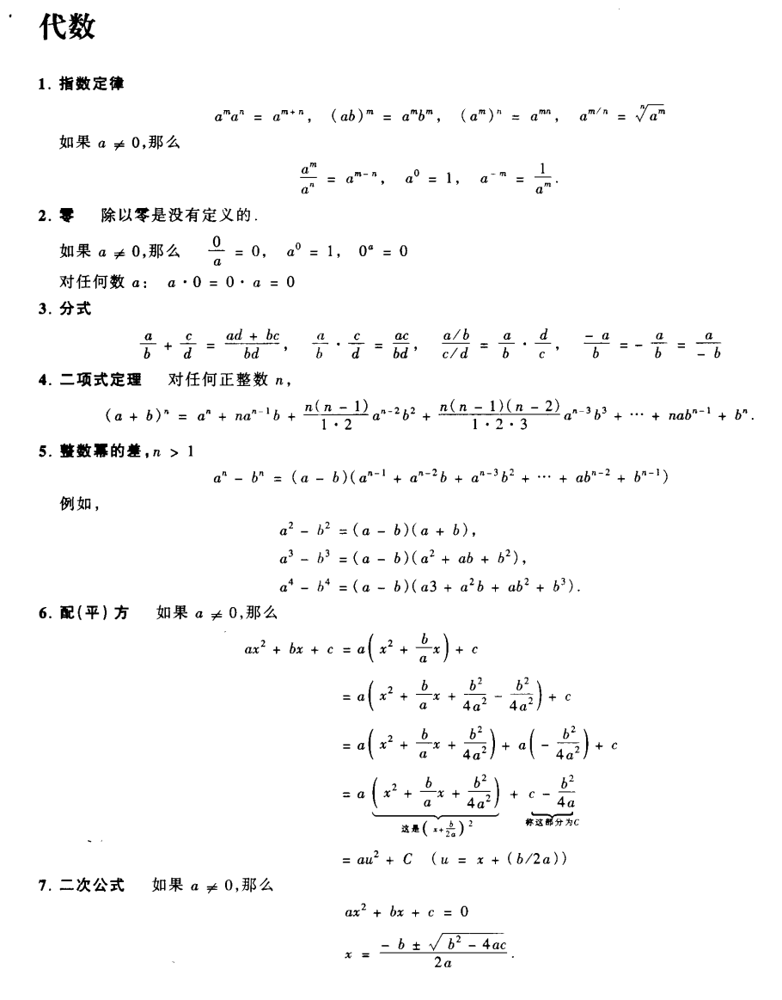
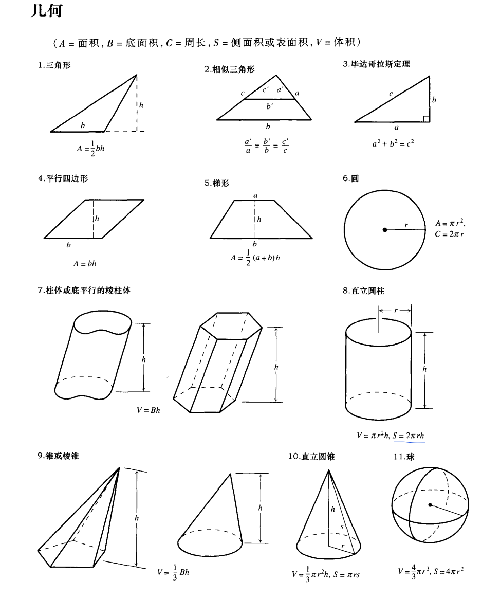
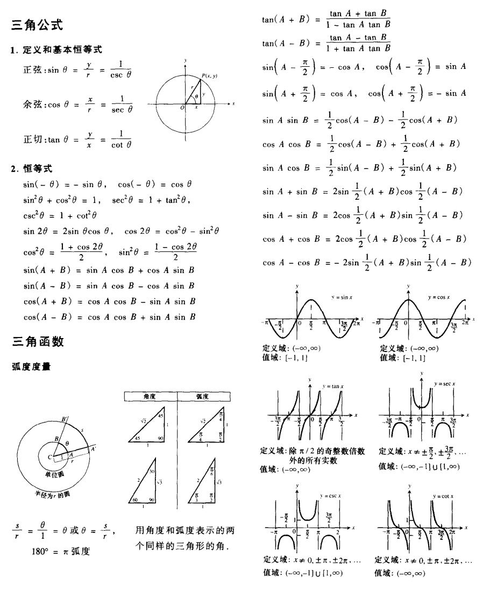

学习网站

- [集合符号](https://www.shuxuele.com/sets/symbols.html)
- 代数
  - 
- 几何
  - 
- 三角公式
  - 
- [一个数学绘图网站]()https://www.geogebra.org/graphing?lang=zh_CN

## 代数
- [指数对数幂函数](https://zhuanlan.zhihu.com/p/91875580)

## 微积分
- [第一次数学危机](https://zhuanlan.zhihu.com/p/368346185)
- [证明$\sqrt{2}$不是有理数](https://zh.m.wikipedia.org/zh-cn/%E7%84%A1%E7%90%86%E6%95%B8)
- [普林斯顿微积分笔记](https://zhuanlan.zhihu.com/p/31199228)
- [托马斯微积分第14版课后习题答案](https://www.studocu.com/row/document/istanbul-teknik-universitesi/mathematics/thomas-calculus-14th-edition-hass-solutions-manual/23466012)

## 几何
- [理解弧度](https://www.shuxuele.com/geometry/radians.html)

## 学习网站
- [Open Euler](https://projecteuler.net/about)