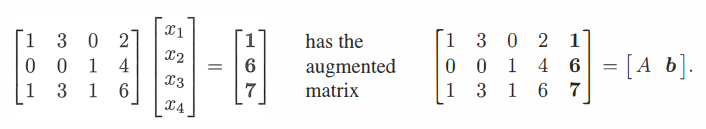
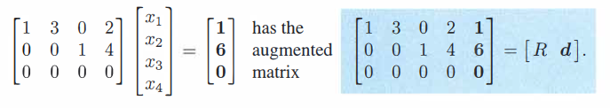
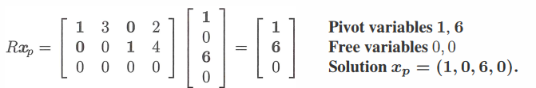
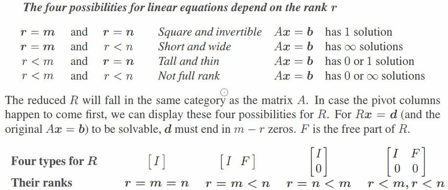

<!-- markdown-toc GFM -->

- [1.方程Ax=0的解](#1方程ax0的解)
  - [1.1 求解Ax=0的特解](#11-求解ax0的特解)
    - [1.1.1 进行消元](#111-进行消元)
    - [1.1.2 找出矩阵的主列和自由列](#112-找出矩阵的主列和自由列)
    - [1.1.3 找出所有的特解](#113-找出所有的特解)
  - [1.2 矩阵的零空间与 $Ax=0$ 的特解](#12-矩阵的零空间与-ax0-的特解)
- [2.方程Ax=b的解](#2方程axb的解)
  - [2.1 使用矩阵的列空间理解Ax = b](#21-使用矩阵的列空间理解ax--b)
  - [2.2 求Ax=b的特定解 $x\_p$](#22-求axb的特定解-x_p)
  - [2.3 求出Ax=b的通解](#23-求出axb的通解)
  - [2.4 为何方程$Ax=b$的解为$x\_p + x\_n$](#24-为何方程axb的解为x_p--x_n)
- [3.矩阵的秩与解的情况](#3矩阵的秩与解的情况)

<!-- markdown-toc -->

# 1.方程Ax=0的解

## 1.1 求解Ax=0的特解

设矩阵$A = \left[\begin{array}{cccc} 1&2&2&2 \\ 2&4&6&8 \\ 3&6&8&10 \end{array} \right]$  ,如何求解$Ax = 0$，即求解矩阵$A$的零空间。

**算法步骤**

- **进行消元，将矩阵变为阶梯矩阵或者是简化行阶梯矩阵**
- **找到矩阵的主列和自由列**
- **找出零空间的所有特解**
- **所有特解的线性组合即为零空间**

### 1.1.1 进行消元

------------

通过消元法将矩阵中主元下的元素变为0

$$
\begin{array}{r}
    
A =\left[\begin{array}{cccc} 1&2&2&2 \\ 2&4&6&8 \\ 3&6&8&10 \end{array} \right] \\\\
E_{1}A = \left[\begin{array}{cccc} 1&2&2&2 \\ 0&0&2&4 \\ 0&0&2&4 \end{array} \right] \\\\
U = E_{2}E_{1}A = \left[\begin{array}{cccc} 1&2&2&2 \\ 0&0&2&4 \\ 0&0&0&0 \end{array} \right] \\

\end{array}    

$$

此时矩阵$A$经过消元处理后，变成 了一个阶梯矩阵记作$U$

继续进行消元将主元上方的元素也变为0可得简化行阶梯矩阵记作$R$或$R = reff(A)$
$$
R =\left[\begin{array}{cccc} 
1&2&0&-2 \\ 
0&0&1&2 \\ 
0&0&0&0 
\end{array} \right]
$$

此时方程变为$Rx = 0$。

### 1.1.2 找出矩阵的主列和自由列

---------------

通过观察矩阵$U$，可以看出它的主元的有两个，一个为1，一个为2。**矩阵中主元的个数被称为秩。**
$$
U =  \left[\begin{array}{cccc} \textcolor{red}{1}&2&2&2 \\ 0&0&\textcolor{red}{2}&4 \\ 0&0&0&0 \end{array} \right] \\
$$
而秩所对应的列被称为主列，其他的列被称为自由列，如下标注红色的列为主列，标注蓝色的列为自由列。
$$
U =  \left[\begin{array}{cccc} 
\textcolor{red}{1}&\textcolor{blue}2&\textcolor{red}2&\textcolor{blue}2 \\
\textcolor{red}0&\textcolor{blue}0&\textcolor{red}{2}&\textcolor{blue}4 \\
\textcolor{red}0&\textcolor{blue}0&\textcolor{red}0&\textcolor{blue}0 
\end{array} \right] \\
$$
观察上图可知，第1，3个列向量为主列，第2，4个列向量为自由列。自由列对应的向量在形成矩阵的列空间中没有作用。

### 1.1.3 找出所有的特解

------------

方程转化为$Ux = 0$  或者$Rx = 0$后需要找出特解。特解本质上是矩阵零空间中那些互相独立的向量。

根据$Rx = 0$，可以进行方程的求解
$$
Rx = 0 = \left[\begin{array}{cccc} 
1&2&0&-2 \\ 
0&0&1&2 \\ 
0&0&0&0 
\end{array} \right]
\left[\begin{array}{c} 
x \\ y\\ z\\w
\end{array} \right] = 
\left[\begin{array}{c} 
0 \\ 0\\ 0\\ 0
\end{array} \right]
$$

$$
x+2y-2w = 0 \\
z+w = 0
$$

因为第1，3个列向量为主列，第2，4个列向量为自由列。向量$x$中y,w分量对应矩阵中的自由列, 我们分别将它们分为$y = 1,w = 0$和$y = 0,w = 1$两种情况，这样就可以求出两个解,如下所示。
$$
x_1 = \left[
\begin{array}{c}
-2 \\1 \\0 \\0
\end{array}
\right]，
x_2 = \left[
\begin{array}{c}
2 \\0 \\-2 \\1
\end{array}
\right]
$$

这两个解被称为特解。

## 1.2 矩阵的零空间与 $Ax=0$ 的特解

**矩阵的零空间包含了Ax=0所有特解的线性组合**

对于主列它们互相独立不可能线性组合出零向量,因此想要组合出零向量就需要借助自由列, 我们想要解$Ax = 0$ 本质上就是要让主列的向量线性组合出和自由列向量方向相反的向量，这样所有列向量加起来就是一个零向量。这样就可以根据特解的数量，来分为各种情况。例如所有的主列向量线性组合为第一个自由列向量，或者是所有的主列向量线性组合为第二个自由列向量，而这些所有情况中得出的解就组成了零空间中所有线性无关的向量。这些特解就是矩阵零空间的基，零空间中其他向量都可以由它们线性组合得出。

因此上述例子中, 找到所有特解后，方程$Ax = 0$的解为所有特解的线性组合，所有的解都可以由特解的线性组合得出，该线性组合构成了矩阵$A$的零空间$N(A)$
$$
x = cx_1+dx_2 =
c\left[
\begin{array}{c}
-2 \\1 \\0 \\0
\end{array}
\right] +d\left[
\begin{array}{c}
2 \\0 \\-2 \\1
\end{array}
\right]
$$

# 2.方程Ax=b的解

## 2.1 使用矩阵的列空间理解Ax = b

--------------------

对于方程
$$
Ax = b
$$

向量$x$起到对矩阵$A$的列向量进行线性组合的作用,那么想要$Ax = b$有解，当且仅当向量$b$在矩阵$A$的列空间中。

## 2.2 求Ax=b的特定解 $x_p$

首先将矩阵$A$和向量$b$组成一个增广矩阵$[A \; b]$

然后将矩阵$[A \; b]$消元成简化行阶梯矩阵$[R \; d]$. 

此时方程变为 $Rx_p = d$, 最后将$x_p$中的自由变量全部设为零，解出剩余的主元变量即可求出$x_p$

## 2.3 求出Ax=b的通解

当我们求解出方程 $Ax=b$ 的特定解$x_p$后将其与$Ax=0$的所有特解的线性组合相加即可得到方程$Ax=b$的通解

$$
x = x_p + x_n \\
$$

## 2.4 为何方程$Ax=b$的解为$x_p + x_n$
-------------
首先检验$x_p+x_n$是否为方程$Ax =b$的解
$$
A(x_p+x_n) = Ax_p+Ax_n \\
Ax_p = b \\
Ax_n = 0 \\
Ax_p+Ax_n = b+0 = b \\
A(x_p+x_n) = b
$$

可以看出$x_p+x_n$确实为方程的解

那么下一个问题时 $x_p+x_n$ 是否可以表示方程所有的解。
我们假设不能表示所有的解，即存在$x_q = x_p+x_m$，并且$x_m$ 不在矩阵$A$ 的零空间中。那么有如下所示方程

$$
\begin{array}{c}
Ax_q = A(x_p+x_m) = Ax_p+Ax_m\\\\
\end{array}
$$

因为$Ax_m!=0$，所以可以得出
$$
Ax_q = A(x_p+x_m) !=b
$$

假设不成立.

# 3.矩阵的秩与解的情况

对于mxn矩阵$A$，我们可以通过观察矩阵的秩的大小来判断该矩阵的解的情况

