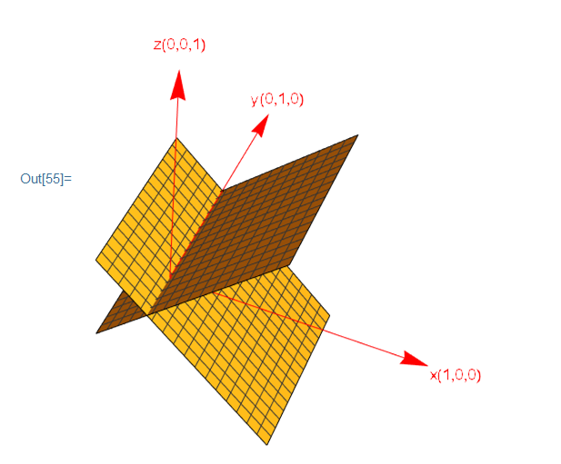

[TOC]

# 正交向量和正交子空间
--------------

## 1. 向量空间的正交

----------------

**向量空间$S$ 和向量空间 $T$ 正交意味着$S$ 中的任意向量和 $T$ 中的任意向量垂直**

### 1.1 垂直和正交

------------------

考虑在$R^3$ 中有两个平面，这两个平面互相垂直，那么两个平面垂直是否意味着这两个平面正交呢？如下所示。

答案是否定的，在这两个平面的交线上的向量同时属于这两个平面，但是这些向量并不垂直。因此**两个平面垂直，并不代表两个平面正交**。

- 两个向量空间正交，这两个向量空间一定不会相交于非零向量。

- 只有当两个向量空间只在零点相交时，垂直才会等价于正交。

  

## 2. 矩阵子空间的关系

--------------

设存在一个$mxn$矩阵，则该矩阵的四个基本子空间存在如下关系

- **矩阵的行空间与零空间在$R^n$ 中互为正交补(Orthogonal complements),，零空间中的所有向量都与行空间中的所有向量垂直**
- **矩阵的列空间与左零空间在$R^m$ 中互为正交补(Orthogonal complements)，列空间中的所有向量都与左零空间中的所有向量垂直**

设存在一个$mxn$ 矩阵$A$ ，对于$Ax =0$，可以写成如下形式
$$
\left[\begin{array}{cccc}
Row_1\\
Row_2\\
...\\
...\\
Row_n
\end{array}\right]
\left[\begin{array}{c}
x\\y\\z
\end{array}\right] = 
\left[\begin{array}{c}
0\\0\\...\\...\\0
\end{array}\right]
$$
对于矩阵中的各个行向量,它们和向量$x$ 的点乘都为0
$$
Row_1\left[\begin{array}{c}
x\\y\\z
\end{array}\right] = 0\\
Row_2\left[\begin{array}{c}
x\\y\\z
\end{array}\right] = 0\\
...\\...\\...\\
Row_n\left[\begin{array}{c}
x\\y\\z
\end{array}\right] = 0
$$

由此可知矩阵行空间中的基和矩阵零空间中的任意向量点乘为0，即垂直。对于矩阵所有行向量的线性组合有
$$
(n_1Row_1+n_2Row_2+.......+n_nRow_n)
\left[\begin{array}{c}
x\\y\\z
\end{array}\right] \\

$$

$$
n_1Row_1\left[\begin{array}{c}
x\\y\\z
\end{array}\right] +
 n_2Row_2\left[\begin{array}{c}
x\\y\\z
\end{array}\right] +.......+
 n_nRow_1\left[\begin{array}{c}
x\\y\\z
\end{array}\right] =0 \\
$$

由此可知矩阵行向量线性组合后的任意向量，和矩阵零空间中的任意向量的点乘为0。因此**矩阵的行空间和矩阵的零空间正交**。

又因为矩阵行空间的维数$r$和矩阵零空间的维数$n-r$存在$r+n-r = n$ 的互补关系，所以**矩阵的行空间和矩阵的零空间存在正交补关系**。

同理矩阵的列空间和矩阵的左零空间也可以通过这种方式推导。

