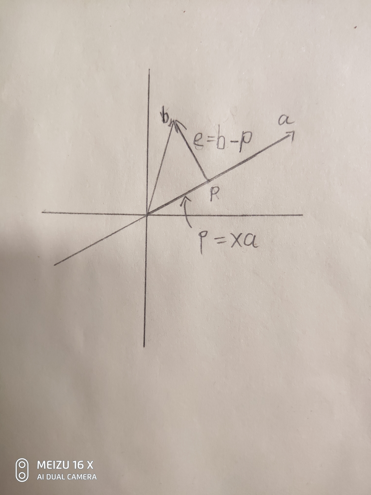

[TOC]

# 投影

---------------

## 1.投影矩阵

--------------

### 1.1 二维的情况下

假设存在向量$b$ ，向量$a$ ，将$b$ 投影到$a$ 中可以得到向量$p$，设向量$e = b-p$ ，可知$e \bot a$

因为 存在$e \bot a$ ，且向量$p$ 可以表示成 $p = xa$ 形式，因此可到如下方程。
$$
a^T(b - p) = 0 \\
$$
将上述方程展开可得：
$$
\begin{array}{l}
a^T(b - xa) = 0 \\\\
a^Tax = a^Tb \\
\end{array}
$$
其中$a^Ta$ 的结果为一个实数，由此可得
$$
x = \frac{a^Tb}{a^Ta}
$$
将此式带入$p =ax$ 中可得
$$
p =a\frac{a^Tb}{a^Ta} = a(a^Ta)^{-1}a^Tb
$$
$aa^T$ 为一个列向量乘以一个行向量，其结果为一个矩阵，因此可以设矩阵$P = \frac{aa^T}{a^Ta}$ 该矩阵被称为**投影矩阵** ,因此有
$$
\begin{array}{l}
p =a\frac{a^Tb}{a^Ta} =a(a^Ta)^{-1}a^Tb \\\\
p = Pb，P = a(a^Ta)^{-1}a^T
\end{array}
$$

### 1.2 m维的情况下

-----------

上述情况描述了将一个点向量投影到一条直线的上情况，这次考虑将一个点$b$ 投影到任意子空间的情况，投影后的向量为$p$ 。目标是找到矩阵$P$ ，该矩阵的作用是将任意向量投影到该子空间上。设该子空间的基分别为$a_1,a_2,..........,a_n$ ，可以用矩阵$A$的列空间来表示该投影空间，该矩阵为:
$$
A = \left[\begin{array}{cccc}
a_1 &
a_2 &....&
a_n
\end{array}\right]
$$

由于向量$b - p$  和该子空间正交可得:
$$
a_1^T(b-p) = 0 \\
a_2^T(b-p) = 0 \\
.\\
. \\
a_n^T(b-p) = 0
$$
将其转化为矩阵的形式为：
$$
\begin{array}{c}
\left[\begin{array}{cccc}
a_1^T \\
a_2^T \\
..\\
a_n^T
\end{array}\right]
\left[\begin{array}{c}
b- p
\end{array}\right] = 
\left[\begin{array}{cccc}
0 \\
0 \\
..\\
0
\end{array}\right]\\\\\\
A^T(b-p) = 0
\end{array}
$$

由于向量 $p$ 在该子空间中，因此点 $p$ 可以表示为

$$
\begin{array}{c}
p = Ax  \\\\
A^Tb = A^TAx \\\\
x = (A^TA)^{-1}A^Tb
\end{array}
$$

由此可以得出：
$$
p = A(A^TA)^{-1}A^Tb
$$
投影矩阵$P$ 为：
$$
P =A(A^TA)^{-1}A^T
$$

只有当矩阵$A$ 为方阵的时候矩阵$A$ 才可逆，$(A^TA)^{-1}$ 才能展开为$A^{-1}(A^T)^{-1}$ ，此时矩阵$A$的列空间为$m$ 维空间，点$b$ 一定在该空间中，此时投影矩阵$P = I$ 。

因为向量$e$ 和矩阵$A$ 的列空间正交所以，向量$e$ 在矩阵$A$的左零空间中。

### 1.3.投影矩阵的性质

------------------------

1. **投影矩阵的作用是将一个向量投影到矩阵$A$ 对应的列空间中**
2. **矩阵$A$ 中的列向量一定线性无关**
3. **投影矩阵是一个对称矩阵 ，$P^T = P$**
4. **将投影后的点，再次乘以投影矩阵该点保持不变 $P^2 = P$**
5. **投影后的点$p$ 为子空间中离点$b$ 最近的点，向量$e = b-p$ 和该子空间正交**
6. **由$A^T(b - p) =0$可知向量$b - p$  在矩阵$A^T$ 的零空间中**

