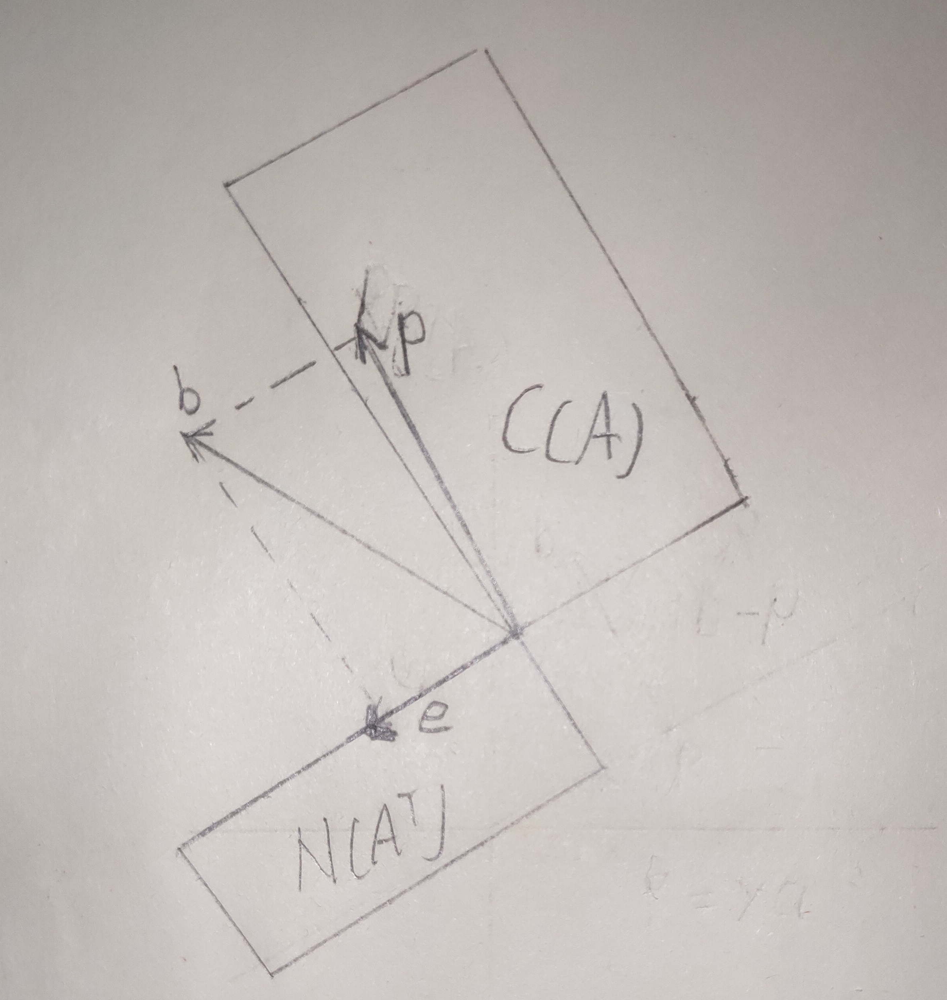
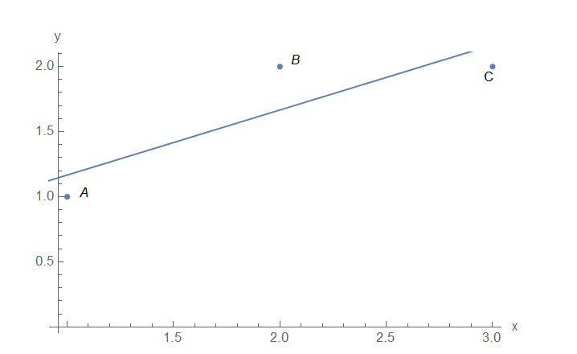
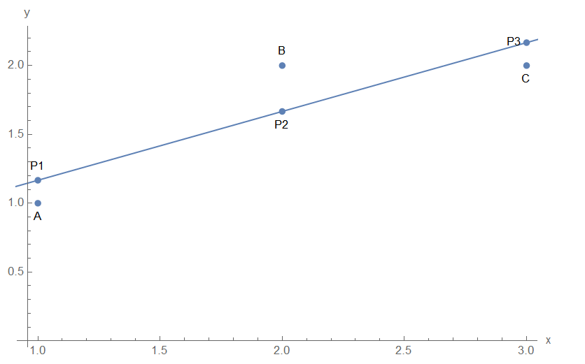
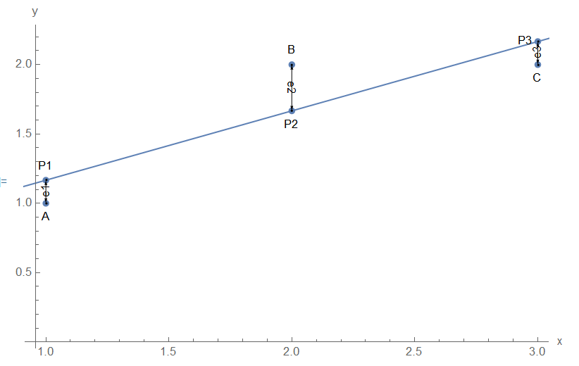

[TOC]

# 投影矩阵,最小二乘法

----------

## 1.投影矩阵

---------------

将一个向量$b$ 投影到矩阵$A$ 的列空间的投影矩阵为
$$
P = A(A^TA)^{-1}A^T
$$

- 当向量$b$ 和列空间正交的时候，$Pb = 0$
- 当向量$b$ 位于列空间时，$Pb = b$

设向量$p$ 为向量$b$ 投影到矩阵$A$ 列空间后的向量，向量$e = b - p$ 和矩阵$A$  的列空间正交，因此向量$e$ 位于矩阵的左零空间中。如下图所示

对于向量$p$ 和向量$e$ 可以通过下列公式算出
$$
p = Pb \\
e = (I-P)b
$$

## 2.最小二乘法

--------------

假设在一个二维坐标系中有三点$A,B,C$ ，坐标分别如下所示。

$$
A=\left[\begin{array}{c} 1\\1 \end{array}\right],B = \left[\begin{array}{c} 2 \\ 2 \end{array}\right],C = \left[\begin{array}{c} 3 \\2 \end{array}\right] 
$$

假设三点在直线$y = C+Dx$ 上，为了求该直线的解析式，列出如下方程
$$
\begin{array}{l}
C+D = 1 \\
C+2D = 2 \\
C+3D = 2 \\
\end{array}
$$

讲上述方程转化为矩阵$Ax = b$ 的形式
$$
\left[\begin{array}{cccc}
1&1 \\
1&2 \\
1&3 \\
\end{array}\right]
\left[\begin{array}{c} C\\D \end{array}\right] = 
\left[\begin{array}{c} 1\\2\\2 \end{array}\right]
$$
通过消元法解该方程，可以很明显的发现该方程无解。也就是说向量$b =\left[\begin{array}{c} 1 \\2\\2 \end{array}\right]$ ，不在矩阵$A = \left[\begin{array}{cccc}1&1\\1&2\\1&3 \end{array}\right]$ 的列空间中。

因此同时过 $A,B,C$ 三点的直线不存在。此时，如何找出最优的一条直线 $y = C+Dx$ ,让这条直线尽可能的拟合 $A,B,C$ 三点。如下所示

从矩阵方程来看$Ax = b$ 无解，设该最优直线为$L$ ，对于该直线，取三个点$p_1,p_2,p_3$ 这三个点都位于直线$L$ 上，并且横坐标上的值分别和点$A,B,C$ 相同，如下图所示。

此时可以得到一个新的方程组 
$$
C+D = p_{1y} \\
C+2D = p_{2y} \\
C+3D = p_{3y} \\
$$
转化为矩阵形式为
$$
\begin{array}{c}
Ax = p \\\\
A = \left[\begin{array}{cccc}
1&1 \\
1&2 \\
1&3 \\
\end{array}\right] ,
p = \left[\begin{array}{c} p_{1y} \\p_{2y}\\p_{3y} \end{array}\right]
\end{array}
$$

该方程一定有解，因为点$p_1,p_2,p_3$ 都在直线$L$ 上，对于向量$b$ ，它和向量$p$ 存在一个差值，记差值为$e = b - p$ ，代入$Ax = p$ 可得
$$
Ax - b = e
$$
向量$e$ 的为$\left[\begin{array}{c} e_1 = 1 -P_{1y}\\e_2 = 2 -P_{2y}\\e_3 = 2 -P_{3y} \end{array}\right] = \left[\begin{array}{c} A_y -P_{1y}\\ B_y-P_{2y}\\C_y -P_{3y} \end{array}\right]$ ，各分量为点$A,B,C$ 和点$p_1,p_2,p_3$ 在纵轴上的差值，如下所示。

想要直线$L$ 最优只需要让向量$e$ 的长度越小，也就是要让向量$b$ 到向量$p$ 的距离最小。因为向量$p$ 有可能是矩阵$A$ 列空间中的任意一向量，因此想要让$e$ 最小，那么向量$p$ 就一定是向量$b$ 在矩阵$A$ 列空间上的投影。

因此向量$p$ 可以通过矩阵$A$ 对应的列空间的投影矩阵来求解，如下所示。
$$
A^TAx = A^Tb
$$
求解的
$$
\left[\begin{array}{cccc}
1&1&1 \\
1&2&3
\end{array}\right]
\left[\begin{array}{cccc}
1&1 \\
1&2 \\
1&3 \\
\end{array}\right]x = 
\left[\begin{array}{cccc}
1&1&1 \\
1&2&3
\end{array}\right]
\left[\begin{array}{c} 1\\2\\2\end{array}\right]
$$
最后求得向量$x = \left[\begin{array}{c} 2/3 \\ 1/2 \end{array}\right]$ ,最优直线$L$ 的解析式为：
$$
y = \frac{2}{3}+\frac{1}{2}x
$$

### 2.1  $A^TA$的可逆性

---------------

如果矩阵$A$  中的列向量是线性无关，那么矩阵$A^TA$ 一定可逆，证明如下。

假设$A^TA$ 可逆
$$
\begin{array}{c}
A^TAx = 0 \\\\
x^TA^TAx = 0 \\\\
(Ax)^TAx = 0 \\\\
y^Ty = 0
\end{array}
$$

对于$y^Ty = 0$ 只有当 $y = 0$ 的时候才成立，由此可知
$$
y = Ax = 0
$$
因为矩阵$A$ 中列向量线性无关因此
$$
x = 0
$$
所以想让$A^TAx = 0$ 那么只有$x = 0$ 一个解，也就是让矩阵 $A$ 中的列向量线性无关。因此只有当矩阵$A$ 可逆，矩阵$A^TA$ 才可逆。