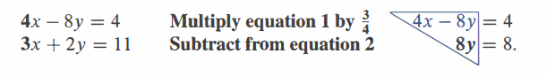
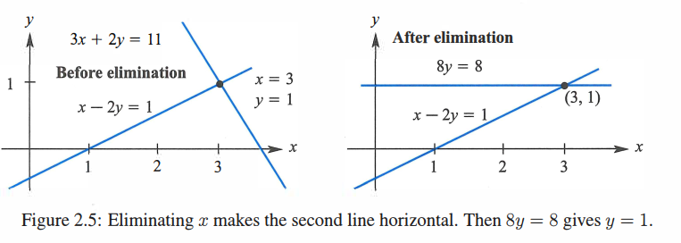
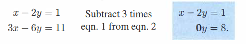
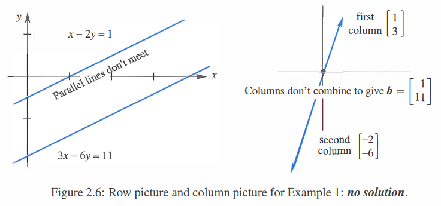
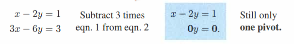
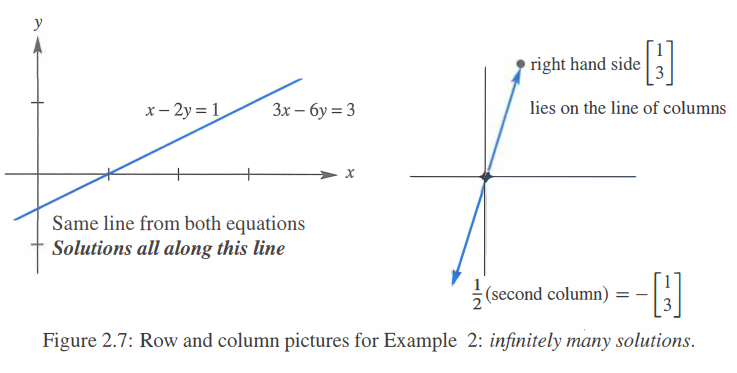

[TOC]

# 方程组的解法 - 矩阵消元

-------------
矩阵的高斯消元法是计算机中常用的一种解方程组的算法，该方法将解方程的步骤离散化。使得在计算机中实现该方法非常简单。

**关键词**

- **增广矩阵 Augment Matrix**

- **行交换  row exchange** 

- **回代 back substitution**

- **消元矩阵 elimination Matrix**

- **左乘和右乘**

- **矩阵乘积顺序不可变，结合律成立但交换律不成立。**

## 1.消元法的步骤

给定一个方程组

$$
\begin{array}{l}
x +2y +z =2 \\\\
3x +8y +z =12 \\\\
4y +z =2
\end{array}
$$

将该方程组转化为矩阵形式为 $Mx = b$ ，如下所示：
$$
\left[ \begin{array}{ccc}
1 & 2 & 1\\
3 & 8 & 1\\
0 & 4 & 1
\end{array} 
\right ]
\left[\begin{array}{c}
x \\
y \\
z
\end{array}\right]
=
\left[\begin{array}{c}
2 \\
12 \\
2
\end{array}\right]
$$

我们将矩阵$M$和向量$b$组合成增广矩阵矩阵$A$

$$
A = 
\begin{bmatrix}
1 & 2 & 1 & 2 \\
3 & 8 & 1 & 12 \\
0 & 4 & 1 & 2 
\end{bmatrix}
$$

接下来，需要将矩阵A中矩阵$M$部分的主对角线下面的元素变为0 (将矩阵$A$ 转变为上三角矩阵) 。也就是说需要将 $A_{21}，A_{31},A_{32}$ 的值变为0。（如果在消元过程中主元变为零，则使用**行交换(row exchange)**，来尝试避免主元为零，如果行交换后主元还是零，则该方程组无解）

想要将 $M_{21} = 0$，只需要  **行2 - 3*行1**。此时矩阵变为：
$$
\left[ \begin{array}{ccc}
1 & 2 & 1 & 2\\
0 & 2 & -2 & 6\\
0 & 4 & 1 & 2
\end{array} 
\right ]
$$

通过观察得知 $A_{31} = 0$ ，接下来只需将$A_{32} = 0$ ，我们只需要  **行3 - 2*行2**。此时矩阵变为：我们叫此时的矩阵记作$U$
$$
U = \left[ \begin{array}{ccc}
1 & 2 & 1 & 2\\
0 & 2 & -2 & 6\\
0 & 0 & 5 & -10
\end{array} 
\right ]
$$

可以用矩阵来表示这些消元步骤：

$A_{10} = 0$ 的矩阵我们记为 $E10$：
$$
E_{21} =
\left[ \begin{array}{ccc}
1 & 0 & 0\\
-3 & 1 & 0\\
0 & 0 & 1
\end{array} 
\right ]
$$

将$A_{32} = 0$的矩阵我们记为$E21$:
$$
E_{21} =
\left[ \begin{array}{ccc}
1 & 0 & 0\\
0 & 1 & 0\\
0 & -2 & 1
\end{array}
\right ]
$$

将上述过程用矩阵来表示为：
$$
E_{32}*E_{21}*A = U
$$

将矩阵$E_{32}，E_{21}$通过矩阵乘法结合在一起，我们可以得到一个新的矩阵$E$ **消元矩阵(elimination Matrix)**.
$$
E =
\left[ \begin{array}{ccc}
1 & 0 & 0\\
-3 & 1 & 0\\
6 & -2 & 1
\end{array}
\right ]
$$
最后上述过程可以表述为：
$$
EA = U
$$
然后再返回去使用矩阵$A$所表示的方程组去解方程，这一过程称为**回代 (back substitution)**，之后方程组就转变为：
$$
x+2y+z = 2
$$

$$
2y-2z = 6
$$

$$
5z = -10
$$

求得
$$
z = -2，y = 1，x = 2
$$
至此整个消元过程结束。

- **消元法中主元不能为零，因为我们在最后的回代求解未知量的过程中需要除以主元**

# 方程组解的情况

##  唯一解

对于方程组

可以看出消元后方程当y = 1时等式成立,该方程组对应的row 图像 和消元后的row图像如下所示

可以看出方程的解并没有改变。

## 无解

对于方程组

上述例子中消元后主元为零，此时y值无论取何值等式都不成立。方程组对应的row和colum图像如下所示

##  无穷解

对于方程组

此时消元后可以看出无论y取什么值等式都成立。方程组的row和colum图像如下所示

# 消元过程中的行交换

-------------------

在进行消元的时候很可能会遇到**主元**为零的情况，此时为了让消元过程继续进行下去就需要进行行交换，来让**主元**不为零。**一个疑问是为什么行交换不会影响最后的解**。

如果只对矩阵进行行交换，那么最后求得的解是不正确得。为了不影响最后求得的解，需要对 $Mx = b$ 中向量$b$也进行相同的行交换。
