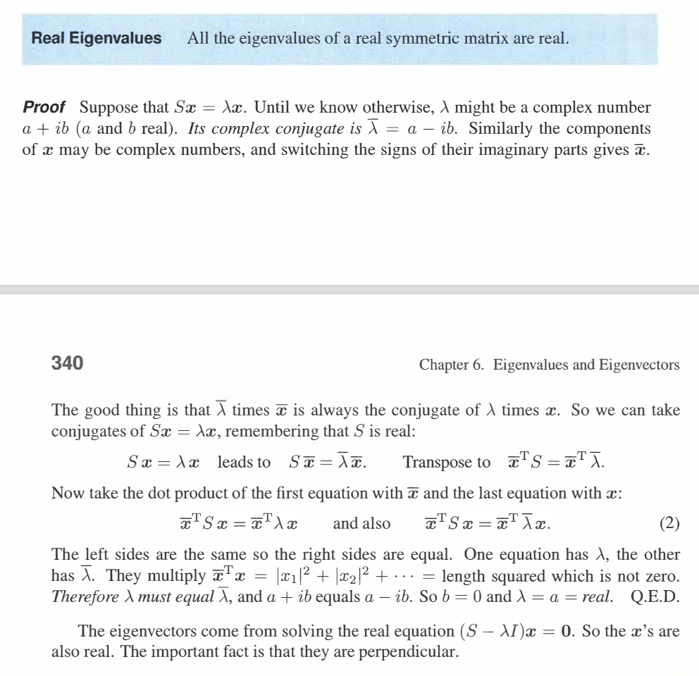
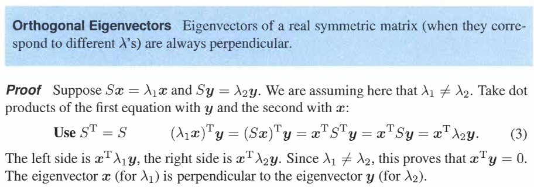

[TOC]

# 对称矩阵和正定矩阵
---------------

## 1.对称矩阵
---------

### 1.1 对称矩阵的特征值和特征向量
--------------

对于元素都是实数的对称矩阵它的特征值和特征向量，满足如下两个特性
- 对称矩阵的特征值为实数
- 对称矩阵的特征向量都是互相垂直的
  

**证明：对称矩阵的特征值为实数**

注意:
- 矩阵$S$ 代表对称矩阵.
- 复数和其对应的共轭复数的乘积为$(a+bi)*(a - bi) = a^2+b^2$ 。
- 当矩阵的特征值为一个复数的时候，该复数的共轭复数一定也是该矩阵的特征值。

  
**证明:对称矩阵的特征向量都是互相垂直的**

  

因为对称矩阵对应的特征向量一定互相垂直，因此将这些特征向量标准化后组成的特征向量矩阵一定是一个正交矩阵。那么堆成矩阵的对角化公式为：
$$
A = Q\Lambda Q^{-1} = Q\Lambda Q^{T}
$$

### 1.2 对称矩阵的特殊性质
---------

对于对称矩阵的对角化
$$
A = Q\Lambda Q^{T} =
\left[ \begin{array}{cccc}
\\
q_1&q_2&.......&q_n \\
\\
\end{array} \right] \left[ \begin{array}{cccc}
\lambda_1&0&....&0 \\
0&\lambda_2&....&0 \\
...&...&...&... \\
0&0&...& \lambda_n
\end{array} \right]
\left[ \begin{array}{c}
    q_1^T\\
    q_2^T\\
    ...\\
    ...\\
    q_n^T
    \end{array}
\right] = \lambda q_1q_1^T+\lambda q_2q_2^T+.......+\lambda q_nq_n^T
$$

其中$q_1,q_2,........,q_n$为一组标准正交向量(**将原来的特征向量标准化，特征向量标准化后还是特征向量**)。因此$q_1q_1^T$ 其实就是列空间$q_1$的投影矩阵。所以对称矩阵可以看成一组投影矩阵的线性组合。

### 1.3 对称矩阵的主元和特征值
------------
对于任意方阵$A$ 特征值和主元一般不太相同。求解矩阵的主元是通过消元，求解特征值是通过求解方程 $\operatorname{det}(A -\lambda I) =0$。一般的特征值和主元 满足如下性质。

**主元的乘积等于特征值的乘积等于矩阵的行列式**

对于对称矩阵除了上述性质以外，还有：

**主元的符号等于特征值的符号，正主元的个数等于正特征值的个数，负主元的个数等于负特征值的个数**

  

## 2.正定矩阵
------------
**对于所有特征值是正数的对称矩阵称为正定矩阵**正定矩阵有以下性质
- 所有特征值为正数
- 所有主元为正数
- 所有子行列式为正数

