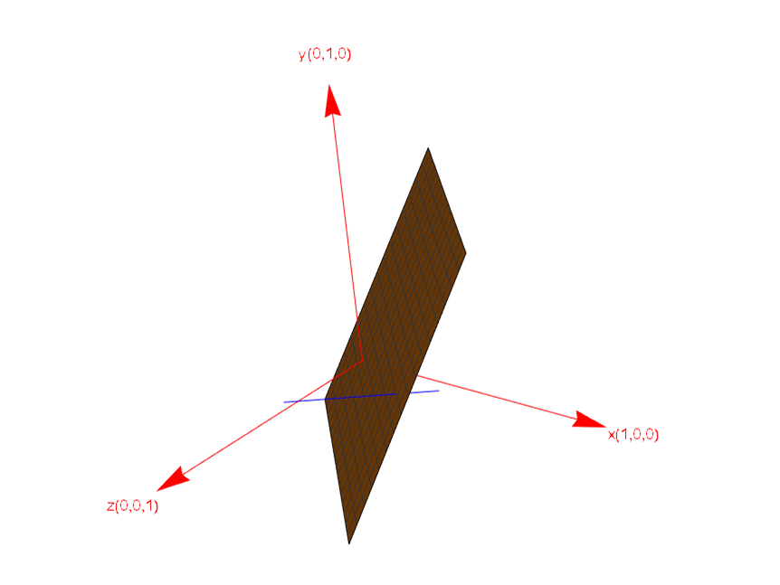

[TOC]

# 转置,置换,向量空间
--------------------

## 1.矩阵的转置

-------------

矩阵的转置就是将矩阵中的行向量变为列向量，使得 
$$
(A^{T})_{ij} = A_{ji} 
$$

如下所示。
$$
\left[\begin{array}{cccc}
2& 3\\
4 & 5\\
6 & 7\\
\end{array}\right]^{T} = 
\left[\begin{array}{cccc}
2 & 4 & 6\\
3 & 5 & 7
\end{array}\right]
$$

### 1.1 矩阵转置的性质

----------------

- **矩阵和其转置矩阵相乘后的结果为一个对称矩阵**

$$
\left[\begin{array}{cccc}
2& 3\\
4 & 5\\
6 & 7\\
\end{array}\right]^{T}
\left[\begin{array}{cccc}
2 & 4 & 6\\
3 & 5 & 7
\end{array}\right] = 
\left[\begin{array}{cccc}
13 & 23 & 33\\
23 & 41 & 59\\
33 & 59 & 85
\end{array}\right]
$$

​		证明：矩阵$R$为一个普通矩阵，$R^{T}$为其转置矩阵

​		对两个矩阵的乘积进行转置有：
$$
(R^{T}R)^{T} = R^{T}R^{TT} = R^{T}R \\
(R^{T}R)^{T} = R^{T}R
$$
​		可以看出对乘积后的结果矩阵进行转置结果不变，所以矩阵$R^TR$为一个对称矩阵。

### 1.2 矩阵转置几何上的意义
-----------
矩阵的置换会让一个矩阵的行空间变为矩阵的列空间，列空间变为行空间,让零空间变为左零空间，左零空间变为零空间

$$
\left[\begin{array}{cccc}
\textcolor{Red}2& \textcolor{Red}3\\
4 & 5\\
6 & 7\\
\end{array}\right]^{T} = 
\left[\begin{array}{cccc}
\textcolor{Red}2 & 4 & 6\\
\textcolor{Red}3 & 5 & 7
\end{array}\right]
$$

----------------------------

## 2.置换矩阵(Permutation Matrix)

--------------------
置换矩阵的作用是交换一个矩阵中的行或者是列。**左乘置换矩阵式交换行，右乘置换矩阵是交换列**，置换矩阵的每行和每列只有一个1，其他地方的元素为0，并且一定为方阵。

考虑在左乘规则下，所有3x3的置换矩阵如下所示，$P_{xxx}$的下标表示矩阵$P_{xxx}$作用后各行的位置。

  

$$
\begin{array}{c}
P_{123} = I = \left[\begin{array}{cccc}
1 & 0 & 0 \\
0 & 1 & 0 \\
0 & 0 & 1
\end{array}\right] ,
P_{213}  = \left[\begin{array}{cccc}
0 & 1 & 0 \\
1 & 0 & 0 \\
0 & 0 & 1
\end{array}\right],
P_{321} = \left[\begin{array}{cccc}
0 & 0 & 1 \\
0 & 1 & 0 \\
1 & 0 & 0
\end{array}\right] \\ 
\\ P_{132} = \left[\begin{array}{cccc}
1 & 0 & 0 \\
0 & 0 & 1 \\
0 & 1 & 0
\end{array}\right],
P_{231} =\left[\begin{array}{cccc}
0 & 1 & 0 \\
0 & 0 & 1 \\
1 & 0 & 0
\end{array}\right],
P_{312} = \left[\begin{array}{cccc}
0 & 0 & 1 \\
1 & 0 & 0 \\
0 & 1 & 0
\end{array}\right]
\end{array}
$$

  

对于$3x3$形式的置换矩阵有6个，对于4x4 形式的置换矩阵则有24个，$nxn$置换矩阵的数量 = $n !=1 \times 2 \times 3 \times \cdots(n-1) n$，将单位矩阵的每一行进行排列。

### 2.1置换矩阵的性质

----------------

- **置换矩阵之间的任意乘积，仍为置换矩阵**

- **置换矩阵的逆等于置换矩阵的转置**
- **置换矩阵一定是方阵**

------------------------------------

## 3.向量空间

------------------

向量空间是线性代数中的一个非常重要的一个概念。存在许多向量空间例如 $R^{n}...........R^{3},R^{2},R^{1}$,它们分别表示n维空间，3维空间，2维空间，1维空间，并且这些空间中自己的一组向量，这些向量的分量都为实数。如果向量的分量都是复数则这些向量在对应的$C^{n}......C^{3},C^{2},C^{1}$向量空间中。

### 3.1 向量空间的性质

----------------

- **每一个向量空间都包含零向量**

- **向量空间对线性组合封闭，向量空间中的向量进行线性组合后，肯定还是在该向量空间中**

- **每一个向量空间的零向量都是该向量空间的子空间**

  

### 3.2 向量空间的子空间

-----------------

一个向量空间中可能存在子空间，这些子空间同样也遵守向量空间的性质。一些子空间的例子如下。

$R^{2}$**的子空间**

- $R^{2}$本身

- 零向量
- 过零点的直线

$R^{3}$**的子空间**

- $R^{3}$本身
- 零向量
- 过零点的直线
- 过零点的平面

#### 3.2.1 向量空间的并集和交集

---------------

假设在三维向量空间$R^{3}$中在两个子空间$P,L$。它们分别为过原点的平面和过原点的直线。

**并集情况**

取两个子空间的并集，$P \cup L$.表示一组向量，这组向量中的向量既可以在子空间$P$或者是子空间$L$中，也可以同时在子空间$P$和$L$中。那么这一组向量是否可以构成一个新的子空间呢？

很明显这一组向量是不能构成一个子空间的，直线中的某一向量和平面中的某一向量通过线性组合可以构成两者之外的向量。

**交集情况**

取两个子空间的交集$P\cap L$，$P\cap L$表示一组向量。这组向量同时属于子空间$P$和子空间$L$，那么这一组向量是否可以构成一个新的子空间呢？

假设向量$u,v$是在$P \cap L$中任意的一组向量。它们的线性组合为$au + bv$。

因为$u \in P$  且 $v \in P$,所以$(au + bv) \in P$，

又因为 $u \in L$，且 $v \in L$，所以$(au + bv) \in L$

因为$(au + bv) \in P$ 且 $(au + bv) \in L$，所以可以得出$(au+bv) \in (P \cap L)$

**根据上面的证明可以得出两个子空间交集仍为子空间**，上图中的平面和直线的交集为零点。零向量为$R^{3}$的一个子空间。

  

### 3.3 向量空间和矩阵

--------------

#### 3.3.1矩阵的列空间(Column Space)

----------------

假设存在矩阵$A = \left[\begin{array}{cccc}1 & 4 \\2 & 4 \\3 & 1 \end{array}\right]$，该矩阵中的列向量分别为$\left[\begin{array}{c} 1 \\ 2 \\ 3 \end{array}\right],\left[\begin{array}{c} 4 \\ 4 \\ 1 \end{array}\right]$，这些列向量的线性组合可以组成一个向量空间记作$C(A)$，该向量空间为$R^{3}$的一个子空间。$C(A)$被称为矩阵$A$的列空间。

#### 3.3.2使用矩阵的列空间理解Ax = b

--------------------

设$A = \left[ \begin{array}{cccc} 1&1&2\\ 2& 1&3 \\ 3& 1&4\\ 4&1&5 \end{array} \right]$ ,x = $\left[ \begin{array}{c} x \\ y \\ z \end{array}\right]$，b = $\left[\begin{array}{c} b_{1} \\ b_{2} \\ b_{3} \end{array}\right]$ ，它们存在如下几个关系

$$
Ax = b =\left[ \begin{array}{cccc} 1&1&2\\ 2& 1&3 \\ 3& 1&4\\ 4&1&5 \end{array} \right]\left[ \begin{array}{c} x \\ y \\ z \end{array}\right] =\left[\begin{array}{c} b_{1} \\ b_{2} \\ b_{3} \end{array}\right]
$$

向量$x$起到对矩阵$A$的列向量进行线性组合的作用,那么想要$Ax = b$有解，当且仅当向量$b$在矩阵$A$的列空间中。

#### 3.3.3 列向量的独立性

------------------

设矩阵$A = \left[ \begin{array}{cccc} 1&1&2\\ 2& 1&3 \\ 3& 1&4\\ 4&1&5 \end{array} \right]$ ，可以发现三个列向量存在如下关系
$$
\left[ \begin{array}{c} 1 \\ 2 \\ 3 \\ 4 \end{array}\right] +
\left[ \begin{array}{c} 1 \\ 1 \\ 1  \\ 1\end{array}\right] = 
\left[ \begin{array}{c} 2 \\ 3 \\ 4 \\ 5 \end{array}\right]
$$
在构成矩阵的列空间时向量$\left[ \begin{array}{c} 2 \\ 3 \\ 4 \\ 5 \end{array}\right]$毫无作用，矩阵$A$的列空间由向量$\left[ \begin{array}{c} 1 \\ 2 \\ 3 \\ 4 \end{array}\right]$和向量$\left[ \begin{array}{c} 1 \\ 1 \\ 1  \\ 1\end{array}\right]$构成，这时候列向量$\left[ \begin{array}{c} 1 \\ 2 \\ 3 \\ 4 \end{array}\right]$和$\left[ \begin{array}{c} 1 \\ 1 \\ 1  \\ 1\end{array}\right]$为矩阵$A$的**主列**并且互相独立的。

#### 3.3.4 矩阵的零空间(Null Space)

------------------

设$A = \left[ \begin{array}{cccc} 1&1&2\\ 2& 1&3 \\ 3& 1&4\\ 4&1&5 \end{array} \right]$ ,x = $\left[ \begin{array}{c} x \\ y \\ z \end{array}\right]，b = \left[ \begin{array}{c} 0 \\ 0 \\ 0\\0 \end{array}\right]$

矩阵$A$的零空间表示为使方程$Ax = 0$成立时，向量$x$组成的向量空间。记作$N(A)$。

$$
\left[ \begin{array}{cccc} 1&1&2\\ 2& 1&3 \\ 3& 1&4\\ 4&1&5 \end{array} \right]\left[ \begin{array}{c} x \\ y \\ z \end{array}\right] = \left[ \begin{array}{c} 0 \\ 0 \\ 0\\0 \end{array}\right]
$$

此处要让方程成立只需要让$x = c\left[ \begin{array}{c} 1 \\ 1 \\ -1 \end{array}\right]$,c为任意实数。很明显向量$x$的所有解可以构成一个过原点的直线，很明显这条直线为 向量空间$R^{3}$的一个子空间。

**PS：那么对应任意的向量$b$，对应的向量$x$ ,$Ax = b$ 的解 $x$ 是否可以构成一个子空间呢？**

​		答案是否定的，因为向量$x$的解可能不包含零向量。

