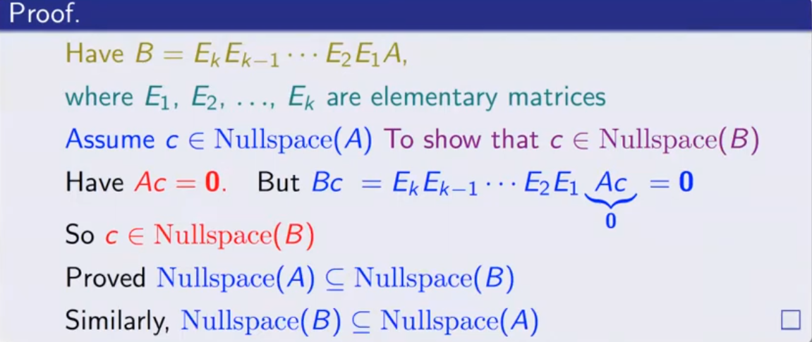
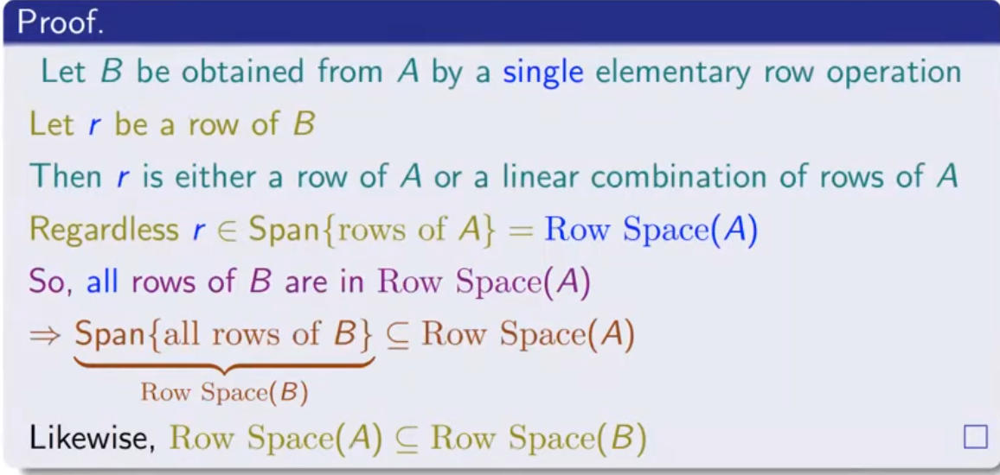

- [1.什么是初等行变换矩阵](#1什么是初等行变换矩阵)
- [2. 两个矩阵的行等价(row equivalence)](#2-两个矩阵的行等价row-equivalence)
- [3.初等行变换对矩阵子空间的影响](#3初等行变换对矩阵子空间的影响)
  - [3.1 初等行变换不影响矩阵的零空间](#31-初等行变换不影响矩阵的零空间)
  - [3.2 初等行变换不影响矩阵的行空间](#32-初等行变换不影响矩阵的行空间)
  - [3.3 初等行变换可能影响矩阵的列空间](#33-初等行变换可能影响矩阵的列空间)
  - [3.4 初等行变换可能影响矩阵的左零空间](#34-初等行变换可能影响矩阵的左零空间)
- [4.行等价矩阵之间列向量独立的对应关系](#4行等价矩阵之间列向量独立的对应关系)
- [相关链接](#相关链接)

# 1.什么是初等行变换矩阵

矩阵的初等行变换包括以下三种操作：

- 交换两行：可以交换矩阵中的任意两行的位置。

- 数乘一行：将矩阵的某一行乘以一个非零常数。

- 行加法：将矩阵的某一行加上另一行的一个倍数，并将结果放回到原来的行中。

我们可以将这些初等行变换用矩阵的形式进行表示，这些变换在进行消元和求解线性方程组时经常出现。

# 2. 两个矩阵的行等价(row equivalence)

两个mxn矩阵 $A, B$, 如果可以通过一系列的初等行变换使得矩阵$A$变为矩阵$B$即

$$
B = E_kE_{k-1}....E_2E_1A
$$

那么我们可以说矩阵$A$行等价矩阵$B$

同理，我们也可以通过同样的方式得出矩阵$B$行等价矩阵$A$

$$
A = E_1^{-1}E_2^{-1}....E_{k-1}^{-1}E_k^{-1}B
$$

因此矩阵$A$与矩阵$B$互为行等价矩阵

# 3.初等行变换对矩阵子空间的影响

## 3.1 初等行变换不影响矩阵的零空间

证明

## 3.2 初等行变换不影响矩阵的行空间

证明

根据上述过程，我们可以用同样的方式证明对应两次初等行变换的矩阵$B$和矩阵$A$行空间的一致性。

## 3.3 初等行变换可能影响矩阵的列空间

对于矩阵

$$
A = \begin{bmatrix}
1 & 1 & 3 & 4\\
0 & -1 & 1 & 1 \\
2 & 3 & 5 & 7
\end{bmatrix}
$$

将其消元成简化行阶梯矩阵后

$$
R = rref A = \begin{bmatrix}
1 &0 & 4 & 5 \\ 
0 & 1 & -1 & -1\\
0 & 0 & 0 & 0
\end{bmatrix}
$$

可以很容易的看出矩阵$A$和矩阵$R$的列空间是不同的，因为向量 $\begin{bmatrix} 1 \\ 0 \\ 2 \end{bmatrix}$ 在矩阵$A$的列空间中但是却不在矩阵$R$的列空间中。

## 3.4 初等行变换可能影响矩阵的左零空间

因为矩阵的列空间和矩阵的左零空间是互相正交的，所以初等行变换有可能改变矩阵的左零空间

# 4.行等价矩阵之间列向量独立的对应关系

假设矩阵$A$和矩阵$B$同为$mxn$矩阵，并且它们互为行等价(row equivalence)矩阵

对于矩阵$A = [c_1, c_2, ... \, , c_n]$ 和矩阵$B = [c_1^{\prime}, c_2^{\prime}, ... \, , c_n^{\prime}]$，如果矩阵$A$中一组向量线性无关，那么矩阵$B$中对应序号上的一组向量同样线性无关。

证明:

矩阵$A$中列向量的线性组合为 $a_1c_1 + a_2c_2 + ... + a_nc_n$, 表示为$Ad$ ,向量$d = \begin{bmatrix} a_1 \\ a_2 \\ .\\.\\.\\ a_n \end{bmatrix}$, 如果矩阵$A$中的向量$c_1, c_2, c_n$互相独立,我们让它们之外的列向量对应的线性组合系数为零，即向量$d = \begin{bmatrix} a_1 \\ a_2 \\ 0 \\ . \\ 0\\ a_n \end{bmatrix}$

因为向量$c_1, c_2, c_n$独立，所以只有当向量 $d = 0$ 时才有$Ad = 0$ 成立，此时向量$d$处于矩阵$A$的零空间，而两个行等价矩阵的零空间是相同的，那么我们可以得出对于矩阵$B$当其余列向量的线性组合系数为零时，只有当$a_1, a_2, a_n$都为零时才有$Bd = 0$成立

即矩阵$B$中向量 $c_1^{\prime}, c_2^{\prime}  , c_n^{\prime}$ 也为一组独立(线性无关)向量

# 相关链接

- [LA37 What do Elementary Row Operations do to Row Space, Column Space, and Nullspace of a matrix?
](https://www.youtube.com/watch?v=ms7pELFVqWY&t=2108s)