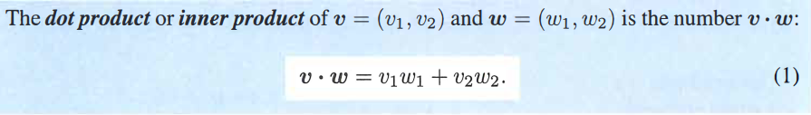
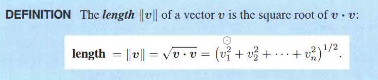
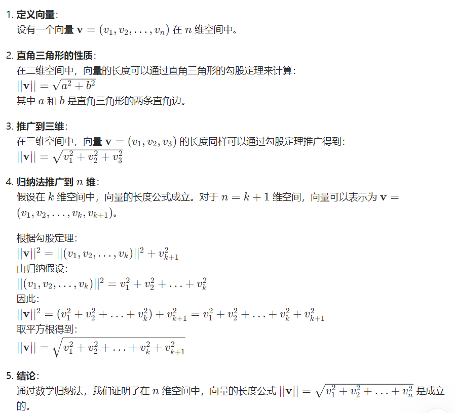
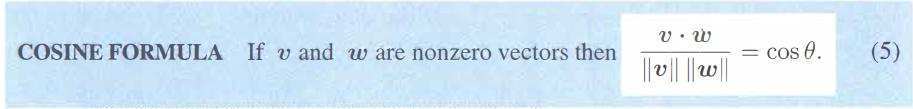
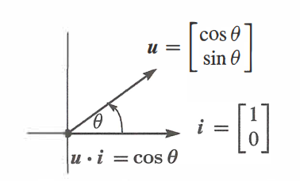
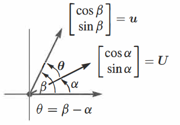
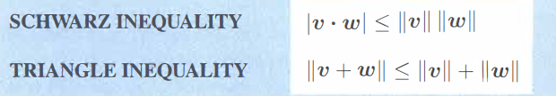

<!-- markdown-toc GFM -->

* [向量运算](#向量运算)
* [向量的表示方法](#向量的表示方法)
* [向量的点乘](#向量的点乘)
* [向量的外积](#向量的外积)
* [向量长度和单位向量](#向量长度和单位向量)
* [两个向量之间的夹角](#两个向量之间的夹角)
* [两个向量的不等式](#两个向量的不等式)

<!-- markdown-toc -->

# 向量运算
- 加法
- 数乘
- 线性组合

# 向量的表示方法
- 两个数字 
- 从原点开始的箭头
- 空间中的点

# 向量的点乘

- 两个向量点乘为零意味着两个向量互相垂直
- 向量的点乘是可交换的
- 行向量乘以列向量
- 点乘又被称为向量的内积(inner product)

# 向量的外积

- 列向量乘以行向量
- 外积的结果为一个矩阵$(n \times 1)(1 \times n) = (n \times n)$

# 向量长度和单位向量

证明:

**单位向量即为长度为1的向量,即 $\mathbf{v} \cdot \mathbf{v} = 1$**

# 两个向量之间的夹角

**当两个向量互相垂直时，它们的点乘为0**

证明：
假设两个向量$\mathbf{v}, \mathbf{w}$互相垂直，那么它们就组成了一个直角三角形。它们分别对应了直角三角形的两条直角边$a, b$，对于斜边$c$则有：
$$||\mathbf{v}||^2 + ||\mathbf{w}||^2 = ||\mathbf{v - w}||^2$$
即:
$$(v_1^2 + v_2^2) + (w_1^2 + w_2^2) = (v_1 - w_1)^2 + (v_2 - w_2)^2$$
化简后得:
$$0 = -2v_1w_1 - 2v_2w_2$$
即
$$v_1w_1 + v_2w_2 = 0$$
刚好为向量$\mathbf{v}, \mathbf{w}$ 的点乘，因此可以证明两个向量互相垂直时，它们的点乘为0

对于向量的夹角我们有:

证明：
假设存在两个单位向量$\mathbf{u}, \mathbf{i}$，如下图所示：

它们的点乘为:

$$\mathbf{u} \cdot \mathbf{i} = \cos{\theta}$$

当我们将这两个向量旋转$\alpha$角后，我们使用如下两个向量表示它们：

它们的点乘为:

$$\cos{\alpha} \cos{\beta} + \sin{\alpha} \sin{\beta} = \cos{(\beta - \alpha)} = \cos{\theta}$$

因此$\mathbf{u} \cdot \mathbf{U} = \cos{\theta}$, 当两个向量都不是单位向量时，我们只需将它们单位化即可，因此可以证明：

$$
\frac {\mathbf{v} \cdot \mathbf{w}}{||\mathbf{v}||\, ||\mathbf{w}||} = \cos{\theta}
$$

- 通过向量点乘的正负可以快速判断向量夹角的范围,当点乘为负时夹角为钝角,当为正时夹角为锐角, 0为直角.

# 两个向量的不等式

通过三角形的遵循的原则以及向量的余弦定理

$$
\frac {\mathbf{v} \cdot \mathbf{w}}{||\mathbf{v}||\, ||\mathbf{w}||} = \cos{\theta}
$$

我们可以很容易得到两个不等式

