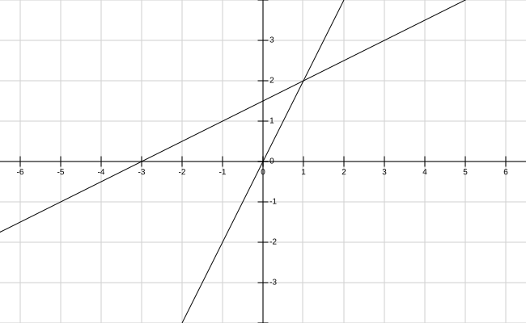
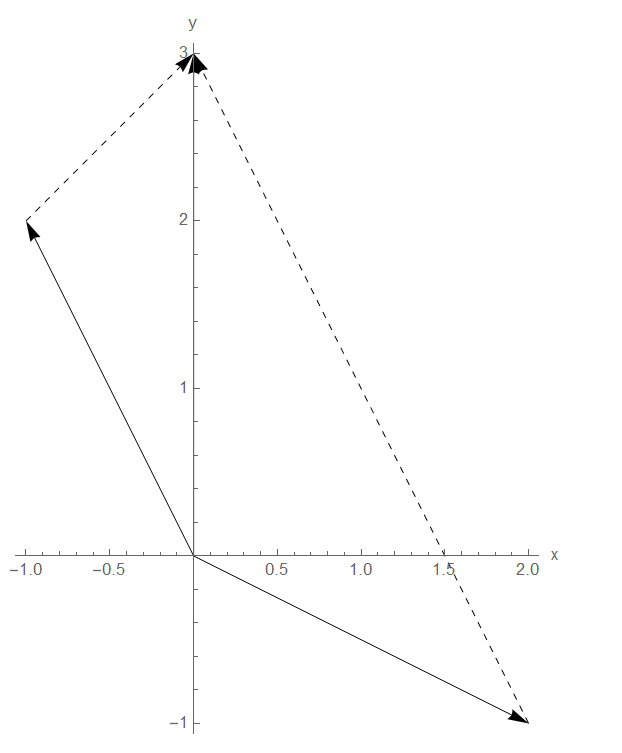

<!-- markdown-toc GFM -->

* [方程组的几何解释](#方程组的几何解释)
    * [1.方程的行图像(Row Picture)](#1方程的行图像row-picture)
    * [2.方程的列图像(Column Picture)](#2方程的列图像column-picture)
    * [3.方程的矩阵形式](#3方程的矩阵形式)

<!-- markdown-toc -->

# 方程组的几何解释

假如有两个方程组，并且有两个未知量。**方程组的主要目的是求解未知量，也就是说只要最后能将未知量求出来，将方程组改写成任意形式都是可行的。或者是将该问题转化成另一种问题。**
$$
2x - y = 0 \\
-x+2y = 3
$$

## 1.方程的行图像(Row Picture) 

将方程组按行的顺序来进行观察，在坐标系上绘制出两个方程的图像。**此时可以将问题看成求两条直线的交点**，如下所示。它们的交点为(1,2)。$x = 1,y = 2$ 就是上述方程组的解。

## 2.方程的列图像(Column Picture)

将方程组按列的方式来进行观察，则可以将方程组转换成如下向量的线性组合形式。

$$2x - y = 0$$ 
$$-x+2y = 3$$

转化为：
$$
x\left[\begin{array}{c}
2 \\
-1
\end{array}\right]+y\left[\begin{array}{c}
-1 \\
2
\end{array}\right]=\left[\begin{array}{c}
0 \\
3
\end{array}\right]
$$
这个时候问题就转化为 向量$\left[\begin{array}{c}2\\-1\end{array}\right]$ 和向量$\left[\begin{array}{c}-1\\2\end{array}\right]$ 如何通过线性组合组合出向量 $\left[\begin{array}{c}0\\3\end{array}\right]$ 。可以得出$x = 1,y = 2$

用图像来表示如下所示。

## 3.方程的矩阵形式

我们也可以使用矩阵的形式来表示上述方程组。
$$
\left[\begin{array}{cc}
 2 & -1 \\
-1  & 2 \\

\end{array}\right]\left[\begin{array}{c}
x \\
y \\

\end{array}\right] = \left[\begin{array}{c}
0 \\
3 \\
\end{array}\right]
$$

它可以理解为矩阵行向量和向量$\left[\begin{array}{c} 0 \\ 3 \\ \end{array}\right]$ 的点乘或者是矩阵列向量的线性组合

