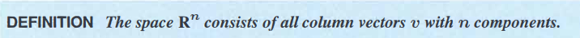
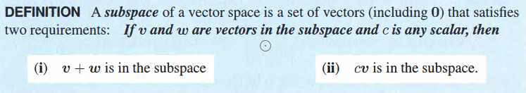
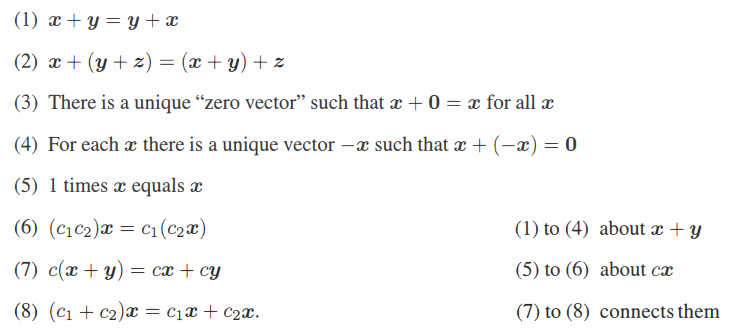

[TOC]

# 1.向量空间

------------------

向量空间是线性代数中的一个非常重要的一个概念。存在许多向量空间例如 $R^{n}...........R^{3},R^{2},R^{1}$,它们分别表示n维空间，3维空间，2维空间，1维空间，并且这些空间中的向量的分量都为实数。如果向量的分量都是复数则这些向量在对应的$C^{n}......C^{3},C^{2},C^{1}$向量空间中。

向量空间的定义为

## 1.1 向量空间的性质

----------------

- **每一个向量空间都包含零向量**

- **向量空间对线性组合封闭，向量空间中的向量进行线性组合后，还是在该向量空间中**

- **每一个向量空间的零向量都是该向量空间的子空间**

  

## 1.2 向量空间的子空间

-----------------

子空间的定义为

一个向量空间中可能存在子空间，这些子空间同样也遵守向量空间的性质。一些子空间的例子如下。

$R^{2}$**的子空间**

- $R^{2}$本身
- 零向量
- 过零点的直线

$R^{3}$**的子空间**

- $R^{3}$本身
- 零向量
- 过零点的直线
- 过零点的平面

**每个子空间都包含零向量**

## 1.3 向量空间的并集和交集

---------------

假设在三维向量空间$R^{3}$中在两个子空间$P,L$。它们分别为过原点的平面和过原点的直线。

**并集情况**

取两个子空间的并集，$P \cup L$.表示一组向量，这组向量中的向量既可以在子空间$P$或者是子空间$L$中，也可以同时在子空间$P$和$L$中。那么这一组向量是否可以构成一个新的子空间呢？

很明显这一组向量是不能构成一个子空间的，直线中的某一向量和平面中的某一向量通过线性组合可以构成两者之外的向量。

**交集情况**

取两个子空间的交集$P\cap L$，$P\cap L$表示一组向量。这组向量同时属于子空间$P$和子空间$L$，那么这一组向量是否可以构成一个新的子空间呢？

假设向量$u,v$是在$P \cap L$中任意的一组向量。它们的线性组合为$au + bv$。

因为$u \in P$  且 $v \in P$,所以$(au + bv) \in P$，

又因为 $u \in L$，且 $v \in L$，所以$(au + bv) \in L$

因为$(au + bv) \in P$ 且 $(au + bv) \in L$，所以可以得出$(au+bv) \in (P \cap L)$

**根据上面的证明可以得出两个子空间交集仍为子空间**，上图中的平面和直线的交集为零点。零向量为$R^{3}$的一个子空间。

## 1.4 构成向量空间的八个基本条件

  

# 2.矩阵的四个基本子空间

## 2.1 矩阵的列空间(Column Space)

----------------

矩阵中所有列向量线性组合所形成的空间被称为矩阵的列空间, 记作$C(A)$

- mxn矩阵的列向量处于$R^m$空间中，因此矩阵的列空间是$R^m$的子空间，而不是$R^n$的子空间

### 2.2.1 列向量的独立性

------------------

设矩阵$A = \left[ \begin{array}{cccc} 1&1&2\\ 2& 1&3 \\ 3& 1&4\\ 4&1&5 \end{array} \right]$ ，可以发现三个列向量存在如下关系
$$
\left[ \begin{array}{c} 1 \\ 2 \\ 3 \\ 4 \end{array}\right] +
\left[ \begin{array}{c} 1 \\ 1 \\ 1  \\ 1\end{array}\right] = 
\left[ \begin{array}{c} 2 \\ 3 \\ 4 \\ 5 \end{array}\right]
$$
在构成矩阵的列空间时向量$\left[ \begin{array}{c} 2 \\ 3 \\ 4 \\ 5 \end{array}\right]$毫无作用，矩阵$A$的列空间由向量$\left[ \begin{array}{c} 1 \\ 2 \\ 3 \\ 4 \end{array}\right]$和向量$\left[ \begin{array}{c} 1 \\ 1 \\ 1  \\ 1\end{array}\right]$构成，这时候列向量$\left[ \begin{array}{c} 1 \\ 2 \\ 3 \\ 4 \end{array}\right]$和$\left[ \begin{array}{c} 1 \\ 1 \\ 1  \\ 1\end{array}\right]$为矩阵$A$的**主列**并且互相独立的。

## 2.2 矩阵的零空间(Null Space)

------------------

设$A = \left[ \begin{array}{cccc} 1&1&2\\ 2& 1&3 \\ 3& 1&4\\ 4&1&5 \end{array} \right]$ ,x = $\left[ \begin{array}{c} x \\ y \\ z \end{array}\right]，b = \left[ \begin{array}{c} 0 \\ 0 \\ 0\\0 \end{array}\right]$

矩阵$A$的零空间表示为使方程$Ax = 0$成立时，向量$x$组成的向量空间。记作$N(A)$。

- **那么对应任意的向量$b$，对应的向量$x$ ,$Ax = b$ 的解 $x$ 是否可以构成一个子空间呢？**
    - 答案是否定的，因为向量$x$的解可能不包含零向量。
- **对于一个mxn矩阵它的零空间处于$R^n$, 因此矩阵的零空间为$R^n$的一个子空间**
