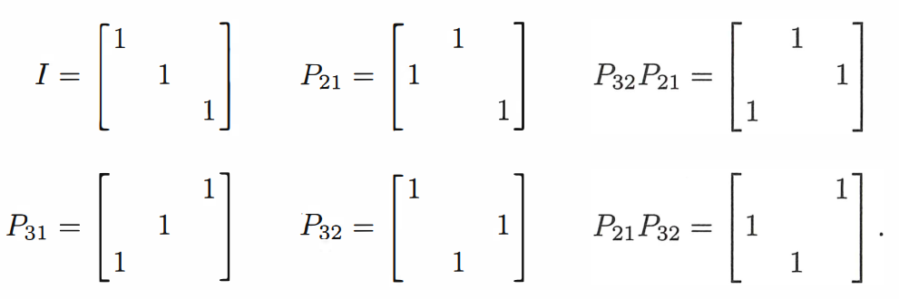

- [对称矩阵](#对称矩阵)
  - [对称矩阵的定义](#对称矩阵的定义)
  - [对称矩阵的性质](#对称矩阵的性质)
  - [对称矩阵的$LDL^T$分解](#对称矩阵的ldlt分解)
- [置换矩阵](#置换矩阵)
  - [置换矩阵的定义](#置换矩阵的定义)
  - [置换矩阵的性质](#置换矩阵的性质)
- [秩1矩阵](#秩1矩阵)
- [矩阵的秩1矩阵分解](#矩阵的秩1矩阵分解)

# 对称矩阵

------------

## 对称矩阵的定义

对称矩阵是指一个方阵（即行数和列数相同），其转置矩阵等于其自身的矩阵即$S^T = S$。这意味着其中的元素$S_{ij} = S_{ji}$

-----------

## 对称矩阵的性质

- **对称矩阵的逆矩阵仍为对称矩阵**

证明: 

对于$S^{-1}$ ，因为$S^T = S$ ，所以可以改写成$S^{-1} = (S^T)^{-1}$ 由矩阵转置的性质我们可以改写成

$$
S^{-1} = (S^{-1})^T
$$

所以可以得出矩阵$S$的逆矩阵为对称矩阵

- 

  

## 对称矩阵的$LDL^T$分解

当不涉及行交换的时候，对称矩阵$S$的LDU分解中矩阵$U$为矩阵$L$ 的转置即

$$
    U = L^T
$$

此时对称矩阵的LDU分解可以改写为

$$
    S = LDL^T
$$

# 置换矩阵

--------------------------

## 置换矩阵的定义

置换矩阵是一种特殊的方阵，其特点是每一行和每一列都恰好有一个元素为1，其余元素为0。置换矩阵的作用是交换矩阵中的行或列(取决于乘法的顺序)

nxn大小的置换矩阵可以通过对nxn大小的单位矩阵的行向量进行排列来得出，以3x3的置换矩阵为例

-------------------

## 置换矩阵的性质

- **置换矩阵的逆矩阵为其转置**
- **n维的置换矩阵的数量为$n!$**
- **所有置换矩阵都为正交矩阵**

-----------------

# 秩1矩阵

对于秩为1的矩阵我们可以将其看成一个列向量乘以行向量的形式，如下所示

$$\begin{bmatrix}2&3&7&8\\2a&3a&7a&8a\\2b&3b&7b&8b\end{bmatrix}=\begin{bmatrix}1\\a\\b\end{bmatrix}\begin{bmatrix}2&3&7&8\end{bmatrix}=\boldsymbol{uv}^\mathrm{T}$$

----------- 

# 矩阵的秩1矩阵分解

以秩为2的矩阵为例，设矩阵$A$秩为2，它的简化行阶梯矩阵为$R$对应的消元矩阵为$E$,因为矩阵$E$必然可逆,设其逆矩阵为$C = E^{-1}$ 此时矩阵$A$可以表示为 $A = CR$

$$\quad A=\left[\begin{array}{ccc}1&0&3\\1&1&7\\4&2&20\end{array}\right]=\left[\begin{array}{ccc}1&0&0\\1&1&0\\4&2&1\end{array}\right]\left[\begin{array}{ccc}1&0&3\\0&1&4\\0&0&0\end{array}\right]=CR.$$

其中矩阵$R$只有两个非零行向量，矩阵$C$中前两个列向量为矩阵$A$前两个列向量，这是因为简化行阶梯的秩为2并且前两个列向量为标准单位向量。

因此我们可以将秩为2的矩阵分解为两个秩1矩阵之和

$$\left.A=\left[\begin{array}{ccc}\\u_{1}&u_{2}&u_{3}\\\\\end{array}\right.\right]\left[\begin{array}{c}v_{1}^{\mathrm{T}}\\v_{2}^{\mathrm{T}}\\\mathrm{zero~row}\end{array}\right]=u_{1}v_{1}^{\mathrm{T}}+u_{2}v_{2}^{\mathrm{T}}=(\mathrm{rank~1})+(\mathrm{rank~1}).$$

类似的秩为n的矩阵也可以分解为n个秩1矩阵之和