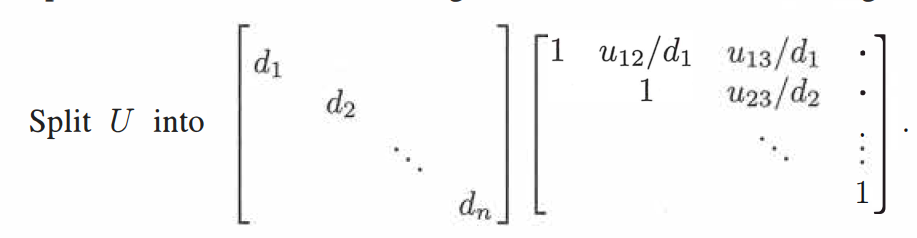

<!-- markdown-toc GFM -->

* [矩阵A的LU分解](#矩阵a的lu分解)
    * [不存在行交换的LU分解](#不存在行交换的lu分解)
    * [存在行交换的LU分解](#存在行交换的lu分解)
* [矩阵的LDU分解](#矩阵的ldu分解)
* [矩阵LU分解的性质](#矩阵lu分解的性质)

<!-- markdown-toc -->

#  矩阵A的LU分解

在线性代数中，LU分解(LU Factorization) 是矩阵分解的一种，可以将一个矩阵分解为一个单位下三角矩阵和一个上三角矩阵的乘积(有时候还需要乘以一个置换矩阵)。其原理为高斯消元法,LU分解主要应用在数值分析中，用来解线性方程、或计算行列式。

## 不存在行交换的LU分解

假设存在可逆矩阵$A$。
$$
A = 
\left[\begin{array}{cccc}
2 & 1 \\
8 & 7
\end{array}\right]
$$

通过高斯消元法可以将矩阵$A$转化成一个上三角矩阵$U$
$$
EA = U =
\left[\begin{array}{cccc}
1 & 0 \\
-4 & 1
\end{array}\right]
\left[\begin{array}{cccc}
2 & 1 \\
8 & 7
\end{array}\right] = 
\left[\begin{array}{cccc}
2 & 1 \\
0 & 3
\end{array}\right]
$$
其中 $E = \left[\begin{array}{cccc}1 & 0 \\-4 & 1\end{array}\right]$，$U =\left[\begin{array}{cccc}2 & 1 \\0 & 3\end{array}\right]$ ，$E$为消元矩阵，一定可逆，且为单位下三角矩阵。等号左边和右边各左乘矩阵$E$的逆矩阵 $E^{-1}$可得
$$
A = E^{-1}U =
\left[\begin{array}{cccc}
2 & 1 \\
8 & 7
\end{array}\right] = 
\left[\begin{array}{cccc}
1 & 0 \\
4 & 1
\end{array}\right]
\left[\begin{array}{cccc}
2 & 1 \\
0 & 3
\end{array}\right]
$$

因为$E^{-1}$为一个单位下三角矩阵，将$E^{-1}$记作$L$可得
$$
A = LU
$$

由此一个可逆矩阵可以被分解为一个单位下三角矩阵和一个上三角矩阵的乘积。

  

## 存在行交换的LU分解

当矩阵$A$在进行消元的时候，需要进行行交换(Row Exchange)。此时的LU分解就变为
$$
PA = LU
$$
矩阵$P$为置换矩阵，矩阵$L$为单位下三角矩阵，矩阵$U$为上三角矩阵。等号左右两边左乘矩阵$P$的逆矩阵可得。
$$
A =P^{-1}LU
$$
因为 矩阵$P$为置换矩阵，所以其转置矩阵就为其逆矩阵$P^{-1} = P^{T}$，可得
$$
A =P^{T}LU
$$

**只有在行交换之后，矩阵中主元(Pivot)才不为0，高斯消元法才可以正确进行。**

# 矩阵的LDU分解

将矩阵进行LU分解后,我们可以进一步将矩阵$U$分解为一个对角矩阵和一个上三角矩阵的乘积. 如下图所示。

因此我们可以将矩阵$A$更进一步的分解为

$$
A = LDU
$$

# 矩阵LU分解的性质

- 下三角矩阵$L$中包含每个消元矩阵对用的消元系数
- 上三角矩阵$U$中对角线元素为其主元
- 矩阵的LU分解本质上就是高斯消元法，而高斯消元法并没有改变矩阵的行空间。因为矩阵$U$中的行向量为原本行向量的线性组合

