<!-- markdown-toc GFM -->

* [矩阵的基本运算](#矩阵的基本运算)
* [对于矩阵$A$与向量$x$ 的乘法 $Ax$的两种理解形式](#对于矩阵a与向量x-的乘法-ax的两种理解形式)
* [矩阵乘法的四种表达形式](#矩阵乘法的四种表达形式)
    * [点积形式](#点积形式)
    * [行形式](#行形式)
    * [列形式](#列形式)
    * [矩阵之和形式](#矩阵之和形式)
* [矩阵的转置](#矩阵的转置)
    * [矩阵的和，积，逆的转置](#矩阵的和积逆的转置)
    * [矩阵转置的性质](#矩阵转置的性质)
    * [1.2 矩阵转置几何上的意义](#12-矩阵转置几何上的意义)
* [矩阵的逆](#矩阵的逆)
    * [矩阵及其逆矩阵的性质](#矩阵及其逆矩阵的性质)
    * [通过Gauss-Jordan消元法求解逆矩阵](#通过gauss-jordan消元法求解逆矩阵)

<!-- markdown-toc -->

# 矩阵的基本运算
- 加法
    - 可交换,可结合
    - 两个矩阵的维度必须相等
- 乘法
    - 可结合,不可交换
    - 相乘的两个矩阵的维度必须满足$(m \times n)(n \times p) = (m \times p)$
- 乘方
    - 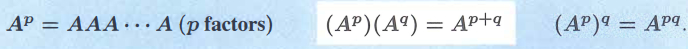
    - 当指数为0时为单位矩阵
    - 当指数为-1时为其逆矩阵

# 对于矩阵$A$与向量$x$ 的乘法 $Ax$的两种理解形式

1. **矩阵中的行向量与向量$x$点乘**

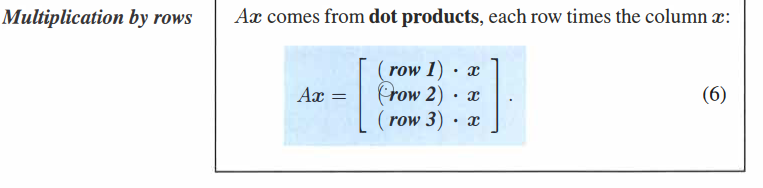

2. **矩阵中的列向量的线性组合**

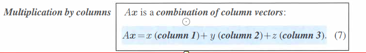

# 矩阵乘法的四种表达形式

## 点积形式

矩阵$AB$中的元素等于矩阵$A$的行向量乘以矩阵$B$的列向量

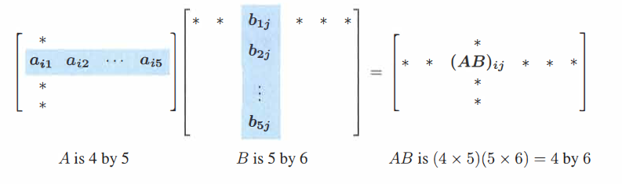

## 行形式

矩阵$AB$中的每一行都等于矩阵$A$中对应的行乘以矩阵$B$.(即矩阵B的行向量的线性组合)

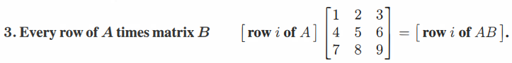

## 列形式

矩阵$AB$中的每一列都等于矩阵$A$乘以矩阵$B$中对用的列.(即矩阵$A$中列向量的线性组合)

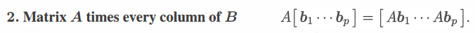

## 矩阵之和形式

矩阵$AB$等于矩阵$A$中的每个列向量乘以矩阵$B$对应的行向量所得矩阵之和

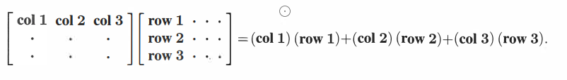

# 矩阵的转置

矩阵的转置就是将矩阵中的行向量变为列向量，使得 

$$
\left[\begin{array}{cccc}
2& 3\\
4 & 5\\
6 & 7\\
\end{array}\right]^{T} = 
\left[\begin{array}{cccc}
2 & 4 & 6\\
3 & 5 & 7
\end{array}\right]
$$

矩阵转置后元素的位置如下所示,

$$
(A^{T})_{ij} = A_{ji} 
$$

## 矩阵的和，积，逆的转置

对于矩阵的和，积，逆进行转置，我们有如下的性质

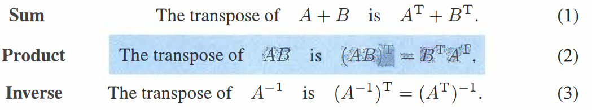

证明1: 
略

证明2：

对于$(AB)^T$先考虑$B$为向量的情况，此时$AB$可以改写为$Ax$。此时$Ax$意味着矩阵$A$中列向量关于向量$x$的线性组合.
而对于$x^TA^T$则意味着对矩阵$A^T$中行向量关于向量$x^T$的线性组合. 而矩阵$A^T$中的行向量就是矩阵$A$的列向量，因此我们可以看出这两个线性组合是一致的
所以我们可以得出

$$
(AB)^T = B^TA^T
$$

对于$B$为一个矩阵的情况, 此时矩阵$B$可以表示为$\begin{bmatrix} x_1 & x_2 &...& x_n \end{bmatrix}$ 对于$(AB)^T$中的每一个向量都和上面的同理，因此等式也成立。

证明3:

对于逆矩阵$A^{-1}$我们有 $AA^{-1} = I$ 通过等式2我们有 $(AA^{-1})^T = (A^{-1})^TA^T = I$, 由此我们可以推断出矩阵$(A^{-1})^T$ 为矩阵$A^T$的逆矩阵(当矩阵$A$可逆时，它的转置必然可逆)因此有

$$
    (A^{-1})^T = (A^T)^{-1}
$$

## 矩阵转置的性质

- **矩阵和其转置矩阵相乘后的结果为一个对称矩阵**

$$
\left[\begin{array}{cccc}
2& 3\\
4 & 5\\
6 & 7\\
\end{array}\right]^{T}
\left[\begin{array}{cccc}
2 & 4 & 6\\
3 & 5 & 7
\end{array}\right] = 
\left[\begin{array}{cccc}
13 & 23 & 33\\
23 & 41 & 59\\
33 & 59 & 85
\end{array}\right]
$$

​		证明：矩阵$R$为一个普通矩阵，$R^{T}$为其转置矩阵

​		对两个矩阵的乘积进行转置有：
$$
(R^{T}R)^{T} = R^{T}R^{TT} = R^{T}R \\
(R^{T}R)^{T} = R^{T}R
$$
​		可以看出对乘积后的结果矩阵进行转置结果不变，所以矩阵$R^TR$为一个对称矩阵。

## 1.2 矩阵转置几何上的意义

矩阵的置换会让一个矩阵的行空间变为矩阵的列空间，列空间变为行空间,让零空间变为左零空间，左零空间变为零空间

$$
\left[\begin{array}{cccc}
\textcolor{Red}2& \textcolor{Red}3\\
4 & 5\\
6 & 7\\
\end{array}\right]^{T} = 
\left[\begin{array}{cccc}
\textcolor{Red}2 & 4 & 6\\
\textcolor{Red}3 & 5 & 7
\end{array}\right]
$$

# 矩阵的逆

矩阵存在逆矩阵意味着，存在一个矩阵使得
$$
A^{-1}A = I \; and \; AA^{-1} = I
$$

成立

## 矩阵及其逆矩阵的性质

- 矩阵必须为方阵
    - 因为使得 $A^{-1}A = I \; and \; AA^{-1} = I$ 成立，所以矩阵$A$必然为方阵。
- 当且仅当矩阵的n个主元不为零时逆矩阵才存在
    - 通过高斯消元法求解逆矩阵的过程可知，最后都需要除以主元。因此主元不能为零 
- 矩阵不能有两个不同的逆矩阵
    - 证明：假设有 $BA = I$ 以及 $AC = I$ 可得 $B(AC) = (BA)C$ 可以得到$BI = IC$ 即 $B = C$
- 如果矩阵$A$可逆，那么方程 $Ax = b$ 只有唯一解
    - 证明：因为 $Ax = b$ 所以有 $x = A^{-1}b$ 因为矩阵的逆矩阵唯一所以该乘积结果唯一。得证
- 如果存在非零向量$x$使得$Ax = 0$，那么矩阵$A$不可逆
    - 证明：假设$A$可逆，那么对于方程 $Ax = 0$ 有唯一解 $x = A^{-1} 0 = 0$ 为零，与假设矛盾所以矩阵$A$不可逆

## 通过Gauss-Jordan消元法求解逆矩阵

设存在矩阵$A$, Gauss-jordan消元法通过构建增广矩阵$[A \, I]$ 然后通过消元(乘以消元矩阵)使其转化为$[I \, A^{-1}]$来求得矩阵$A$的逆矩阵。

假设矩阵$A$为$\begin{bmatrix} 2 & -1 & 0 \\ -1 & 2 & -1 \\ 0 & -1 & 2 \end{bmatrix}$ ,则消元步骤如下所示

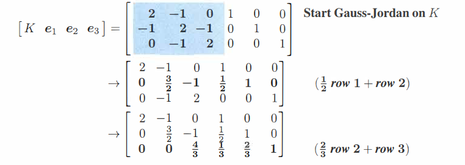

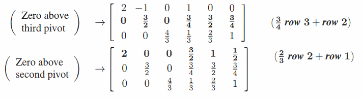

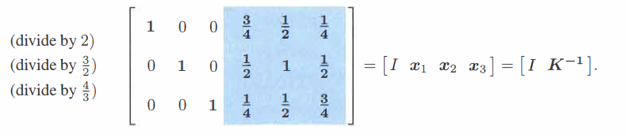

