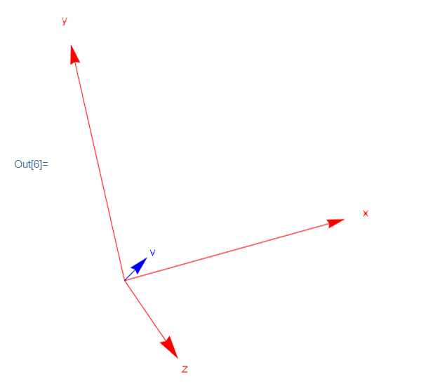

<!-- markdown-toc GFM -->

- [线性相关 ,秩,基,维数](#线性相关-秩基维数)
  - [1. 矩阵的秩(Rank)](#1-矩阵的秩rank)
  - [2.线性相关](#2线性相关)
    - [2.1 线性相关的定义](#21-线性相关的定义)
  - [3. 向量空间的基(base)](#3-向量空间的基base)
    - [3.1 从几何上去理解基](#31-从几何上去理解基)
    - [3.2 向量空间基的性质](#32-向量空间基的性质)
  - [4.向量空间的维数](#4向量空间的维数)

<!-- markdown-toc -->

# 线性相关 ,秩,基,维数

---------------

## 1. 矩阵的秩(Rank)

-----------

$mxn$矩阵中主元的个数被称为矩阵的秩(rank)，记作$r$
$$
r<= m \\
r<= n
$$
**当矩阵的秩$r = n<m$时**

- $Ax = b$ 只有0或1个解
- 矩阵的简化行阶梯矩阵的形式为$\left[\begin{array}{cccc} I \\ 0\end{array}\right]$

**当矩阵的秩$r = m<n$时**

- $Ax = b$ 有无穷个解
- 矩阵的简化行阶梯矩阵的形式为$\left[\begin{array}{cccc} I & F\end{array}\right]$

**当矩阵的秩$r < m<n$时**

- $Ax = b$ 有0或者无穷个解
- 矩阵的简化行阶梯矩阵的形式为$\left[\begin{array}{cccc} I & F \\ 0& 0\end{array}\right]$

**当矩阵的秩$r = m=n$时**

- $Ax = b$ 只有1个解
- 矩阵的简化行阶梯矩阵的形式为$\left[\begin{array}{cccc} I & F \\ 0& 0\end{array}\right]$

​	**想要理解以上的关系就必须从向量空间以及列向量的线性组合上去思考，例如在$r = n<m$的情况中。矩阵中的列向量都对生成该矩阵的列空间起到作用，那么如果有解就一定只会有1个解。但是该矩阵形成的列空间只是列向量存在的$m$维空间的一个子空间，所以就可能出现无解的情况**

-------------------------

## 2.线性相关

### 2.1 线性相关的定义

----------------------
设存在一个向量组$x_1,x_2,x_3 ,............. ,x_n$，该向量组中所有向量的线性组合为
$$
n_1x_1+n_2x_2+n_3x_3+.............+n_nx_n
$$
**一般定义**

- 在向量组中向量的所有线性组合中，除了零组合外，如果不存在结果为零向量的组合。那么该向量组是**线性无关**的。

- 在向量组中向量的所有线性组合中，除了零组合外，存在结果为零向量的组合。那么该向量组是**线性相关**的。

**其他定义**

- 当向量组组成的矩阵$\left[\begin{array}{cccc} x_1&x_2&x_3& ..........&x_n \end{array}\right]$ 的零空间只有零向量的时候，该向量组是**线性无关**的，否则该向量组是**线性相关**的。

- 当向量组组成的矩阵$\left[\begin{array}{cccc} x_1&x_2&x_3& ..........&x_n \end{array}\right]$ 中存在自由列时，该向量组是**线性相关**的，否则为**线性无关**。

- 当向量组组成的$mxn$矩阵$\left[\begin{array}{cccc} x_1&x_2&x_3& ..........&x_n \end{array}\right]$ 中矩阵的秩$r = n$，那么该向量组是 **线性无关**，否则为**线性相关**

  

## 3. 向量空间的基(base)

------------

向量空间的基是指一个向量组，它们有两个性质。

- **该向量组是线性无关的**
- **该向量组中的向量能生成整个空间**

### 3.1 从几何上去理解基

---------------

向量空间的基最为本质的性质为，向量空间中的所有向量都可以通过该向量空间的基的线性组合来得到。

例如在$R^{3}$空间中，该空间中最容易找到的基为$\left[\begin{array}{c} 1\\0\\0 \end{array}\right],\left[\begin{array}{c} 0\\1\\0 \end{array}\right],\left[\begin{array}{c} 0\\0\\1 \end{array}\right]$这三个向量符合上述性质，并且它们的线性组合能够得到$R^3$空间中所有的向量。每一个向量都能表示成如下形式,例如$R^3$ 中的向量$v = (1,1,1)$

$$
v = 1\left[\begin{array}{c} 1\\0\\0 \end{array}\right]+1\left[\begin{array}{c} 0\\1\\0 \end{array}\right]+1\left[\begin{array}{c} 0\\0\\1 \end{array}\right]
$$
将上述的表示简化后就是向量$v$的坐标
$$
v = (1,1,1)
$$
在$R^3$中的表现形式如下所示：

### 3.2 向量空间基的性质

----------------

- **基向量都是线性无关的**
- **每一个向量空间中基向量的个数都等于向量空间的维数**
- **如果矩阵为方阵，当矩阵中向量为该矩阵列空间的基向量时，该矩阵可逆**

---------------------

## 4.向量空间的维数

-------------

设有 $mxn$ 矩阵$A$,矩阵列向量的个数为 $n$，矩阵列空间的维数记作为$dim(C(A)) = r$，矩阵零空间的维数则为$dim(N(A)) = n - r$。**矩阵零空间的维数等于矩阵自由列的个数**

设矩阵$A = \left[ \begin{array}{cccc} 1&2&3&1\\1&1&2&1\\1&2&3&1 \end{array} \right]$，可以简单的看出该矩阵的主列向量有2个为别为$\left[\begin{array}{c} 1\\1\\1 \end{array}\right],\left[\begin{array}{c} 2\\1\\2 \end{array}\right]$ 这两个列向量通过线性组合可以构成矩阵的列空间。另外该矩阵的零空间的特解有两个分别为$\left[\begin{array}{c} -1\\-1\\1\\0 \end{array}\right],\left[\begin{array}{c} -1\\0\\0\\1 \end{array}\right]$ ，有几个自由列，矩阵零空间的特解就有几个，并且特解之间是线性无关的。

因此可以得出$dim(N(A)) = n - r$

