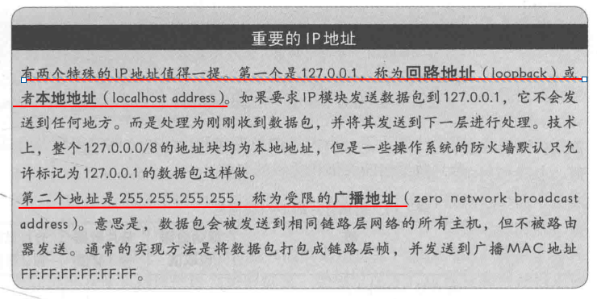
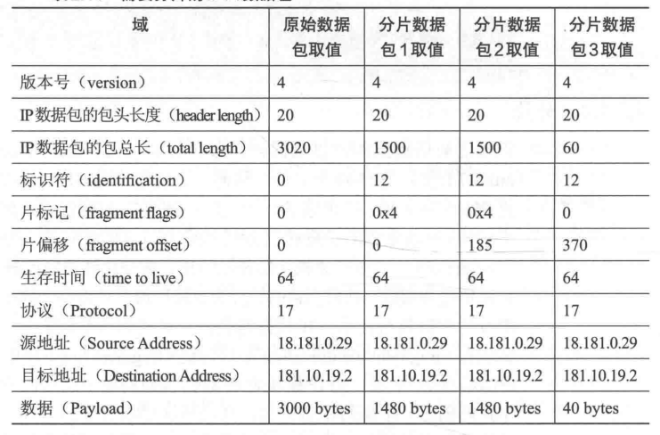

# 网络基础知识

<!-- markdown-toc GFM -->

* [TCP/IP 模型](#tcpip-模型)
* [OSI 七层模型](#osi-七层模型)
* [寻址](#寻址)
    * [MAC 地址](#mac-地址)
    * [IPv4地址](#ipv4地址)
    * [IPv6地址](#ipv6地址)
    * [端口](#端口)
* [数据的封装](#数据的封装)
    * [链路层的以太网帧](#链路层的以太网帧)
    * [IPv4 数据包结构](#ipv4-数据包结构)
    * [UDP数据报](#udp数据报)
    * [TCP报文段(segment)](#tcp报文段segment)
* [子网](#子网)
    * [子网掩码](#子网掩码)
    * [特殊的IP地址](#特殊的ip地址)
    * [无类别域间路由](#无类别域间路由)
* [分片](#分片)
* [协议](#协议)
    * [链路层](#链路层)
    * [网络层](#网络层)
    * [传输层](#传输层)
    * [应用层](#应用层)
* [TCP 协议的可靠传输](#tcp-协议的可靠传输)
    * [建立链接 - 三次握手](#建立链接---三次握手)
    * [关闭链接 - 四次挥手](#关闭链接---四次挥手)
    * [数据传输](#数据传输)
    * [超时重传](#超时重传)
    * [快速重传](#快速重传)
    * [延迟确认](#延迟确认)
    * [流量控制](#流量控制)
    * [拥塞控制](#拥塞控制)
    * [Nagle's 算法](#nagles-算法)

<!-- markdown-toc -->

## TCP/IP 模型

- 链路层
    - 数据传输单位称为帧
    - 定义主机的唯一表示方法(例如以太网协议中的MAC 地址), 方便数据对接收方进行编址
    - 定义帧的格式, 包括目的地址的格式和所传输数据的格式
    - 定义帧的长度, 以便确定上层每一次传输所能发送的数据大小
    - 定义一种将帧转换为电子信号的物理方法,以便数据可以具体的线路进行传输, 并被接收方接收
    - 链路层的通信是不可靠的
- 网络层
    - 负责路由以及把数据包发送给目标网络或主机。从而实现两台远程主机之间的通信。
- 传输层
    - 实现主机上单独进程之间的通信
- 应用层
    - 负责向用户提供应用程序，比如HTTP、FTP、Telnet、DNS、SMTP等, 实际编写代码的地方

## OSI 七层模型

当然在理论上，还有一个OSI七层模型：物理层、数据链路层、网络层、传输层、会话层、表示层和应用层。这是一个理想模型，由于其复杂性并没有被大家广泛采用。

## 寻址

### MAC 地址

MAC 地址中的前24比特叫做**组织唯一标识符 OUI** 是由 IEEE给厂家分配的唯一代码后24比特是由厂家自己分配的, 来保证所生产的硬件是唯一标识.

MAC地址 `FF:FF:FF:FF:FF:FF` 被称为广播地址, 表示同时向局域网中的所有主机都发送该帧

### IPv4地址

IPv4 协议的核心是IP地址。IPv6的IP地址是32比特数字，通常以点分十进制来表示例如 `128.125.253.146`

### IPv6地址

IPv6的IP地址长度是128比特，可以写成由冒号分割的8组数字。有三种格式来表示IPv6地址如下所示。

IPv6地址的前64比特表示网络，称为网络前缀，后64比特表示个体主机，称为接口ID。通常来说接口ID自动设置为网卡的64比特EUI，因为已经保证了它的唯一性。

### 端口

端口是传输层的概念, 端口是16比特的无符号数，是一台特定主机的通信端点，使用传输层模块时，一个进程绑定一个特定的端口。每一个传输层的协议只能注册一个端口号，端口号 1024-49151称为用户端口或者时注册端口。端口号 0 - 1023 称为系统端口或者时预留端口，只允许root级别的进程才能绑定系统端口. 端口 49152 - 65535 称为动态端口，任何进程使用它们都是公平的。

## 数据的封装

### 链路层的以太网帧

- 对于每个数据包, 其前导序列和帧开始标志都是一样的, 包含十六进制 `0x55 0x55 0x55 0x55 0x55 0x55 0x55 0xD5`,  它是一个二进制模式用来帮助底层硬件同步和准备接收到来的帧.
- 帧长度/类型域: 标识帧的长度或者类型, 当表示帧长度时, 它指定了帧中数据部分的字符数. 当表示帧类型时, 它包含了一个以太网类型, 唯一标识了用于解释数据的协议.
- 帧检验序列(FCS): 是由两个地址域, 帧长度/类型域, 数据域以及其他填充信息生成的循环冗余检验值
- 以太网一次传输中所能传递的数据部分的最大容量被称为最大传输单元(MTU)为 1500 字节, 最小为46字节

### IPv4 数据包结构

- 版本号: 长度4比特, 标识目前采用的IP协议的版本号. 对于IPV4其值为4
- IP包头长度: 描述IP包头的长度, 以4个字节为单位. IP包头最大为60个字节, 最小为20个字节
- 服务类型: 用于从拥塞控制到差异化服务识别的各种目的.
- IP包总长: 以字节为单位计算的IP数据包的长度. 包括头部和数据部分. 最大值为65535字节
- 片标识符, 片标记, 片偏移: 用于重组分片数据包.
- 生存时间(TTL): 用于限制数据包转发的次数
- 头部检验和: 用于IPv4头部的正确性检测. 仅仅针对头部数据, 数据部分的完整性由上层来保证.

### UDP数据报

- 数据包长度： 指报头和数据部分在内的总字节数
- 检验和：由UDP包头，数据部分和IP头的某些域计算得到。是一个可选项，如果不做计算，其值为零，如果底层验证了数据这个域可以被忽略。

### TCP报文段(segment)

- 序列号：一个单调递增的数字。通过TCP所传输的每个字节都有一个连续的序列号，用于这个字节的唯一标识。这样发送方可以标记所放松的数据，接收方可以确认。报文段的序列号是本报文段所发送的数据的第一个字节的序号。有一个列外是建立初始链接的时候。
- 确认号：包含发送方期望收到的下一个字节的序列号。对所有序列号低于这个数字的数据做一个实际的确认。主机期望收到的下一个字节的序列号通常比刚刚收到的前一个字节的序列号多1.
- 数据偏移：表示以32比特为单位的TCP头部大小。TCP允许头部的最后添加一些可选的头部元素，所以头部开始到报文段可以取值从20到64字节。
- 控制位：关于头部的元数据
- 接收窗口：表示对于传入的数据， 剩余缓冲空间的最大容量用于流量控制
- 紧急指针：表示TCP段数据的第一个字节和紧急数据的第一个字节之间的距离。只有在控制位中URG标志设置了时才有效。

## 子网

子网是IP地址与子网掩码做按位与运算后结果相同的一群主机， 所以子网可以通过子网掩码和网络地址定义。

子网中由两个地址是保留的一个是网络地址，为子网中任意IP地址与子网掩码按位与操作的结果，另一个是广播地址，由子网掩码按位非操作的结果与网络地址按位或运算得到，即网络地址中不能定义子网的二进制位都设置位1.

### 子网掩码

子网掩码是一个32比特数， 通常写成以英文句号分割的4个8比特数字，与IP地址的标识方法一样. 

### 特殊的IP地址

### 无类别域间路由

用来简化网络地址和子网掩码的表示方法, 子网表示为它的网络地址后跟一个斜杆接子网掩码的有效位数例如
网络地址为 `18.19.100.0` , 子网掩码为 `255.255.255.255` 的子网 使用无类别域间路由表示为 `18.19.100.0/24`

## 分片

如果IP模块要传输的IP数据包比链路层的最大传输单元大，它就要被分割成一些数据包的长度为链路层最大传输单元的小片段。接收到分片数据包的主机必须等接收到该组所有的分片数据包之后才能将重建的数据包传输给上层。

IP分片数据包与普通的IP数据包类型，只需要头部设置一些值，即使用片标识符，片标记，片偏移这三个域。

- 片标识符： 标识原始的数据包，同一组被拆分的分片数据包被标记相同的值
- 片偏移：以8个字节为单位， 表明该IP数据包从开始到属于这个分片数据包的位置
- 片标记：除了最后一个片段的所有分片数据包都设置为 `0x4` 称为 `MF` 表示还有更多的分片数据包。最后一个分片数据包不需要这个标记设置为零

*一个被分为三份的数据包如下所示*

## 协议

### 链路层

- 以太网：以太网不是一个协议而是基于以太网蓝皮书的一组协议，用于光纤，双绞线或者铜电缆上进行数据传输。引入了 MAC地址等相关概念
- ARP(地址解析协议)协议: 用于查询IP地址对应的MAC地址, 构建它们之间的映射关系表

### 网络层

- IPv4 协议: 定义了一个为每台主机单独标识的逻辑寻址系统，引入了IP地址，子网等相关概念
- IPv6 协议: IPv4 协议的改良版解决了IP地址不足的问题，和一些IPv4协议的低效率问题

### 传输层

- UDP协议: 封装树并将其从一台主机的端口发送到另一台主机的端口, 通信的两台主机之间没有共享状态，UDP不提供堵塞网络的流量限制服务，不保证数据顺序传输和准确到达。
- TCP协议: 在两台主机之间创建持久性的链接, 提供可靠的数据流传输。TCP保证所有的数据都按序抵达接收方。

### 应用层

- DHCP协议：用于给子网中的每一台主机分配唯一的IPv4地址
- DNS协议：用于讲域名和子域名翻译为IP地址，为了讲域名翻译为IP地址，浏览器会向名称服务器的IP地址发送一个DNS查询，该IP地址是已经在计算机上配置号的。名称服务器存储域名和IP地址之间的映射。如果被查询的名称服务器不是该区域的权威服务器，它通常有一个指针指向一个更权威的名称服务器接着查询，第二次查询的结果通常被缓存，以便下一次可以马上回答这个域名的查询。DNS协议的查询和响应通常通过UDP协议发送，使用端口号53.

## TCP 协议的可靠传输

TCP可靠数据传输的流程图

因为TCP策略涉及重新发送数据和跟踪期望的序列号, 所以每一台主机必须维护所有活跃TCP链接的状态，如下所示。

### 建立链接 - 三次握手

三次握手的流程如下所示，握手成功后这个链接中就包含两个独立的数据流。

### 关闭链接 - 四次挥手

当TCP报文段包含一个SYN或者FIN标志时，序列号会额外的加1，有时被称为TCP幻影字节

### 数据传输

当没有报文丢失时, 数据传输流程如下所示。

### 超时重传

TCP协议要求在发送端每发送一个报文段，就启动一个定时器并等待确认信息；接收端成功接收新数据后返回确认信息。若在定时器超时前数据未能被确认，TCP就认为报文段中的数据已丢失或损坏，需要对报文段中的数据重新组织和重传。为了重新发送这个报文段，TCP模块必须存储发送出去的每一个字节，直到这个字节已经被接收方确认收到。

### 快速重传

TCP保证数据按序到达，如果接收到的数据报的序列号不是所期望的，它有两个选择，一个是直接丢弃这个数据报等待按序重传，另一个是缓存该数据报，同时不确认该报文，也不转发给应用层处理。等到这个序列号之前的所有报文抵达后，主机再确认这个乱序的数据报，并发送到应用层处理，而不需要发送方重传。

- 当一个报文段丢失时，会等待一定的超时周期然后才重传分组，增加了端到端的时延。
- 当一个报文段丢失时，在其等待超时的过程中，可能会出现这种情况：其后的报文段已经被接收端接收但却迟迟得不到确认，发送端会认为也丢失了，从而引起不必要的重传，既浪费资源也浪费时间。

幸运的是，由于TCP采用的是累计确认机制，即当接收端收到比期望序号大的报文段时，便会重复发送最近一次确认的报文段的确认信号，我们称之为冗余ACK（duplicate ACK）。
如图所示，报文段1成功接收并被确认ACK 2，接收端的期待序号为2，当报文段2丢失，报文段3失序到来，与接收端的期望不匹配，接收端重复发送冗余ACK 2。

这样，如果在超时重传定时器溢出之前，接收到连续的三个重复冗余ACK（其实是收到4个同样的ACK，第一个是正常的，后三个才是冗余的），发送端便知晓哪个报文段在传输过程中丢失了，于是重发该报文段，不需要等待超时重传定时器溢出，大大提高了效率。这便是快速重传机制。

### 延迟确认

延迟确认指的是接收方在收到数据后，不用马上响应确认。而是等待500毫秒，如果500毫秒内再次接收到对应连续的报文段那么主机只需要发送最后的那个报文段的ACK

1. 这样做的目的是ACK是可以合并的，也就是指如果连续收到两个TCP数据段，并不一定需要ACK两次，只要回复最终的ACK就可以了，可以降低网络流量。

2. 如果接收方有数据要发送，那么就会在发送数据的TCP数据包里，带上ACK信息。这样做，可以避免大量的ACK以一个单独的TCP包发送，减少了网络流量。

### 流量控制

TCP 链接允许一次由多个未被确认的报文段同时传输。但是不得不限制报文段的数量，因为当传输层数据抵达主机，将存储在主机的缓冲区中，直到绑定在相应端口的进程来处理它。到那时，数据将从缓冲区中删除。但是缓冲区的大小是有限的。在一个很慢的CPU上的一个复杂进程处理数据的速度赶不上数据到达的速度，这时缓冲区将被填满，传入的数据会被丢弃。TCP遇到这种情况，很有可能大部分的重传数据再一次被丢弃，因为接收主机使用同样慢的CPU，运行相同复杂的进程，这将导致网络拥塞。
TCP的流量控制为了防止一台快速传输的主机压制另外一台处理较慢的主机，引入了接收窗口，来指明数据发送方有多少可用的接收缓冲区。传输过程如下所示。

主机B总是提醒主机A它可以接收的数据量，主机A绝不能发送比主机B可以缓存的数据量更多的数据。

### 拥塞控制

TCP的流量控制可以防止处理较慢的主机不被数据淹没，但是没有办法阻止较慢的网络和路由器不被淹没(因为网络和路由器不会将递交给传输层). 

TCP的拥塞控制根据已经确认的和丢弃的数据报的数据量计算限制本身。通过使用某种AIMD系统(加性增，乘性减). 最终达到一个平衡状态，在没有发生数据报丢失的情况下发送方尽可能块地发送。

### Nagle's 算法

Nagle算法的基本定义是任意时刻，最多只能有一个未被确认的小段。 所谓“小段”，指的是小于MSS尺寸的数据块，所谓“未被确认”，是指一个数据块发送出去后，没有收到对方发送的ACK确认该数据已收到。

Nagle算法的规则（可参考tcp_output.c文件里tcp_nagle_check函数注释）：

（1）如果包长度达到MSS，则允许发送；

（2）如果该包含有FIN，则允许发送；

（3）设置了TCP_NODELAY选项，则允许发送；

（4）未设置TCP_CORK选项时，若所有发出去的小数据包（包长度小于MSS）均被确认，则允许发送；

（5）上述条件都未满足，但发生了超时（一般为200ms），则立即发送。

TCP 通过使用 纳格算法来讲一些小得报文段合并成一个大得报文段来将进行发送。

