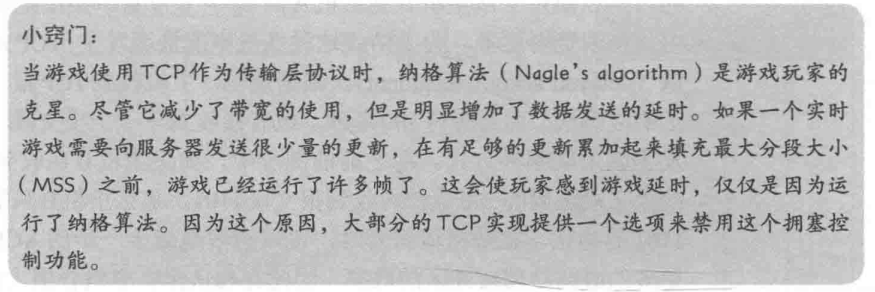
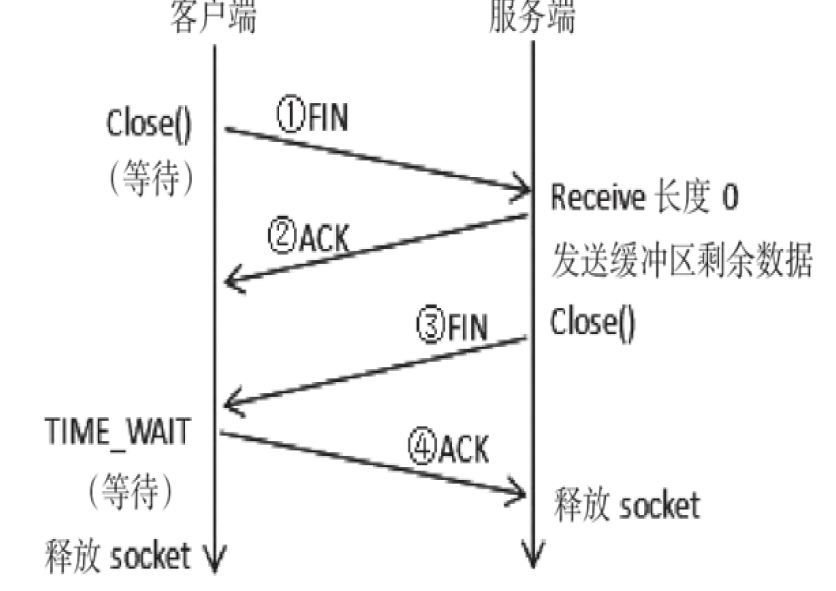
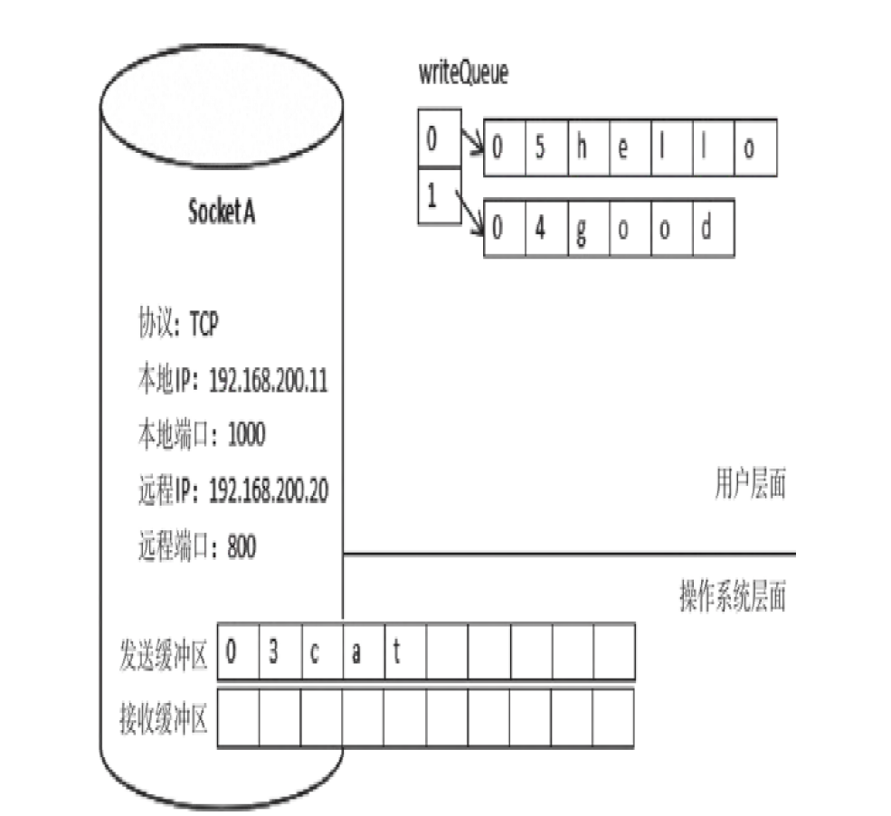

# 网络服务器编程

## 服务端的实现

1. 服务端可以使用多线程, 状态检测poll 或者是 多路复用select 等方案实现
2. 做好对应的异常处理
3. 一般客户端不会使用poll或者select等方式来实现, 而是使用异步(多线程)的方案. 这样做是为了减少客户端的性能开销, 避免每一帧都需要去检查网络数据.
4. **解耦** - 网络模块一般是作为一个底层模块用的,它应该和具体的游戏逻辑分开

## 系统缓冲区

在网络上发送和接收数据实际上是通过操作系统上的网络协议栈来实现的. 网络协议栈中存在发送和接受缓冲区. 我们使用 网络套接字接口来进行数据的发送和接受实际上是在对应的发送接收缓冲区上进行操作.

## 粘包问题

粘包是指发送方发送多个数据包, 而接收方在接收时这些数据包粘连在了一起.导致数据包不能完整的体现发送的数据. 一般有三种方法来解决粘包问题

1. 长度信息法 - 长度信息法是指在每个数据包前面加上长度信息。每次接收到数
据后，先读取表示长度的字节，如果缓冲区的数据长度大于要取的字
节数，则取出相应的字节，否则等待下一次数据接收。游戏开发中最常用的方法
2. 固定长度法 - 每次都以相同的长度发送数据
3. 结束符好法 - 规定一个结束符号，作为消息间的分隔符。

## 大小端问题

网络数据都是以大端的字节序来进行数据传输的, 市面上部分手机采用大端字节序, 部分手机采用小端的字节序. 有些手机甚至可以由硬件来选择使用大端模式或者时小端模式. 为了兼容所有的机型, 可以规定写入缓冲区的数据必须按照小端的模式来进行存储.

## 数据发送不完整问题

在网络拥堵的环境中可能会出现网络协议栈中的发送缓冲区爆满的情况, 此时如果再向发送缓冲区中添加数据则会失败. 会导致不完整的数据被发送. **通过引入额外的缓冲队列来缓冲需要发送的数据可以解决这个问题, 但是要注意不能同时发送多条 数据否则会造成混乱**

##  多线程之间的条件竞争问题

当存在多个线程同时读写一个资源的时候就有可能发生条件竞争, 这种情况有可能发生再客户端或者时服务端上. 我们可以使用 **锁** 来解决这个问题, 但是要注意将临界区设计得足够小从而获取更高得效率

## IP数据包的分片问题

## 关闭Nagle's 算法

一般游戏开发中选择关闭Nagle‘s 算法

## TTL

TTL指发送的IP数据包的生存时间值（Time To Live，TTL）。TTL 是IP头部的一个值，该值表示一个IP数据报能够经过的最大的路由器 跳数。发送数据时，TTL默认为64（TTL的默认值和操作系统有关， Windows Xp默认值为128，Windows7默认值为64，Window10默认值为 65，Linux默认值为255）。TTL的主要作用是避免IP包在网络中的无限循环和收发。

在网络游戏中，如果某些偏远地区用户时不时无法接收数据，可 以尝试增大TTL值（socket.ttl=xxx）来解决问题。

## 端口复用问题

ReuseAddress即端口复用，让同一个端口可被多个socket使用。 一般情况下，一个端口只能由一个进程独占，假设服务端程序都绑定 了1234端口，若开启两个服务端程序，虽然，第一个开启的程序能够 成功绑定端口并监听，但第二个程序会提示“端口已经在使用中”， 无法绑定端口。在计算机中，退出程序与释放端口并不同步。在5.2.3 节“TCP连接的终止”中，我们知道TCP断开连接会经历4次挥手。4次 挥手需要时间，在网络不好的情况下，程序还会多次重试。当服务端 程序崩溃，但它持有的Socket不会被立马释放，这时候重启服务器就 会遇到“端口已经在使用中”的情形。等到Socket被释放后（这个过 程可能要十几分钟时间），服务端才能成功重启。对于人气爆棚的大型网游，十几分钟的等待时间会造成很大损 失，一般要求在程序崩溃（尽管也不应该崩溃，但人算不如天算）后 立刻重启，继续提供服务。端口复用最常见的用途是，防止服务器重 启时，之前绑定的端口还未释放或者程序突然退出而系统没有释放端 口。这种情况下如果设定了端口复用，则新启动的服务器进程可以直 接绑定端口。如果没有设定端口复用，绑定会失败，提示端口已经在 使用中，只好等十几分钟再重试了。

尽管端口复用能解决服务端立即重启的问题，但它存在安全隐患。主动关闭方有可能在下次使用时收到上一次连接的数据包，包括 关闭连接响应包或者正常通信的数据包，有可能会出现奇怪的现象。

## 关闭链接确保发送缓冲的数据

当被动关闭方接收到对端发来的FIN后会返回一个长度为0的数据包给应用层，当应用层接收到长度为0 的数据包的时候不应该直接关闭socket而是应该等待发送缓冲区中的数据全部发送之后再进行链接的关闭。这样做可以提高数据传输的完整性。如下图所示

但是当发送缓冲区有对应的写入队列的时候，可能会出现如下所示的情形

上图中socket的发送缓冲区已经有5个字节的数据 “03cat”，写入队列writeQueue中也有2条数据，分别是“05hello” 和“04good”。在此状态下，假如调用Close关闭连接，就算开启 LingerState选项，“05hello”和“04good”这两条数据也会丢失， 达不到完整发送数据的目的。

对于主动关闭的一方，应判断当前写入队列或者发送缓冲区中是否还有正在发送的数据。如有，只将标志位isClosing设置为 true，等数据发送完再关闭连接；如果没有正在发送数据，直接关闭socket。

## 服务器TIME_WAIT值的设置

一般情况下，当服务端判断客户端发来的数据包不合法时，它会主动断开与客户端的链接。根据TCP断开链接的四次挥手流程。主动断开链接的服务端会进入TIME_WAIT状态，并且等待一段时间后再释放资源（Windows下默认为4分钟）。对于高并发的服务端，过多的TIME_WAIT 会占用系统资源，不是一件好事。有时候需要减小服务器的TIME_WAIT 值，以求快速释放资源。

## 心跳机制

TCP通过四次挥手来进行链接的关闭，但是如果对端遇到一些故障例如网线被人剪短，手机突然没有信号。此时主动方就无法发送FIN信号，导致对端会认为链接有效从而长期的占用系统资源。服务端应该避免这种无效链接长期占用资源的情况。

TCP有一个连接检测机制，就是如果在指定的时间内没有数据传 送，会给对端发送一个信号（通过SetSocketOption的KeepAlive选项 开启）。对端如果收到这个信号，回送一个TCP的信号，确认已经收 到，这样就知道此连接通畅。如果一段时间没有收到对方的响应，会 进行重试，重试几次后，会认为网络不通，关闭socket。

游戏开发中，TCP默认的KeepAlive机制很“鸡肋”，因为上述的 “一段时间”太长，默认为2小时。一般会自行实现心跳机制。心跳机 制是指客户端定时（比如每隔1分钟）向服务端发送PING消息，服务端 收到后回应PONG消息。服务端会记录客户端最后一次发送PING消息的 时间，如果很久没有收到（比如3分钟），就假定连接不通，服务端会 关闭连接，释放系统资源。

心跳机制也有缺点，比如在短暂的故障期间，它们可能引起一个 良好连接被释放；PING和PONG消息占用了不必要的宽带；在流量如黄 金的移动网络中，会让玩家花费更多的流量费。

## 参考资料

- [网络多人游戏架构与编程 第二章]()
- [Unity 网络游戏开发实战 (第二版)]()
