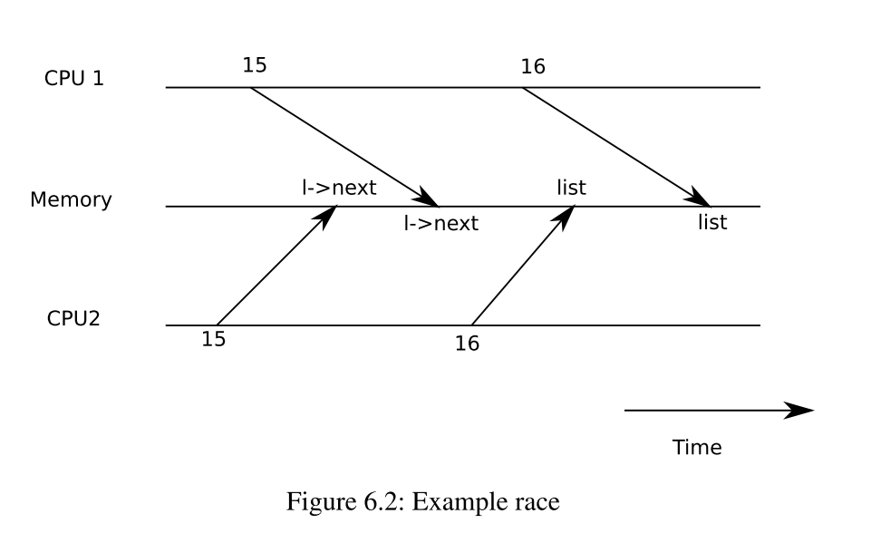

#  6.S081

## 学习资料
  - [课程主页](https://pdos.csail.mit.edu/6.828/2021/schedule.html)
  - [自学指南](https://csdiy.wiki/%E6%93%8D%E4%BD%9C%E7%B3%BB%E7%BB%9F/MIT6.S081/)
  - [课程翻译](https://mit-public-courses-cn-translatio.gitbook.io/mit6-s081/)
  - [xv6 文档翻译](https://th0ar.gitbooks.io/xv6-chinese/content/)
  - [lab讲解](https://www.bilibili.com/video/BV1ou41127p9/)
  - [xv6 Kernel 讲解xv6的视频讲解](https://www.youtube.com/watch?v=RdxHGyeoyqI&list=PLbtzT1TYeoMhTPzyTZboW_j7TPAnjv9XB&index=6)
  - [MIT 6.S081 xv6调试不完全指北](https://www.cnblogs.com/KatyuMarisaBlog/p/13727565.html)
-----------

## 环境配置

  - [wsl+tmux+ohmyzsh+vscode 打造前端高效工作流](https://blog.csdn.net/ZHgogogoha/article/details/117998852)
  - [解决ubuntu 无法访问github的问题](https://zhuanlan.zhihu.com/p/409238093)
  - [2021 MIT6.S081 Xv6 实验环境配置](https://zhuanlan.zhihu.com/p/428502480)

------------------

## 参考资源
  - [什么是RISV-V](https://zhuanlan.zhihu.com/p/49176102)
  - [Tmux 快捷键 & 速查表 & 简明教程](https://gist.github.com/ryerh/14b7c24dfd623ef8edc7)

-----------------

## 笔记

### 什么是`caller-save register`以及`callee-save register` ? 为需要需要将它们区分开来?

[What are callee and caller saved registers?](https://stackoverflow.com/questions/9268586/what-are-callee-and-caller-saved-registers)
[为什么要区分caller saved和callee saved registers? - 合十的回答 - 知乎](https://www.zhihu.com/question/453450905/answer/2328315047)

### 为什么会发生条件竞争?

从概念上来说条件竞争是指: 当并发的对内存进行一系列存取操作,并且其中至少存在一个写操作时，可能会造成数据丢失,或者是读取了不完整的数据的现象。但这并不足以从本质上去理解条件竞争。事实上条件竞争之所以会发生是因为在并发执行一段 `cirtical section` 之前其所依赖的 `invariant` 不正确导致的。例如存在如下代码

```c
1 struct element {
2   int data;
3   struct element *next;
4 };
5 
6 struct element *list = 0;
7 
8 void
9 push(int data)
10  {
11  struct element *l;
12
13   l = malloc(sizeof *l);
14   l->data = data;
15  l->next = list;
16  list = l;
17 }
```
假设同一个时刻存在两个并发执行的进程同时访问了该 `push`函数那么就可能出现条件竞争, 假设此时具体的执行顺序如下图所示：

那么出现的结果就是两个进程所创建的节点的`next`字段指向同一个节点，并且链表的头指针指向后执行的进程所创建的节点, 该段代码的 `cirtical section` 为第 `15` 和 `16`行, 而其`invariant`为在执行该段代码前链表的状态必须是前一个节点指向后一个节点而且头指针`list`必须指向链表的第一个节点。但是根据上面所示的执行顺序明显可以看出在第二次执行第`15`行的代码的之后该违反了该`invariant`。而想要修复该条件竞争就必须在执行`cirtical section`之前保证`invariant`是正确的并且在执行过程中除了执行者自己其他执行者都不能改变该`invariant` 最后在执行结束前必须执行者必须恢复该`invariant`.

由此可见，条件竞争发生的本质原因是违反了下面三个条件
1. 在执行`cirtical section` 之前 `invariant` 不为真
2. 在执行`cirtical section` 期间除了执行者自己其他执行者都不允许修改 `invariant` 
3. 在执行`cirtical section` 之后必须要恢复该 `invariant` 

### 当两个进程在同一个时刻去获取一个 `lock`的时候会不会出现两个进程同时获取该`lock`的情况?
会的, 这种情况被称为 `lock contention` 即锁争用。当不同的执行者在同一时刻同时去获取一个 `lock`的时候会出现的情况。可以通过将获取`lock` 的代码中的`cirtical section`部分进行原子化或者是对其中的算法或者使用到的数据结构进行特殊处理来避免这个问题.

### 如果对每一个共享的数据结构能在其内部自动的进行lock 和unlock 是不是就不会发生条件竞争了?
还是有发生条件竞争的风险的, 假设我们有能在内部自动进行Lock,unlock的数据结构list1 ，list2，当我们想从list1中移动元素到list2中时就会出现问题, 即存在那么一段时间元素在list1以及list2中都不存在

**因此 lock 不应该和具体的数据结构相挂钩, 它应该和具体的操作相挂钩**

因此将lock 和 unlock操作封装到数据结构中不会避免条件竞争的发生。


### 锁对性能的影响如何?如何去判断程序中需要多少的锁?
在一个并发程序中使用锁来保证程序并发执行的正确性的前提条件下，如果你想获得更高的性能，你需要拆分数据结构和锁.例如与其锁住整个文件系统，对每一个目录应用锁会获得更高的并发性。但使用越多的锁程序的复杂度就会越高。

通常可以使用以下的开发流程来判断程序中需要多少锁
1. 先以coarse-grained lock（注，也就是大锁）开始。
2. 再对程序进行测试，来看一下程序是否能使用多核。
3. 如果可以的话，那么工作就结束了，你对于锁的设计足够好了；如果不可以的话，那意味着锁存在竞争，多个进程会尝试获取同一个锁，因此它们将会序列化的执行，性能也上不去，之后你就需要重构程序。

## 为什么xv6在获取锁的时候需要关闭trap处理机制呢?
如果trap处理机制不关闭的话，那么在获取锁的那一刻有可能会发生 time interrupt 此时会切换到另外一个进程。如果新的进程要需要获取同一个锁那么此时就有 Deadlock的风险。更严重的是当这种情况发生在` time interrupt handler` 本身的时候(即其他进程获取了`tickslock`)，此时由于在 `time interrupt handler` 执行之前trap处理机制就已经被关闭了那么当前的cpu就会被彻底的冻结.


-------------------

## Lab

*这里不会对每个实验进行讲解，如果需要详细的实验思路的可以参考上面的链接，这里只给出自己在做lab时，遇到的一些重点难点的*

-----------------

### Lab 2

-------------------

#### trace 
根据文档去实现了功能后，还需要注意一点是，记得在`freeproc`函数中去清除掉 `proc`结构体中 `trace mask` 的数值。以防止通过函数`allocproc`函数创建的新进程继承了上一个进程的 `trace mask` 的数值.

测试：


##### sysinfo
根据文档要求实现功能，需要注意的是如果你想添加新的文件到`kernel`而不是在其它文件(例如在`proc.c`) 中实现 `sys_sysinfo` 系统调用 那么需要修改makefile，如下所示
```makefile
....
OBJS = \
  $K/entry.o \
  $K/kalloc.o \
  $K/string.o \
  $K/main.o \
  $K/vm.o \
  $K/proc.o \
  $K/swtch.o \
  $K/trampoline.o \
  $K/trap.o \
  $K/syscall.o \
  $K/sysproc.o \
  $K/bio.o \
  $K/fs.o \
  $K/log.o \
  $K/sleeplock.o \
  $K/file.o \
  $K/pipe.o \
  $K/exec.o \
  $K/sysfile.o \
  $K/kernelvec.o \
  $K/plic.o \
  $K/virtio_disk.o \
  $K/sysinfo.o # 自己添加的文件
...

```
在 `sysinfo` lab 中 需要注意结构体 `sysinfo` 中的字段 `freemem` 指的是当前剩余的内存空间，所有进程的内存空间是通过一个 `keme` 结构体中的`freelist`链表来维护的 (在`kernel/kalloc.c`中) 而每一个`freelist`节点中管理内存大小为 `PGSIZE`。因此只需要遍历链表计算出节点个数就可以计算出当前剩余的内存容量.

测试：


-----------------

#### 实验结果


----------------


### Lab3 

#### Speed up system calls
根据文档完成内容，需要注意在进程释放的时候要清理页表中的表项和释放新开辟的物理内存空间

#### Detecting which pages have been accessed

需要注意系统调用`sys_pgaccess` 的第三个参数为一个int变量的地址，可以通过查看文件`pgtbltest.c` 来进行确认

#### 实验结果


---------------


### Lab4 Traps

#### RISC-V assembly
答案如下
```
1. a0~a7 保存了函数的调用参数，a2 保存了值13
2. main 函数并没有直接调用函数f(8) 相反编译器直接计算出了f(8)的值，并将其直接保存到寄存器 a1 中，而在函数f中也并没有调用函数g,函数g被直接内联到函数f中。
3. printf 的地址是0x630 ，是根据如下指令推导得出的：

  30:	00000097          	auipc	ra,0x0 # 书面值 0x0 左移12位然后和寄存器pc中的值相加然后存放在寄存器 ra中
  34:	600080e7          	jalr	1536(ra) # 630 <printf> ， jalr指令是用来进行跳转的，跳转到寄存器ra的数值加上 1536 的地址处, 并将当前 寄存器pc + 4 的数值保存到寄存器ra 中用作为返回地址(return address) 

  printf 的地址为 1536 + 48 = 1584 对应的16进制为 0x64

4. 因为 jalr 会将 当前 pc + 4 的地址保存到ra中，所以在执行了jalr指令跳转到printf函数后 ra的数值为 0x38 
5. 因为%x 是将数值以16进制形式输出, xv6遵循小端字节序 所以输出为： HE110 World, 如果xv6是大端字节序，数值57616 不需要变化因为是根据具体的数值来打印16进制的结果的跟系统的字节序无关,而i的值变为 0x726c6400
6. y = %d 部分输出一个随机的值，根据xv6的calling convenience 文档 y = %d 处输出的应该是a2 寄存器中的数值，而该函数调用 printf("x = %d, y = %d", 3); 中并没有赋予寄存器a2 数值，但是printf函数执行时还是会从a2中获取值。

```
如果有需要查询对应的指令和寄存器的功能可以参考[该网站](https://dzone.com/articles/introduction-to-the-risc-v-architecture)

#### Backtrace

要求实现一个backtrace函数当出现异常时打印出函数的调用栈，文档给的hints已经非常详细了，需要注意的一点是通过 `PGROUNDDOWN(fp)` 以及 `PGROUNDUP(fp)`函数可以求出对应进程栈的最高以及最低地址，通过该方式可以判断是否已经到达调用栈的顶部，来终止循环。

**该实验只是实现了打印出内核栈的调用过程，并没有实现用户栈的调用过程**

实验结果


#### Alarm

该实现要求实现两个系统调用`sys_sigalarm` 以及`sys_sigreturn`, 根据文档的hints来进行实现即可。

**注意点**
1. 在实现`sys_sigreturn`系统调用时记得保存寄存器的状态,并记得在`proc.c`文件创建和释放进程的对应函数中释放掉 `trapframe`副本的物理内存。
2. 在实现两个系统调用的过程中记得在`proc.c`文件的创建和释放进程的函数中做好对应的状态初始化。
3. 当`sys_sigalarm`函数的handler正在运行的时候，可以选择继续给下一次handler调用计时也可以暂停计时，两种实现都可以通过。这里我选择了前者。

实现结果


#### 实验结果


--------------

## Lab5 cow fork

该实验有一定的难度，但是完成后可以加深对虚拟内存以及页表，中断的理解。实验的关键点在于实现一个页的引用计数，并且根据该引用计数来实现一个 基于页的 copy on write 功能。
实验的hint直接告知了需要修改的函数，但是我们也可以进行自己的修改，实现过程中的关键点如下所示
1. 一个被标记为cow的页原先并不一定可写，因此需要保存该页的原始PTE_W位。这里我选择保存在 PTE_RSW 位中，否则有可能会让恶意程序攻击一些只读的页
2. 我们可以在进程被卸载时检查其每一个页的引用计数，但最好是只检查cow位被标的页。
3. 当检测到一个cow页的引用计数为1时，表明当前引用该页的只有它自己，此时可以将该页转换为不同的页，也可以不转.
4. 当我们递增或者递减某个cow页的引用计数的时候需要对引用计数的数组进行加锁。

### 实验结果


## Lab6 Multithreading
这次实验比较简单，实验结果如下所示：


-------------------

## Lab6 Multithreading
该实验比较简单，省略

### 实验结果


----------------------

## Lab7 Network driver
根据该lab的文档和hits可以很快的得到思路，该实验的关键是理解发送和接受队列的结构
1. 在发送队列中 [head, tail) 表示已经存放在队列中的数据，网卡每次从head处读取数据并且递增head的数值, xv6 每次都将数据插入到tail所指的位置上
2. 在接受队列中 [head, tail] 表示已经存放在队列中的数据，网卡每次接受到一个数据都会将其插入到head 中并且递增head的值, xv6每次都从 tail + 1 处读取数据

注意点：
- 当网卡发送完一个mbuf时，记得将该mbuf释放掉
- 当将一个mbuf放置到 发送队列时需要设置 `descriptor`的 `RS`位，并根据情况设置`EOP`位，如果该package 是一个完整的package或者是某个package尾部那么需要设置`EOP`位
- e1000_recv 可以不加锁，处理完一个recv 前，下一个recv 会被阻塞住。
- e1000_recv 不可以和e1000_transmit 用同一把锁，如果recv接收到一个arp包，会在recv 内部发送arp回包，从而调用e1000_transmit，两者用同一把锁就死锁了。

### 实验结果


------------

## Lab8 lock
本次实验非常有难度，有几个问题需要注意
- 当同时锁住两个锁的时候需要注意死锁问题
- 锁的释放顺序要和获取顺序相反
- 在 Buffer cache 实验中需要注意当同时有两个线程使用相同的参数 (dev,blockno )去调用 bget 函数时有可能会导致 buf 的重分配


### 实验结果
