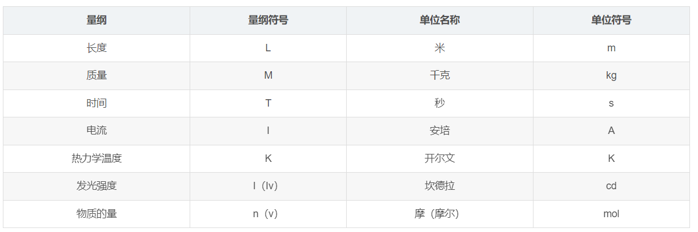

# 游戏开发中的物理学简析

**该笔记只作为 <游戏开发物理学> 第二版的补充**

## 单位和量纲

量纲是表征物理量的性质（类别），单位是表征物理量的大小或数量的标准。长度，时间，质量等都叫做量纲，而米，千米，秒，分钟，等都是单位. 国际单位制规定了七个基本量纲单位，这七个量纲彼此之间不能通过量纲计算得到。分别是 `长度，质量，时间，电流，热力学温度，发光强度，物理的量` 如下所示。

通过检查公式的量纲一致性可以判断公式是否正确。

## 什么是封闭系统

在古典力学之中，封闭系统是指一个不与外界交换能量（作功或热量）且不交换质量的系统。 即系统内的物体之间可以相互作用，但系统与外界没有物质和能量的交换。

## 什么是刚体

刚体是指在运动中和受力作用后，形状和大小不变，而且内部各点的相对位置不变的物体。绝对刚体实际上是不存在的，只是一种理想模型，因为任何物体在受力作用后，都或多或少地变形，如果变形的程度相对于物体本身几何尺寸来说极为微小，在研究物体运动时变形就可以忽略不计。

## 动量和角动量,冲量的概念

- 动量：一个物体的动量指的是这个物体在它运动方向上保持运动的趋势。动量是个向量，其方向与速度方向相同。
- 角动量：角动量是物理学中描述物体绕某一轴旋转时的动量表现。角动量可以理解为物体旋转的某种“惯性”，它是一种矢量物理量，具有大小和方向。物体的角动量大小和物体的质量、物体的旋转速度以及物体与旋转轴之间的距离有关。
- 冲量（impulse）是指力的时间累积效应的量度，是矢量。 当一个物体受到一个随时间改变的力的作用时，冲量常被用来表征该时间段内这个力对物体作用的积累效果，即力对时间的积分.

## 动量守恒，角动量守恒

- 动量守恒：一个系统(或者某一方向上)不受外力作用或所受外力之和为零，这个系统的总动量保持不变
- 角动量守恒：若物体（或系统）不受外力矩或者所受外力矩和为零，则物体（系统）的角动量守恒。

[动量守恒判断条件](https://zhuanlan.zhihu.com/p/417191232)

## 力矩

- 任何穿过物体质心的力都不会产生相对于物体重心的力矩。
- 当计算合力的时候，只需要简单地按照向量的加法把所有力向量加起来就可以，而不需要考虑力的作用点。然而当计算合力矩时，你必须考虑力的作用点，然后把所有作用在物体上的力矩向量加起来即可。

## 碰撞

[小球碰撞物理分析](https://enjoyphysics.cn/Article807)

## 流体阻力

### 高尔夫球的阻力分析

**为了更好的理解书中的例子，这里给出高尔夫球在空中运动时所受阻力的分析。**

空气对于任何在运动的物体，都会受到两个空气动力学中所谓的升力及阻力。阻力的作用方向与运动方向相反，而升力的作用方向则朝上。

而物体在空气中运动时，主要受到两种阻力：一种是物体表面与气流的摩擦力；另一种是物体前面与后面所受气压之差所形成的压差阻力。在物体运动速度较快时，后者会占全部阻力的大部分。

高尔夫球快速飞行的时候，在球的后面形成了对称的漩涡，在球附近的流体分子贴着球走一段后，就脱离球面，这种现象也被称为边界层分离。高尔夫球后面是中心压力很小的漩涡，而球前面的压力比较大，由于这个压力差，球就受到一个相对较大的阻力。

一般来说，球的飞行速度越大，边界层的分离就越早，在球的后面形成的漩涡区也就越大，这种压差所形成的阻力也越大。光滑的球由于这种边界层分离得早，形成的前后压差阻力就很大，飞行距离就大大缩短了。

而当高尔夫球有了小凹坑，飞行时小凹坑附近产生了一些小的漩涡，由于这些小漩涡的吸力，高尔夫球表面附近的流体分子被漩涡吸引，边界层的分离点就推后许多。这时，在高尔夫球后面所形成的大漩涡区便比光滑的球所形成的漩涡区小得多，从而使得前后压差所形成的阻力大为减小。

此外，小凹坑也会影响高尔夫球的升力。一个表面不平滑的回旋球，会像飞机机翼般偏折气流以产生升力。球的自旋可使球下方的气压比上方高，这种不平衡可以产生往上的推力。

### 层状流体和扰动流体

*chatgpt*

层状流体和扰动流体是两种不同的流体模型，它们的主要区别在于流体的流动方式和稳定性。

层状流体是指一种具有高度方向性的流体模型，其中流体沿着不同密度的水平层流动。在这种流体中，密度较高的流体会下沉，而密度较低的流体则会浮起。由于这种流动方式是沿着水平方向而非垂直方向，所以它的流动非常稳定，并且不容易受到外部扰动的影响。

扰动流体则是指一种在静止状态下不具备稳定性的流体模型，当受到外部扰动时会发生剧烈的流动变化。这种流体的流动方式是在各种不同的速度和方向上进行混合，导致流动非常复杂且难以预测。扰动流体的特点是容易受到外部因素的干扰，例如风、水流和物体的运动等，这些因素都可能引起流体的扰动和不稳定性。

总之，层状流体和扰动流体的区别在于它们的流动方式和稳定性。层状流体的流动沿着水平方向，并且非常稳定，而扰动流体则在静止状态下不具备稳定性，并且容易受到外部因素的影响而发生复杂的流动变化。

具体例子:

- 层状流体的例子：海水。海水中的盐度和温度变化会导致水层之间的密度差异，从而形成不同密度的水平层。这些水平层具有高度方向性，沿着水平方向流动，并且非常稳定。海水的流动往往受到地球自转和海底地形的影响，但是这些影响相对较小，无法打破海水的层状结构。
- 扰动流体的例子：空气。空气在静止状态下不具备稳定性，很容易受到外部因素的影响而发生复杂的流动变化。例如，当风吹过地面或者物体表面时，空气会受到扰动，并形成涡流和湍流等复杂的流动结构。这些流动结构具有随机性和不规则性，难以精确地描述和预测。

总之，海水是一种典型的层状流体，而空气则是一种典型的扰动流体。这些例子可以帮助我们更好地理解不同类型的流体模型以及它们的流动特性和稳定性。

