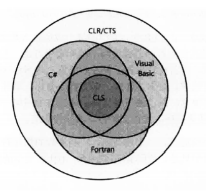
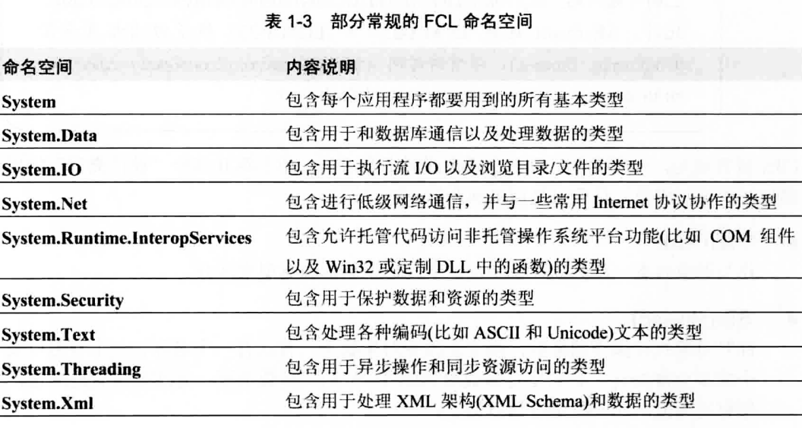

[TOC]

# .NET Framework的基本概念

## 1.什么是 .NET Framework
.NET Framework 是一个可以快速开发、部署网站服务及应用程序的开发平台，是 Windows 中的一个组件，包括公共语言运行时（Common Language Runtime, CLR）虚拟执行系统和 .NET Framework 类库。

## 2. .NET Framework的组成

## 2.1 公共语言运行时CLR

**CLR (公共语言运行时 Common Language Runtime)**简单来说是一个系统，它提供了**内存管理，程序集加载，安全性，异常处理和线程同步**等等的功能。而IL(中间语言代码)则可以操作CLR，来命令它完成一系列的操作。IL是CLR可以识别的语言，CLR可以将IL编译成本机的CPU指令。

### 2.1.1 公共类型系统CTS
CTS(Common Type System)，我们知道通过CLR不同的编程语言之间可以实现互相沟通调用，而该功能的实现离不开类型。通用类型系统 (Common Type System) 定义了运行期引擎如何使用程序中的数据类型，以及如何配置数据在存储器中的一种标准，依照此种标准所撰写的编程语言，都可以在同一个运行期引擎中使用，因此它是跨语言支持的重要部分，亦即**匹配CTS 规范的编程语言所撰写出的程序，都可以在 CLR 中使用**。

### 2.1.2 公共语言规范CLS
CLS全称公共语言规范(Common Language Specification) 它定义了CTS中的一个最小功能集。不同的编程语言有不同的语言特性，它们只能提供CTS的部分内容，如下图所示.

因此单纯的依靠CTS无法让不同语言编写出来的程序互相通信和兼容。为了让这些不同语言编写出来的程序能够做到兼容，就必须让它们都支持一个语言之间的最小功能集这就是CLS。任何编译器只有支持这个功能集，生成的类型才能兼容由其他符合CLS，面向CLR的语言生成的组件。

## 2.2 Framework类库 FCL
FCL是一组DLL程序集的统称，其中包含数千个类型定义，每个类型定义都公开一些功能。其中包括
- Web服务
- Windows服务
- 数据库存储过程
- 组件库

部分常规的FCL命名空间
