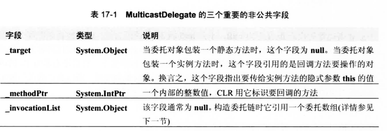
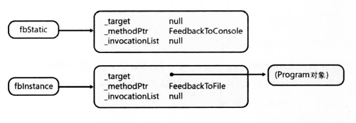
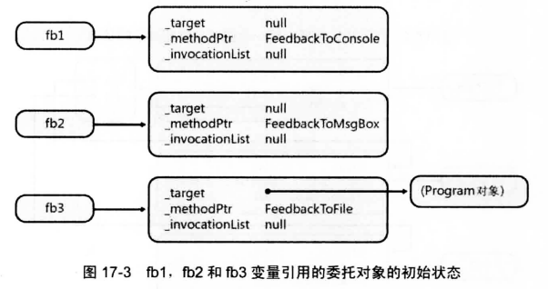
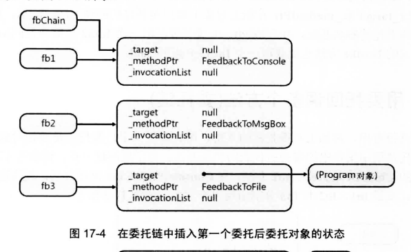
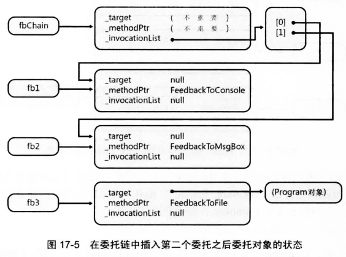
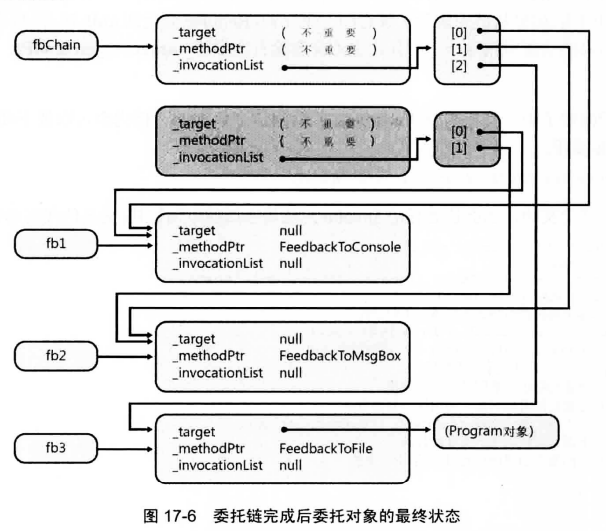

[TOC]

# 编译器对委托的处理
考虑如下代码
```csharp
internal delegate void Feedback(Int32 value);
```
看到这行代码后，编译器实际会像下面这样定义一个完整的类:
```csharp
internal class Feedback : System.MulticastDelegate {
    // 构造器
    public Feedback(Object @object, IntPtr method);

    // 这个方法的原型和源代码指定的一样
    public virtual void Invoke(Int32 value);

    // 以下方法实现对回调方法的异步问题
    public virtual IAsyncResult BeginInvoke(Int32 value, AsyncCallback callback, Object @object);
    public virtual void EndInvoke(IAsyncResult result);
}
```

编译器定义的类有 4 个方法：一个构造器、`Invoke、BeginInvoke和EndInvoke`，事实上，可用 `ILDasm.exe` 查看生成的程序集，验证编译器真的会自动生成这个类。
`System.MulticastDelegate`派生自`System.Delegate`，后者又派生自 `System.Object`。是历史原因造成有两个委托类。这实在是令人遗憾———— FCL 本该只有一个委托类。没有办法，我们对这两个类都要有所了解。即使创建的所有委托类型都将`MulticastDelegate`作为基类，个别情况下仍会使用 `Delegate` 类(而非`MulticastDelegate`类)定义的方法处理自己的委托类型。例如，Delegate类的两个静态方法`Combine和Remove`(后文将解释其用途)的签名都指出要获取`Delegate`参数。由于你创建的委托类型派生自`MulticastDelegate`，后者又派生自`Delegate`，所以你的委托类型的实例是可以传给这两个方法的。

这个类的可访问性是`private`，因为委托在源代码中声明为`internal`。如果源代码改成使用`public`可见性，编译器生成的`Feedback`类也会变成公共类。要注意的是，委托类既可嵌套在一个类型中定义，也可在全局范围中定义。简单地说，由于委托是类，所以凡是能够定义类的地方，都能定义委托。
由于所有委托类型都派生自`MulticastDelegate`，所以它们继承了`MulticastDelegate`的字段、属性和方法。在所有这些成员中，有三个非公共字段是最重要的。下表总结了这些重要字段



所有委托都有一个构造器，它获取两个参数：一个是对象引用，另一个是引用了回调方法的整数。但如果仔细查看前面的源代码，会发现传递的是`Program.FeedbackToConsole`或`p.FeedbackToFile`这样的值。根据迄今为止学到的编程知识，似乎没有可能通过编译！

然而，C# 编译器知道要构造的是委托，所以会分析源代码来确定引用的是哪个对象和方法。对象引用被传给构造器的 `object` 参数，标识了方法的一个特殊 `IntPtr` 值(从 `MethodDef` 或 `MemberRef` 元数据 `token` 获得)被传给构造器的 `method` 参数。对于静态方法，会为 `object` 参数传递 null 值。在构造器内部，这两个实参分别保存在 `_target` 和`_methodPtr` 私有字段中。除此以外，构造器还将 `_invocationList` 字段设为null

所以，每个委托对象实际都是一个包装器，其中包装了一个方法和调用该方法时要操作的对象。例如，在执行以下两行代码之后：

```csharp
Feedback fbStatic = new Feedback(Program.FeedbackToConsole);
Feedback fbInstance = new Feedback(new Program().FeedbackToFile);
```

`fbStatic` 和 `fbInstance` 变量将引用两个独立的、初始化好的 `Feedback` 委托对象，如下图所示。



知道委托对象如何构造并了解其内部结构之后，再来看看回调方法时如何调用的。为方便讨论，下面重复了 Counter 方法的定义：
```csharp
private static void Counter(Int32 from, Int32 to, Feedback fb) {
    for (Int32 val = from; val <= to; val++) {
        // 如果指定了任何回调，就调用它们
        if (fb != null)
            fb(val);
    }
}
```
注意if语句首先检查`fb`是否为`null`。不为`null`就调用①回调方法。`null`检查必不可少，因为`fb`只是可能引用了`Feedback`委托对象的变量；它也可能为`null`。这段代码看上去像是调用了一个名为`fb`的函数，并向它传递一个参数(val)。但事实上，这里没有名为 `fb` 的函数。再次提醒你注意注意，因为编译器知道 `fb` 是引用了委托对象的变量，所以会生成代码调用该委托对象的`Invoke` 方法。也就是说，编译器在看到以下代码时：

```csharp
fb(val);
```
它将生成以下代码，好像源代码本来就是这么写的一样：
```csharp
fb.Invoke(val);
```

## 委托链
委托本身就很有用，再加上对委托链的支持，用处就更大了！委托链是委托对象的集合。可利用委托链调用集合中的委托所代表的全部方法。
假设存在三个委托对象`fb1,fb2,fb3`，以及一个委托对象的引用`fbChain`。如下图所示。



指向`Feedback`委托对象的引用变量`fbChain`旨在引用委托链(或者说委托对象集合)。`fbChain`初始化为`null`，表明目前没有要回调的方法。使用`Delegate`类的公共静态方法Combine将委托添加到链中

```csharp
Feedback fbChain = null;
fbChain = (Feedback) Delegate.Combine(fbChain, fb1);
```

执行这行代码时，Combine 方法发现试图合并的是null和fb1。在内部，Combine直接返回fb1中的值，所以fbChain变量现在引用fb1变量所引用的委托对象，如下所示



再次调用 `Combine` 方法在链中添加第二个委托：
```csharp
fbChain = (Feedback) Delegate.Combine(fbChain, fb2);
```
在内部，Combine方法发现fbChain 已引用了一个委托对象，所以 Combine 会构造一个新的委托对象。新委托对象对它的私有字段 _target 和 _methodPtr 进行初始化，具体的值对于目前的讨论来说并不重要。重要的是，_invocationList字段被初始化为引用一个委托对象数组。数组的第一个元素(索引0)被初始化引用包装了 FeedbackToConsole 方法的委托(也就是 fbChain 目前引用的委托)。数组的第二个元素(索引 1)被初始化为引用包装了FeedbackToMsgBox方法的委托(也就是 fb2 引用的委托)。最后，fbChain被设为引用新建的委托对象。如下图所示



为了在链中添加第三个委托，我再次调用 Combine 方法。
```csharp
fbChain = (Feedback) Delegate.Combine(fbChain, fb3);
```
同样地，Combine方法发现fbChain已引用了一个委托对象，因而又构造一个新的委托对象，如果 17-6 所示。和前面一样，新委托对象对私有字段 _target和_methodPtr进行初始化，具体的值就目前来说并不重要。_invocationList字段被初始化为引用一个委托对象数组。该数组的第一个元素和第二个元素(索引 0 和 1)被初始化为引用 fb1 和 fb2 所引用的委托。数组的第三个元素(索引 2)被初始化为引用包装了FeedbackToFile方法的委托(这是fb3所引用的委托)。最后，fbChain被设为引用这个新建的委托对象。注意，之前新建的委托及其_invocationList字段引用的数组现在可以进行垃圾回收




现在当我们调用`fbChain`的`Invoke`方法时，CLR会检测到该委托对象中的`_invocationList `字段不为空所以会沿着委托链逐个调用其中的委托对象的 `Invoke` 方法。委托对象的`Invoke`方法的实现可以看作如下所示的代码

```csharp
public void Invoke(Int32 value) {
    Delegate[] delegateSet = _invocationList as Delegate[];
    if (delegateSet != null ) {
        // 这个委托数组指定了应该调用的委托
        foreach (Feedback d in delegates)
            d(value);   // 调用每个委托
    } else {  // 否则就不是委托链
        // 该委托标识了要回调的单个方法，
        // 在指定的目标对象上调用这个回调方法
        _methodPtr.Invoke(_target, value);
        // 上面这行代码接近实际的代码，
        // 实际发生的事情用 C# 是表示不出来的
    }
}
```

注意，还可调用 Delegate 的公共静态方法 Remove 从链中删除委托。ChainDelegateDemo1 方法在结尾处对此进行了演示。
```csharp
fbChain = (Feedback) Delegate.Remove(fbChain, new Feedback(FeedbackToMsgBox));
```
Remove 方法被调用时，它扫描第一个实参(本例是fbChain)所引用的那个委托对象内部维护的委托数组(从末尾向索引 0 扫描)。Remove查找的是其_target 和 _methodPtr 字段与第二个实参(本例是新建的Feedback委托)中的字段匹配的委托。如果找到匹配的委托，并且(在删除之后)数组中只剩余一个数据项，就返回那个数据项。如果找到匹配的委托，并且数组中还剩余多个数据项，就新建一个委托对象————其中创建并初始化的 _invocationList 数组将引用原始数组中的所有数据项，当然被删除的数据项除外————并返回对这个新建委托对象的引用。如果从链中删除了仅有的一个元素，Remove会返回null。注意，每次 Remove 方法调用只能从链中删除一个委托，它不会删除有匹配的_target 和 _methodPtr 字段的所有委托。

前面展示的例子中，委托类型 Feedback 的返回值都是 void。但完全可以像下面这样定义 Feedback 委托：
```csharp
public delegate Int32 Feedback(Int32 value);
```
如果是这样定义的，那么该委托的 Invoke 方法就应该像下面这样(又是伪代码形式)：

```csharp
public Int32 Invoke(Int32 value) {
    Int32 result;
    Delegate[] delegateSet = _invocationList as Delegate[];

    if(delegateSet != null) {
        // 这个委托数组指定了应该调用的委托
        foreach (Feedback d in delegateSet)
            result = d(value);      // 调用每个委托
    } else {  // 否则就不是委托链
        // 该委托标识了要回调的单个方法，
        // 在指定的目标对象上调用这个回调方法
        result = _methodPtr.Invoke(_target, value);
        // 上面这行代码接近实际的代码
        // 实际发生的事情用 C# 是表示不出来的
    }
    return result;
}
```
数组中的每个委托被调用时，其返回值被保存到 result 变量中。循环完成后，result 变量只包含调用的最后一个委托的结果(前面的返回值会被丢弃)，该值返回给调用 Invoke 的代码。

## C# 编译器对委托链的支持
为方便 C# 开发人员，C# 编译器自动为委托类型的实例重载了 += 和 -=操作符。这些操作符分别调用 Delegate.Combine 和 Delegate.Remove。可用这些操作符简化委托链的构造。可利用 ILDasm.exe 查看生成的 IL 代码。会看到 C#编译器用 Delegate 类型的 Combine 和 Remove 公共静态方法调用分别替换了 += 和 -= 操作符


委托类型的Invoke方法包含了对数组中的所有项进行遍历的代码。这是一个很简单的算法。尽管这个简单的算法足以应付很多情形，但也有它的局限性。例如，除了最后一个返回值，其他所有回调方法的返回值都会被丢弃。但局限并不止于此。如果被调用的委托中有一个抛出了异常或阻塞了相当长一段时间，会出现什么情况呢？由于这个简单的算法是顺序调用链中的每一个委托，所以一个委托对象出现问题，链中后续的所有对象都调用不了。显然，这个算法还不够健壮。

由于这个算法有的时候不胜其任，所以 MulticastDelegate 类提供了一个实例方法 GetInvocationList，用于显式调用链中的每一个委托，并允许你使用需要的任何算法

```csharp
public abstract class MulticastDelegate : Delegate {
    // 创建一个委托数组，其中每个元素都引用链中的一个委托
    public sealed override Delegate[] GetInvocationList();
}
```

GetInvocationList 方法操作从 MulticastDelegate 派生的对象，返回包含 Delegate 引用的一个数组，其中每个引用都指向链中的一个委托对象。在内部，GetInvocationList 构造并初始化一个数组，让它的每个元素都引用链中的一个委托，然后返回对该数组的引用。如果_invaocationList字段为null，返回的数组就只有一个元素，该元素引用链中唯一的委托，即委托实例本身。