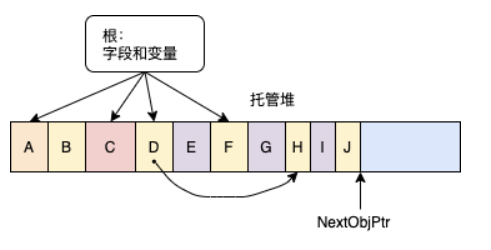
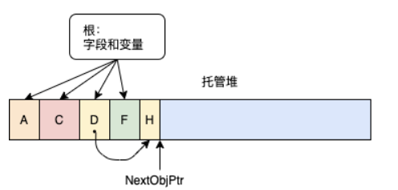
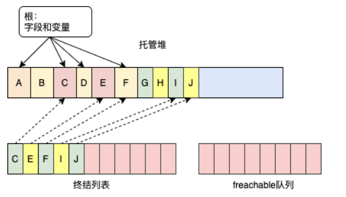
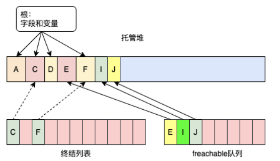
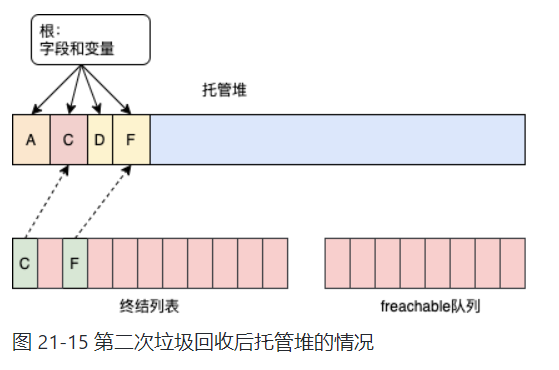

[TOC]

# 托管堆的初始化
CLR 要求所有对象都从托管堆分配。进程初始化时，CLR 划出一个地址空间区域作为托管堆。CLR 还要维护一个指针，我把它称作 NextObjPtr。该指针指向下一个对象在堆中的分配位置。刚开始的时候，NextObjPtr 设为地址空间区域的基地址。
一个区域被废垃圾对象填满后，CLR 会分配更多的区域。这个过程一直重复，直至整个进程地址空间都被填满。所以，你的应用程序的内存受进程的虚拟地址空间的限制。32 为进程最多能分配 1.5 GB，64 位进程最多能分配 8 TB。

下图展示了包含三个对象(A，B 和 C)的一个托管堆。如果要分配新对象，它将放在NextObjPtr 指针指向的位置(紧接在对象 C 后)。


# CLR的垃圾回收原理
应用程序调用 new 操作符创建对象时，可能没有足够地址空间看来分配该对象。发现空间不够，CLR 就执行垃圾回收。
至于对象生存期的管理，有的系统采用的是某种引用计数算法。事实上，Microsoft 自己的“组件对象模型”(Component Object Model, COM)用的就是引用计数。在这种系统中，堆上的每个对象都维护着一个内存字段来统计程序中多少"部分"正在使用对象。随着每一“部分”到达代码中某个不再需要对象的地方，就递减对象的计数字段。计数字段变成0，对象就可以从内存中删除了。许多引用计数系统最大的问题是处理不好循环引用。例如在GUI 应用程序中，窗口将容纳对子 UI 元素的引用，而子 UI 元素将容纳对父窗口的引用。这种引用会阻止两个对象的计数器达到 0，所以两个对象永远不会删除，即使应用程序本身不再需要窗口了。

鉴于引用计数垃圾回收器算法存在的问题，CLR 改为使用一种引用跟踪算法。引用跟踪算法只关心引用类型的变量，因为只有这种变量才能引用堆上的对象；值类型变量直接包含值类型实例。引用类型变量可在许多场合使用，包括类的静态和实例字段，或者方法的参数和局部变量。我们将所有引用类型的变量都称为根。

CLR 开始 GC 时，首先暂停进程中的所有线程。这样可以防止线程在 CLR 检查期间访问对象并更改其状态。然后，CLR 进入 GC 的 标记阶段。在这个阶段，CLR 遍历堆中的所有对象，将同步块索引字段中的一位设为 0。这表明所有对象都应删除。然后，CLR 检查所有活动根。查看它们引用了哪些对象。这正是 CLR 的 GC 称为引用跟踪 GC 的原因。如果一个根包含 null， CLR 忽略这个根并继续检查下个根。

任何根如果引用了堆上的对象，CLR 都会标记那个对象，也就是将该对象的同步块索引中的位设为 1。一个对象被标记后， CLR 会检查那个对象中的根，标记它们引用的对象。如果发现对象已经标记，就不重新检查对象的字段。这就避免了因为循环引用而产生死循环。
下图展示了一个堆，其中包含几个对象。应用程序的根直接引用对象 A， C， D 和 F。所有对象都已标记。标记对象 D 时，垃圾回收器发现这个对象含有一个引用对象 H 的字段，造成对象 H 也被标记。标记过程会持续，直至应用程序的所有根所有检查完毕。




检查完毕后，堆中的对象要么已标记，要么未标记。已标记的对象不能被垃圾回收，因为至少有一个根在引用它。我们说这种对象的可达(reachable)的，因为应用程序代码可通过仍在引用它的变量抵达(或访问)它。未标记的对象是不可达(unreachable)的，因为应用程序中不存在使对象能被再次访问的根。

CLR 知道哪些对象可以幸存，哪些可以删除后，就进入 GC 的压缩(compact)①阶段。在这个阶段，CLR 对堆中已标记的对象进行“乾坤大挪移”，压缩所有幸存下来的对象，使它们占用连续的内存空间。这样做有许多好处。首先，所有幸存对象在内存中紧挨在一起，恢复了引用的“局部化”，减小了应用程序的工作集，从而提升了将来访问这些对象时的性能。其实，可用空间也全部是连续的，所以整个地址空间区段得到了解放，允许其他东西进驻。最后，压缩意味着托管堆解决了本机(原生)堆的控件碎片化问题。

`大对象堆(本章稍后讨论)中的对象不会压缩，所以大对象堆还是可能发生地址空间碎片化的。`

在内存中移动了对象之后有一个问题亟待解决。引用幸存对象的根现在引用的还是对象最初在内存中的位置，而非移动之后的位置。被暂停的线程恢复执行时，将访问旧的内存位置，会造成内存损坏。这显然不能容忍的，所以作为压缩阶段的一部分，CLR 还要从每个根减去所引用的对象在内存中偏移的字节数。这样就能保证每个根还是引用和之前一样的对象；只是对象在内存中变换了位置。

压缩好内存后，托管堆的 NextObjPtr 指针指向最后一个幸存对象之后的位置。下一个分配的对象将放到这个位置。下图展示了压缩阶段之后的托管堆。压缩阶段完成后，CLR 恢复应用程序的所有线程。这些线程继续访问对象，就好像 GC 没有发过一样。



如果 CLR 在一次 GC 之后回收不了内存，而且进程中没有空间来分配新的 GC 区域，就说明该进程的内存已耗尽。此时，试图分配更多内存的 new 操作符会抛出 OutOfMemoryException。应用程序可捕捉该异常并从中恢复。但大多数应用程序都不会这么做；相反，异常会成为未处理异常，Windows 将终止进程并回收进程使用的全部内存。

作为程序员，应注意本章开头描述的两个 bug 不复存在了。首先，内存不可能泄露，因为从应用程序的根③ 访问不了任何对象，都会在某个时间被垃圾回收。其次，不可能因为访问被释放的内存而造成内存损失，因为现在只能引用活动对象；非活动的对象是引用不了的。

`重要提示 静态字段引用的对象一直存在，直到用于加载类型的 AppDomain 卸载为止。内存泄漏的一个常见原因就是让静态字段引用某个集合对象，然后不停地向集合添加数据项。静态字段使集合对象一直存活，而集合对象使所有数据项一直存活。因此，应尽量避免使用静态字段。`

# CLR的垃圾回收策略

请直接查看CLR_Via C# 的第21章第二节

-----------------

# Finalize的工作原理

## C#编译器的处理方式

终极基类 System.Object 定义了受保护的虚方法 Finalize。垃圾回收器判定对象是垃圾后，会调用对象的 Finalize 方法(如果重写)。Microsoft 的 C# 团队认为 Finalize 在编程语言中需要特殊语法(类似于 C# 要求用特殊语法定义构造器)。因此，C# 要求在类名前添加 ~符号来定义 Finalize 方法，如下例所示：

```csharp
internal sealed class SomeType {
    // 这是一个 Finalize 方法
    ~SomeType() {
        // 这里的代码会进入 Finalize 方法
    }
}
```
编译上述代码，用 ILDasm.exe 检查得到的程序集，会发现 C# 编译器实际是在模块的元数据中生成了名为 Finalize 的 protected override 方法。查看 Finalize 的 IL，会发现方法主体的代码被放到一个 try 块中，在 finally 块中则放入了一个 base.Finalize 调用。

`重要提示 如果熟悉 C++，会发现 C# Finalize 方法的特殊语法非常类似于 C++ 析构器。事实上，在 C#编程语言规范的早期版本中，真的是将该方法称为析构器。但 Finalize 方法的工作方式和 C++ 析构器完全不同，这会使从一种语言迁移到另一种语言的开发人员产生混淆。`

`问题在于，这些开发人员可能错误地以为使用 C# 析构器语法意味着类型的实例会被确定性析构，就像在 C++ 中那样。但 CLR 不支持确定性析构，而作为面向 CLR 的语言，C# 也无法提供这种机制。`

强烈建议不要重写 Object 的 Finalize 方法。相反，使用 Microsoft 在 FCL 中提供的辅助类。这些辅助类重写了 Finalize 方法并添加了一些特殊的 CLR “魔法”(以后会慢慢讲述)。你从这些辅助类派生出自己的类，从而继承 CLR 的 “魔法”。

## Finalize对垃圾回收的影响

应用程序创建新对象时，new操作符会从堆中分配内存。如果对象的类型定义了 Finalize 方法，那么在该类型的实例构造器被调用之前，会将指向该对象的指针放到一个终结列表(finalization list)中。终结列表是由垃圾回收器控制的一个内部数据结构。列表中的每一项都指向一个对象————回收该对象的内存前应调用它的 Finalize 方法。

下图 展示了包含几个对象的堆。有的对象从应用程序的根可达，有的不可达。对象 C，E，F，I 和 J 被创建时，系统检测到这些对象的类型定义了 Finalize 方法，所以将指向这些对象的指针添加到终结列表中。




`注意 虽然 System.Object 定义了 Finalize 方法，但 CLR 知道忽略它。也就是说，构造类型的实例时，如果该类型的 Finalize 方法是从 System.Object 继承的，就不认为这个对象是 ”可终结“ 的。类型必须重写 Object 的 Finalize 方法，这个类型及其派生类型的对象才被认为是”可终结“的。`

垃圾回收开始时，对象 B，E，G，H，I 和 J 被判定为垃圾。垃圾回收器扫描终结列表以查找这些对象的引用。找到一个引用后，该引用会从终结列表中移除，并附加到 freachable 队列。freachable队列(发音是“F-reachable”)也是垃圾回收器的一种内部数据结构。队列中的每个引用都代表其 Finalize 方法已准备好调用的一个对象。图 21-14 展示了回收完毕后的托管堆。



从图 21-14 可以看出，对象 B，G 和 H 占用的内存已被回收，因为它们没有 Finalize 方法。但对象 E，I 和 J 占用的内存暂时不能回收，因为它们的 Finalize 方法还没有调用。

一个特殊的高优先级 CLR 线程专门调用 Finalize 方法。专用线程可避免潜在的线程同步问题。(使用应用程序的普通优先级线程就可能发生这个问题。)freachable队列为空时(这很常见)，该线程将睡眠。但一旦队列中有记录项出现，线程就会被唤醒，将每一项都从 freachable 队列中移除，同时调用每个对象的 Finalize 方法。由于该线程的特殊工作方式，Finalize 中的代码不应该对执行代码做出任何假设。例如，不要在 Finalize 方法中访问线程的本地存储。

CLR 未来可能使用多个终结器线程。所以，代码不应假设 Finalize 方法会被连续调用。在只有一个终结器线程的情况下，可能有多个 CPU 分配可终结的对象，但只有一个线程执行 Finalize 方法，这造成该线程可能跟不上分配的速度，从而产生性能和伸缩性方面的问题。

终结列表和 freachable 队列之间的交互很有意思。首先，让我告诉你 freachable 队列这个名称的由来。“f” 明显代表 “终结”(finalization)；freachable 队列中的每个记录项都是对托管堆中应用调用其 Finalize 方法的一个对象的引用。“reachable”意味着对象是可达的。换言之，可将 freachable 队列看成是像静态字段那样的一个根。所以，freachable 队列中的引用使它指向的对象保持可达，不是垃圾。

简单地说，当一个对象不可达时，垃圾回收器就把它视为垃圾。但是，当垃圾回收器将对象的引用从终结列表移至 freachable 队列时，对象不再被认为是垃圾，不能回收它的内存。对象被视为垃圾又变得不是垃圾，我们说对象被复活了。

标记 freachable 对象时，将递归标记对象中的引用类型的字段所引用的对象；所有这些对象也必须复活以便在回收过程中存活。之后，垃圾回收器才结束对垃圾的标识。在这个过程中，一些原本认为是垃圾的对象复活了。然后，垃圾回收器压缩(移动)可回收的内存，将复活的对象提升到较老的一代(这不理想)。现在，特殊的终结线程清空 freachable 队列，执行每个对象的 Finalize 方法。

下次对老一代进行垃圾回收时，会发现已终结的对象成为真正的垃圾，因为没有应用程序的根指向它们，freachable 队列也不再指向它们。所以，这些对象的内存会直接回收。整个过程中，注意，可终结对象需要执行两次垃圾回收才能释放它们占用的内存。在实际应用中，由于对象可能被提升至另一代，所以可能要求不止进行两次垃圾回收。图 21-15 展示了第二次垃圾回收后托管堆的情况。



------------------

# 垃圾回收触发条件
垃圾回收触发条件
前面说过，CLR 在检测第 0 代超过预算时触发一次 GC。这是 GC 最常见的触发条件，下面列出其他条件。

代码显式调用System.GC的静态 Collect方法
代码可显式请求 CLR 执行回收。虽然 Microsoft 强烈反对这种请求，但有时情势比人强。详情参见本章稍后的 21.2.4 节“强制垃圾回收”。

Windows报告低内存情况
CLR 内部使用 Win32 函数 CreateMemoryResourceNotification 和 QueryMemoryResourceNotification 监视系统的总体内存使用情况。如果 Windows 报告低内存，CLR 将强制垃圾回收以释放死对象，减小进程工作集。

CLR 正在卸载 AppDomain
一个 AppDomain 卸载时，CLR 认为其中一切都不是根，所以执行涵盖所有代的垃圾回收。AppDomain 将在第 22 章讨论。

CLR 正在关闭
CLR 在进程正常终止①时关闭。关闭期间，CLR 认为进程中一切都不是根。对象有机会进行资源清理，但 CLR 不会试图压缩或释放内存。整个进程都要终止了， Windows 将回收进程的全部内存。

① 与之相反的是从外部终止，比如通过任务管理器。

# CLR对大对象的处理
大对象
还有另一个性能提升举措值得注意。CLR 将对象分为大对象和小对象。本章到目前为止说的都是小对象。目前认为 85000 字节或更大的对象是大对象②。CLR 以不同方式对待大小对象。

② 未来 CLR 可能更改大对象的标准。85000 不是常数。

大对象不是在小对象的地址空间分配，而是在进程地址空间的其他地方分配。

目前版本的 GC 不压缩大对象，因为在内存中移动它们代价过高。但这可能在进程中的大对象之间造成地址空间的碎片化，以至于抛出 OutOfMemoryException。CLR 将来的版本可能压缩大对象。

大对象总是第 2 代，绝不可能是第 0 代或 第 1 代。所以只能为需要长时间存活的资源创建大对象。分配短时间存活的大对象。分配短时间存活的大对象会导致第 2 代被更频繁地回收，会损害性能。大对象一般是大字符串(比如 XML 或 JSON)或者用于 I/O 操作的字节数组(比如从文件或网络将字节读入缓冲区以便处理)。

可在很大程度上视大对象若无物。可忽略它们的存在。仅在出现解释不了的情况时(比如地址空间碎片化)才对它进行特殊处理。

# CLR中的GC模式
CLR 启动时会选择一个 GC 模式，进程终止前该模式不会改变。有两个基本 GC 模式。

工作站
该模式针对客户端应用程序优化 GC。GC 造成的延时很低，应用程序线程挂起时间很短，避免使用户感到焦虑。在该模式中，GC 假定机器上运行的其他应用程序都不会消耗太多的 CPU 资源。

服务器
该模式针对服务器端应用程序优化 GC。被优化的主要是吞吐量和资源利用。GC 假定机器上没有运行其他应用程序(无论客户端还是服务器应用程序)，并假定机器的所有 CPU 都可用来辅助完成 GC。该模式造成托管堆被拆分成几个区域(section)，每个 CPU 一个。开始垃圾回收时，垃圾回收器在每个 CPU 上都运行一个特殊线程：每个线程都和其他线程并发回收它自己的区域。对于工作者线程(worker thread)行为一致的服务器应用程序，并发回收能很好地进行。这个功能要求应用程序在多 CPU 计算机上运行，使线程能正真地同时工作，从而获得性能的提升。

应用程序默认以“工作站” GC 模式运行。寄宿①了 CLR 的服务器应用程序(比如 ASP.NET 或 Microsoft SQL Server)可请求 CLR 加载“服务器” GC。但如果服务器应用程序在单处理器计算机上运行，CLR 将总是使用“工作站”GC模式。

`可通过创建一个配置文件告诉 CLR 使用哪一种模式`

除了这两种主要模式，GC 还支持两种子模式：并发(默认)或非并发。在并发方式中，垃圾回收器有一个额外的后台线程，它能在应用程序运行时并发标记对象。一个线程因为分配对象造成第 0 代超出预算时，GC 首先挂起所有线程，再判断要回收哪些代。如果要回收第 0 代或第 1 代，那么一切如常进行。但是，如果要回收第 2 代，就会增大第 0 代的大小(超过其预算)，以便在第 0 代中分配新对象。然后，应用程序的线程恢复运行。


# 强制垃圾回收
System.GC 类型允许应用程序对垃圾回收器进行一些直接控制。例如，可读取 GC.MaxGeneration 属性来查询托管堆支持的最大代数；该属性总是返回 2.

还可调用 GC 类的 Collect 方法强制垃圾回收。可向方法传递一个代表最多回收几代的整数、一个 GCCollectionMode以及指定阻塞(非并发)或(并发)回收的一个Boolean值。以下是最复杂的 Collect 重载的签名：

```csharp
void Collect(Int32 generation, GCCollectionMode mode, Boolean blocking);
```

