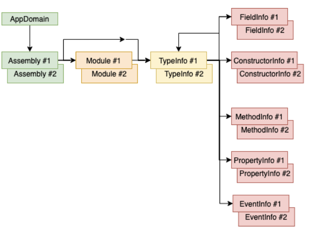

[TOC]

# 程序集的加载

JIT 编译器将方法的 IL 代码编译成本机代码时，会查看 IL 代码中引用了哪些类型。在运行时，JIT 编译器利用程序集的 TypeRef 和 AssemblyRef 元数据表来确定哪一个程序集定义了所引用的类型。在 AssemblyRef 元数据表的记录项中，包含了构成程序集强名称的各个部分。JIT 编译器尝试将与该标识匹配的程序集加载到 AppDomain 中(如果还没有加载的话)。如果被加载的程序集是弱命名的，那么标识中就只包含程序集的名称(不包含版本、语言文化及公钥标记信息)。

在内部，CLR 使用 System.Reflection.Assembly 类的静态 Load 方法尝试加载这个程序集。该方法在 .NET Framework SDK 文档中是公开的，可调用它显式地将程序集加载到 AppDomain 中。该方法是 CLR 的与 Win32 LoadLibrary 函数等价的方法。

在内部，Load 导致 CLR 向程序集应用一个版本绑定重定向策略，并在 GAC(全局程序集缓存)中查找程序集。如果没找到，就接着去应用程序的基目录、私有路径子目录和 codebase②位置查找。如果调用 Load 时传递的是弱命名程序集，Load 就不会向程序集应用版本绑定重定向策略，CLR 也不会去 GAC 查找程序集。如果 Load 找到指定的程序集，会返回对代表已加载的那个程序集的一个 Assembly 对象的引用。如果 Load 没有找到指定程序集，会抛出一个 System.IO.FileNotFoundException 异常。

*参考对应CLR_Via_C#第23章第1节，查看更多的加载方法和加载策略*

# 反射
众所知周，元数据是用一系列表来存储的。生成程序集或模块时，编译器会创建一个类型定义表、一个字段定义表、一个方法定义表以及其他表。利用 System.Reflection 命名空间中的其他类型，可以写代码来反射(或者说”解析“)这些元数据表。实际上，这个命名空间中类型为程序集或模块中包含的元数据提供了一个对象模型。

利用对象模型中的类型，可以轻松枚举类型定义元数据表中的所有类型，而针对每个类型都可获取它的基类型、它实现的接口以及与类型关联的标志(flag)。利用 System.Reflection 命名空间中的其他类型，还可解析对应的元数据表来查询类型的字段、方法、属性和事件。还可发现应用于任何元数据实体的定制特性(详情参见第 18 章”定制特性“)。甚至有些类允许判断引用的程序集；还有一些方法能返回一个方法的 IL 字节流。利用所有这些信息，很容易构建出与 Microsoft 的 ILDasm.exe 相似的工具。

## 反射的性能
反射是相当强大的机制，允许在运行发现并使用编译时还不了解的类型及其成员。但是，它也有下面两个缺点。
- 反射造成编译时无法保证类型安全性。由于反射严重依赖字符串，所以会丧失编译时的类型安全性。例如，执行 Type.GetType("int")；要求通过反射在程序集中查找名为“int”的类型，代码会通过编译，但在运行时会返回 null，因为 CLR 只知 "System.Int32"，不知道"int"。

- 反射速度慢。使用反射时，类型及其成员的名称在编译时未知；你要用字符串名称标识每个类型及其成员，然后在运行时发现它们。也就是说，使用 System.Reflection 命名空间中的类型扫描程序集的元数据时，反射机制会不停地执行字符串搜索。通常，字符串搜索执行的是不区分大小写的比较，这会进一步影响速度。

使用反射调用成员也会影响性能。用反射调用方法时，首先必须将实参打包(pack)成数组；在内部，反射必须将这些实参解包(unpack)到线程栈上。此外，在调用方法前，CLR 必须检查实参具有正确的数据类型。最后，CLR 必须确保调用者有正确的安全权限来访问被调用的成员。

基于上述所有原因，最好避免利用反射来访问字段或调用方法/属性。应该利用一下两种技术之一开发应用程序来动态发现和构造类型实例。

- 让类型从编译时已知的基类型派生。在运行时构造派生类型的实例，将对它的引用方法放到基类型的变量中(利用转型)，再调用基类型定义的虚方法。

- 让类型实现编译时已知的接口。在运行时构造类型的实例，将对它的引用放到接口类型的变量中(利用转型)，再调用接口定义的方法。

在这两种技术中，我个人更喜欢使用接口技术而非基类技术，因为基类技术不允许开发人员选择特定情况下工作得最好的基类。不过，需要版本控制的时候基类技术更合适，因为可随时向基类型添加成员，派生类会直接继承该成员。相反，要向接口添加程成员，实现该接口的所有类型都得修改它们的代码并重新编译。


---------------------

# 反射提供的对象模型
基于 AppDomain，可发现其中加载的所有程序集。基于程序集，可发现构成它的所有模块。基于程序集或模块，可发现它定义的所有类型。基于类型，可发现它的嵌套类型、字段、构造器、方法、属性和事件。命名空间不是这个层次结构的一部分，因为它们只是从语法角度将相关类型聚集到一起。CLR 不知道什么是命名空间。要列出程序集中定义的所有命名空间，需枚举程序集中的所有类型，并查看其 Namespace 属性。



-----------------

# Type 对象

反射经常用于判断程序集定义了哪些类型。FCL 提供了许多 API 来获取这方面的信息。目前最常用的 API 是 Assembly 的 ExportedTypes 属性。下例加载一个程序集，并显示其中定义的所有公开导出的类型

```csharp
using System;
using System.Reflection;

public static class Program {
    public static void Main() {
        String dataAssembly = "System.Data, version=4.0.0.0, "
            + "culture=neutral, PublicKeyToken=b77a5c561934e089";
        LoadAssemAndShowPublicTypes(dataAssembly);
    }

    private static void LoadAssemAndShowPublicTypes(String assemId) {
        // 显式地将程序集加载到这个 AppDomain 中
        Assembly a = Assembly.Load(assemId);

        // 在一个循环中显示已加载程序集中每个公开导出 Type 的全名
        foreach (Type t in a.ExportedTypes) {
            // 显示类型全名
            Console.WriteLine(t.FullName);
        }
    }
}
```

上述代码遍历 System.Type 对象构成的数组。 System.Type 类型是执行类型和对象操作的起点。System.Type 对象代表一个类型引用(而不是类型定义)。
在一个 AppDomain 中，每个类型只有一个 Type 对象，所以可以使用相等和不等操作符来判断两个对象是不是相同的类型。


Type 对象是轻量级的对象引用。要更多地了解类型本身，必须获取一个 TypeInfo 对象，后者才代表类型定义。

# TypeInfo 对象
可调用 System.Reflection.IntrospectionExtensions 的 GetTypeInfo 扩展方法将 Type 对象转换成 TypeInfo 对象。

``` csharp
Type typeReference = ...;       // 例如： o.GetType() 或者 typeof(Object)
TypeInfo typeDefinition = typeReference.GetTypeInfo();
```

获取 TypeInfo 对象会强迫 CLR 确保已加载类型的定义程序集，从而对类型进行解析。这个操作可能代价高昂。如果只需要类型引用(Type 对象)，就应避免这个操作。但一旦获得了 TypeInfo 对象，就可查询类型的许多属性进一步了解它。大多数属性，比如 IsPublic，IsSealed，IsAbstract，IsClass 和 IsValueType 等，都指明了与类型关联的标志。另一些属性，比如 Assembly，AssemblyQualifiedName,FullName 和 Module 等，则返回定义该类型的程序集或模块的名称以及类型的全名。还可查询 BaseType 属性来获取对类型的基类型的引用。除此之外，还有许多方法能提供关于类型的更多信息。文档描述了 TypeInfo 公开的所有方法和属性。


