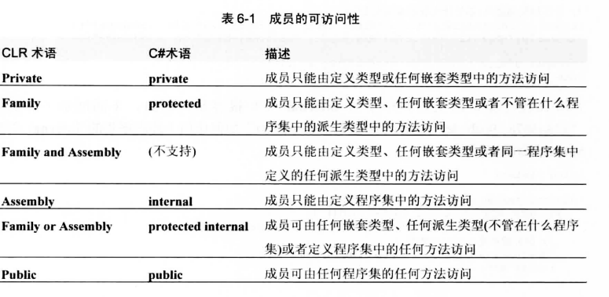
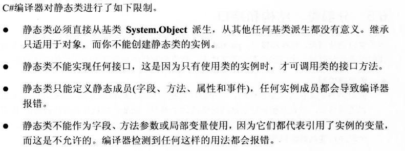
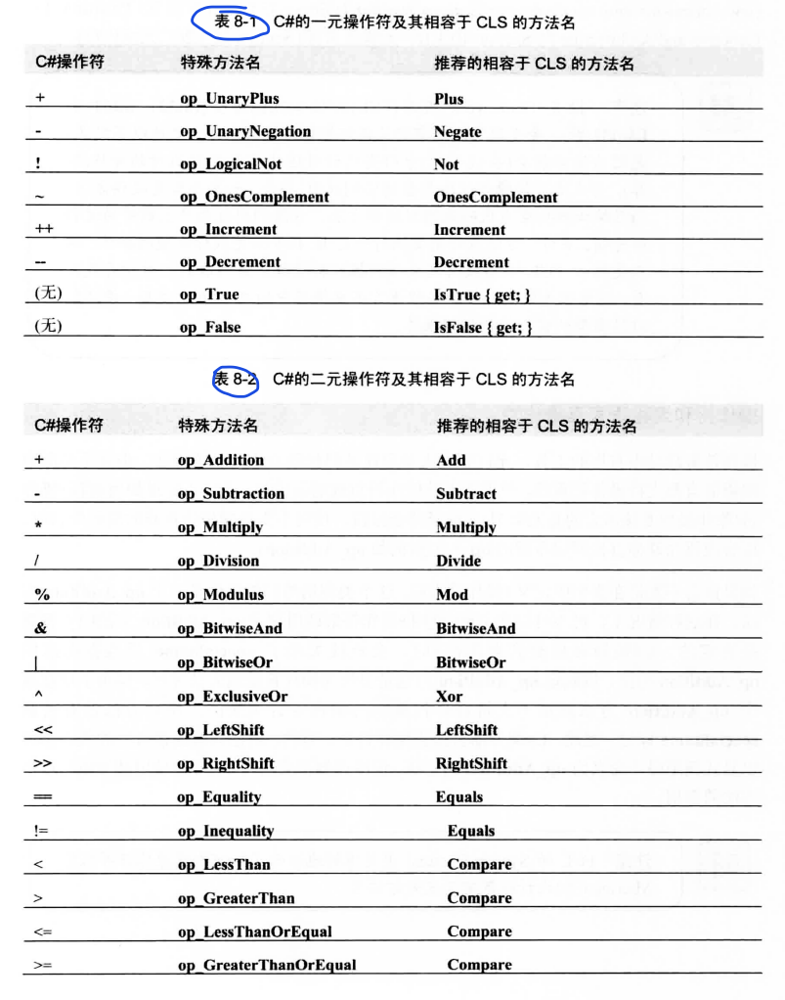

[TOC]

# 类型的成员
- 常量
- 字段
- 实例构造器
- 类型构造器 
- 操作符重载
- 转换操作符
- 属性
- 事件
- 类型(指嵌套类型)


# 类型的可见性
可将类型的可见性指定为 public 或 internal
- public类型不仅对定义程序集中的所有代码可见，还对其他程序集中的代码可见。
- internal 类型则仅对定义程序集中的所有代码可见，对其他程序集中的代码不可见。定义类型时不显示指定可见性

# 类型成员的可访问性
定义类型的成员(包括嵌套类型)时，可指定成员的可访问性。在代码中引用成员时，成员的可访问性指出引用是否合法。


# 静态类
永远不可以实例化的类,在 C# 中，要用 static 关键字定义不可实例化的类。该关键字只能应用于类，不能应用于结构(值类型)。因为 CLR 总是允许值类型实例化，这是没办法阻止的。


# 分部类，结构，接口
partial 关键字告诉 C# 编译器；类、接口或接口的定义源代码可能要分散到一个或多个源代码文件中。
要将 partial 关键字应用于所有文件中的类型。这些文件编译到一起时，编译器会合并代码，在最后的.exe 或 .dll 程序文件(或 .netmodule 模块文件)中生成单个类型。“分部类型”功能完全由 C# 编译器实现，CLR 对该功能一无所知，这解释了一个类型的所有源代码文件为什么必须使用相同编程语言，而且必须作为一个编译单元编译到一起。

# 常量
常量是值从不变化的符号。定义常量符号时，它的值必须能在编译时确定。确定后，编译器将常量值保存到程序集元数据中。这意味着只能定义编译器识别的基元类型的常量。
代码引用常量符号时，编译器在定义常量的程序集的元数据中查找该符号，提取常量的值，将值签入生成的 IL 代码中。由于常量的值直接嵌入代码，所以在运行时不需要为常量分配任何内存。除此之外，不能获取常量的地址，也不能以传引用的方式传递常量。这些限制意味着常量不能很好地支持跨程序集的版本控制。因此，只有确定一个符号的值从不变化才应定义常量。

# 字段
字段是一种数据成员，其中容纳了一个值类型的实例或者对一个引用类型的引用。CLR 支持类型(静态)字段和实例(非静态)字段。如果是类型字段，容纳字段数据所需的动态内存是在类型对象中分配的，而类型对象是在类型加载到一个 AppDomain 时创建的。
CLR 支持 readonly 字段和 read/write 字段。大多数字段都是 read/write字段，意味着在代码执行过程中，字段值可多次改变。但readonly 字段只能在构造器方法中写入。

# CLR如何调用方法
方法代表在类型或类型的实例上执行某些操作的代码。在类型上执行操作，称为静态方法；在类型的实例上执行操作，称为非静态方法。所有方法都有名称、签名和返回类型(可为void)。CLR 允许类型定义多个同名方法，只要每个方法都有一组不同的参数或者一个不同的返回类型。所以，完全能定义两个同名、同参数的方法，只要两者返回类型不同。大多数语言(包括C#)在判断方法的唯一性时，除了方法名之外，都只以参数为准，方法返回类型会被忽略。

```csharp
internal class Employee {
    // 非虚实例方法
    public         Int32    GetYearsEmployed() { ... }
    
    // 虚方法(虚暗示实例)
    public virtual String   GetProgressReport() { ... }

    // 静态方法
    public static  Employee Lookup(String name) { ... }
}
```
编译上述代码，编译器会在程序集的方法定义表中写入 3 个记录项，每个记录项都用一组标志(flag)指明方法是实例方法、虚方法还是静态方法。调用这些方法，生成调用代码的编译器会检查方法定义的标志(flag)，判断应如何生成 IL 代码来正确调用方法。CLR 提供两个方法调用指令。
- call
  - 该 IL 指令可调用静态方法、实例方法和虚方法。用 call 指令调用静态方法，必须指定方法的定义类型。用 call 指令调用实例方法或虚方法，必须指定引用了对象的变量。call指令假定该变量不为null。换言之，变量本身的类型指明了方法的定义类型。如果变量的类型没有定义该方法，就检查基类型来查找匹配方法。call指令经常用于以非虚方式调用虚方法。

- callvirt
  - 该 IL 指令可调用实例方法和虚方法，不能调用静态方法。用 callvirt 指令调用实例方法或虚方法，必须指定引用了对象的变量。用 callvirt 指令调用非虚实例方法，变量的类型指明了方法的定义类型。用 callvirt 指令调用虚实例方法，CLR 调查发出调用的对象的实际类型，然后以多态方式调用方法。为了确定类型，发出调用的变量绝不能是 null。换言之，编译这个调用时，JIT 编译器会生成代码来验证变量的值是不是null。如果是， callvirt 指令的执行速度比 call 指令稍慢。注意，即使 callvirt 指令调用的是非虚实例方法，也要执行这种null检查。

在两种指令都可以使用的时候，由编译器决定使用哪种方法。所以这种情况下两种指令都有可能被使用。


# 构造函数

## 实例构造函数(引用类型)

```csharp
internal sealed class SomeType {
    private Int32 m_x = 5;
    private String m_s = "Hi there"; 
    private Double m_d = 3.14159; 
    private Byte m_b;

    // 下面是一些构造器
    public SomeType() { ... }
    public SomeType(Int32 x) { ... }
    public SomeType(String s) { ...; m_d = 10; } 
} 
```

引用类型的实例构造器的工作流程如下所示
1. 对使用了内联初始化的字段`m_x,m_s,m_d`，在构造函数内插入对其进行相应初始化的代码。
2. 在构造函数内插入对基类构造函数的调用代码，然后调用执行基类的构造函数
3. 执行该类型构造函数中的代码。

## 实例构造函数(值类型)
- C#编译器根本不会为值类型内联(嵌入)默认的无参构造器
- CLR 允许为值类型定义构造器。但必须显示调用才会执行


## 类型构造器
CLR 还支持类型构造器(type constructor)，也称为静态构造器(static constructor)、类构造器(class constructor)或者类型初始化器(type initializer)。
- 类型构造器可应用于接口(虽然 C# 编译器不允许)、引用类型和值类型。
- 实例构造器的作用是设置类型的实例的初始状态。对应地，类型构造器的作用是设置类型的初始状态。- 类型默认没有定义类型构造器。如果定义，也只能定义一个。
- 类型构造器永远没有参数。

### CLR调用类型构造器的过程
类型构造器的调用比较麻烦。JIT 编译器在编译一个方法时，会查看代码中都引用了哪些类型。任何一个类型定义了类型构造器，JIT 编译器都会检查针对当前 AppDomain，是否已经执行了这个类型构造器。如果构造器从未执行，JIT 编译器会在它生成的本机(native)代码中添加对类型构造器的调用。如果类型构造器已经执行，JIT 编译器就不添加对它的调用，因为它知道类型已经初始化好了。
当方法被 JIT 编译完毕之后，线程开始执行它，最终会执行到调用类型构造器的代码。事实上，多个线程可能同时执行相同的方法。CLR 希望确保在每个 AppDomain 中，一个类型构造器只执行一次。为了保证这一点，在调用类型构造器时，调用线程要获取一个互斥线程同步锁。这样一来，如果多个线程试图同时调用某个类型的静态构造器，只有一个线程才可以获得锁，其他线程会被阻塞(blocked)。第一个线程会执行静态构造器中的代码。当第一个线程离开构造器后，正在等待的线程将被唤醒，然后发现构造器的代码已被执行过。因此，这些线程不会再次执行代码，将直接从构造器方法返回。除此之外，如果再次调用这样的一个方法，CLR 知道类型构造器已被执行过，从而确保构造器不被再次调用。

- 虽然能在值类型中定义类型构造器，但永远都不要真的那么做，因为 CLR 有时不会调用值类型的静态类型构造器。
- 单个线程中的两个类型构造器包含相互引用的代码可能出现问题。
- 类型构造器中的代码只能访问类型的静态字段
- 类型构造器不应调用基类型的类型构造器

# 操作符重载

在 C# 中，向基元(类型的)数字应用+符号，编译器生成将两个数加到一起的代码。将+符号应用于String 对象，C# 编译器生成将两个字符串连接到一起的代码。

## CLR 编译操作符重载函数的过程
对编程语言的选择决定了你是否获得对操作符重载的支持，以及具体的语法是什么。编译源代码时，编译器会生成一个标识操作符行为的方法。CLR 规范要求操作符重载方法必须是 public 和 static 方法。

```csharp
public sealed class Complex {
    public static Complex operator+(Complex c1, Complex c2) { ... }
}
```

编译将上述的操作符重载函数识别为名为 `op_Addition` 的方法，并为该方法生成元数据方法定义项；这个方法定义项还设置了 `specialname` 标志，表明这是一个“特殊”方法。编程语言的编译器(包括 C# 编译器)看到源代码中出现一个+操作符时，会检查是否有一个操作数的类型定义了名为 op_Addition 的 specialname 方法，而且该方法的参数兼容于操作数的类型。如果存在这样的方法，编译器就生成调用它的代码。不存在这样的方法就报告编译错误。


如果语言不支持在类型中定义+操作符重载，这个类型仍然可能提供了一个 op_Addition 方法。在这种情况下，可不可以在 C# 中使用 + 操作符来调用这个 op_Addition 方法呢？答案是否定的。C# 编译器检测到操作符 +时，会查找关联了 specialname 元数据标志的 op_Addition 方法，以确定 op_Addition方法是要作为操作符重载方法使用。但由于现在这个 op_Addition 方法是由不支持操作符重载的编程语言生成的，所以方法没有关联specialname标记。因此，C# 编译器会报告编译错误。当然，用任何编程语言写的代码都以显式调用碰巧命名为 op_Addition 的方法，但编译器不会将一个+号的使用翻译成对这个方法的调用。

## C#支持的操作符函数


---------------

# 转换操作符方法
转换操作符是将对象从一种类型转换成另一种类型的方法.
- 当源类型和目标类型都是编译器识别的基元类型时，编译器自己就知道如何生成转换对象所需的代码。
- 如果源类型或目标类型不是基元类型，编译器会生成代码，要求 CLR 执行转换(强制转型)。这种情况下，CLR 只是检查源对象的类型和目标类型(或者从目标类型派生的其他类型)是不是相同。但有时需要将对象从一种类型转换成全然不同的其他类型。为了进行这样的转换,类型应该定义只有一个参数的公共构造器，该参数要求是源类型的实例。还应该定义无参的公共实例方法.每个方法都将定义类型的实例转换成 Xxx类型
- 在 C# 中，implicit 关键字告诉编译器为了生成代码来调用方法，不需要在源代码中进行显式转型。相反， explicit 关键字告诉编译器只有在发现了显式转型时，才调用方法。


C# 编译器检测到代码中的转型，并内部生成 IL 代码来调用 类型定义的转换操作符方法。编译类型并查看元数据，会发现编译器为定义的每个转换操作符都生成了一个方法。将对象从一种类型转换成另一种类型的方法总是叫做 op_Implicit 或者 op_Explicit.
只有在转换不损失精度或数量级的前提下(比如讲个 Int32转换成Rational)，才能定义隐式转换操作符。如果转换会造成精度或数量级的损失(比如将 Rational 转换成 Int32)，就应该定义一个显式转换操作符。显式转换失败，应该让显式转换操作符方法抛出 `OverflowException`或者`InvalidOperationException`异常。


# 拓展方法
允许定义一个静态方法，并用实例方法的语法来调用。定义如下所示的`StringBuilder`类型的名为`IndexOf`的拓展方法。
```csharp
public static class StringBuilderExtensions {
    public static Int32 IndexOf(this StringBuilder sb,Char value) {
        for (Int32 index = =0; index < sb.Length; index++)
            if(sb[index] == value) return index;
        return -1
    }
}
```

使用如下代码调用
```csharp
Int32 index = sb.IndexOf('X');
```
当C#编译器编译如上代码时，首先检查 StringBuilder 类或者它的任何基类是否提供了获取单个 Char 参数、名为 IndexOf 的一个实例方法。如果是，就生成 IL 代码来调用它。如果没有找到匹配的实例方法，就继续检查是否有任何静态类定义了名为 IndexOf 的静态方法，方法的第一个参数的类型和当前用于调用方法的那个表达式的类型匹配，而且该类型必须用 this 关键字标识。在本例中，表达式是 sb，类型是 StringBuilder。所以编译器会查找一个 IndexOf 方法，它有两个参数：一个 StingBuilder(用this关键字标记)，以及一个 Char。编译器找到了这个 IndexOf 方法，所以生成相应的 IL 代码来调用这个静态方法。


-----------------

# 属性
对于简单的 get 和 set 访问器方法， JIT 编译器会将代码内联(inline，或者说嵌入)。这样一来，使用属性(而不是使用字段)就没有性能上的损失。内联是指将方法(目前说的是访问器方法)的代码直接编译到调用它的方法中。这就避免了在运行时发出调用所产生的开销，代价是编译好的方法变得更大。由于属性访问器方法包含的代码一般很少，所以对内联会使生成的本机代码变得更小，而且执行得更快。

-----------------

# 事件

## 编译器如何实现事件

假设在代码中定义了如下事件变量
```csharp
public event EventHandler<NewMailEventArgs> NewMail;
```
C# 编译器编译时把它转换为以下 3 个构造
```csharp
// 1. 一个初始化为 null 的私有委托字段
private EventHandler<NewMailEventArgs> NewMail = null;

// 2. 一个公共 add_Xxx 方法(其中 XXX 是事件名)
// 允许方法登记对事件的关注
public void add_NewMail(EventHandler<NewMailEventArgs> value) {
    // 通过循环和对 CompareExchange 的调用，可以
    // 以一种线程安全的方式向事件添加委托
    EventHandler<NewMailEventArgs> preHandler;
    EventHandler<NewMailEventArgs> newMail = this.NewMail;
    do {
        preHandler = newMail;
        EventHandler<NewMailEventArgs> newMail = (EventHandler<NewMailEventArgs>) Delegate.Combine(preHandler, value);
        newMail = Interlocked.CompareExchange<EventHandler<NewMailEventArgs>>(ref this.NewMail, newHandler, preHandler);
    } while (newMail != preHandler);
}

// 3. 一个公共 remove_Xxx 方法(其中Xxx是事件名)
// 允许方法注销对事件的关注
public void remove_NewMail(EventHandler<NewMailEventArgs> value) {
    // 通过循环和对 CompareExchange 的调用，可以
    // 以一种线程安全的方式从事件中移除一个委托
    EventHandler<NewMailEventArgs> preHandler;
    EventHandler<NewMailEventArgs> newMail = this.NewMail;
    do {
        preHandler = newMail;
        EventHandler<NewMailEventArgs> newHandler = (EventHandler<NewMailEventArgs>) Delegate.Remove(preHandler, value);
        newMail = Interlocked.CompareExchange<EventHandler<NewMailEventArgs>>(ref this.NewMail, newHandler, preHandler);
    } while (newMail != preHandler);
}
```
第一个构造是具有恰当委托类型的字段。该字段是对一个委托列表的头部的引用。事件发生时会通知这个列表中的委托。字段初始化为null，表明无侦听者(listener)登记对该事件的关注。一个方法登记对事件的关注时，该字段会引用 EventHandler<NewMailEventArgs>委托的实例，后者可能引用更多的EventHandler<NewMailEventArgs>委托。侦听者登记对事件的关注时，只需将委托类型的一个实例添加到列表中。显然，注销(对事件的关注)意味着从列表中移除委托。

注意，即使原始代码行将事件定义为public，委托字段(本例是NewMail)也始终是private。将委托字段定义为private，目的是防止类外部的代码不正确地操纵它。如果字段是public，任何代码都能更改字段中的值，并可能删除已登记了对事件的关注的委托。

C#编译器生成的第二个构造是一个方法，允许其他对象登记对事件的关注。C#编译器在事件名(NewMail)之前附加add_前缀，从而自动命名该方法。C#编译器还自动为方法生成代码。生成的代码总是调用System.Delegate的静态Combine方法，它将委托实例添加到委托列表中，返回新的列表中，返回新的列表头(地址)，并将这个地址存回字段。

C#编译器生成的第三个构造是一个方法，允许对象注销对事件的关注。同样地，C#编译器在事件名(NewMail)之前附加remove_前缀，从而自动命名该方法。方法中的代码总是调用Delegate的静态Remove方法，将委托实例从委托列表中删除，返回新的列表头(地址)，并将这个地址存回字段。

除了生成上述3个构造，编译器还会在托管程序集的元数据中生成一个事件定义记录项。这个记录项包含了一些标志(flag)和基础委托类型(underlying delegate type)，还引用了add和remove访问器方法。这些信息的作用很简单，就是建立“事件”的抽象概念和它的访问器方法之间的联系。编译器和其他工具可利用这些元数据信息，并可通过System.Reflection.EventInfo类获取这些信息。但是，CLR本身并不使用这些元数据信息，它在运行时只需要访问器方法。