- [基本原理](#基本原理)
  - [什么是托管模块](#什么是托管模块)
  - [托管模块的组成](#托管模块的组成)
  - [什么是元数据](#什么是元数据)
  - [什么是程序集](#什么是程序集)
  - [程序集的组成](#程序集的组成)
  - [程序集的生成](#程序集的生成)
  - [程序集的分类](#程序集的分类)
  - [面向CLR的编译器](#面向clr的编译器)
- [程序的执行](#程序的执行)
  - [Window 如何执行应用程序](#window-如何执行应用程序)
  - [代码的执行](#代码的执行)
    - [将IL编译为本机CPU代码](#将il编译为本机cpu代码)
    - [代码执行流程](#代码执行流程)
    - [运行时加载程序集的流程](#运行时加载程序集的流程)
  - [函数执行时的堆栈过程](#函数执行时的堆栈过程)
  - [JIT对函数的定位](#jit对函数的定位)

# 基本原理

## 什么是托管模块

面向CLR的编译器会将源代码编译成一个托管模块(managed moudle)。托管模块是标准的32位 Microsft Windows 可移植执行体(PE32)文件，或者是标准的64位Windows可移植执行体(PE32+)文件。

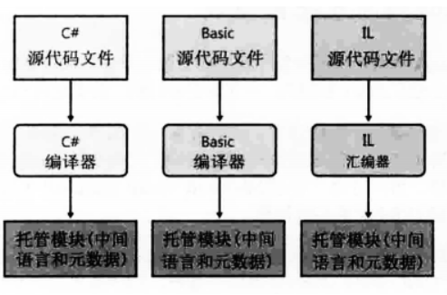

## 托管模块的组成

- PE32或者PE32+头
  - 这个头还表示了文件类型，包括GUI，CUI或者DLL，并包含一个时间标记来指出文件的生成时间。对于只包含IL代码的模块，PE32(+)头的大多数信息会被忽视。如果是包含本机(native)CPU代码的模块，这个头包含与本机CPU代码有关的信息
- CLR头
  - 包含使这个模块成为托管模块的信息(可由CLR和一些实用程序进行解释)。头中包含要求的CLR版本，一些标志(flag)，托管模块入口方法(Main方法)的MethodDef元数据token以及模块的元数据、资源、强名称、一些标志及其他不太重要的数据项的位置/大小
- 元数据
  - 主要包含元数据表，主要有两种表：一种表描述源代码中定义的类型和成员，另一种描述源代码引用的类型和成员
- IL
  - 编译器编译源代码时生成的代码。在运行时，CLR将IL编译成本机CPU指令

`本机代码编译器(native code compilers)生成的是面向特定CPU架构(比如x86，x64或ARM)的代码。相反，每个面向CLR的编译器生成的都是IL(中间语言)代码。IL代码有时称为托管代码(managed code)，因为CLR管理它的执行。`

## 什么是元数据

元数据是由几个表构成的二进制数据块，有三种表。

- 类型定义表
- 类型引用表
- 清单表

各个表的组成如下各图所示

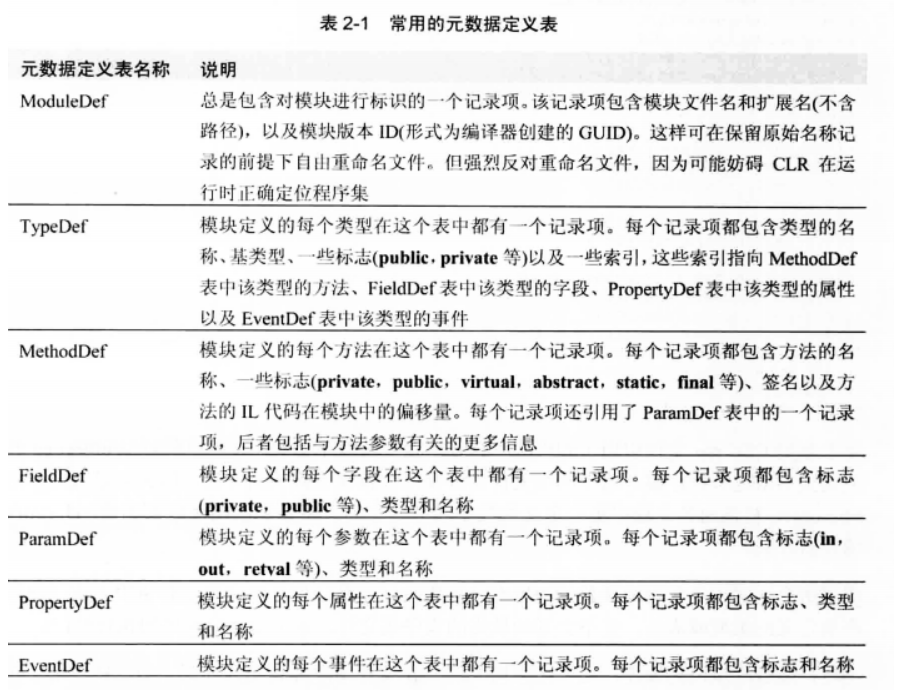

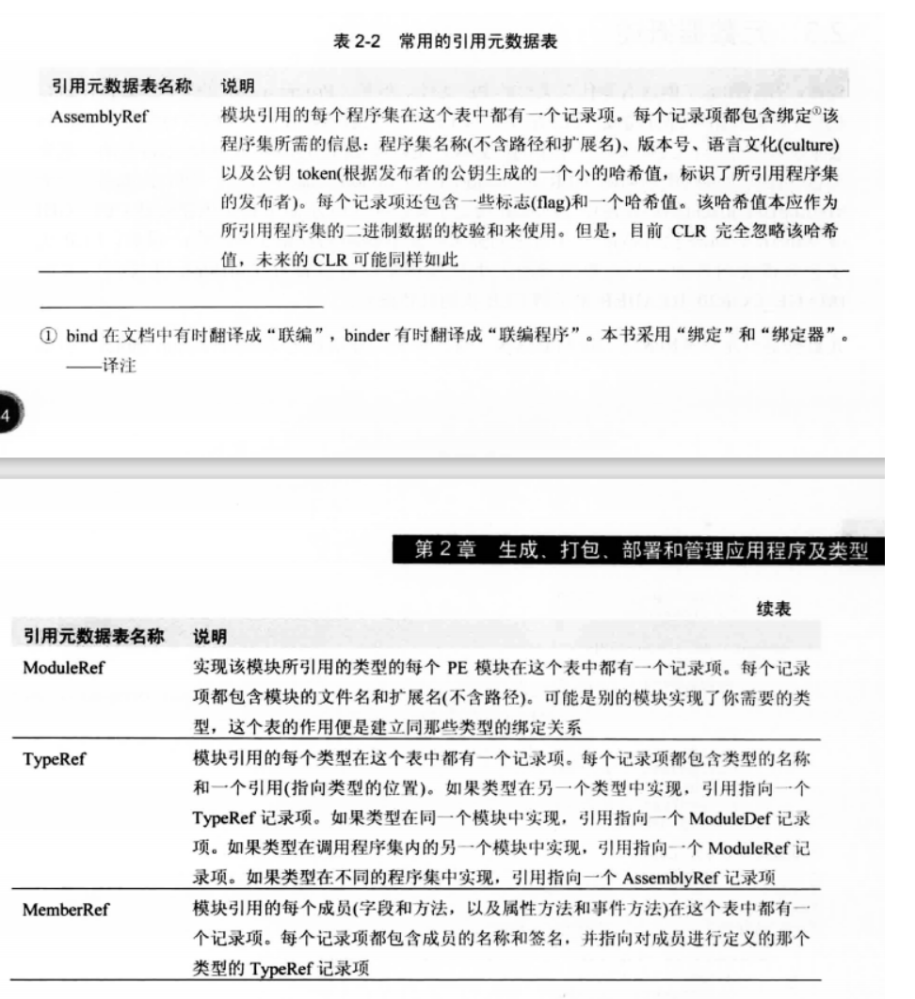

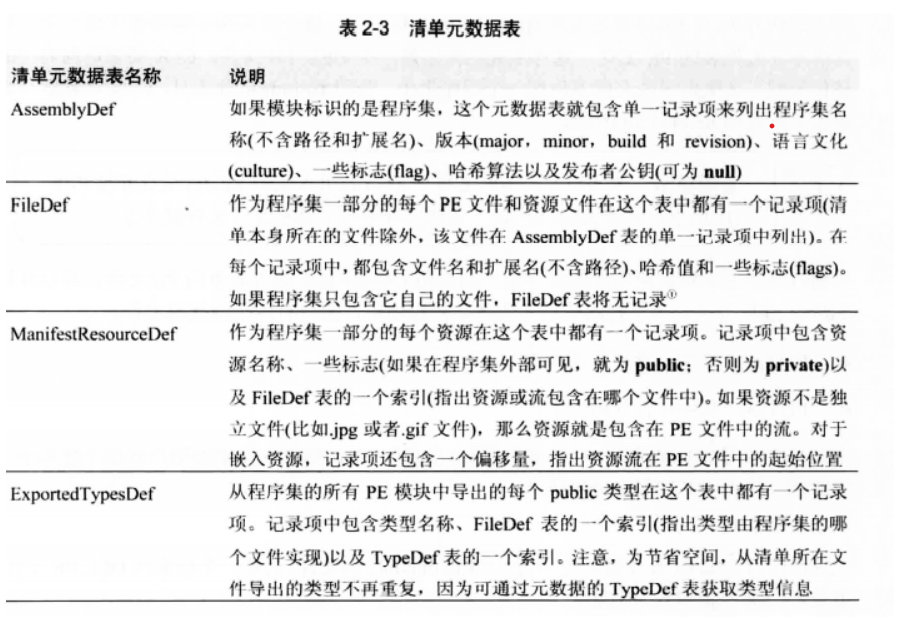

## 什么是程序集
程序集是标准的32位Microfost Windows 可移植执行体文件(PE32)，或者是标准的64位Microfost Windows 可移植执行体文件(PE32+)，CLR实际上不会和模块工作，它和程序集工作。**程序集是一个或是多个模块，资源文件的逻辑性分组**，**程序集也是重用，安全性和版本控制的最小单元，CLR将每一个程序集视为一个组件**。

## 程序集的组成
- PE32或者PE32+头
  - 该部分的主要作用有标识文件类型，文件的生成时间，本机CPU有关的信息等等
- CLR头
  - 该部分主要作用有标识CLR版本，一些标志位，模块入口方法的元数据等等。
- 清单
  - 清单是元数据表的集合，这些表描述了构成程序集的文件，程序集中的文件所实现的公开导出类型以及与程序集关联的资源或数据文件。清单位于某个托管模的元数据表中。
- 托管模块
  - 编译器为每一个源代码文件生成，包含IL和元数据。
- 资源文件
  - 程序使用到的资源，例如一个png,gif,html等等。

*程序集分为单文件程序集和多文件程序集*

## 程序集的生成

生成程序集有两种方式一种是直接使用面向CLR的编译器，一种是使用程序集连接器(AL.exe)。它们的区别如下所示。
- 使用面向CLR的编译器可以生成程序集，但它只支持由同一个编译器生成的托管模块。且不会生成额外的托管模块。
- 使用程序集连接器(AL.exe)可以生成程序集，它支持不同编译器生成的托管模块，还可以生成只含资源的程序集(satellite assembly 附属程序集)。

生成程序集的流程图下所示。
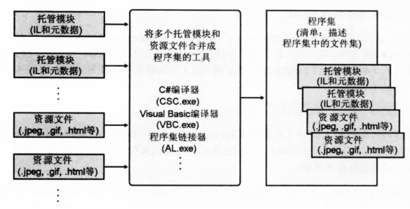

假设我们有两个编译好了的托管模块RUT.netmodule和FUT.netmodule如下所示

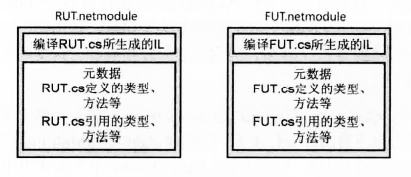

当我们使用程序集链接器来生成程序集的时候，链接器会创建新的托管模块，该托管模块的元数据中含有清单。

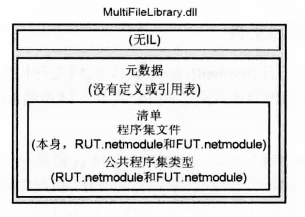

当我们使用编译器来生成程序集的时候编译器会在其中一个托管模块的元数据中添加清单表。

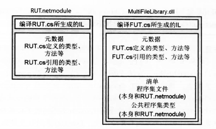

*对于单个模块，编译器会直接在其主模块的元数据表内生成一个清单表*
*对于资源文件来说编译器和程序集链接器都支持将资源文件直接嵌入到PE文件或者是作为一个独立的文件链接到程序集*

## 程序集的分类

程序集分为两类
- 单文件程序集：程序集中只有一个托管模块，且不包含资源文件 。
- 多文件程序集：程序集中包含多个托管模块，或者多个资源文件。

## 面向CLR的编译器

一个C#程序的执行，实际上就是使用CLR提供的功能，去使用操作系统。而想要使用CLR提供功能，我们就要将C#转换为IL代码。我们将这种能将其他语言的代码转换为IL代码的编译器为 **面向CLR的编译器** 。

不只是 **C#** 其他语言也有自己的**面向CLR的编译器**，例如 Microsoft 为 **C++** 特点打造了一个**面向CLR的编译器**，使得可以将C++转换为IL代码，从而在**CLR**上运行。

我们可以给编译器提供一些参数来指定生成的应用只能运行在哪种CPU架构(x86,x64,ARM)的平台上，或者是指定程序运行在32位还是64位系统上。

--------------

# 程序的执行

## Window 如何执行应用程序

当编译器和程序集连接器生成了程序集之后，那么该程序集就可以被执行了。(生成的程序集是可执行应用程序而非DLL的情况)

当我们点击运行该程序的时候，会执行如下几个步骤
1.  首先 Windows 检查文件头，判断需要32位还是64位地址空间。(*PE32文件在32位或64位地址空间中均可运行，PE32+文件则需要64位地址空间。*) Windows还会检查头中嵌入的CPU架构信息，确保当前计算机的CPU符合要求。最后， Windows的64位版本通过WoW64( Windows on Windows64)技术运行32位 Windows应用程序。
2.  然后Window检查EXE文件头，决定是创建32位还是64位进程之后，会在进程的地址空间内加载 **MSCOREE.dll** 程序集的对应版本(x86,x64,ARM) 到该进程地址空间中。
3.  然后，进程的主线程调用 **MSCOREE.dll** 中定义的一个方法。这个方法初始化CLR,加载EXE程序集，再调用其入口方法(Main)。随即，托管应用程序启动并运行

如果非托管应用程序调用 **Loadlibrary** 加载托管程序集,Windows会自动加载并初始化CLR(*如果尚未加载*),以处理程序集中的代码。

如果应用程序所引用的程序集是一个多文件程序集，CLR并不会在一开始就将程序集中所有的模块和资源文件加载到内存中，相反只有当使用到具体的模块的时候才会进行加载操作。

-----------------

## 代码的执行

当进入了入口方法，程序正式开始执行。为了执行方法，首先必须把方法的IL转换成本机CPU指令。

### 将IL编译为本机CPU代码

CLR使用JIT(just-in-time)来完成这一过程，JIT编译器的主要功能是将IL代码编译为本机CPU指令。
在编译之前CLR还会执行一个名为验证的过程，检查高级的IL代码保证代码的行为都是安全的。

### 代码执行流程

当进入了入口函数之后，CLR检测Main中代码引用的所有类型并加载它们对应的程序集，然后分配一些内部数据结构来管理对引用类型的访问(类型对象)。每一个方法和其对应的入口指令地址为该数据结构中的表项。初始时所有方法的入口指令地址都指向一个被称为 **JITCompiler** 的已编译的方法的指令地址。

函数初次的执行流程如下图所示。

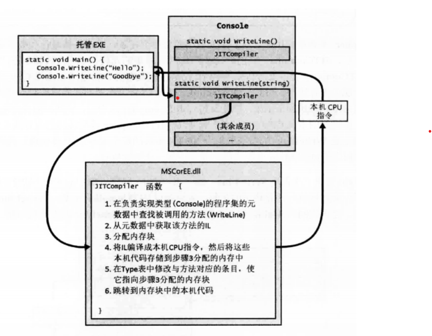

当再次执行该函数的时候，其执行流程如下所示

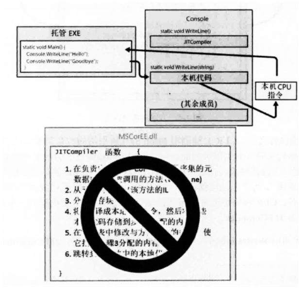

JIT编译器将本机CPU指令存储到**动态内存**中。这意味着一旦应用程序终止，编译好的代码也会被丢弃。所以，将来再次运行应用程序，或者同时启动应用程序的两个实例（使用两个不同的操作系统进程），JIT编译器必须再次将IL编译成本机指令。对于某些应用程序这可能显著増加内存耗用。相比之下，本机( native)应用程序的只读代码页可由应用程序正在运行的所有实例共享。

### 运行时加载程序集的流程

在编译IL成本机代码的时候，CLR 会检测所有类型和成员引用，加载它们的定义程序集(如果尚未加载)。CLR可能在以下三个地方进行寻找
- 相同文件: 编译时便能发现对相同文件中的类型的访问，这称为早期绑定(early binding)。类型直接从文件中加载，执行继续。
- 不同文件,相同程序集 : “运行时”确保被引用的文件在当前程序集元数据的 FileDef 表中，检查加载程序集清单文件的目录，加载被引用的文件，检查哈希值以确保文件完整性。发现类型的成员，执行继续。
- 不同文件, 不同程序集:  如果引用的类型在其他程序集的文件中，“运行时”会加载被引用程序集的清单文件。如果需要的类型不在该文件中，就继续加载包含了类型的文件。发现类型的成员，执行继续。

加载流程如下图所示

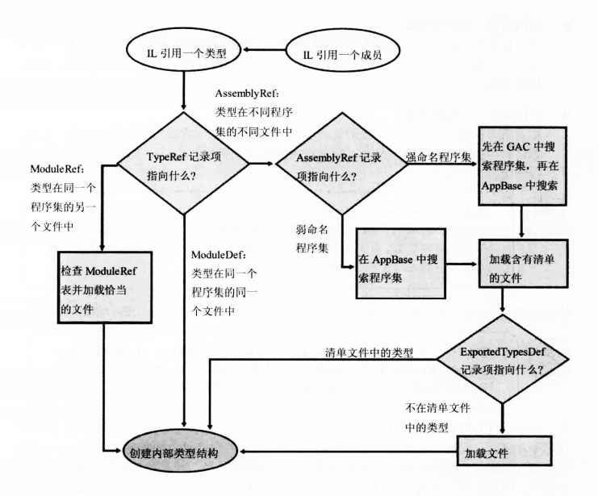

----------------------

## 函数执行时的堆栈过程

下图展示了已加载CLR的一个Windows进程，该进程可能有多个线程。线程创建时会分配到`1MB`的栈。栈空间用于向方法传递实参，方法内部定义的局部变量也在栈上。栈从高位内存地址向低位内存地址构建。图中线程已经执行了一些代码，栈上已经有了一些数据(栈顶部的阴影区域)。现在，假设线程执行的代码要调用M1方法。
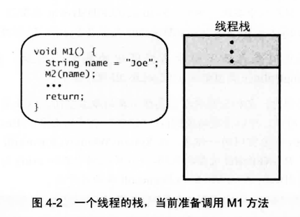

最简单的方法包含”序幕“(prologue)代码，在方法开始做工作前对其进行初始化；还包含“尾声”(epilogue)代码，在方法做完工作后对其进行清理，以便返回至调用者。 M1 方法开始执行时，它的“序幕”代码在线程上分配局部变量 name 的内存，如下所示。
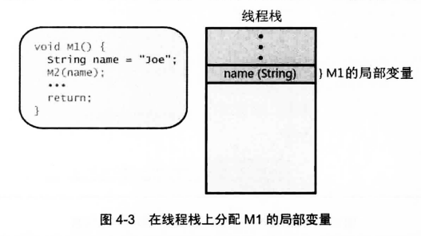

然后 M1 调用 M2 方法，将局部变量 name 局部变量中的地址被压入栈。M2 方法内部使用参数变量 s 标识栈位置(注意，有的 CPU 架构用寄存器传递实参以提升性能，但这个区别对于当前的讨论来说并不重要)。另外，调用方法时还会将“返回地址”压入栈。被调用的方法在结束之后应该返回至该位置,如下所示。
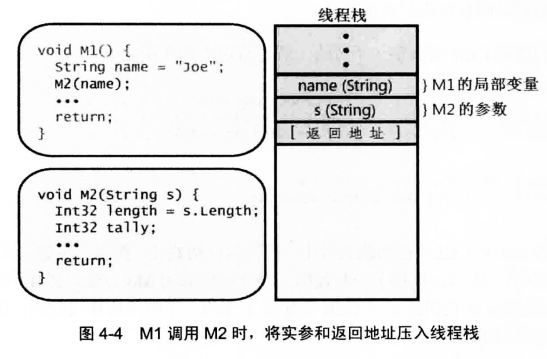

M2 方法开始执行时，它的“序幕”代码在线程栈中为局部变量 length 和 tally 分配内存，然后，M2 方法内部的代码开始执行。最终， M2 抵达它的 return 语句，造成 CPU 的指令指针被设置成栈中的返回地址， M2 的栈桢展开(unwind)，栈帧恢复成M2调用之前的样子(如图4-3)。之后， M1 继续执行 M2 调用之后的代码， M1 的栈桢将准备反映 M1 需要的状态。
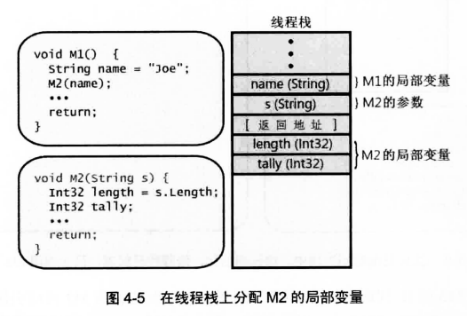

## JIT对函数的定位

当调用不同的函数时，JIT对不同类型的函数有不同的定位方式。
- 静态函数：直接到对应的类型对象中去寻找。
- 非虚函数：通过对象的**基类型指针**来进行定位，可能会回溯类的层次结构。
- 虚函数：通过对象的**基类型指针**来进行定位，可能会回溯类的层次结构。

*System.Object 的 GetType 方法返回存储在指定对象的“类型对象指针”成员中的地址。也就是说， GetType 方法返回指向对象的类型对象的指针。这样就可判断系统中任何对象(包括类型对象本身)的真实类型。*
